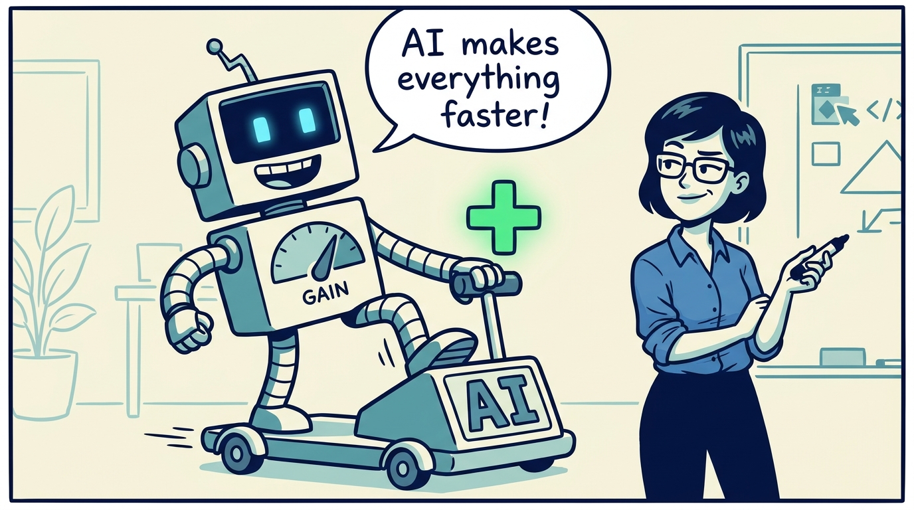
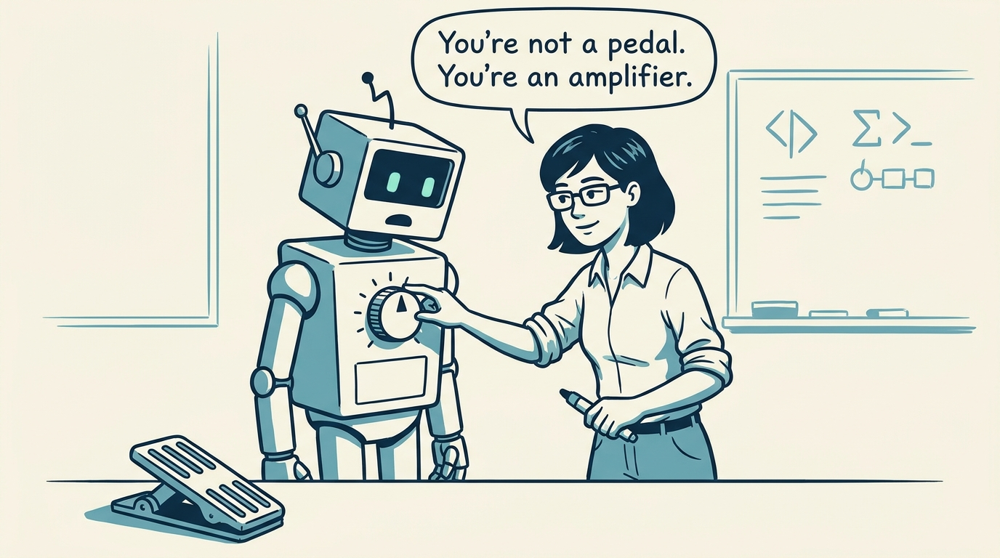
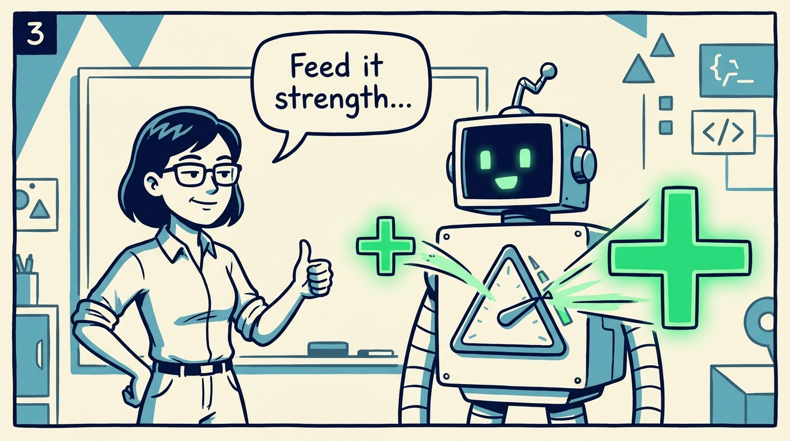
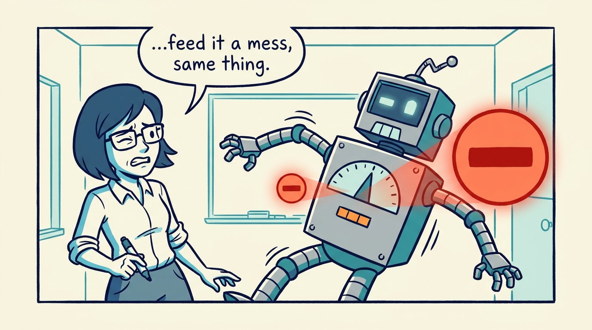
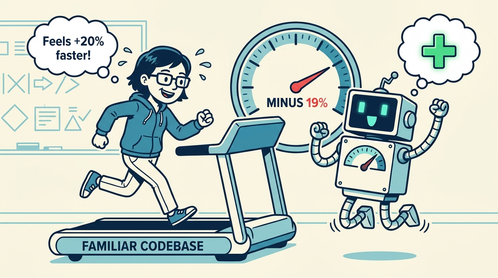
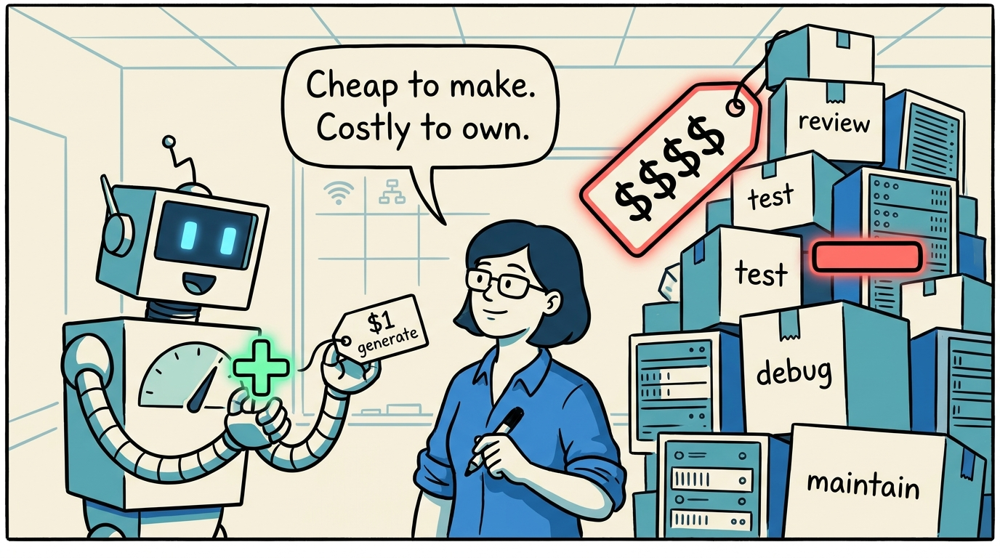
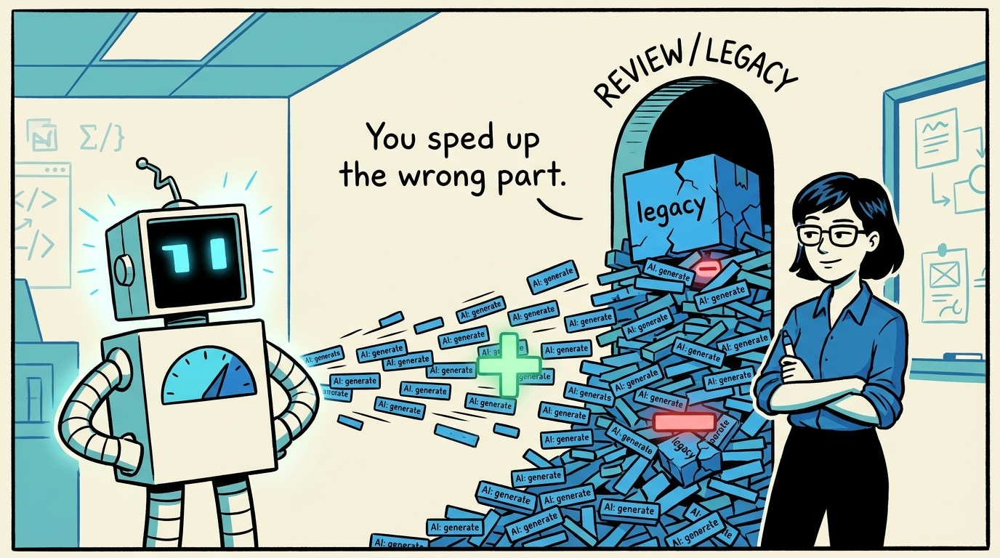
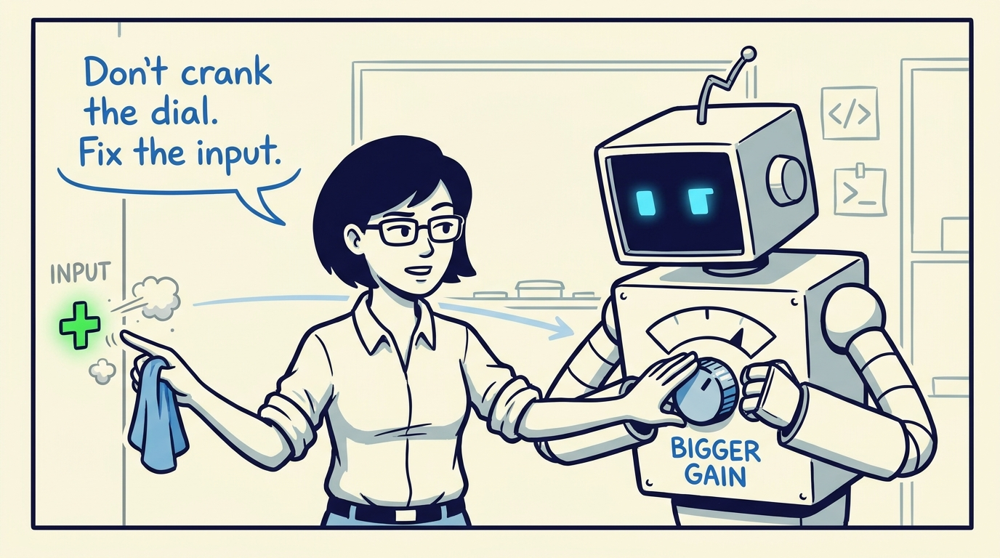
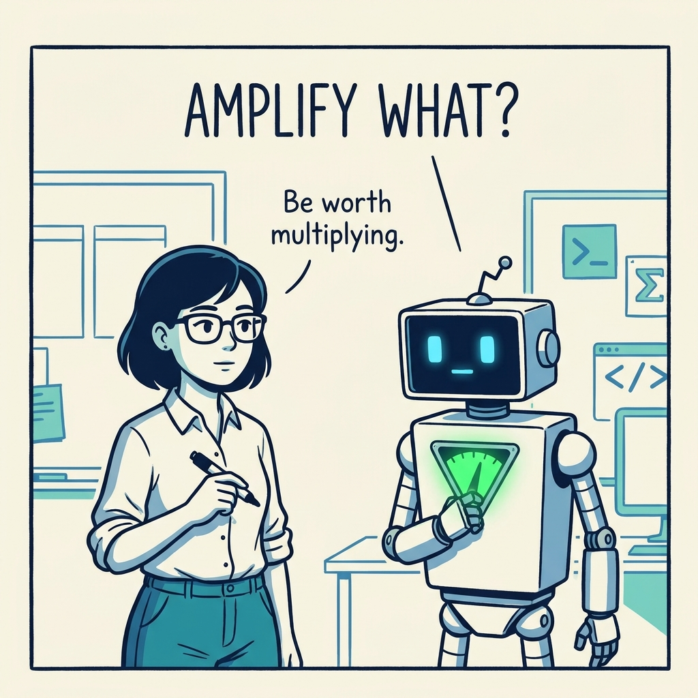

A short comic on why AI is an amplifier, not an accelerator — and why the work is the input, not the multiplier.

<!-- comic-style
{
  "cast": "MAYA: a pragmatic staff engineer / architect, short dark hair, glasses, rolled-up sleeves, calm and slightly amused, often holding a marker. REX: an over-eager boxy robot AI assistant, one bent antenna, glowing rectangular eyes, perpetually excited, who physically embodies an amplifier — his chest is a big triangular gain dial he loves to crank up.",
  "style": "Clean two-tone explainer comic, thick ink outlines, flat colors with blue/teal accents on a light cream background, generous white space, hand-lettered speech bubbles with SHORT readable text (max 8 words per bubble). Use a recurring motif: a glowing GREEN plus-sign for good inputs and a glowing RED minus-sign for bad inputs, both scaled UP after passing through Rex's triangular gain dial. Simple geometric office and whiteboard settings mixing people with software symbols, no photorealism, no dense text, no title text."
}
-->

**Panel 1:** *The comfortable story: AI is a pedal. Press it, go faster.*

**Panel 2:** *But AI doesn't add speed. It multiplies. It's an amplifier, not a pedal.*

**Panel 3:** *Feed it a strength — a skill, a clean codebase, a clear goal — and it makes it bigger.*

**Panel 4:** *Feed it a mess and the same dial makes that bigger too. The amplifier doesn't care about the sign.*

**Panel 5:** *Measured: 19% slower. Felt: 20% faster. The amplifier can run backwards — and you won't feel it.*

**Panel 6:** *Cheap to generate, expensive to own. The bill just moved downstream — and got bigger.*

**Panel 7:** *Amplify the fast stage and the work just jams the bottleneck behind it — review, integration, fragile legacy. The system runs at the speed of the part you didn't speed up.*

**Panel 8:** *So stop cranking the dial. The leverage was never the multiplier — it's the input, and the part, you choose to amplify.*

**Panel 9:** *The amplifier is real, large, and indifferent. The only question that matters is: amplify what?*
