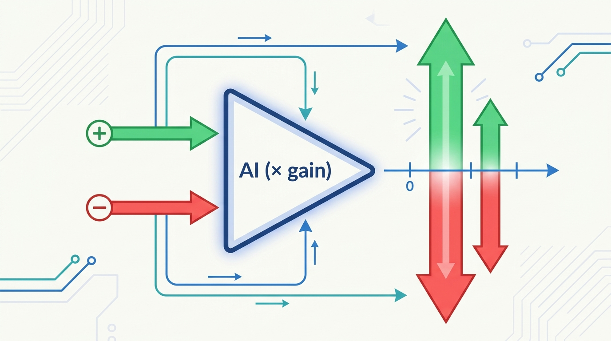
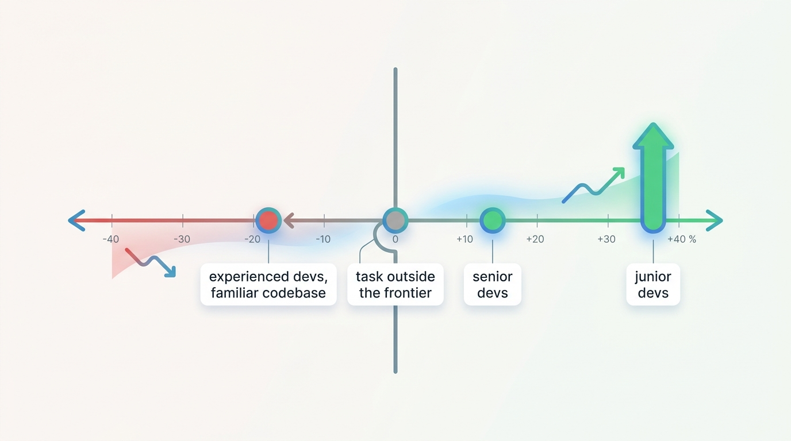
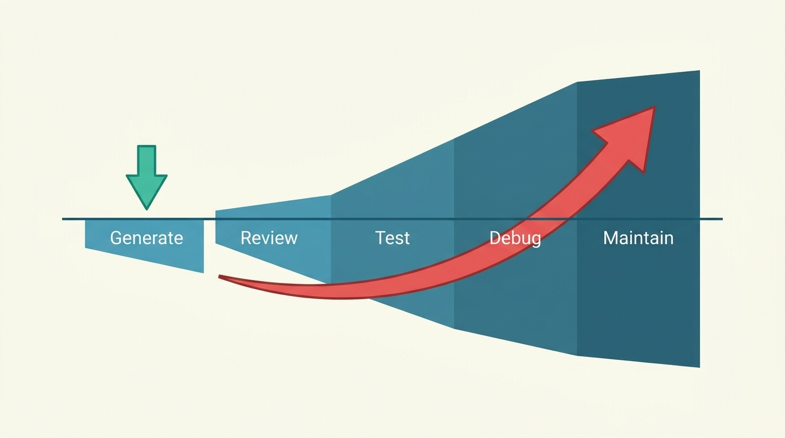
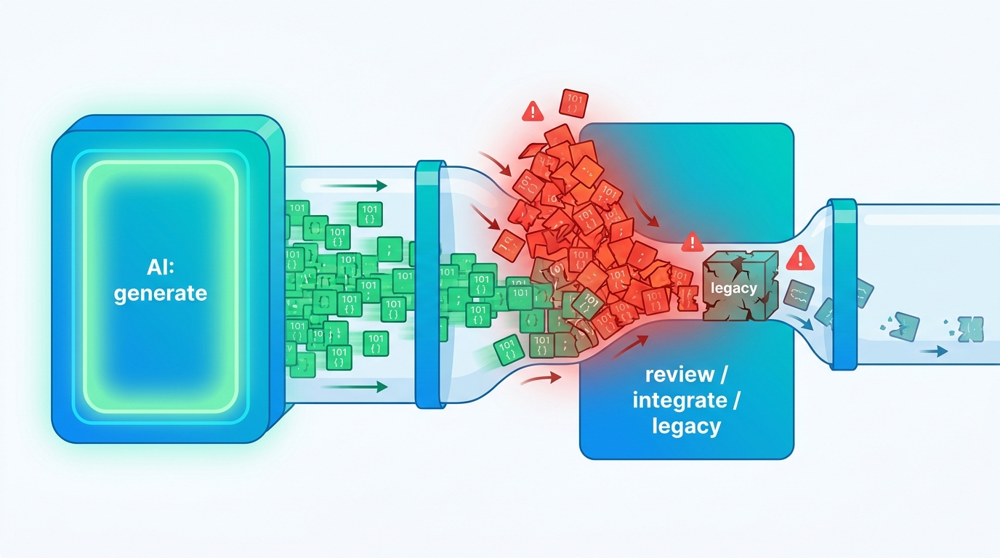
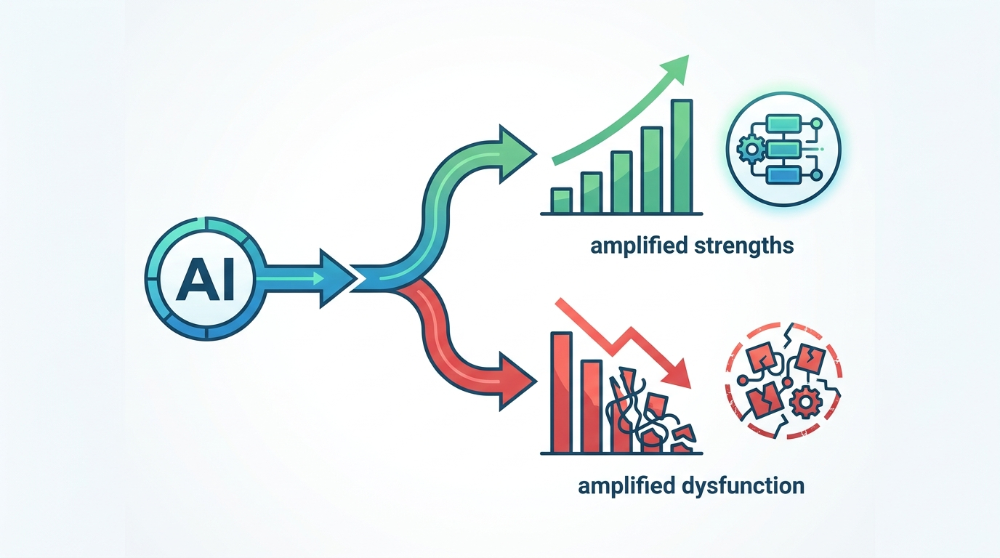

> **KEY POINTS:**
>
> * **"Accelerator" is the wrong word.** An accelerator only adds speed, always in the same direction. AI doesn't add — it *multiplies*. It takes whatever you already have and makes it bigger: a skill, a process, a codebase, a goal.
> * **A multiplier keeps the sign of its input.** Point AI at strength and it compounds the strength. Point it at a mess — a brittle process, a confused goal, no standards — and it compounds the mess, faster and more expensively. The same tool that makes one developer 39% faster makes another, on a codebase he knows by heart, measurably *slower*.
> * **So the leverage is never in the AI — it is in what, and which part, you amplify.** An amplifier acts on one part, not the whole: speed up the fast stage of an unbalanced system and you just jam the bottleneck behind it. That is why individuals feel faster while their teams often don't. The durable work isn't a bigger multiplier; it's fixing the input and widening the slowest part.

 
There is a comfortable story we tell about AI, and it goes like this: AI is an **accelerator**. It makes everything faster. Coding, writing, research, analysis — point AI at the work and the work goes quicker. Buy the tools, hand them out, and the whole organization speeds up.

It is a comforting story because it asks almost nothing of us. An accelerator is a pedal. You press it and you go faster; the only decision is how hard to press. If AI is an accelerator, **the AI strategy is a purchasing decision**.

The story is wrong — or, more precisely, it is true often enough to be dangerous. AI is not an accelerator. **It is an amplifier.** And the difference between those two words is the difference between an AI strategy that compounds your strengths and one that quietly, expensively compounds your problems.

## The Wrong Word

An accelerator and an amplifier are not the same kind of thing, and the gap between them is exactly where most AI disappointment lives.

An **accelerator adds**. It contributes its own quantity — speed — on top of whatever you were doing, and it does so in one direction. Press the pedal and you go faster, never backwards. The effect is uniform: the same pedal, the same pressure, the same extra speed, regardless of where you were headed. If you were driving toward a cliff, an accelerator gets you there sooner, but we don't usually describe a pedal as "the thing that drove me off the cliff." We blame the driver. The pedal just added speed.

An **amplifier multiplies**. It does not contribute a quantity of its own; it takes the signal you give it and scales it. A guitar amplifier makes a clean chord gloriously loud — and makes a buzzing, badly-fretted mess gloriously loud too. It has no opinion about the music. It multiplies whatever reaches its input, faithfully, including the noise.

That distinction sounds pedantic until you notice it predicts the entire pattern of who wins and who loses with AI. The accelerator story predicts that everyone speeds up by roughly the same amount. The amplifier story predicts something very different: that AI's effect on you depends almost entirely on **what you already have** — and that for some people, on some tasks, the effect runs the *wrong way*.

The evidence says the amplifier story is the right one.

## A Multiplier, Not an Adder

Here is the whole idea in one line of arithmetic:

**output = gain × input**

An accelerator is addition: `output = input + speed`. The added term is always positive, so the output always moves the same way. An amplifier is multiplication: `output = gain × input`. And multiplication does something addition never does — **it preserves the sign of its input.** A large gain applied to a positive input gives you a large positive result. The *same* large gain applied to a negative input gives you a large *negative* result. The amplifier doesn't decide the direction. You do, with the input. The amplifier only decides the magnitude.

This is why "amplifier" is not just a nicer-sounding synonym for "accelerator." It makes a sharper, falsifiable claim: **AI makes whatever you feed it more so.** A strong skill, more so. A clear process, more so. A clean codebase, more so. But also: a confused goal, more so. A brittle process, more so. A codebase no one understands, more so — and now no one understands it *faster*.

**Figure 1:** *output = gain x input. An accelerator only adds speed, always in the same direction. An amplifier multiplies - and multiplication keeps the sign. The same gain that compounds a positive input compounds a negative one just as hard.*

This is not a new idea; it is one of the oldest ideas in computing, and it predates the chatbots by sixty years. In 1962, Douglas Engelbart wrote *Augmenting Human Intellect: A Conceptual Framework*, and the word he reached for was not "automation" but **amplification** — "intelligence amplification." His key move was to insist that the amplified capability does not belong to the machine. It belongs to the *system*: the human plus the tool, working together. The tool multiplies the human; it does not replace them, and it cannot supply what the human fails to bring.

Steve Jobs popularized the same instinct with his "bicycle for the mind" — "a tool," he said, "can amplify an inherent ability a man has." Note the word *inherent*. A bicycle makes a strong rider gloriously fast. It also lets someone pedaling confidently in the wrong direction get lost twice as quickly. The bicycle amplifies the rider's ability, including the ability to be wrong about where they're going.

AI is that, at a scale and speed we have never had before. Which means the interesting questions are no longer about the multiplier. They are about the input — and, just as much, about *which part* of the system you point the multiplier at. Let's walk through where AI's sign flips, and what decides it.

## It Amplifies Speed (in Both Directions)

Start with the claim at the heart of the accelerator story: *AI makes you faster*. It is true. It is also, for a meaningful set of people and tasks, false — and the studies that measure it carefully keep finding the multiplier, not the pedal.

The clearest result is also the most uncomfortable one. In mid-2025, the research group **METR** ran a randomized controlled trial with sixteen experienced open-source developers, working on their *own* large, mature repositories — codebases they had contributed to for years and knew intimately. With state-of-the-art AI tools, they were **19% slower** than without them. The twist that makes the study unforgettable: afterward, the same developers estimated that the AI had sped them up by about **20%**. They were wrong about the *sign* of the effect. **The amplifier ran backwards, and they couldn't feel it.**

Now hold that next to the opposite result. Large field experiments with GitHub Copilot, run at Microsoft and Accenture, found real and substantial speedups — but distributed in a revealing way. The biggest gains went to **junior developers and recent hires, who completed 27–39% more tasks**. The most senior developers gained far less — on the order of **8–13%**. Same tool, very different multipliers, sorted by what the user already had. AI amplified the juniors' modest baseline a great deal and the seniors' deep expertise comparatively little — and, in the METR setting of deep expertise on a familiar codebase, the multiplier went negative.

The mechanism behind this scatter has a name. In their 2023 study *Navigating the Jagged Technological Frontier*, researchers from Harvard and Boston Consulting Group gave consultants a battery of tasks. On the eighteen tasks that sat *inside* AI's "frontier" of competence, AI users **completed 12.2% more tasks, 25.1% faster, at higher quality**. On a task deliberately chosen to sit just *outside* that frontier, AI users were **19% less likely to reach the correct answer** than colleagues working without it. The frontier is "jagged" — capability that is dazzling on one task and quietly misleading on an adjacent one that looks just as easy. AI amplified performance on one side of that ragged line and degraded it on the other.

| The accelerator story | What the studies actually found |
| --- | --- |
| AI makes everyone faster. | AI makes *some people* faster on *some tasks* — and makes others slower. The sign depends on the user and the task. |
| Experts gain the most; they can drive the tool hardest. | Juniors often gain most (**+27–39%**); experts on familiar work gain least, and sometimes go **negative** (**−19%**, METR). |
| If it feels faster, it is faster. | Developers measured **19% slower** *believed* they were **20% faster**. The felt speedup and the real one can have opposite signs. |
| The tool is the variable. | The *task's fit to the frontier* is the variable. Same tool, **+12.2%** inside the frontier, **−19%** outside it. |

**Figure 2:** *Speed is not one number. The same AI runs from roughly minus nineteen percent (experienced developers on familiar code) to plus thirty-nine percent (juniors), depending on the user and the task's fit to the frontier.*

The practical lesson is not "AI is slow." It is that **speed is an output, not a property of the tool** — `gain × input`, where the input is your skill, your familiarity with the work, and the task's fit to what AI is actually good at. Feed it the right combination and the multiplier is large and positive. Feed it the wrong one and you can be slower while feeling faster, which is the most expensive way to be slow.

## It Amplifies Cost

The second cliché is *AI makes things cheaper*. Again: true, and dangerously incomplete. AI doesn't lower cost uniformly. It amplifies your **cost structure** — and most software has a cost structure where the cheap part and the expensive part are different parts.

Generating code is the cheap part, and AI makes it radically cheaper. But **generating code was never where software cost lived**. The cost lives in *owning* it: reviewing it, testing it, debugging it, understanding it six months later, and changing it safely when everything around it has moved. AI pours its multiplier onto the cheap end — and **the volume it produces lands squarely on the expensive end**.

The early measurements point one way, and it is not the way the savings story predicts. Treat the specific figures that follow as **directional, not decimal** — several come from vendor analyses and the field is young — but the direction is consistent. Analyses of large code corpora have found that AI-assisted code carries **roughly 1.7× more issues per pull request** than human-written code, and that incidents per pull request rose by about **23.5%** as AI adoption climbed. A study of 211 million lines of code found **duplicated code blocks rising roughly eightfold** in 2024 while refactoring — the deliberate work of *removing* duplication — fell to historic lows. Some analyses project that unmanaged AI-generated code drives maintenance costs toward **4× their previous level by the second year**, and that the most debt-laden organizations ship features markedly slower and spend substantially more on upkeep than their peers.

And the direction is exactly what the amplifier predicts: when you multiply the cheap step (writing) and leave the expensive steps (reviewing, owning) to humans, you don't remove cost. You **relocate and often inflate it** — and you move it downstream, where it is harder to see and more expensive to fix.

| What gets cheaper | What can get more expensive |
| --- | --- |
| **Generating** a first draft, a function, a migration, a test. | **Reviewing** far more code than before — the bottleneck moves to human attention. |
| **Starting** — green-field velocity, prototypes, exploration. | **Owning** — debugging, understanding, and safely changing what was generated. |
| The **typing**. The keystrokes. The blank-page problem. | The **judgment** — was this the right thing to build, and is it correct? |
| Cost **per line produced**. | Cost **per line maintained**, multiplied by far more lines, much of it duplicated. |

**Figure 3:** *Cheap to generate, expensive to own. AI pushes down the small cost at the start and pushes up the large cost downstream, where reviewing, debugging, and maintaining far more code now lives.*
The savings are real, but they are not free, and they do not land where the demo suggests. "Cheaper to generate" and "cheaper to own" are different claims, and AI strengthens the first while it can quietly weaken the second. The bill arrives later, in a different budget line, which is precisely why it surprises people.

## It Amplifies the Bottleneck

So far we have treated "the input" as a single thing. But a real system is not one number — it is a chain of stages in series: design, build, review, integrate, test, deploy, operate. And here is the part the accelerator story completely misses: **an amplifier acts on a part, not on the whole.** You do not turn up "the system." You turn up *one stage*. And turning up one stage of an unbalanced chain does not speed the chain up. It moves the strain to whatever stage you did not touch.

This is not a new or controversial idea. It is **the Theory of Constraints**, which Eliyahu Goldratt spent a career making unavoidable: the throughput of a system is set by its slowest stage — its bottleneck — and *"any improvement made anywhere besides the bottleneck is an illusion."* Speed up a non-bottleneck and you do not get more output. You get a **pile of work-in-progress stacking up in front of the constraint**, which was already the limiting stage and is now simply more overwhelmed.

AI is the most powerful non-bottleneck accelerator the industry has ever deployed, and it is being pointed almost entirely at one stage: writing code. Watch what happens to the stages downstream of it.

* **Code review.** When generation gets multiplied and review does not, review becomes the constraint — and the queue in front of it grows. Teams that handled ten to fifteen pull requests a week describe facing fifty to a hundred. One 2026 dataset captured the shape precisely: **feature-branch throughput up roughly 59% year over year, while the median team's main-branch throughput actually fell.** Code is produced faster and reaches users *slower*. The amplifier worked perfectly — on the wrong stage.
* **Integration and legacy.** You can generate a polished new UI in an afternoon, but you cannot connect it to the backend, the auth system, and the twelve-year-old billing service any faster than before — that work is gated by systems AI does not understand and cannot safely change. AI-generated code, as practitioners keep noting, "looks right" but lacks the context that lives in the integration quirks and tribal knowledge of the old system.
* **Fragile legacy gets less stable, not more.** This is the cruelest version. When the parts around a fragile system speed up — more changes, more frequently, flowing into it from a faster pipeline — the fragile system is asked to absorb more change per unit time than it was ever built for. Amplifying the healthy parts of an unbalanced system can make the weak part **fail more often**, because you have increased exactly the load it cannot handle.

**Figure 4:** *Amplify one stage of an unbalanced pipeline and you don't speed up the system - you pile work in front of the bottleneck. AI multiplies 'generate', so the strain moves to review, integration, and fragile legacy, the stages it cannot speed up.*

The lesson is sharp and it inverts the usual instinct. **The highest-leverage place to apply AI is almost never the stage that is already fastest.** It is the bottleneck — and the bottleneck is rarely "writing code." Amplify the fast part of an unbalanced system and you make the imbalance worse, not better.

## Why Your Team Didn't Get Faster (Even Though You Did)

This is the systems story playing out at human scale, and it explains one of the most consistent — and most disorienting — findings about AI at work: **individuals reliably report getting faster, while their teams often don't.**

The numbers are stark when you put the two levels side by side. In DORA's 2024 research, around three-quarters of developers were using AI and most felt more productive with it — and yet, that year, AI adoption was associated with a *negative* effect on software delivery throughput and stability at the team level. Individual perception said "faster." The system measurement said "not faster, and a bit less stable." Both were true at once, and that is exactly what the bottleneck model predicts: the individual gain is real, and then it is **absorbed at the constraint** before it ever becomes team throughput.

There is a second tax on top of the bottleneck, and it is the oldest result in software management. Fred Brooks observed half a century ago that the communication paths in a team grow roughly with the *square* of its size, and that the genuinely hard work — integration, architectural decisions, untangling a subtle bug — sits on a critical path that does not parallelize. AI does nothing to relieve that, and can quietly make it worse: when each person generates and changes more, faster, there is **more for everyone else to keep up with.** More code to review, more decisions to align on, more divergence to reconcile. You sped up the producers and added load to the coordinators — who were the bottleneck.

| Level | What AI does | Net effect |
| --- | --- | --- |
| **Individual** | Multiplies one person's output on the stage they personally own — writing, drafting, scaffolding. | Reliably positive, and *felt* strongly. This part of the accelerator story is basically true. |
| **Team / system** | Pours that multiplied output into a shared chain — review, integration, coordination — whose slow stages it does not speed up. | Often flat or negative, because the gain is absorbed at the constraint and partly eaten by added coordination friction. |

None of this means individual gains are fake. It means **a gain at a non-bottleneck stage is not yet a system gain** — and may never become one unless you also widen the constraint. The amplifier multiplied the part you pointed it at. The system moves at the speed of the part you didn't.

## It Amplifies Quality — and Slop

The third cliché is *AI raises quality*. By now the shape of the correction is familiar: AI amplifies the **standards and guardrails you already have**. Where those are strong — real evaluations, tests that mean something, review that catches things, a clear definition of "good" — AI compounds quality, because every output passes through a filter that keeps the sign positive. Where those are weak or absent, AI compounds **slop** at exactly the same rate, because nothing stands between raw generation and the codebase.

This is the dynamic, signed version of an argument made statically in [[ai-is-the-reactor-not-the-plant]]: a model is a reactor core, and the value comes from the "plant" of evaluation, guardrails, and review built around it. The amplifier framing adds the direction. Your standards are not a quality *bonus* that AI lets you skip. They are the thing that decides whether the multiplier points up or down. Remove them and you have not saved effort — you have flipped the sign and pointed a very powerful multiplier at your own codebase. The same instinct runs through [[risc-for-ai-software-development]]: the bottleneck was never whether the model can *generate* something. It is whether you can *trust* what it generated — and trust is manufactured by the standards upstream of the AI, not by the AI.

## It Amplifies Organizations

The last cliché is the biggest, and it zooms out from the single team to the whole organization: *AI lifts every company that adopts it*. It does not. It amplifies your **operating model** — and the most authoritative evidence we have says so almost in these exact words.

The **2025 DORA report** — Google's long-running, large-scale study of software delivery — landed on a one-line headline: **"AI is an amplifier."** In its own framing, AI "magnifies the strengths of high-performing organizations and the dysfunctions of struggling ones." With roughly **90% of respondents now using AI**, the report found that AI adoption was associated with higher delivery throughput — *and* with rising delivery instability. The hopeful "we'll just fail fast and fix fast" story did not hold up: the speed did not pay for the instability. Where the organization was strong, AI accelerated the flow of value; where it was brittle, AI exposed and widened the cracks.

Tellingly, the report identified **seven distinct team profiles**, from teams that combine high throughput *and* high stability to teams stuck with foundational process problems — and **the differentiator was never "do they have AI."** Nearly everyone has AI. The differentiator was the **foundations AI lands on**: a clear, communicated stance on AI use; healthy internal data that AI tools can actually reach; strong version-control discipline; working in small batches; a genuine user focus; and a high-quality internal platform. Where those foundations were present, AI's multiplier ran positive. Where they were missing, the *same* AI produced a negligible — or negative — effect. As DORA's lead author put it, the greatest returns on AI come not from the tools but "from a strategic focus on the underlying organizational systems."

**Figure 5:** *DORA's finding, in one picture: the same AI amplifies a strong organization's strengths upward and a struggling one's dysfunction downward. The differentiator is never whether you have AI - it is the foundation it lands on.*
Trust, meanwhile, stayed low: only around a third of developers reported trusting AI output, and a vanishingly small share reported *high* trust. An organization that hands powerful generation to a workforce that doesn't trust it, without the foundations to channel it, is not buying acceleration. It is buying a louder amplifier and hoping the signal turns out to be music.

[[breaking-vibe-monolith]] makes the engineering version of this point — that the way out of brute-force AI development is *better structure*, not more force — and [[prepare-for-ai-future]] makes the human version: when generation gets cheap, the scarce, decisive inputs become judgment, direction, and accountability. Those are exactly the inputs an amplifier multiplies. Supply them and AI compounds good decisions. Withhold them and it compounds confusion, on schedule and at scale.

## Where the Metaphor Breaks

The strongest version of a metaphor is the one that names its own limits, so that it stays a tool rather than hardening into a slogan. "Amplifier" breaks in two important places.

| Where it holds | Where it breaks |
| --- | --- |
| AI multiplies what you already have — skill, structure, standards, direction — and preserves the sign of that input. | **AI also adds genuinely new capability.** A pure amplifier only scales an existing signal; it cannot create one. AI can do things you could not do at all — a non-coder ships a working script, a novice drafts in a language they don't speak. That is closer to *new signal* than to gain on an old one. |
| The same gain runs positive on a strong input and negative on a weak one — which is why outcomes scatter so widely. | **"Gain" is not one number.** A real amplifier has a roughly constant gain. AI's gain is *jagged* — large on one task, near zero or negative on an adjacent one that looks identical. There is no single multiplier you can write down for "AI," only a different one for each user, task, and context. |

If you catch yourself saying "AI can't help you do anything new, it only scales what you've got," you have over-rotated. The useful, sturdy core of the metaphor is narrower: **for the work you already do, AI's effect is dominated by what you bring to it, and that effect is signed.** It can run the wrong way. The pedal can't.

## What to Do on Monday

A mental model earns its keep only if it changes where you spend effort. Everything here points the same direction: **stop optimizing the multiplier and start fixing the input.**

| Move | What it looks like | What it buys you |
| --- | --- | --- |
| **Fix the input, not the multiplier** | Before reaching for a better model or a faster tool, ask what you're feeding it: the skill, the process, the codebase, the goal. Improve *that* first. | You stop spending on gain you can't use. A bigger multiplier on a bad input just gets you to the wrong place faster. |
| **Find your sign before you scale** | Pilot on a real task and *measure* — don't trust the felt speedup. Is the output actually faster, cheaper, better? Establish the sign before you roll it out. | You don't amplify a negative across the whole org. The METR developers felt **+20%** while running **−19%**; measurement is the only defense. |
| **Budget for ownership, not generation** | Plan for the review, testing, and maintenance load of far more code — not the keystrokes saved. Staff the expensive end. | The "it's basically done" demo doesn't become a year of paying down debt in a budget line no one forecast. |
| **Put your standards upstream of the AI** | Evals, tests, review, a clear definition of "good" — in front of the generator, not after. They decide the sign. | The multiplier points up. Without them you've pointed a powerful tool at your own codebase with no filter. |
| **Match the task to the frontier** | Use AI hardest where it is strong and where you can check the result; keep a human firmly in front of the jagged edge. | You collect the **+12%** inside the frontier without eating the **−19%** outside it. |
| **Amplify the bottleneck, not the fast part** | Find the slowest stage in your actual delivery chain — usually review, integration, or fragile legacy, *not* writing code — and point AI (and effort) there first. | Individual speedups become *system* speedups instead of a bigger pile of work-in-progress jammed in front of the constraint. |
| **Name who owns the direction** | Decide explicitly who supplies the goal, the judgment, and the accountability — the inputs the amplifier multiplies. | Direction doesn't quietly evaporate into "the AI did it," leaving a fast, confident march the wrong way. |

None of these are about getting a bigger multiplier. They are about the number you feed it — which is where the leverage was the whole time.

## Closing Thought

"Accelerator" flatters us. It says the gains are automatic and the only choice is how hard to press. "Amplifier" asks the harder question, and the more useful one: *amplify what?*

Because the multiplier is real, and it is large, and it is indifferent. It will take a sharp skill and make it sharper, a clean system and make it cleaner, a clear goal and pursue it relentlessly. It will also take a brittle process and shatter it faster, a confused goal and chase it harder, a quietly accumulating mess and compound it past the point where anyone can see the bottom. **The gain does not care which one you hand it.**

And because it acts on parts, not on wholes, it asks a second question right behind the first: *amplify which part?* Turn up the stage that was already fast and you just move the strain to the one you didn't — the review queue, the integration seam, the fragile legacy, the overloaded coordinator. A system moves at the speed of its slowest part, and the amplifier has no opinion about which part you point it at.

So the work of the AI era is not, mostly, about the AI. It is about the input: the skills worth amplifying, the standards that keep the sign positive, the *bottleneck* worth widening, the structure that holds, the direction worth multiplying. AI handed us an enormous multiplier. **The work — the durable, unglamorous, entirely human work — is being worth multiplying, and knowing which part to multiply.**

## To Probe Further

* DORA / Google Cloud, [*2025 State of AI-assisted Software Development*](https://dora.dev/research/2025/) — the headline finding that "AI is an amplifier" of organizational strengths and dysfunction; ~90% adoption, low trust, throughput up alongside instability, the seven team profiles, and the foundational capabilities that decide the sign.
* METR, [*Measuring the Impact of Early-2025 AI on Experienced Open-Source Developer Productivity*](https://metr.org/blog/2025-07-10-early-2025-ai-experienced-os-dev-study/) — experienced developers measured **19% slower** with AI on their own repositories while estimating they were **20% faster**.
* Dell'Acqua et al., [*Navigating the Jagged Technological Frontier*](https://papers.ssrn.com/sol3/papers.cfm?abstract_id=4573321) (Harvard / BCG, 2023) — **+12.2%** tasks and **+25.1%** faster inside the frontier; **−19%** less likely correct on a task outside it. The origin of the "jagged frontier."
* MIT Sloan, [*How generative AI affects highly skilled workers*](https://mitsloan.mit.edu/ideas-made-to-matter/how-generative-ai-affects-highly-skilled-workers) — the Copilot field experiments: juniors and new hires up **27–39%**, senior developers up **8–13%**.
* GitClear / industry analyses of AI-generated code — duplication rising ~**8×**, ~**1.7×** more issues per pull request, incidents per PR up **~23.5%**, and maintenance burden compounding downstream. (Directional; attribute and hedge.)
* Eliyahu Goldratt, *The Goal* / the [Theory of Constraints](https://www.lean.org/the-lean-post/articles/what-is-the-theory-of-constraints-and-how-does-it-compare-to-lean-thinking/) — a system's throughput is set by its bottleneck, and improving a non-bottleneck just stacks work-in-progress in front of the constraint. The backbone of "it amplifies the bottleneck."
* DORA / Google Cloud, [*2024 Accelerate State of DevOps*](https://dora.dev/research/2024/dora-report/) — most developers used AI and felt more productive, while AI adoption was associated with a *negative* effect on team-level delivery throughput and stability. The measured individual-vs-system gap.
* Fred Brooks, *The Mythical Man-Month* (Brooks's Law) — communication paths grow with the square of team size, and the critical path (integration, architecture, hard debugging) does not parallelize. Why faster individuals can mean a more, not less, congested team.
* Douglas Engelbart, [*Augmenting Human Intellect: A Conceptual Framework*](https://www.dougengelbart.org/pubs/papers/scanned/Doug_Engelbart-AugmentingHumanIntellect.pdf) (SRI, 1962) — "intelligence amplification"; the amplified capability belongs to the human-plus-tool system, not the tool.
* [[ai-is-the-reactor-not-the-plant]] — the static companion: the value and the work are in the "plant" of evals, guardrails, and review around the model. Amplifier is the signed, dynamic version.
* [[risc-for-ai-software-development]] — trust, not capability, as the adoption bottleneck; standards as what makes output inspectable and safe.
* [[breaking-vibe-monolith]] — the way out of brute-force AI development is better structure, not more force.
* [[prepare-for-ai-future]] — when generation gets cheap, judgment, direction, and accountability become the scarce, decisive inputs.

## Questions to Consider

Use these if your team is moving an AI initiative from a demo toward something you'd put your name on.

* For your last AI win, was the gain in the *tool* — or in a strong input (a skilled person, a clean codebase, a clear goal) that the tool happened to multiply?
* Have you actually *measured* the sign of your AI effect, or are you trusting the felt speedup? Would your number survive the METR test — faster in reality, not just in perception?
* When you costed your AI plan, did you budget for the cheap part (generation) or the expensive part (review, testing, ownership of far more code)?
* What stands between raw AI output and your codebase? If the honest answer is "not much," which way is your multiplier pointing?
* Where is the real bottleneck in your delivery chain — and is it the stage you're pointing AI at, or a different one (review, integration, that one fragile legacy service)? Are you widening the constraint or feeding it?
* Your developers say they're faster. Is your *team* shipping more to users — or did the gain disappear somewhere between the individual and the system?
* Which of your AI investments are making the multiplier bigger, and which are improving the input? Which list is longer — and which should be?
* If AI amplifies your operating model, what exactly would it amplify about yours tomorrow morning — your strengths, or your dysfunction?
