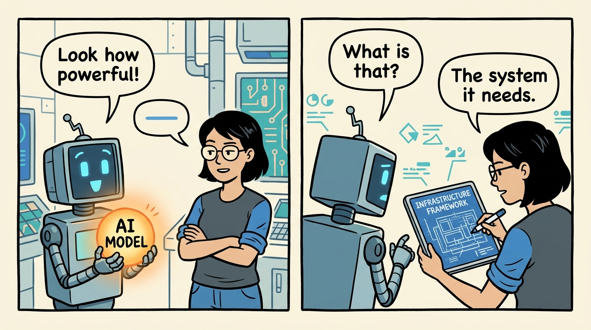
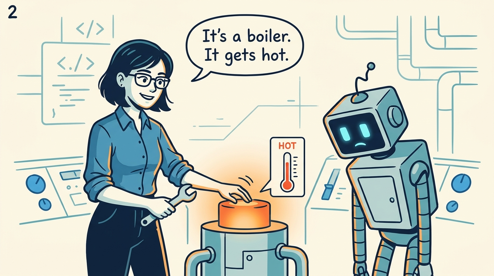
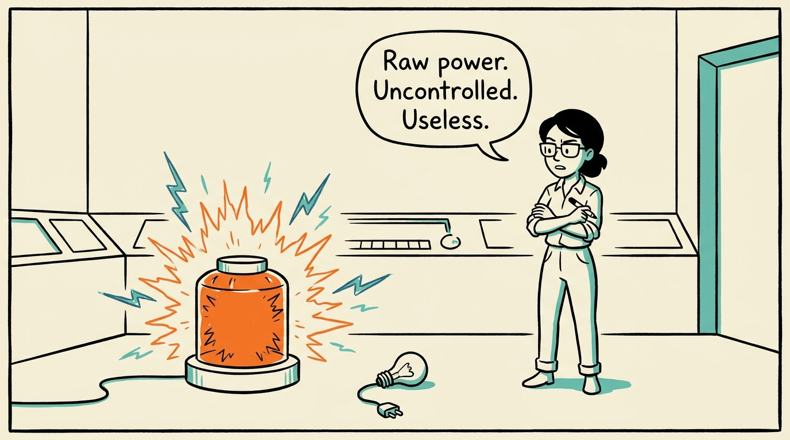
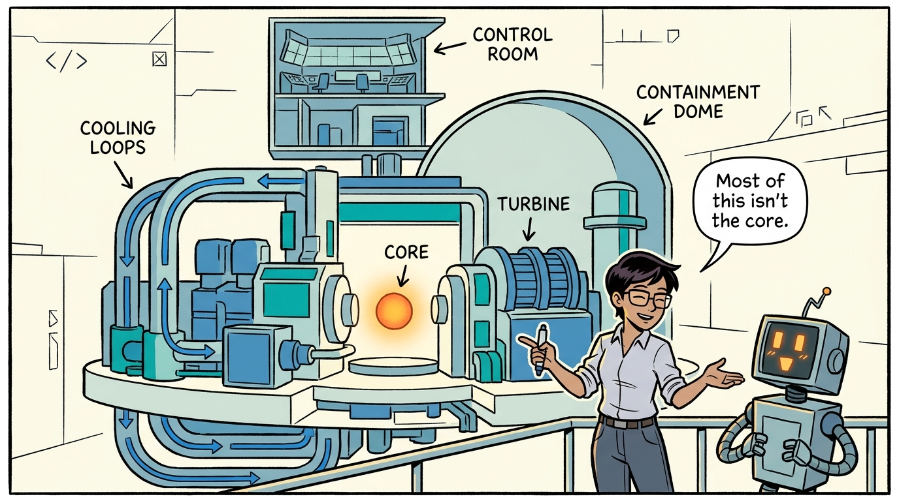
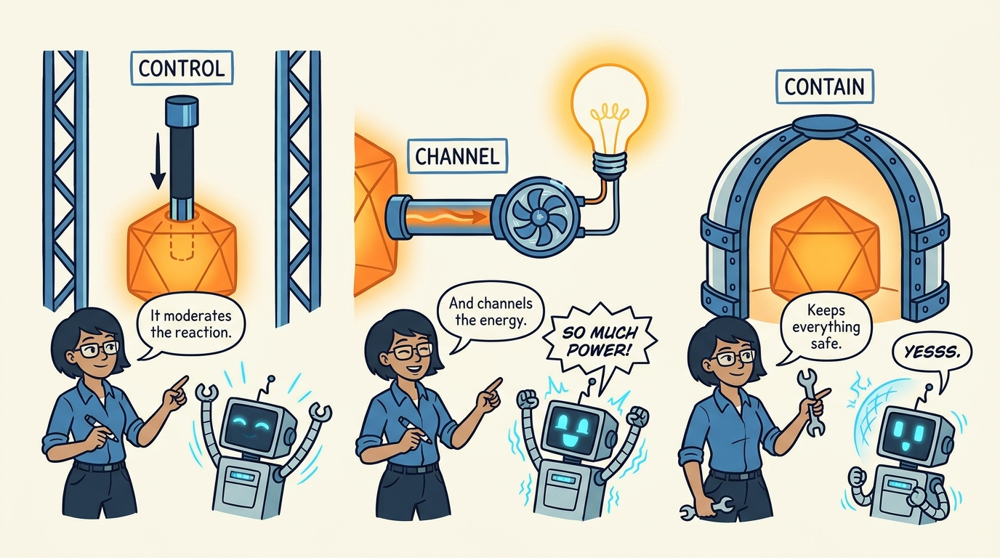
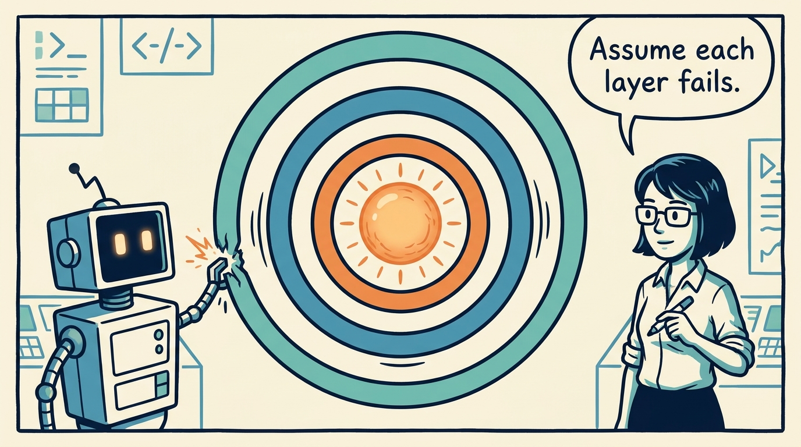
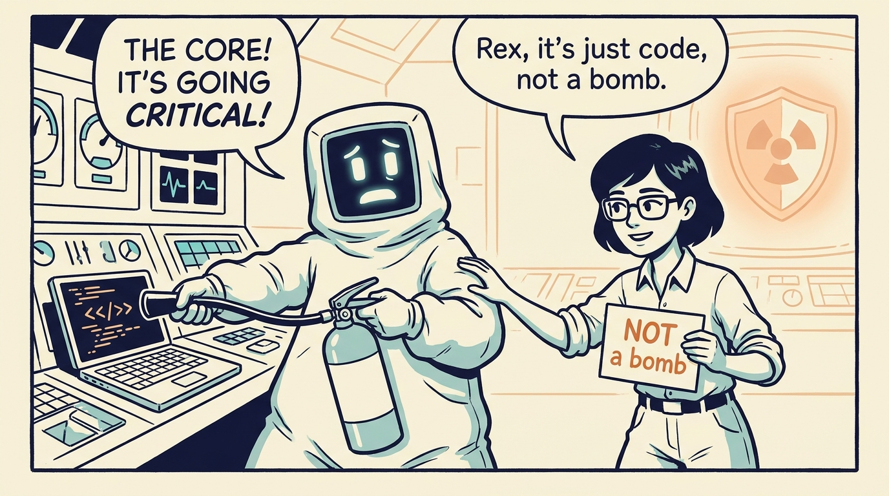
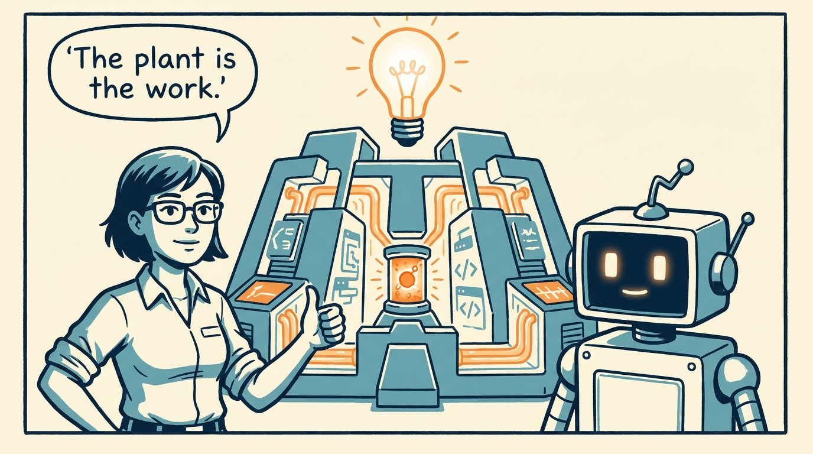

An eight-panel explainer comic for *AI Is the Reactor, Not the Plant*: generative AI is raw power like a reactor core, but almost all the value and engineering is the plant built around it to control, channel, and contain that power.

<!-- comic-style
{
  "cast": "MAYA: a pragmatic staff engineer / architect, short dark hair, glasses, rolled-up sleeves, calm and slightly amused, often holding a marker or a wrench. REX: an over-eager boxy robot AI assistant, one bent antenna, glowing rectangular eyes, perpetually excited about raw power.",
  "style": "Clean two-tone explainer comic, thick ink outlines, flat colors with blue/teal accents and a warm orange glow for the reactor core, on a light cream background, generous white space, hand-lettered speech bubbles with SHORT readable text (max 8 words per bubble), simple geometric control-room and power-plant settings mixing machinery with software symbols, no photorealism, no dense text, no title text."
}
-->

**Panel 1:** *Generative AI is raw power — a glowing core. Dazzling, and on its own, not yet useful.*

**Panel 2:** *A reactor core is, plainly, 'the heat source for the power plant, just like the boiler is for a coal plant' (U.S. NRC).*

**Panel 3:** *Uncontrolled, the core is both useless and a hazard. Control is what makes a reactor a reactor.*

**Panel 4:** *Most of a plant — cost, components, engineering — is NOT the reactor. The marvel in the middle is a minority line item.*

**Panel 5:** *The plant does three jobs: control the rate, channel raw output into useful work, contain the damage when it fails.*

**Panel 6:** *Defense in depth: no single guardrail. Assume each safeguard fails, and design the next one to still hold.*

**Panel 7:** *Mind the limits: a model can't melt down or explode. The analogy is about structure, not physical danger.*

**Panel 8:** *AI handed us a reactor core. The work ahead is the plant — and that is the revolution.*
