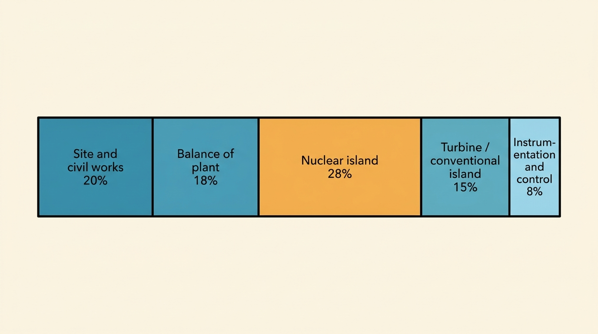
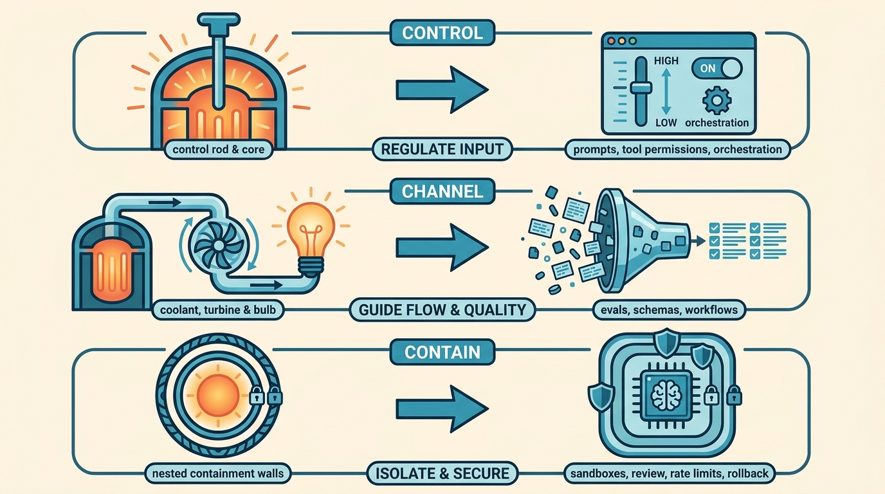
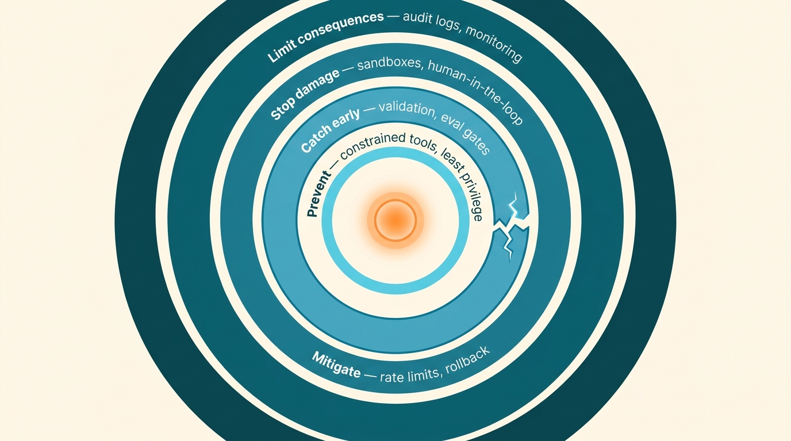

> **KEY POINTS:**
>
> * **Generative AI is raw power, like the heat from a reactor core.** A reactor core is, in the words of the U.S. nuclear regulator, simply "the heat source for the power plant, just like the boiler is for a coal plant." Powerful, dense — and on its own, not yet useful.
> * **Almost none of a nuclear plant is the core.** The reactor is a minority of the cost and a small share of the engineering. The plant is the control rods, the cooling loops, the containment, the instrumentation, the layered safety systems — the machinery that turns a raw reaction into something "predictable and controllable."
> * **The same shift is happening with AI.** The model is the reactor. The product, and most of the real work, is the plant around it: evaluation, guardrails, orchestration, observability, and the human and organizational systems that channel raw capability into something we can trust.

 
It is easy to be dazzled by the core.

A modern AI model, like a reactor core, is a remarkable thing: a dense source of raw power that did not exist at this scale a few years ago. And like a reactor core, it tempts us into the wrong question. With nuclear power, the naive question is "how hot can the core get?" With AI, it is "which model is best?" or "how capable is the latest release?"

Both are the wrong primary question, for the same reason. **The power of the core is not where the value is, and it is not where most of the work is.** The value and the work are in everything built around the core to control it, channel it, contain it, and convert it into something useful and safe. A reactor core that is not surrounded by a plant is not a power station. It is just a hazard.

This article takes that analogy seriously — and only as far as it actually holds. Nuclear power gives us a few hard, verifiable facts about where the engineering really goes. AI is starting to teach us the same lesson.

## What a Reactor Core Actually Is

Strip away the mystique and a reactor core does one thing: it gets hot. The U.S. Nuclear Regulatory Commission describes the reactor plainly as "the heat source for the power plant, just like the boiler is for a coal plant." The exotic part is *how* it gets hot — a self-sustaining fission chain reaction — but its job in the plant is humble. It is a heat source.

That heat is only worth anything once it is made **steady**. The same NRC training material puts it well: by controlling the chain reaction, "heat energy is consistent and constant. As a result, the steam generation — and by extension the generation of electricity — is predictable and controllable." The entire economic point of the plant is to take a raw, intense reaction and render it *predictable and controllable*.

Left to itself, an unchecked reaction runs away — the rate of fission climbs rapidly and the core produces far more energy than anything around it can use or absorb. Uncontrolled, the core is both useless (you cannot run a grid on an unsteady, runaway heat source) and dangerous. **Control is not a feature added to a reactor. It is the thing that makes a reactor a reactor rather than a hazard.**

So the core matters enormously — and yet, on its own, it produces nothing you would want. Hold that thought, because it is exactly the shape of where AI is today.

## Most of the Plant Is Not the Core

Here is the fact that makes the analogy more than a turn of phrase: **most of a nuclear power plant — by cost, by components, and by engineering effort — is not the reactor.**

A few numbers, attributed and kept conservative:

* The World Nuclear Association's cost breakdown (from its 2020 supply-chain report) puts the **"nuclear island" at about 28%** of plant cost. That figure already bundles in the reactor coolant system and steam supply, so the reactor vessel and core *alone* are a smaller slice still.
* The rest — the **conventional island (turbine) at ~15%, the balance of plant at ~18%, and site and civil works at ~20%** — adds up to more than half the cost, none of it the reactor.
* Instrumentation and control systems, on their own, are about **8%** — a line item roughly comparable to major mechanical equipment.
* A much older U.S. Department of Energy breakdown (from 1980, for a hypothetical plant — so treat it as illustrative, not a constant) put the reactor itself at just **15–20%** of *direct* cost, *co-equal* with the turbine and the plant structures. (This is a share of direct cost, a different base from the WNA percentages above, so the two are not strictly comparable — but both point the same way.) In that same estimate, the plant's engineering design "cost nearly as much as the reactor itself," and roughly **a third of the total was indirect cost** — engineering services, construction management, overhead.

| The intuition | The reality |
| --- | --- |
| The reactor is the plant. | The reactor is a **minority** of the plant — a small share of cost, components, and engineering. |
| The hard part is the core. | The hard part is the **control, cooling, containment, instrumentation, and conversion** around the core. |
| Build a better core and you have a better plant. | A better core is wasted without the plant to channel it. The plant is what produces power you can sell. |

The point is directional, not decimal: **the reactor is the smaller part of the problem.** The engineering, the cost, and the difficulty live in the systems that turn raw heat into safe, steady, sellable electricity.

**Figure 1:** *Where the money actually goes: the reactor 'nuclear island' (~28%) is a minority; the systems around it — turbine, balance of plant, civil works, instrumentation and control — make up the rest. (Shares from the World Nuclear Association's 2020 cost-by-activity breakdown.)*

## The Three Jobs of the Plant

Why does so much of the plant exist? Because raw power has to be made usable, and that takes three distinct jobs. The triad below is the article's own framing, and it rhymes with how nuclear engineers think: international safety guidance (the IAEA) names three fundamental safety functions a plant must ensure at all times — **control the reaction, remove the heat, and confine the material.** The labels are not identical (the IAEA's "remove the heat" is about cooling the core safely, where the plant's *channel* job is about converting that heat into sellable electricity), but the shape is the same: three things any plant — nuclear or AI — has to do with a raw power source.

| Job | In a reactor | In an AI system |
| --- | --- | --- |
| **Control** — set and hold the rate | Control rods of neutron-absorbing material (boron, cadmium, hafnium) slide in to slow the reaction and out to speed it up; a moderator and coolant keep it in its working range. | Prompts, system instructions, tool permissions, retrieval, and orchestration set what the model does and how far it can reach. This is the "throttle." |
| **Channel** — convert raw output into useful work | Coolant loops carry heat to a turbine; the turbine converts it into electricity the grid can actually use. | Evaluations, structured outputs, schemas, and workflows convert raw generation into a specific, checkable result a product can use. |
| **Contain** — assume things will go wrong, and bound the damage | Three physical barriers — fuel cladding, the coolant system, and the containment building — each there in case the one inside it fails. | Sandboxes, output filters, human review, rate limits, and rollback bound the blast radius when the model is wrong, manipulated, or misused. |

**Figure 2:** *The three jobs, mapped: control (set the rate), channel (convert raw output into useful work), and contain (bound the damage) — each with a reactor mechanism and its AI equivalent.*

Notice that none of these three jobs is "make the core hotter." They are all about what happens *around* the core. **In AI terms, almost none of the engineering that makes a product trustworthy is model training. It is the plant.**

This is the same instinct behind [[risc-for-ai-software-development]]: the adoption bottleneck is not whether the model can generate something, but whether we can inspect, test, and trust it. The control plane is where trust is manufactured.

## Defense in Depth: No Single Guardrail

There is one more nuclear idea worth borrowing carefully, because the AI field keeps rediscovering it under other names.

Nuclear safety does not rely on any single safeguard. The governing philosophy, **defense in depth**, stacks independent layers — the IAEA describes five levels, from preventing problems, to catching them early, to engineered systems that stop core damage, to mitigating an accident, to limiting consequences if all else fails. The NRC defines it as "successive compensatory measures." Crucially, the rules require **at least two diverse and independent shutdown systems**, where one alone can hold the reaction in check. Each layer is designed on the assumption that the layer inside it *might fail*.

The AI parallel is direct. A single guardrail — one prompt, one filter, one "please don't do that" — is the equivalent of trusting one shutoff. Real systems layer them:

* **Prevent** — constrained tools, least-privilege permissions, narrow scopes.
* **Catch early** — input validation, evaluation gates, anomaly detection on outputs.
* **Stop damage** — sandboxes, human-in-the-loop on high-blast-radius actions.
* **Mitigate** — rate limits, circuit breakers, the ability to roll back.
* **Limit consequences** — audit logs, monitoring, incident response.

The lesson is not "add more filters." It is **assume each safeguard can fail, and design the next one to still hold.** That is what defense in depth means, and it is why the control plane is layered, not a single wall.

**Figure 3:** *Defense in depth: independent layers, each designed on the assumption that the one inside it can fail — prevent, catch early, stop damage, mitigate, limit consequences.*

## Widening Out: Organizations and Society Are Plants Too

So far this is an engineering point. But the same shape repeats at larger scales, and it is worth following — carefully — one level up.

**For an organization**, the model is, again, just the core. An enterprise does not get value from "having access to a frontier model." It gets value from the operating model around it: who is accountable for what an agent does, which decisions a human must still make, how work is reviewed, how failures are caught and fixed. [[breaking-vibe-monolith]] makes the engineering version of this case — that the way out of brute-force AI development is *better structure*, not more force — and [[prepare-for-ai-future]] makes the human version: the scarce skill becomes judgment, accountability, and deciding, not generating. The reactor got cheap. The plant did not.

**For society**, the pattern is the same and the stakes are higher: the raw capability is arriving faster than the institutions, norms, laws, and accountability structures that channel and contain it. It is fair to say that much of the hard, slow, unglamorous work of making nuclear power a net good for society was not the physics of the core but the social "plant" around it — regulation, operating discipline, liability, oversight, and public trust. With AI, that plant is largely still under construction.

A caution here, because this is where analogies get stretched: this is a claim about *structure*, not about *danger*. The point is not that AI is a physical hazard on the level of fission. It is that **with any powerful general-purpose capability, the capability is the easy part. Channeling it safely toward what we actually want is the hard, expensive, durable part — and that is mostly built around the core, not inside it.**

## Where the Analogy Breaks

The strongest version of an analogy is the one that names its own limits. This one breaks in at least four places, and saying so keeps it a tool rather than a slogan.

| Where it holds | Where it breaks |
| --- | --- |
| Raw power is a minority of the system; the value is in the control plane around it. | **AI is not physically dangerous like fission.** A commercial reactor's failure modes are heat and radiation. A model cannot melt down or explode. The danger from AI is wrong outputs, misuse, and over-trust — real, but a different kind of risk. |
| Both need control, channeling, and containment to be useful. | **A reactor's physics are fixed and well-understood; a model's behavior is not.** Control rods obey known nuclear physics. Model behavior is statistical, shifts between versions, and resists exhaustive specification. The "core" itself keeps changing under you. |
| Layered safety beats any single safeguard. | **Nuclear safety has decades of standards, regulators, and operating data.** AI's "plant" is being designed in public, in real time, without a settled rulebook. We are improvising the containment while the core runs. |
| The core alone produces nothing useful. | **A model alone is still useful in a way a bare reactor core is not.** You can get real value from a raw model in a chat box. The analogy is about where *durable, trustworthy, production* value comes from — not about the model being inert. |

If you find yourself saying "AI will melt down" or "we need a containment dome for GPUs," you have crossed from using the analogy to abusing it. The useful part is narrow and sturdy: **the power is the small part; the plant around it is the work.**

## What to Do on Monday

The mental model is only worth having if it changes where you spend effort. Here is the principle made concrete.

| Move | What it looks like | What it buys you |
| --- | --- | --- |
| **Budget for the plant, not the core** | When planning an AI feature, expect most of the work to be evals, guardrails, orchestration, observability, and review — not prompting the model. Staff and schedule accordingly. | Estimates stop being wildly optimistic; the "90% done" demo does not turn into six months of plant-building. |
| **Build the throttle first** | Before scaling usage, decide what the model is *allowed* to do: tool scopes, permissions, and limits. Control before capability. | You can turn power up safely because you can turn it down. |
| **Layer your safeguards** | Don't rely on one filter or one review. Assume each safeguard fails and design the next layer to hold. | A single bad output or jailbreak does not become an incident. |
| **Measure the conversion, not the core** | Track whether raw output becomes a *correct, checkable* result — eval pass rates, escaped-defect rates — not just "the model is impressive." | You optimize the part that actually produces value. |
| **Name who owns the reaction** | Decide, explicitly, which decisions a human still makes and who is accountable when an agent acts. | Accountability does not quietly evaporate into "the AI did it." |

None of these are about getting a better model. They are about building the plant — which is where the value, and most of the work, has always been.

## Closing Thought

The reactor core is a genuine marvel, and so is a frontier model. But a marvel is not yet a power station. The lesson nuclear engineering learned the hard way — that the core is the small part, and the plant around it is the cost, the engineering, and the entire reason any value comes out — is the lesson the AI field is now learning in fast-forward.

**Generative AI handed us a reactor core. The work ahead is the plant.** Most of it is not making the model more powerful. It is control, channeling, and containment — the unglamorous machinery that turns raw capability into something we can trust, sell, and live with. That is not the boring part of the AI revolution. **It is the revolution.**

## To Probe Further

* U.S. NRC, [*Reactor Concepts Manual (R-100)*](https://www.nrc.gov/cdn/legacy/reading-rm/training/reactor-concepts-training-course.pdf) — the reactor as a heat source "just like the boiler is for a coal plant"; the three barriers to fission-product escape; control rods.
* World Nuclear Association, [*Nuclear Power Reactors*](https://world-nuclear.org/information-library/nuclear-fuel-cycle/nuclear-power-reactors/nuclear-power-reactors) and [*Economics of Nuclear Power*](https://world-nuclear.org/information-library/economic-aspects/economics-of-nuclear-power) — control rods, moderator, coolant; the cost-by-activity breakdown showing the reactor as a minority of plant cost.
* IAEA, [*SSR-2/1, Safety of Nuclear Power Plants: Design*](https://www-pub.iaea.org/MTCD/publications/PDF/Pub1534_web.pdf) — five levels of defense in depth; the three fundamental safety functions; two diverse, independent shutdown systems.
* IFP, [*Why Does Nuclear Power Plant Construction Cost So Much?*](https://ifp.org/nuclear-power-plant-construction-costs/) — a 1980 DOE breakdown (illustrative, historical) putting the reactor at ~15–20% of direct cost, co-equal with turbine and structures.
* [[risc-for-ai-software-development]] — trust, not capability, as the adoption bottleneck; reducing the platform surface humans and AI must reason about.
* [[breaking-vibe-monolith]] — the way out of brute-force AI development is better structure, not more force.
* [[prepare-for-ai-future]] — when generation gets cheap, judgment and accountability become the scarce skills.

## Questions to Consider

Use these if your team is moving an AI feature from a demo toward something you would put your name on.

* When you scoped your last AI project, did you budget for the core or for the plant — and which one ran over?
* If your one main guardrail failed silently tonight, what is the *second* thing that would catch it?
* Can you turn the power down? Do you have a throttle — scopes, limits, a kill switch — or only an on switch?
* Are you measuring how impressive the model is, or whether its raw output reliably becomes a correct, checkable result?
* When an agent acts, who is accountable — and would that answer survive an incident review?
* Which of your AI investments are making the core hotter, and which are building the plant? Which list is longer, and which should be?
