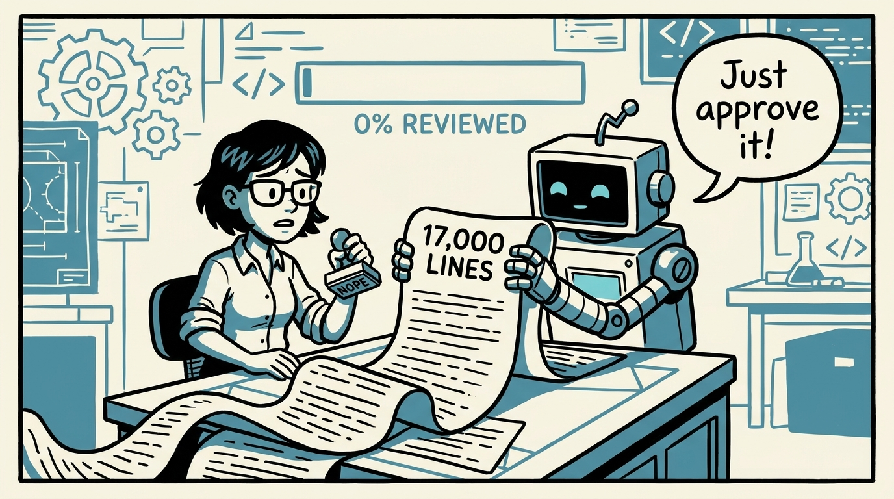
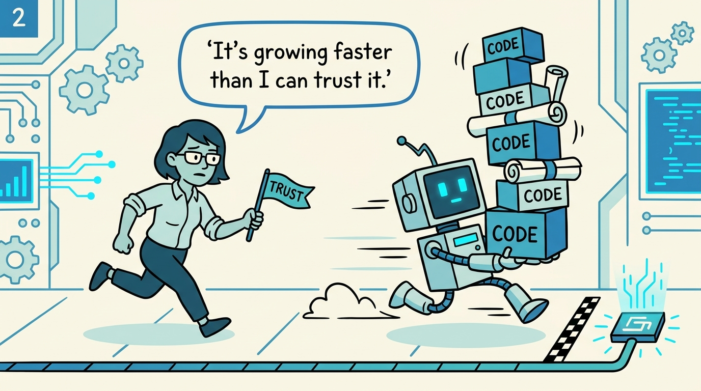
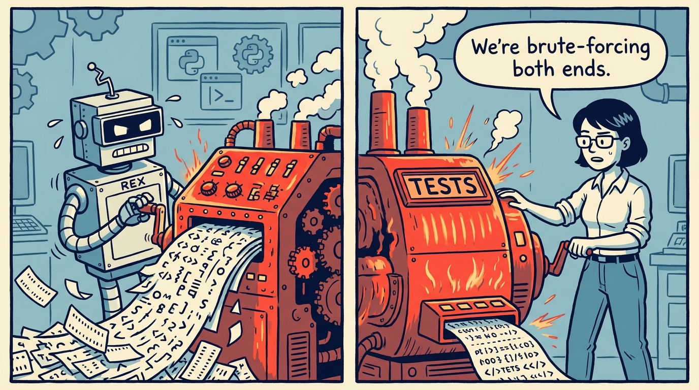
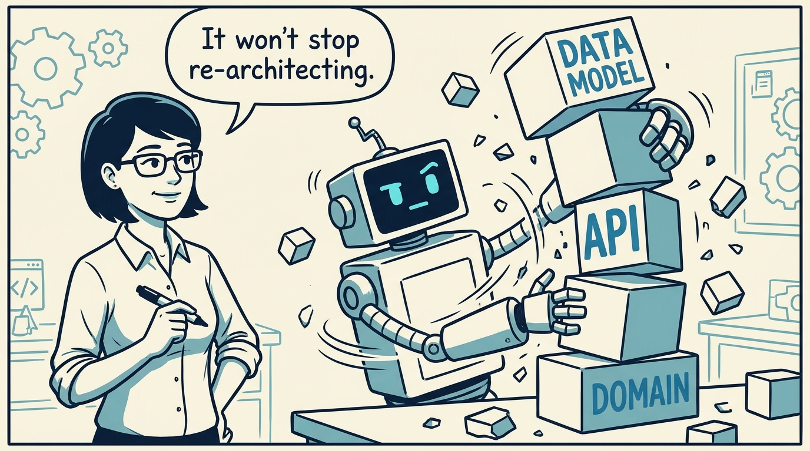
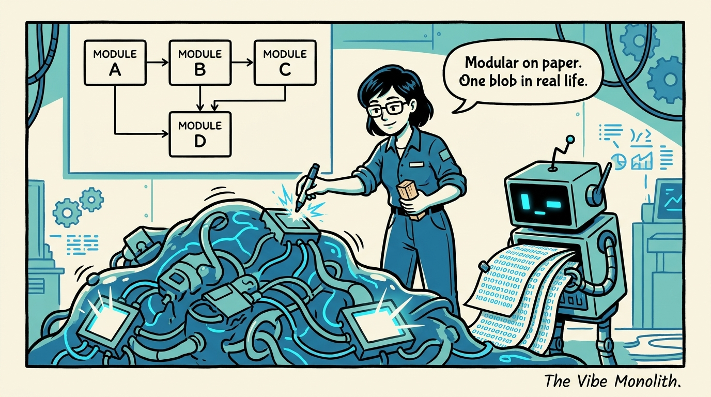
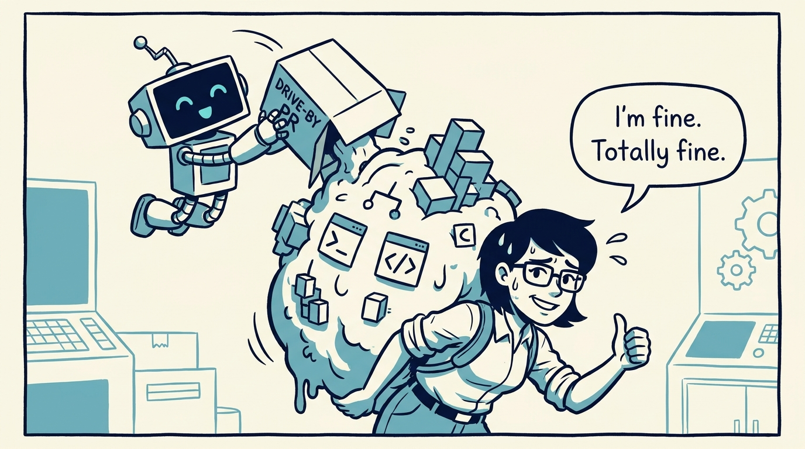
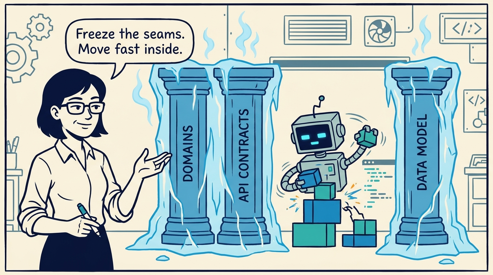
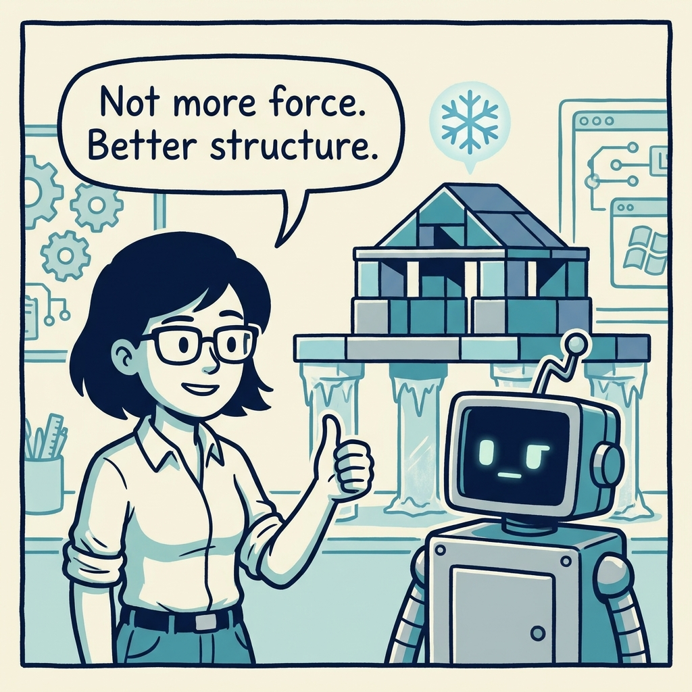

An eight-panel explainer comic for *The Vibe Monolith*: software outgrows our trust, AI never stops re-architecting, and the fix is to freeze the seams that matter.

<!-- comic-style
{
  "cast": "MAYA: a pragmatic staff engineer / architect, short dark hair, glasses, rolled-up sleeves, calm and slightly amused, often holding a marker or a small set of building blocks. REX: an over-eager boxy robot AI assistant, one bent antenna, glowing rectangular eyes, perpetually generating too much code too fast.",
  "style": "Clean two-tone explainer comic, thick ink outlines, flat colors with blue/teal accents on a light cream background, generous white space, hand-lettered speech bubbles with SHORT readable text (max 8 words per bubble), simple geometric workshop/control-room settings mixing machinery with software symbols, no photorealism, no dense text, no title text."
}
-->

**Panel 1:** *A pull request is a trust mechanism. Nobody reviews 17,000 lines.*

**Panel 2:** *Software now grows faster than our trust in it. That gap is the problem.*

**Panel 3:** *Brute force on both sides — building and believing — burns hardware, tokens, and people.*

**Panel 4:** *The failure mode isn't that AI won't refactor — it's that it won't stop re-architecting.*

**Panel 5:** *The Vibe Monolith: clean diagram, but it behaves — and breaks — as one thing.*

**Panel 6:** *Small teams fly, but scaling stalls: the burden piles onto your best people — high-functioning burnout, output high while they hollow out.*

**Panel 7:** *Cool the system down: freeze the high-blast-radius seams, let AI move fast inside them.*

**Panel 8:** *The way out of the burn is not more force — it is better structure.*
