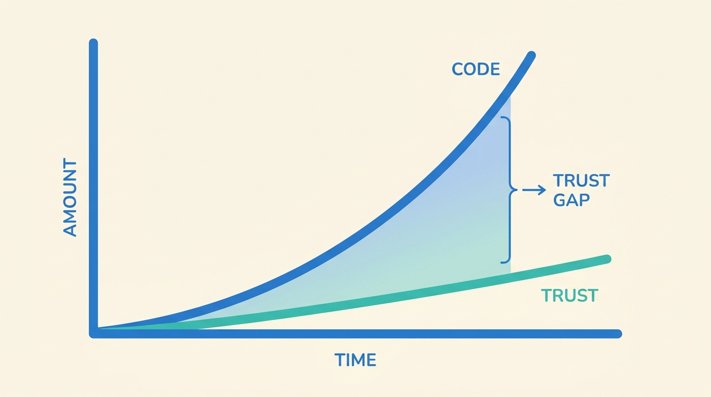
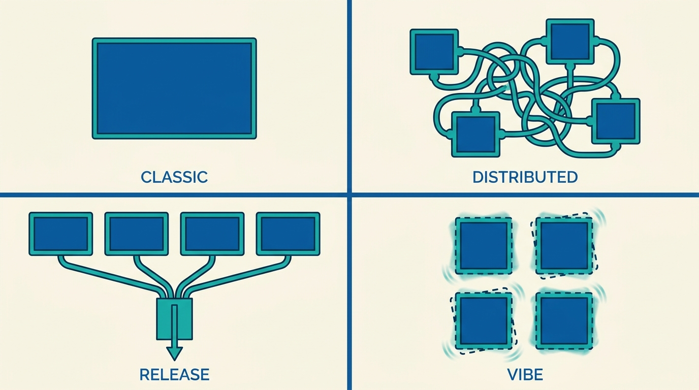
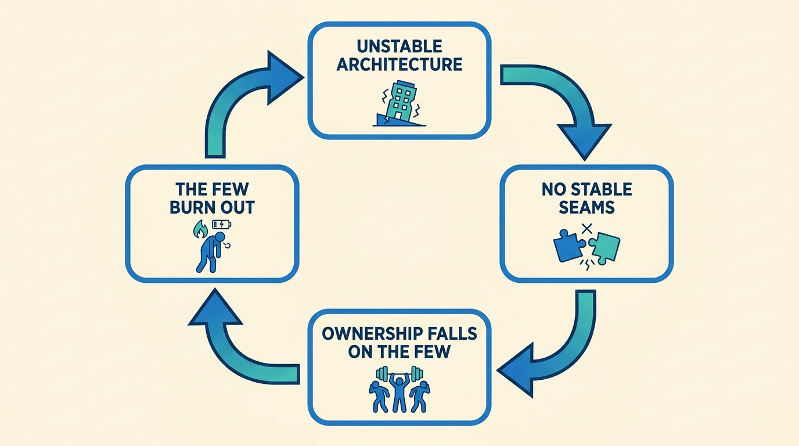
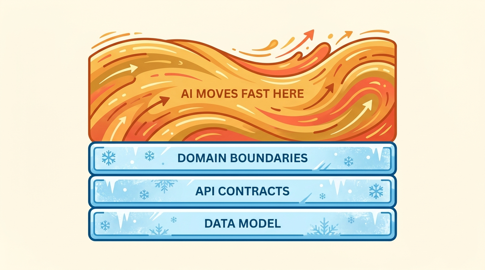

> **KEY POINTS:**
>
> * IT architecture in the age of AI comes down to **trust** and **sustainability** — and **software now grows faster than our trust in it**. That gap, not raw capability, is the problem.
> * We lean on **brute force on both sides**: brute-force generation *and* brute-force after-the-fact verification. Brute force burns hardware, money, tokens, and — most of all — people. It does not scale.
> * The architectural symptom is **continuous re-architecting**. The failure mode is not that AI won't refactor; it's that it **won't stop re-architecting** the foundations.
> * The result can be a **Vibe Monolith**: a system that is modular on paper yet behaves as one rigid entity, because its parts grow deeply coupled and its architecture never holds still.
> * The bill lands as **cognitive load and lost ownership**, and as **high-functioning burnout** — concentrated on the engineers who are *best* at AI.
> * Architecture's job now is to **cool the system down**: freeze the highest-blast-radius seams — **domain boundaries, API contracts, the data model** — and let AI move fast inside them. **The way out of the burn is not more force; it is better structure.**

 
The way I see it, IT architecture in the age of AI comes down to two things: **trust** and **sustainability**. Almost everything interesting about how we build software right now is a story about one or both of them — and, more often than not, about how we are running short on both.

## Software Is Growing Faster Than Our Trust

A startup CTO in Amsterdam recently told me he had just merged a single pull request of **17,000 lines of code** — one to two person-years of work, landing in one PR.

Sit with that for a second, because it tells the whole story in miniature. A pull request is, at its heart, a **trust mechanism**. It is the checkpoint where a human being looks at a change and says: *I understand this well enough to vouch for it.* Nobody on earth meaningfully reviews 17,000 lines. So the ceremony still happens — the PR is opened, approved, merged — but **the trust it was supposed to manufacture has quietly evaporated**. The artifact survived; its purpose did not.

That is the core problem of this era, made physical. AI boosts development effort in two broad ways: it supports the software development lifecycle itself — writing code, generating tests, drafting documentation, reviewing changes — and it adds entirely new product capabilities that were previously impractical to build. But the pace of all this makes it genuinely difficult to maintain trust and sustainability in our architecture. We do not have enough time to understand the implications of each AI-driven integration before the next one lands. **Software is now growing much faster than our trust in it — and that gap is the problem.**

This is not how we used to work. Many traditional approaches, agile chief among them, were designed to build trust *alongside* the development of the system. Short iterations, working software, continuous feedback, retrospectives — these were mechanisms for the team's confidence to grow in step with the codebase. With AI in the loop, that co-evolution breaks down. **The code races ahead; the trust lags behind** (Figure 1). A 17,000-line PR is what it looks like when a year of incremental trust-building checkpoints collapses into one indigestible lump.

**Figure 1:** *Software now grows faster than our trust in it; the widening gap is the problem.*

## We Are Using Brute Force — for Both Building and Believing

Current approaches to building *and* trusting AI-developed systems lean heavily on **brute force, on both sides of the equation**.

| | How brute force shows up | Why it fails |
| --- | --- | --- |
| **Building** | An agent generates a large amount of working code quickly, often as something close to a black box. We accept it because it runs. | "It runs" is not "we understand it." Volume outpaces comprehension. |
| **Believing** | We throw effort at verification *after the fact* — extensive testing and evaluation to gain confidence in what was produced. | We have no clear, shared picture of what "good" looks like for these systems, so we often cannot evaluate them properly even when we want to. |

On the trust side especially, brute force is harder than it sounds. **We are testing against a standard we have not fully defined, and reviewing volumes no human was built to review.** Verification has become its own escalating cost.

## Brute Force Does Not Scale — Everything and Everyone Is Burning

Brute-force trust-building is fundamentally unsustainable, because **brute force burns resources, and right now it is burning all of them at once**.

* **Hardware.** A global fight for the compute to train models, with everyone racing to secure as much as possible.
* **Inference.** Servers overloaded and expensive; we burn tokens to get results.
* **Verification.** We burn still more compute to test and evaluate those results.
* **People.** Most importantly, the engineers — absorbing enormous pressure as the rate of change outstrips anyone's ability to keep up.

There is a **second-order version** of this that is even harder to undo. The technical debt being generated now requires senior human judgment to fix — but in many places we are cutting the very junior engineers who would have *become* those seniors, hollowing out the career ladder. **We are burning not just current people but the pipeline of future ones.** A model of progress whose primary lever is "apply more force" eventually runs into the limits of all of this: hardware, money, tokens, and people.

## The Architectural Symptom: Continuous Re-Architecting

Architecturally, the most striking thing I observe with an AI-powered SDLC is **continuous re-architecting**.

The fingerprint is in the metrics. Across the projects I see, there is a dramatic increase in **churn** — code revised or thrown away shortly after it was written — alongside a sharp rise in the raw number of commits. My intuition is that a huge part of this comes directly from continuous re-architecting. This isn't only my impression: GitClear's analysis of roughly 211 million changed lines found **code churn — lines reverted or rewritten within two weeks — projected to double** across the AI-adoption period, while the share of *moved* (refactored, reused) code fell. In the fully agentic projects I'm seeing — the 17k-PR world — it runs far higher than that conservative, published floor.

It is worth being precise about *why*, because the published explanation and mine are subtly different, and **the difference is the point.**

| | The published failure mode | The one I'm describing |
| --- | --- | --- |
| Era | **Autocomplete** — a developer tab-completing suggestions into a file. | **Agentic** — AI developing systems end-to-end. |
| What goes wrong | AI **under-refactors**: it pastes and duplicates rather than consolidating, partly because a limited context window means it never sees enough surrounding code to reuse it. | AI **won't stop re-architecting**: it constantly reworks the foundational elements — data structures, APIs, domain boundaries, core concepts. |
| The trap | Duplication and missed reuse. | Rapid rewrites of exactly the things that traditionally demand careful, deliberate planning because they are expensive and risky to change. |

The under-refactoring finding is real, and it belongs to the autocomplete era. What I'm describing is closer to the opposite. When we develop systems end-to-end with AI, we are not just adding incremental features on top of a stable base, and we are not just duplicating. **We are constantly reworking the foundations themselves.** With AI doing the heavy lifting, we are tempted — and often effectively forced — to rewrite them rapidly without fully grasping the long-term implications.

The obvious risk is technical debt and instability. But there is a subtler problem that shows up *even when the resulting system is objectively elegant*. I call it the **Vibe Monolith**.

## A Taxonomy of Monoliths — and Why the Vibe Monolith Is Different

It helps to be precise, because "monolith" gets used loosely. There are several distinct kinds, and they differ in *where the coupling lives* (Figure 2):

| Kind | Where the coupling lives | The deal you get |
| --- | --- | --- |
| **Classic monolith** | One application, one database. Everything in one place. | Simple to start; everything is entangled by default. |
| **Distributed monolith** | Many services on paper, so tightly interdependent they behave as one. | You pay the cost of distribution without earning its benefits. |
| **Release monolith** | Code and data are isolated, but nothing ships without coordinating across dozens of teams. | Coupling lives in the release process, not the code. |
| **Vibe Monolith** | The components are genuinely modular — but the *architecture itself won't hold still*. | A clean diagram that still behaves, and breaks, as one thing. |

The **Vibe Monolith** is a new and different animal, and it is a product of AI-driven development specifically.

**Figure 2:** *Four kinds of monolith. The Vibe Monolith's coupling is in time: the architecture itself won't hold still.*

With AI building the system — agents working end-to-end across the whole codebase — you can end up with something that is *technically* well-architected, with components that genuinely **are** modular and decoupled, and yet the overall **vibe** of the system is monolithic. The modularity is real on paper but doesn't translate into the property that matters.

The reason is *how* the parts come to interact. Because the system is generated by brute force and end-to-end, the components grow **deeply dependent on one another** in ways that produce rigidity and inflexibility. The system *feels* like a single entity: a change in one part can ripple out and have unforeseen consequences somewhere else entirely. **You lose agility even though the architecture diagram looks clean.**

The deeper issue is **stability over time**. You might have a well-architected system at one specific moment — but with continuous re-architecting, that architecture is not stable. It won't look the same next week. And that instability is what makes the Vibe Monolith so costly, because it means **you cannot safely reason about, or work on, just one part of the system in isolation.** The boundaries you'd rely on to contain your attention keep moving.

## The Real Cost: Cognitive Load and the Collapse of Clear Ownership

A stable architecture is not just a technical nicety — it is the thing that lets humans and teams **divide and conquer**. This is the central argument of *Team Topologies*: the fundamental unit of delivery is the team, not the individual, and a team's cognitive load must be deliberately managed. Crucially, by **Conway's Law**, team boundaries become service boundaries — a monolithic organization produces a monolithic architecture regardless of microservices intent. The Vibe Monolith attacks exactly the seams this depends on, and the bill comes due on two levels.

**Individually**, cognitive load goes through the roof. Without stable structures to lean on, you have to hold far more of the system in your head at once, because you can't trust that the part you're not looking at will stay put. And it's worth being precise about the *kind* of load: not the **intrinsic** difficulty of the domain, but **extraneous** load — the avoidable burden imposed by weak boundaries and shifting structure. Good architecture, in this framing, is not merely modular; it is **merciful**. Continuous re-architecting is the opposite: it manufactures extraneous load for free.

**At the team level**, it's worse. A stable architecture is what you use to split work, draw boundaries, and assign teams clear, durable responsibilities. When the architecture is constantly evolving, **you cannot establish clear ownership and accountability** — there are no stable seams to organize around. *Team Topologies* even has a name for the precursor: "hidden monoliths and coupling in the software-delivery chain." The Vibe Monolith is arguably the **AI-native cousin of the hidden monolith**. The result is confusion, miscommunication, and ultimately an erosion of trust in the system as a whole. **The architecture problem becomes an organizational problem.**

## The Burden Lands on Your Best People

Here is the observation I find most counterintuitive, and most important. Another CTO, at a startup scaling up, told me that the people on his teams who are *really good* at leveraging AI in the SDLC are **the ones feeling the most incredible burden of it**.

That should stop you, because it inverts the naive expectation.

| What we assume | What's actually happening |
| --- | --- |
| AI helps the strong and exposes the weak. | The people most fluent with AI are carrying the heaviest load. |
| The ones who can't keep up are the ones who burn out. | The ones who adapted *hardest* are the ones burning out. |
| More AI means less work. | The *kind* of work changed — from authoring to validating — and the new kind is heavier. |

The reason is a shift in the *kind* of work, not just the amount. Developers have moved from being the primary authors of code to being **validators of machine-generated output**; the transformation has moved to the cognitive layer. Execution got cheap — less manual coding, less boilerplate, faster iteration — but it has been replaced by interpretation, verification, and decision-making. That is not less work. It is **different, and heavier, work**. And the people best at AI are precisely the ones who have absorbed the most of it.

There is a clinical name for what that CTO is describing: **high-functioning burnout**. It is a documented state where, under sustained high cognitive load, performance is *maintained* while mental reserves steadily erode. It is not a collapse — which is exactly why it's so dangerous, and why it's invisible to everyone but the person experiencing it. **The output stays high while the person hollows out.** If these burdens stay invisible, development remains formally fast while becoming structurally more fragile — and the real question is not how much AI accelerates development, but **at what cost we can sustain that speed.**

The numbers behind "incredible burden" are not subtle. Industry telemetry on AI-heavy teams (Faros AI, *The AI Engineering Report*) points the same way: as AI adoption rises, **PR size, files touched per PR, and bugs per PR all climb together** — reviewers are not getting more of the same work, they're getting **structurally harder work**. And you cannot automate your way out: even as AI agents review a growing share of PRs, human review time keeps climbing, because someone still has to adjudicate what the agent flagged. **White-box review — a human reading every line — simply does not scale** when agents produce thousands of lines an hour. The 17k-line PR is the artifact; the burned-out senior is its human cost. Tellingly, this whole burden is mostly *unmeasured*: validation time, tech debt, and burnout sit outside standard productivity metrics, and managers consistently report rosier conditions than the people doing the work. **What we don't measure, we can't manage — and right now we're not measuring the cost.**

And here is the connection back to the Vibe Monolith — the part that makes this more than a burnout story. **The burden does not spread evenly.** When the architecture won't hold still, there are no stable seams to distribute ownership across, so responsibility collapses onto whoever can still mentally model the whole thing. Meanwhile "drive-by" contributions surge from people who open PRs without understanding the codebase, leaving the maintenance and refactoring to the few still in touch with it — which makes *their* burden worse. The people best at AI are exactly those few. **The instability at the system level is what manufactures the burnout at the human level.** The two halves of the problem close the loop — and, like any feedback loop, it tightens on each turn (Figure 3).

**Figure 3:** *A self-reinforcing loop: architectural instability concentrates ownership, which burns out the few who hold the system together.*

> One honest caveat, because it makes the point *more* believable rather than less: the productivity gains are themselves uneven and idiosyncratic. Some engineers derive far more benefit from AI workflows than equally clever, equally diligent peers — finding a workflow that clicks with your own habits matters more than any global optimum. There's even evidence that AI makes some experienced developers slower while *feeling* faster. The productivity story is genuinely messy. That's all the more reason **not to treat raw speed as the thing to optimize.**

## Why Small Teams Fly and Scaling Stalls

This framing explains something I keep seeing in practice.

**Good architecture is, functionally, stability that lets you split work and define teams with clear responsibilities.** Without it, you simply cannot scale work beyond one person or a small, tightly-knit group — there's no stable structure to coordinate around.

That, I think, is exactly why **individual productivity has shot up so dramatically** with AI, and why I see startups of up to ten people moving astonishingly fast. At that size, the whole system *can* live in a handful of heads. You don't need stable architectural boundaries to coordinate, because you barely need to coordinate at all. The senior-developer productivity gains are real, and a large share of new product MVPs are now built primarily this way.

Scaling *beyond* that is the real challenge — and the Vibe Monolith is a big part of why. **The very thing that makes a small team fast — everyone touching everything, end-to-end, at speed — is the thing that doesn't survive contact with a larger organization** that needs durable boundaries to function. It shows up in the data as a cliff: a large majority of AI-built applications never make it to production, and the gap between "works on my machine" and "works for 10,000 users" is where most of them die. **AI removes the *individual* constraint while leaving the *coordination* constraint fully intact.** That is precisely why the curve bends right around the point where one team becomes many.

## The Role of Architecture: Cooling the System Down

So what is architecture *for* in this new era? Its job is to **cool the system down** — to introduce the stability that prevents everything, and everyone, from burning out under brute force.

The industry is converging on the same diagnosis, and it's close to a paraphrase of this whole essay: vibe coding is a symptom of systems that generate code faster than they can govern it, and the fix is not slower generation — it's **governance that matches the speed**. This is also why the human-in-the-loop doesn't disappear as models improve. The opposite: as AI becomes more capable, **human oversight becomes *more* valuable, not less**. Architecture is how we make that oversight tractable instead of crushing.

Concretely, cooling the system down means deciding **what must stay stable while everything above it stays fluid.** Not everything can be in motion at once. The seams worth freezing are the ones with the **highest blast radius** when they move:

| Seam to freeze | Why it has the highest blast radius |
| --- | --- |
| **Domain boundaries** | The bounded contexts that decide who owns what. These are the org chart in disguise; let them drift and ownership drifts with them. |
| **API contracts** | The interfaces between parts. If these hold, teams can change their internals freely without coordinating — which is the entire point of decoupling. |
| **The data model** | The shared structures everything else depends on. Re-architecting these underneath a running system is where the worst instability lives. |

**Figure 4:** *Cool the system down: freeze the high-blast-radius seams and let AI move fast in the fluid layer above them.*

**Let the AI move fast *inside* these boundaries; hold the boundaries themselves stable, deliberately, as a first-class architectural act** (Figure 4). Around that, the practices the field keeps rediscovering all do the same thing:

* a lightweight architecture forum focused on contracts and guardrails;
* cognitive load checked regularly, and teams resized along their natural fracture lines;
* golden paths and a platform layer to absorb the extraneous load.

Each of these converts raw, fast, end-to-end AI development into something a larger group of people can sustainably build on. This is the same instinct behind [[risc-for-ai-software-development]]: shrink and stabilize the surface humans and AI must reason about together. And it echoes [[fashion-driven-software-development]]: decide what is the durable, stable core and what is allowed to change every season.

We have already seen, at the model layer, that **cleverness in structure can substitute for brute expenditure of resources** — DeepSeek being the obvious example of achieving strong results without simply burning ever more compute and money. The same principle is the one that matters for how we architect systems. **The way out of the burn is not more force — it is better structure.**

## What to Do on Monday

"Cool the system down" is a principle, not a task. Here is the principle made concrete — small, cheap moves that convert brute force into structure without slowing anyone down.

| Move | What it looks like | What it buys you |
| --- | --- | --- |
| **Name the frozen seams** | Write down — explicitly — which domain boundaries, API contracts, and data-model shapes are off-limits to casual change. Put them where the agent and the team both read them. | Re-architecting needs a deliberate decision instead of happening by default on every run. |
| **Gate the seams, not the code** | Require a human sign-off when a PR touches a frozen seam; let everything *inside* the boundaries flow. | Scarce review attention lands where blast radius is highest, not spread thin across 17,000 lines. |
| **Measure the unmeasured** | Track churn (lines reverted within two weeks), PR size, and a simple "could one person still explain this PR?" check alongside velocity. | The hidden cost becomes visible before it shows up as a resignation. |
| **Find who holds the whole system** | Identify the one or two people everything routes through, and treat their load as a system risk, not a personal strength. | You catch high-functioning burnout while it is still reversible. |
| **Run a lightweight architecture forum** | A short, regular review focused only on contracts and guardrails — not designs, not code. | Boundaries get defended continuously instead of rediscovered after they have already drifted. |

None of these slow generation down. They are governance that **matches** the speed — which is the whole point.

## Closing Thought

Trust and sustainability are not soft concerns layered on top of the "real" engineering. **In the age of AI, they *are* the engineering problem.** Software now outgrows our trust by default — a year of work in a single unreviewable PR. Brute force buys speed by spending hardware, money, tokens, and the people we can least afford to lose, concentrating the worst of it on the very engineers who are best at this. Architecture — real architecture, the kind that creates stable structures people can organize around — is how we **close the gap between how fast we can build and how fast we can believe in, and sustain, what we've built.**

## To Probe Further

* GitClear, [*AI Copilot Code Quality* (2025)](https://www.gitclear.com/ai_assistant_code_quality_2025_research) — churn projected to double, rising duplication, and the decline of refactoring across ~211M changed lines.
* [Faros AI](https://www.faros.ai/) — engineering-intelligence telemetry on how PR size, review time, and defect rates move under AI adoption.
* [Team Topologies](https://teamtopologies.com/), Matthew Skelton & Manuel Pais — cognitive load (intrinsic vs. extraneous), Conway's Law, hidden monoliths, and team boundaries built on stable architectural seams.
* [Conway's Law](https://www.melconway.com/Home/Conways_Law.html), Melvin Conway — organizations design systems that mirror their communication structure.
* [Platform engineering / golden paths](https://platformengineering.org/) — a platform layer that absorbs extraneous load so teams can move fast safely.
* [[risc-for-ai-software-development]] — reducing the platform surface humans and AI must reason about together.
* [[fashion-driven-software-development]] — deciding what is the durable core and what is allowed to change.

## Questions to Consider

Use these if your organization is scaling AI-assisted development past a single small team.

* When you approve a large AI-generated PR, are you manufacturing trust — or just performing the ceremony?
* Is your team's churn telling you about healthy iteration, or about continuous re-architecting of the foundations?
* Could your system be a Vibe Monolith — modular on the diagram, yet impossible to change one part without rippling everywhere?
* Which seams in your system are *deliberately* frozen — domain boundaries, API contracts, the data model — and which drift with every agent run?
* Who on your team can still mentally model the whole system, and what is that costing them?
* Are your best AI users your most energized people, or your most quietly depleted ones?
* Is your answer to AI-era pressure "apply more force," or "build better structure"?
* If you froze just three seams on Monday, which would they be — and what is stopping you from writing them down today?
