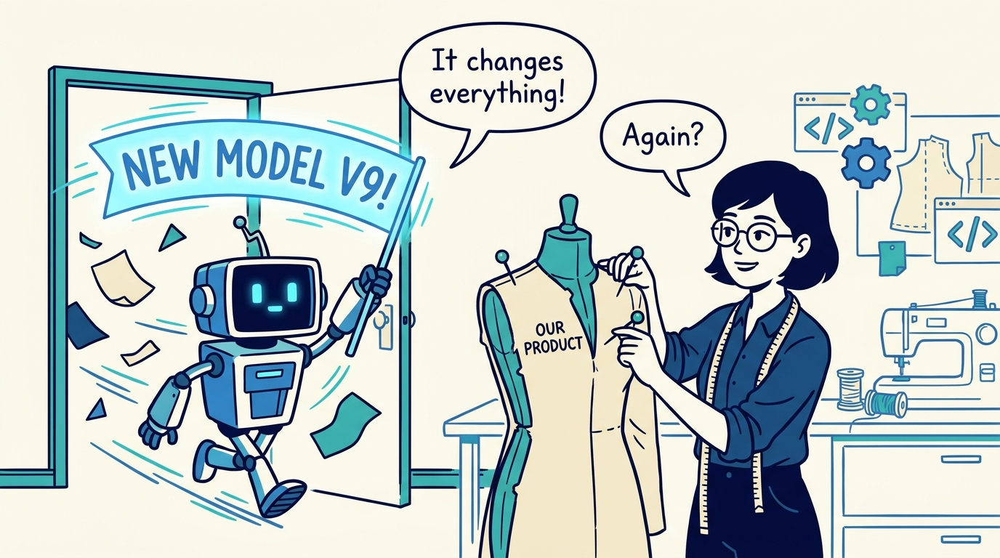
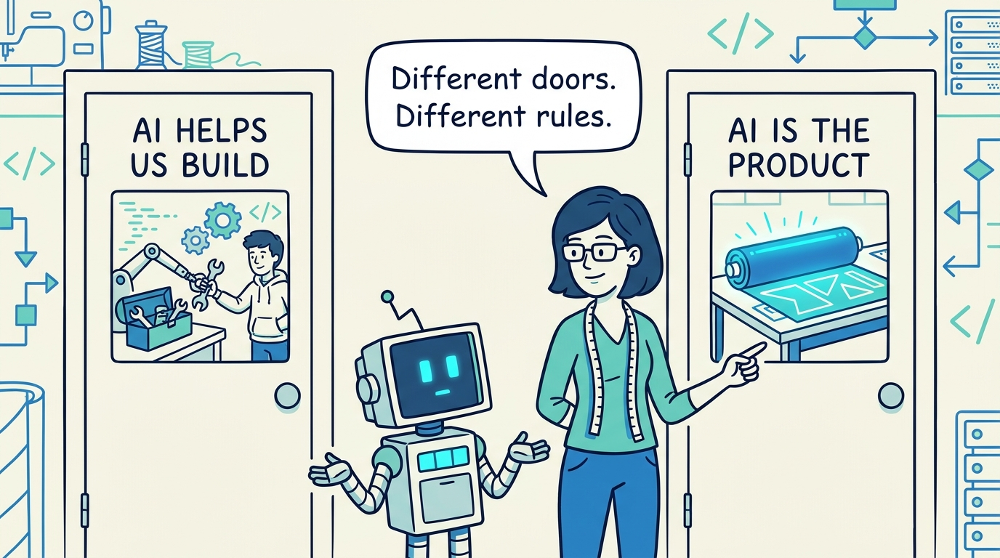
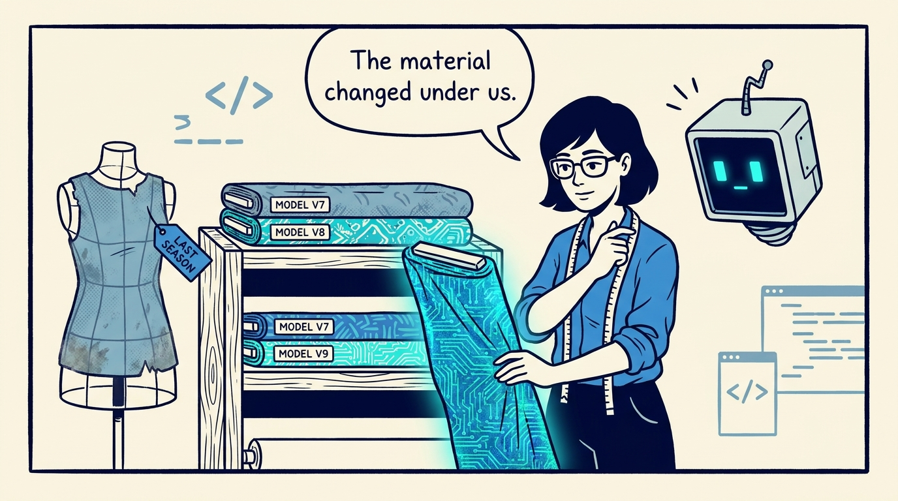
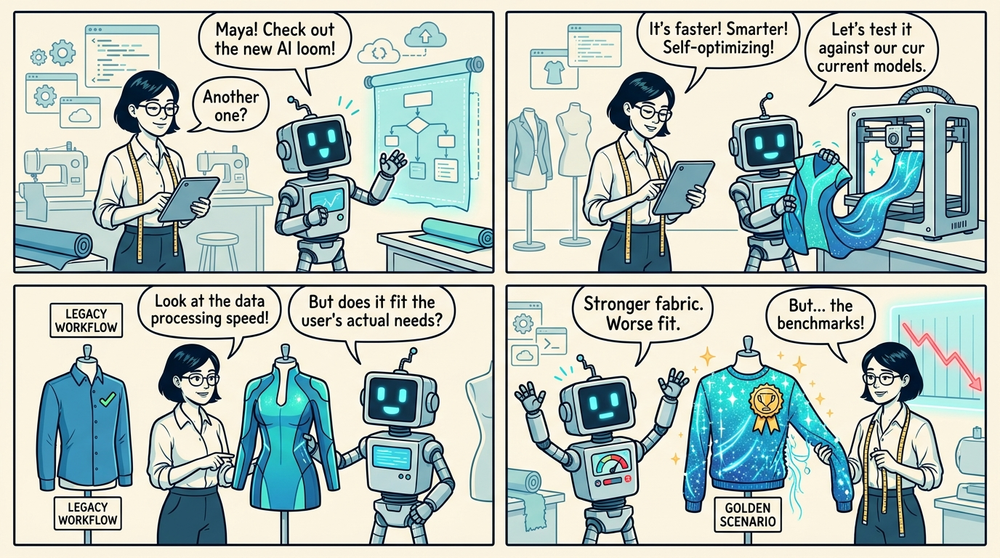
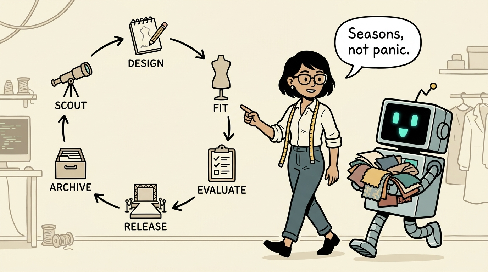
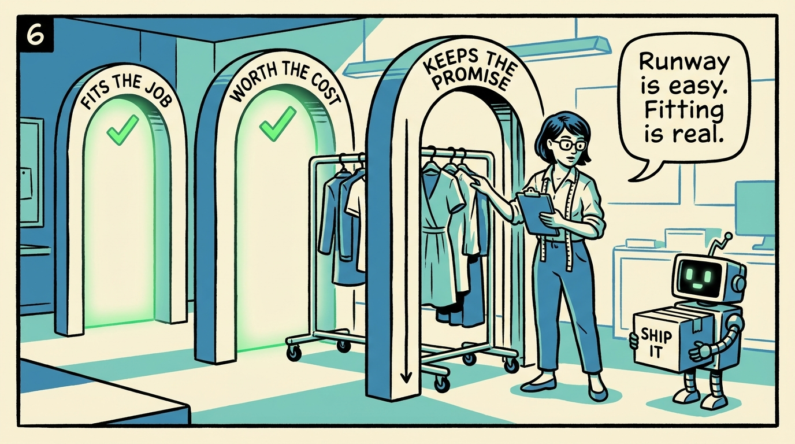
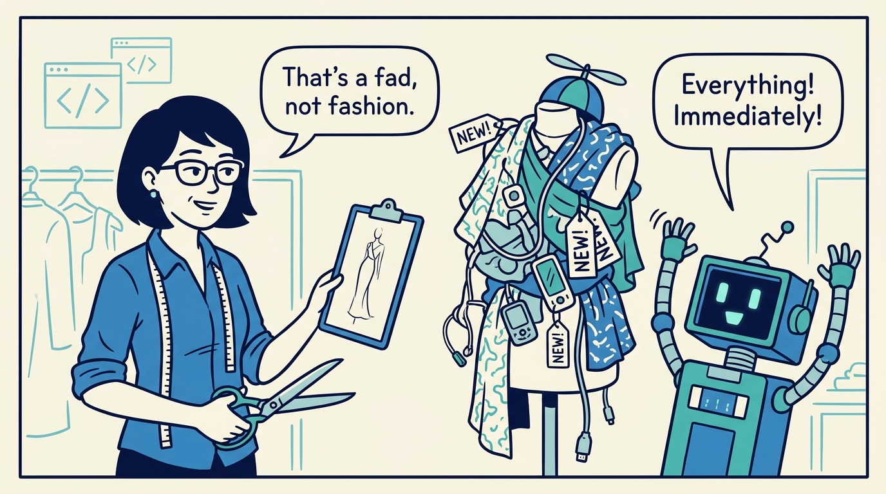
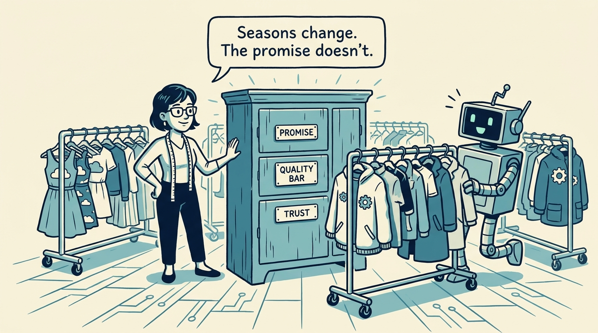

<!-- comic-style
{
  "cast": "MAYA: a pragmatic product lead, short dark hair, glasses, rolled-up sleeves, calm and slightly amused, here working in a software atelier with a measuring tape around her neck. REX: an over-eager boxy robot AI assistant, one bent antenna, glowing rectangular eyes, perpetually excited about every new thing.",
  "style": "Clean two-tone explainer comic, thick ink outlines, flat colors with blue/teal accents on a light cream background, generous white space, hand-lettered speech bubbles with SHORT readable text (max 8 words per bubble), simple geometric fashion-atelier and office settings mixing garments with software symbols, no photorealism, no dense text, no title text."
}
-->

Why building on generative models feels like fashion — in eight panels.

**Panel 1:** *Every major model release can change what is possible, what customers expect, and what should be rebuilt.*

**Panel 2:** *AI-assisted development is a productivity shift; AI-powered product development is an operating-model shift.*

**Panel 3:** *The model is part of the product's material — and the material changes from outside, in short seasons.*

**Panel 4:** *'Better model' is not 'better product': general gains can break your golden scenarios, controls, costs, or promises.*

**Panel 5:** *The rhythm is seasonal: scout the material, design a collection, fit on real users, evaluate, release selectively, archive the learning.*

**Panel 6:** *Evaluation is the fitting room: demos must still fit the job, justify the cost, and keep the promise customers trust.*

**Panel 7:** *The unhealthy version is fad-driven development: novelty without coherence. Good fashion edits.*

**Panel 8:** *Fashion changes, but not everything changes: the stable core is what lets the product rebuild fast without losing itself.*
