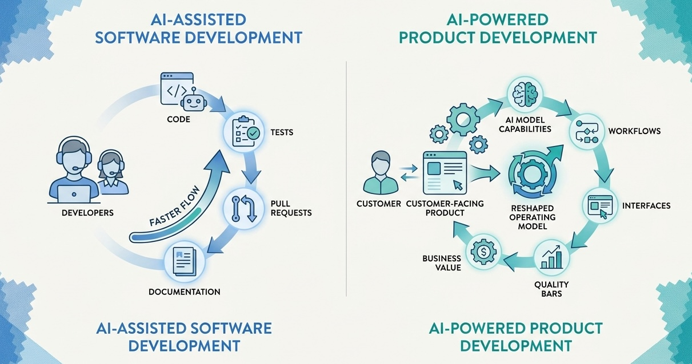
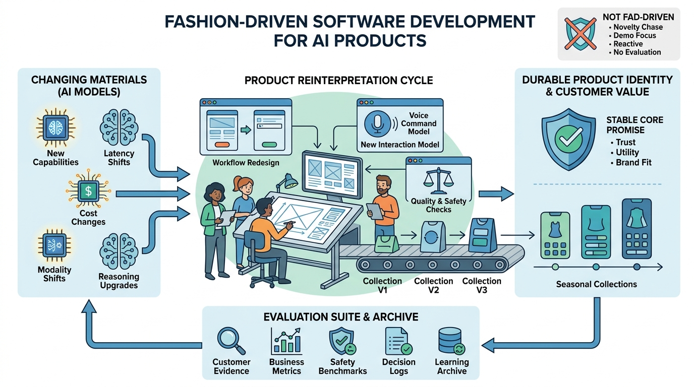
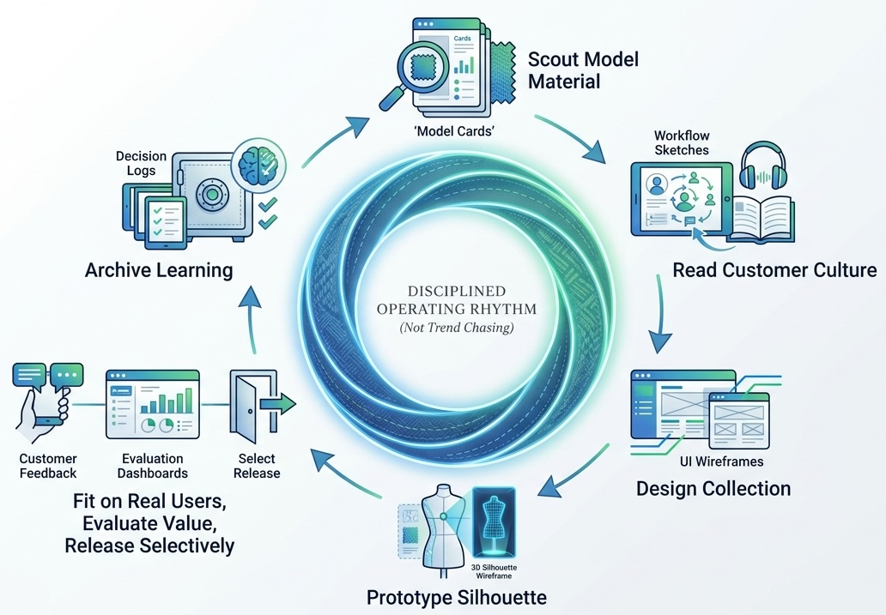
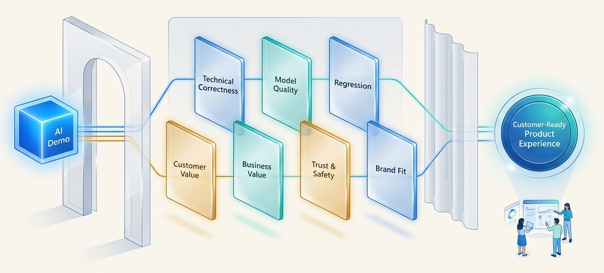

> **KEY POINTS:**
>
> * There are two different AI shifts: using AI to assist software development, and building products whose value depends on AI capabilities.
> * The central thesis: **model-powered products may need frequent reinterpretation around new materials** because every major model release can change what is possible, what customers expect, what breaks, and what should be rebuilt.
> * Fashion is a useful metaphor because it combines short seasons, changing materials, taste, collections, craft, brand identity, and commercial response.
> * Fashion-driven software development is not fad-driven development. It means moving fast while protecting customer value, quality, identity, and trust.
> * Fashion-driven software development extends modern product management rather than replacing it: outcome thinking still matters, but roadmaps, product briefs, discovery, and evaluation must account for unstable model materials.

**Model-powered products may need frequent reinterpretation around new materials.**

That is the central thesis of fashion-driven software development. When an AI model is only a tool used by developers, a better model may help the team build faster. But when an AI model is part of the product's material, a better model can change the product itself: its workflow, interface, quality bar, unit economics, customer promise, and competitive position. The planning horizon becomes shorter. Stability becomes more seasonal. Product fit becomes harder to predict rationally from capability charts alone.

And "better model" does not mean "better product" automatically. A model can improve dramatically in general benchmarks while becoming worse for your specific workflow, tone, latency target, safety boundary, expert control, or unit economics.

This note was inspired by a talk by [Samuel Beek](https://samuelbeek.com/), founder and CEO of [Schematik](https://lsvp.com/company/schematik/) and formerly CPO at VEED, at an Engineering Excellence meetup in Amsterdam. As I understood the story, VEED operated in a product category where the underlying generative AI models for video and image creation kept improving dramatically. Each new model could make previous workflows, interfaces, and assumptions feel old.

That observation is bigger than one company. It points to a distinction that is easy to miss in AI strategy conversations.

There is **AI-assisted software development**: developers use AI to write code, review pull requests, generate tests, summarize incidents, or draft documentation. This changes the productivity of the development process.

And there is **AI-powered product development**: the product's customer value depends directly on AI capabilities. In this world, a new model is not just a better tool for the team. It is a new material for the product itself.

Those are different games.

If AI helps your developers write code faster, you may need new engineering practices. If AI changes what your product can do, you may need a new product operating model. The second case can look surprisingly like fashion.

## Two Very Different AI Conversations

Most organizations are having both conversations at once, often using the same words.

| Question | AI-assisted development | AI-powered product development |
| --- | --- | --- |
| Where is AI used? | Inside the delivery process. | Inside the customer experience. |
| What improves first? | Developer throughput, review speed, documentation, test scaffolding. | Product capability, creative range, personalization, automation, user outcomes. |
| What changes when a new model appears? | The team may code, test, or analyze faster. | The product may need to be redesigned around new capabilities and new regressions. |
| Primary risk | Low-quality generated work entering the codebase. | A product experience becoming obsolete, generic, unsafe, regressed, or misaligned with customer value. |
| Core discipline | Engineering review, tests, architecture, security, developer workflow. | Product judgment, model evaluation, customer evidence, quality control, business-value validation. |

The distinction matters because AI-assisted development can create a false sense of progress. A team can ship more artifacts, faster, while the product itself is falling behind what new models make possible.

For a model-powered product, the key question is not only "Can we build this faster?" It is "Should this product still exist in this shape after the model changed?"

That is a different question. It is closer to fashion than to traditional software planning.

**Figure 1:** *AI-assisted development changes delivery speed; AI-powered products can change shape when the model material changes.*

## Why Fashion Is Not a Superficial Metaphor

When software people say "fashion", they often mean "fad": something shallow, temporary, and irrational. That is not the meaning I want here.

Fashion is not only trend chasing. The fashion industry is a system for turning changing materials, culture, taste, identity, seasonality, production constraints, and commercial demand into designed products. A fashion house has to know what is changing and what must remain recognizable. It has to experiment, edit, produce, market, learn, and archive.

It also has to accept that demand is not fully rationally predictable. You can study materials, production cost, past sales, customer segments, and cultural signals. You still cannot derive next season's taste from first principles. Timing, social proof, identity, surprise, fatigue, and context matter.

That maps surprisingly well to AI product development.

| Fashion concept | AI product parallel |
| --- | --- |
| Fabric and materials | Foundation models, APIs, model costs, latency, context windows, modalities, tool use. |
| Season | Model release cycles, platform shifts, user expectation changes, new creative patterns. |
| Collection | A coherent product release built around what the new model makes possible. |
| Silhouette | The dominant product shape: workflow, interface, interaction model, output form. |
| Fit | Whether the product actually works for the user's job, context, and taste. |
| Craft | Prompting, data flows, UX, editing controls, guardrails, retrieval, orchestration, evaluation. |
| Brand identity | The durable promise customers trust, even as features and models change. |
| Runway | Prototype, demo, launch video, internal model showcase. |
| Retail performance | Adoption, retention, willingness to pay, expansion, production usage. |
| Archive | What the team learns from past releases, failures, prompts, examples, and evaluations. |

Fashion moves because the world moves. AI products move because the capability substrate moves.

A fashion designer cannot pretend new fabric, new manufacturing techniques, new cultural signals, and new customer taste do not matter. An AI product team cannot pretend model quality, multimodality, reasoning, generation speed, cost, and user expectations are stable.

But good fashion is not chaos. It is disciplined change.

**Figure 2:** *When the model is part of the product material, each major model release can force a reinterpretation of the product.*

## What Changes When the Model Is the Material

In traditional software, a team often assumes that the underlying material is relatively stable. Programming languages, databases, cloud platforms, and UI frameworks evolve, but the product's core behavior is usually under the team's control. You can plan a roadmap, build features, refactor, maintain, and improve incrementally.

AI-powered products are different. The model is part of the material. And the material changes from outside.

When a new model arrives, several things can happen at once:

* A workflow that required five steps becomes one model call.
* A careful prompt chain becomes unnecessary because the model handles the task directly.
* A custom interface becomes too rigid because users can now express richer intent.
* A previously impossible output becomes normal.
* A premium feature becomes table stakes.
* A quality workaround becomes technical debt.
* A latency or cost change makes a new interaction pattern viable.
* A safety or consistency problem appears in a new form.
* A golden workflow that worked reliably on the previous model starts failing.
* A model that is better overall becomes worse for your specific use case.

This creates a product-management problem, not only an engineering problem. The team has to ask what to preserve, what to rebuild, what to retire, and what to explore.

In a video or image product, a new generation model might change the default output quality so much that the old editing flow feels over-engineered. Or it might unlock a new creative workflow where users describe intent instead of manipulating layers manually. Or it might make the product more powerful but less predictable, forcing new controls, previews, rollback, and evaluation.

The model is not a stable dependency with a strictly improving version number. It is an unstable capability. Each release is partly an upgrade, partly a migration, and partly a new failure surface. The previous model's quirks may have become part of the product's behavior. Customers may have learned them. Prompts may depend on them. Guardrails may have been tuned around them. A new model can remove old limitations while also invalidating old assumptions.

The product is still software, but the development rhythm starts to resemble collections.

## Short Seasons and Unstable Materials

Traditional software planning often assumes a reasonably stable substrate. A team may make a three-year platform bet, a twelve-month roadmap, or a multi-quarter architecture plan because the basic materials are expected to hold still long enough for the investment to pay back.

Model-powered products weaken that assumption.

The model landscape moves in short seasons. A frontier model release can change output quality, latency, cost, reasoning ability, multimodal range, tool use, safety behavior, failure modes, or customer expectations in weeks. A competitor can turn a new capability into a familiar interaction pattern before your annual plan finishes. Users can develop new taste quickly once a new output quality becomes normal.

This does not mean every team should operate in panic mode. It means long-term stability cannot be assumed at the same layer. The stable layer may be the customer promise, data trust boundary, evaluation suite, brand identity, and architecture for swapping materials. The unstable layer may be the model, workflow, interface, prompting strategy, editing controls, pricing assumptions, and even the product's default interaction shape.

That is why the fashion metaphor is useful. Fashion has seasons because materials, culture, and demand do not move on a purely rational engineering schedule. AI products can behave the same way. The new material does not arrive only when the roadmap is ready. The customer's taste does not wait for architectural convenience. The market does not move because the better model is objectively better; it moves when better capability becomes legible, desirable, trustworthy, and useful.

In this environment, prediction has limits:

| Planning assumption | What changes in model-powered products |
| --- | --- |
| Capability improvements can be mapped directly to product value. | Better models create possibilities, but customer value depends on workflow fit, trust, control, timing, and willingness to change behavior. |
| New model versions are straightforward upgrades. | They can improve general capability while regressing your golden scenarios, expert workflows, safety assumptions, latency, or cost profile. |
| A product interface can stay stable while the underlying engine improves. | Sometimes the new model makes the old interface feel wrong, over-specified, or unnecessarily constrained. |
| Benchmarks tell us which model should win. | Benchmarks help, but they do not predict taste, brand fit, expert workflows, or production adoption. |
| Long-term roadmap certainty is a sign of maturity. | For model-powered products, maturity may mean short-cycle sensing, fast evaluation, and stable principles rather than fixed feature plans. |
| Rebuilds are exceptional events. | Reinterpretation may become seasonal: expected, budgeted, evaluated, and archived. |

The operating question becomes: **What should be stable across seasons, and what should be easy to reinterpret when the material changes?**

## What This Adds to Modern Product Management

Good product management is not feature-factory management.

The build-trap critique is already correct: product teams should not measure success by how many features they ship. They should understand customer problems, connect product work to business outcomes, discover opportunities, test assumptions, and create value. A product manager is not supposed to be a backlog secretary or a requirements courier.

Fashion-driven software development does not reverse that lesson. It depends on it.

The AI-specific shift is different: even good outcome-focused product management often assumes the solution material is stable enough to reason about for a while. Customer problems may be uncertain, but the material used to solve them is usually not reinvented every few months. In model-powered products, the problem space and the solution material can both move.

That changes the PM's work. The PM is no longer only connecting customer outcomes to product strategy. The PM is also managing the fit between changing model capability, changing customer expectations, unstable workflows, and a product promise that must remain coherent.

Several product-management practices need an AI-era extension:

| Modern product-management practice | Fashion-driven extension |
| --- | --- |
| Outcome orientation | Keep outcomes central, but make model assumptions explicit. A desired outcome may become easier, harder, cheaper, riskier, or obsolete when the model changes. |
| Continuous discovery | Continue customer discovery, but add material discovery: model scouting, capability probes, cost/latency checks, failure-mode exploration, and competitor pattern watching. |
| Product strategy | Preserve the product promise, but treat some workflows, interfaces, and value propositions as seasonal interpretations of that promise. |
| Roadmapping | Use the roadmap as a portfolio of stable commitments, seasonal bets, learning goals, and assumptions that may expire when the model changes. |
| Product briefs and specs | Describe value hypotheses, evaluation criteria, stop conditions, customer evidence, model assumptions, and what must be preserved, rebuilt, retired, or explored. |
| Prioritization | Go beyond impact and effort. Ask what the new material makes obsolete, what creates customer value now, what should be delayed until the material stabilizes, and what must be tested before commitment. |
| Launch and measurement | Treat launch as one fitting session in a longer seasonal cycle. Evaluate before, during, and after release: model quality, customer value, business value, trust, safety, and brand fit. |

This shifts the PM role from outcome steward to outcome-and-material editor.

The word "editor" matters. A fashion editor does not publish every possible look. A product manager in a model-powered product should not ship every possible model capability. The work is selection, coherence, timing, and evidence. Which capabilities express the product promise? Which ones confuse the customer? Which old workflows now feel unnecessary? Which expert controls must survive? Which demo is seductive but commercially weak? Which outcome is now achievable through a different shape than the team expected last quarter?

The product brief changes too. In a fashion-driven AI product, the spec should describe:

* the model capability or material change that triggered the work
* the customer behavior expected to improve
* the old workflow, assumption, or workaround that may become obsolete
* the stable product promise that must not be broken
* the evaluation set that decides whether the change is worth shipping
* the failure modes that would stop or delay the release
* the business metric that makes the rebuild matter
* the decision to preserve, rebuild, retire, or explore

This is where product management and spec-driven development meet. The spec is not only a delivery document. It is a seasonal product brief: a way to turn unstable material into a testable product bet before the team spends energy rebuilding.

## What Fashion-Driven Software Development Means

Fashion-driven software development is an operating model for products built on fast-moving AI capability.

It does **not** mean chasing every trend.

It does **not** mean rebuilding because the team is bored.

It does **not** mean sacrificing reliability, architecture, or customer trust.

It means accepting that model-powered products may need frequent reinterpretation around new materials. The team needs to maintain a durable product identity while repeatedly redesigning workflows, interfaces, evaluation suites, and value propositions as the underlying model capability changes.

The cadence is seasonal, not because teams should imitate fashion calendars mechanically, but because the material may not remain stable long enough for traditional product-planning cycles. Teams need a way to sense, interpret, evaluate, and respond without pretending that the future is rationally predictable.

The work has a rhythm:

1. **Scout the material.** Track new models, modalities, costs, constraints, and failure modes.
2. **Read the culture.** Understand how customer expectations and creative behaviors are shifting.
3. **Design a collection.** Decide which product experiences should change together.
4. **Prototype the silhouette.** Explore new workflows and interaction models before hardening implementation.
5. **Fit on real users.** Test with representative customers, not only internal demos.
6. **Evaluate quality and value.** Compare the new experience against existing workflows, business metrics, and customer jobs.
7. **Release selectively.** Ship what strengthens the product identity and retire what no longer fits.
8. **Archive the learning.** Preserve prompts, examples, evals, failures, and decisions for the next cycle.

This loop is slower than hype and faster than traditional annual planning. It treats AI capability as an unstable material that must be continuously reinterpreted.

**Figure 3:** *Fashion-driven software development is a repeatable loop for reinterpreting product value around changing model materials.*

## The Dangerous Version: Fad-Driven Development

There is an unhealthy version of this metaphor. It happens when teams confuse fashion with novelty.

Fad-driven development sounds like this:

* "The new model is out; we need to integrate it immediately."
* "Competitors launched an AI feature; we need one too."
* "The demo looks amazing; let's rebuild the workflow."
* "Users will understand it once they see it."
* "We can evaluate after launch."

This is not fashion-driven development. It is hype following.

Good fashion has taste, constraints, and commercial discipline. A strong fashion house does not put every new fabric on the runway. It edits. It knows its customer. It knows the brand. It understands fit. It makes bets, but it also knows that novelty without coherence becomes noise.

AI product teams need the same discipline.

| Fad-driven AI product work | Fashion-driven AI product work |
| --- | --- |
| Integrates every new model because it is new. | Studies whether the model changes the product's material possibilities. |
| Ships demos as product. | Uses demos to discover possible new silhouettes, then tests fit. |
| Optimizes for announcement value. | Optimizes for customer value and business value. |
| Rebuilds without preserving product identity. | Changes the garment while preserving the promise customers trust. |
| Treats evaluation as cleanup. | Treats evaluation as design infrastructure. |
| Measures "AI usage". | Measures whether users achieve better outcomes. |

The difference is judgment.

## Evaluation Is the Fitting Room

In traditional software, tests often answer: did the system do what we specified?

In AI-powered products, evaluation has to answer more:

* Is the output good?
* Is it good for this user?
* Is it good for this use case?
* Is it better than the previous version?
* Which old workflows did it break?
* Is it worth the cost?
* Is it controllable enough?
* Is it consistent enough?
* Is it safe enough?
* Does it still express the product's promise?
* Does it create business value, or only demo value?

This is why evaluation becomes more important as rebuild cycles accelerate. If implementation gets cheaper and model capability changes faster, the bottleneck moves. The hard part is no longer only building. The hard part is knowing whether the new thing should exist.

In fashion terms, evaluation is the fitting room, quality control, buyer feedback, sales floor, return data, and brand review combined. The garment may look impressive on the runway, but it still has to fit bodies, survive use, match the brand, and sell.

AI products need the same layers of evaluation.

| Evaluation layer | What it checks |
| --- | --- |
| Technical correctness | Does the workflow run, return outputs, preserve data, handle errors, and meet latency/cost constraints? |
| Model quality | Are generated outputs accurate, coherent, useful, controllable, and consistent enough? |
| Regression | Did the new model break important old use cases? |
| Comparative quality | Is the new model or workflow materially better than the current one? |
| Customer value | Does it help users complete a real job faster, better, cheaper, or with more creative range? |
| Business value | Does it improve conversion, retention, expansion, margin, differentiation, or strategic positioning? |
| Trust and safety | Does it create unacceptable risk, ambiguity, surprise, or misuse? |
| Brand fit | Does the experience still feel like the product customers chose? |

**Figure 4:** *Evaluation is the fitting room where model novelty is tested against customer value, business value, trust, and brand fit.*

The strongest teams do not ask only "Can we build with the new model?" They ask "What must be true for this rebuild to be worth it?"

## The Evaluation Suite Becomes a Strategic Asset

If AI products change like fashion, evaluation suites become product infrastructure.

They should not live only in engineering. They should be co-owned by product, design, engineering, data, support, and sometimes legal or trust teams. They should include quantitative metrics, qualitative review, customer evidence, and business signals.

A serious evaluation suite for a model-powered product might include:

* **Golden scenarios:** representative user jobs the product must continue to serve.
* **Creative benchmark prompts:** examples that test range, style, control, and output quality.
* **Failure galleries:** known bad outputs that should not reappear.
* **Customer panels:** real users or super users who test new workflows before broad release.
* **Side-by-side comparisons:** old model versus new model, old workflow versus new workflow.
* **Cost and latency thresholds:** because a magical experience that is too slow or too expensive may not be a product.
* **Safety and policy checks:** especially when outputs are public, personalized, regulated, or brand-sensitive.
* **Business dashboards:** activation, task completion, paid conversion, retention, expansion, support load, refund rate.
* **Decision logs:** why the team chose to adopt, delay, wrap, fine-tune, or reject a model.

This is where spec-driven work becomes important. A spec is the pattern card for a rebuild. It states the intent, expected customer value, non-goals, evaluation criteria, and stop conditions before the team starts cutting fabric.

That connects directly to [[leadership-ladder]]: moving AI work up the ladder requires clearer intent, constraints, guardrails, and review points. It also connects to [[spec-driven-authoring]]: specs make AI-mediated work reviewable before a polished artifact hides weak intent.

Without evaluation, fashion-driven software development becomes mood-driven development. With evaluation, it becomes a disciplined way to keep product value aligned with a moving capability frontier.

## Customer Value Beats Model Novelty

The most dangerous sentence in AI product development is: "The new model is better."

Better for whom?

Better at what?

Better enough to change the product?

Better after cost, latency, safety, and control are included?

Better in a way customers will notice and pay for?

A model can be objectively stronger on benchmarks and still make your product worse. It may produce higher-quality outputs but reduce user control. It may be more creative but less consistent. It may be more capable but slower. It may make a workflow magical for new users while breaking expert users' muscle memory.

In fashion terms, the fabric may be beautiful but wrong for the garment.

The evaluation question must move from model capability to product value:

| Model question | Product-value question |
| --- | --- |
| Is the model more capable? | Does it improve the user's job to be done? |
| Is the output more impressive? | Does the user trust, control, and use it? |
| Is the demo better? | Does production usage improve? |
| Can we remove steps? | Did we remove useful control or only friction? |
| Can we generate more? | Did we help the user decide, edit, publish, or sell better? |
| Is the model cheaper? | Does the unit economics improvement create a better product or only better margin? |

This is why customer evidence becomes more important, not less. When models move quickly, internal taste can drift away from real user value. Teams start admiring what the model can do instead of measuring what customers need.

The antidote is direct contact with users, especially heavy users. Watch what they actually do. Ask what they kept, edited, rejected, exported, paid for, shared, or abandoned. Use analytics, but do not let analytics replace observation.

## What Should Stay Stable

Fashion changes, but not everything changes.

The strongest brands have continuity. They may reinvent silhouettes, materials, campaigns, and seasonal collections, but they preserve a recognizable identity. Customers do not only buy novelty. They buy trust, aspiration, fit, taste, status, utility, and meaning.

AI products need the same stable core.

The product team should be clear about what does not change with every model release:

* The customer's core job.
* The product's promise.
* The quality bar.
* The trust boundary.
* The brand or experience identity.
* The data and privacy commitments.
* The review and safety principles.
* The economics that make the product viable.
* The learning archive that prevents repeated mistakes.

This stable core is what allows fast rebuilding without losing the product. Otherwise, every model release turns into an identity crisis.

[[prepare-for-ai-future]] argues that technology leaders need agency, judgment, and persuasion as AI changes the work. Fashion-driven software development is one place where all three show up. Leaders need agency to explore new model capabilities early, judgment to decide what should change, and persuasion to align teams around rebuilding only what creates value.

## How Teams Should Work

Fashion-driven software development changes team rhythms.

Teams need a capability radar, not only a roadmap. Someone must continuously watch model releases, competitor patterns, cost shifts, tool ecosystems, user behavior, and emerging creative workflows. This is not research theater. It is material scouting.

Teams need seasonal planning, not only long-term certainty. The roadmap should distinguish stable commitments from seasonal bets: what the product will keep promising, what the team will explore, what model assumptions are expiring, and which workflows may need reinterpretation soon.

Teams need product specs that make bets explicit. A model-powered rebuild should state the material change, value hypothesis, customer evidence, evaluation plan, and stop condition. This is not a return to feature-factory requirements. It is outcome-focused product work with the model material named as an assumption.

Teams need collection thinking, not only ticket thinking. A model release may require a coherent set of changes across onboarding, creation flow, editing controls, pricing, evaluation, and marketing. Shipping isolated AI features can create a fragmented product.

Teams need fast rebuild paths. If the model changes the material, old abstractions may become wrong. The architecture should make it possible to swap models, compare workflows, run experiments, and retire obsolete chains without heroic rewrites.

Teams need evaluation before enthusiasm. Every model adoption should come with a small business case, test plan, customer-value hypothesis, and stop condition.

Teams need archives. Keep examples of past prompts, outputs, failures, user feedback, release decisions, and benchmark results. The archive prevents the team from repeating old mistakes and helps new people understand why the product has its shape.

Teams need taste. This is uncomfortable for software organizations because taste feels subjective. But AI products often produce language, images, video, recommendations, workflows, or decisions that users experience qualitatively. Taste does not replace data. It guides what data to collect, what good means, and which trade-offs matter.

## Practical Principles

If you are building an AI-powered product, these principles are a starting point.

**Separate model scouting from product commitment.**  
Explore new models quickly, but do not confuse a promising prototype with a product decision.

**Write the value hypothesis before the rebuild.**  
What customer behavior should improve? What business metric should move? What old pain should disappear? What new risk might appear?

**Turn product briefs into seasonal bet contracts.**  
Describe the model-material change, the customer outcome, the product promise to preserve, the evaluation suite, and the decision criteria for shipping, delaying, retiring, or reverting.

**Plan in seasons, not certainties.**  
Name which model assumptions are stable enough to build on, which are seasonal bets, and which decisions should be revisited when the material changes.

**Keep a stable product promise.**  
If every model release changes what the product is for, the team is not innovating; it is drifting.

**Make evaluations versioned artifacts.**  
Treat prompts, golden scenarios, comparison sets, and review criteria as product assets. Update them deliberately.

**Test old jobs with new models.**  
A new model can improve headline quality while breaking workflows that loyal users depend on.

**Treat model upgrades as migrations.**  
Do not assume a stronger model is a drop-in replacement. Test golden scenarios, expert workflows, safety cases, latency, cost, and customer-visible behavior before switching.

**Measure business value, not AI intensity.**  
"More AI" is not a metric. Better activation, retention, margin, trust, and customer outcomes are metrics.

**Preserve human taste and accountability.**  
AI can generate options. It cannot decide what your product should stand for.

**Retire aggressively but explain why.**  
When old workflows become obsolete, remove them carefully. Tell customers what improved and what trade-offs changed.

## Anti-Patterns

Watch for these traps.

**Runway-only product development.**  
The team optimizes for demos, launch videos, and internal excitement. Production users find the workflow incomplete, uncontrollable, or not worth paying for.

**Model-release panic.**  
Every new model triggers urgent rewrites. The roadmap becomes reactive, and the team loses its product identity.

**Feature-factory relapse.**  
The team responds to model change by generating more roadmap items, tickets, and launches instead of asking which customer outcomes, workflows, and product promises need reinterpretation.

**False long-term stability.**  
The team treats today's model behavior, cost, workflow, or user expectation as a durable foundation. Six months later the product is organized around assumptions that no longer hold.

**Benchmark blindness.**  
The team upgrades because the new model is better overall, then discovers that it is worse for the product's most important prompts, customers, workflows, or economics.

**Evaluation theater.**  
The team creates a few examples that show the new model looking good, then calls that validation. Real evaluation includes failures, edge cases, old workflows, and business impact.

**Architecture as costume jewelry.**  
The system looks modern because it uses the newest model or agent framework, but the underlying product value is weak.

**Customer amnesia.**  
The team forgets why users came in the first place. It replaces useful controls with magical automation and calls the loss of control simplicity.

**Implementation pride.**  
The team celebrates how fast it rebuilt instead of asking whether the rebuild mattered.

## The Real Shift

The AI age makes software faster to write. That part is obvious.

The less obvious shift is that some products are now made from a material that keeps changing on short, uneven timelines. If your product depends on generative models, you are not only managing a codebase. You are also extending modern product management itself: discovery, roadmaps, product briefs, prioritization, launch decisions, and success metrics all have to account for unstable product material.

That is why fashion is a useful metaphor. It reminds us that speed is not enough. Novelty is not enough. Stability is seasonal. Prediction is limited. Taste matters. Fit matters. Timing matters. Quality matters. The archive matters. Commercial response matters.

Above all, evaluation matters.

When you need to rebuild often, implementation becomes less scarce. The scarce capability is knowing whether the fresh product still creates customer and business value.

Fashion-driven software development is not about being fashionable. It is about building with changing materials without losing the customer.

## To Probe Further

* [Samuel Beek](https://samuelbeek.com/)
* [Schematik, Lightspeed company profile](https://lsvp.com/company/schematik/)
* [Whale event listing](https://www.whale-academy.com/)
* [VEED CPO Samuel Beek on real user testing](https://muckrack.com/podcast/marketer-of-the-month/episodes/1492294-snippet-veed-cpo-samuel-beek-explains-how-/)
* [Fashion Industry](https://www.britannica.com/art/fashion-industry), Britannica
* [Escaping the Build Trap](https://www.oreilly.com/library/view/escaping-the-build/9781491973783/), Melissa Perri
* [[leadership-ladder]]
* [[prepare-for-ai-future]]
* [[spec-driven-authoring]]

## Questions to Consider

Use these questions if your product depends directly on AI capability.

* Are you using AI only to ship faster, or does AI change what your product can be?
* Which parts of your product are built around assumptions that the latest models may already have changed?
* What is your evaluation suite for customer value, not only model quality?
* Which old user jobs must still work after a model upgrade?
* Where could a stronger model be worse for your specific product promise?
* What is your product's stable promise across model seasons?
* Where are you following hype instead of testing fit?
* Which assumptions in your roadmap are stable commitments, and which are seasonal bets?
* What cannot be predicted from model benchmarks and needs customer evidence?
* Does your product spec describe the model-material change, the value hypothesis, and the evaluation criteria?
* Which outcomes are now achievable through a different workflow because the solution material changed?
* If a new model made half your workflow obsolete, how quickly would you know what to rebuild and what to preserve?
