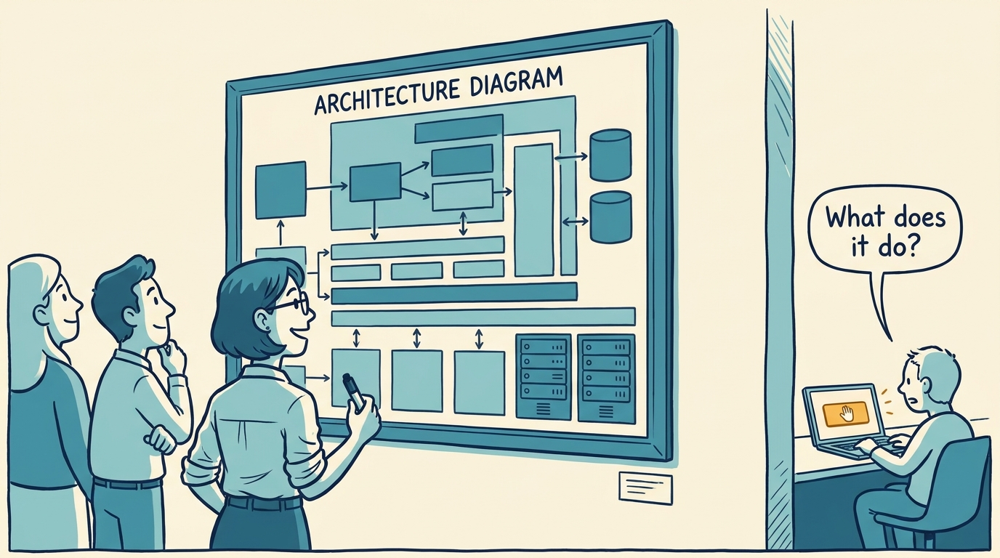
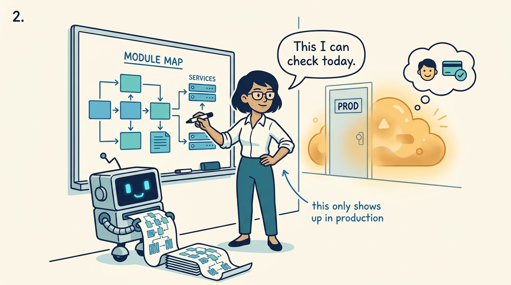
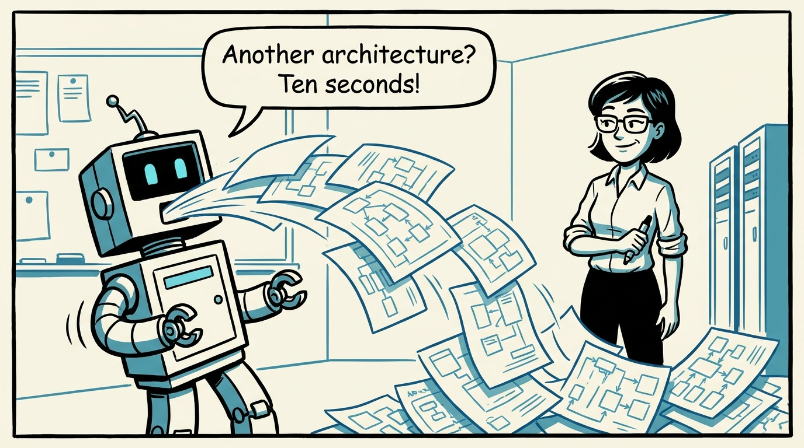
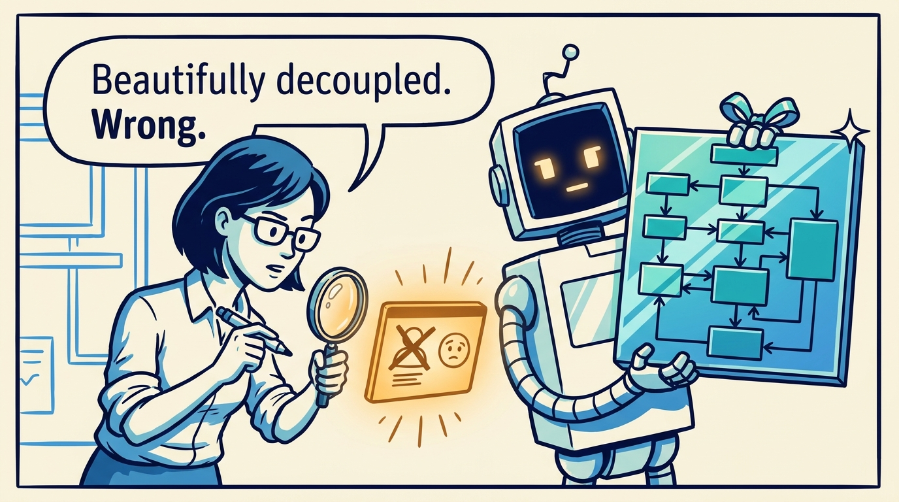
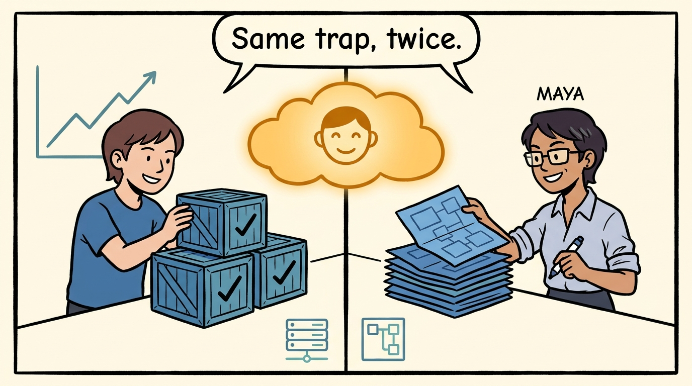
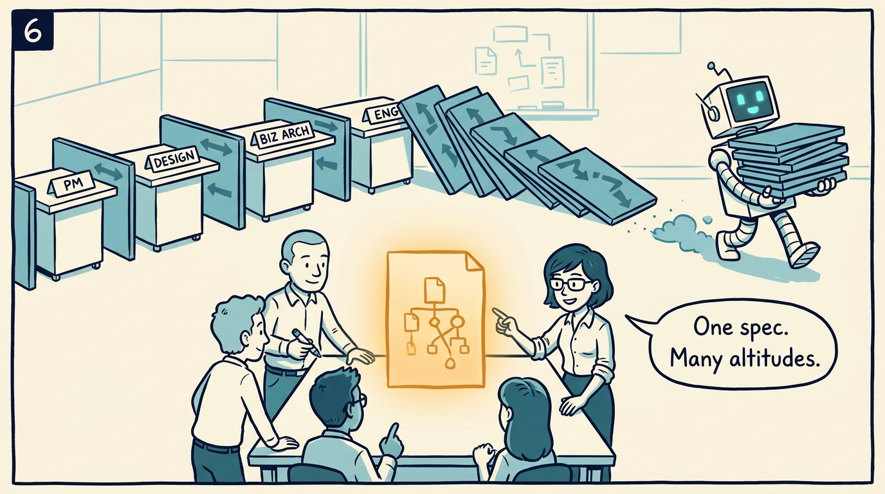
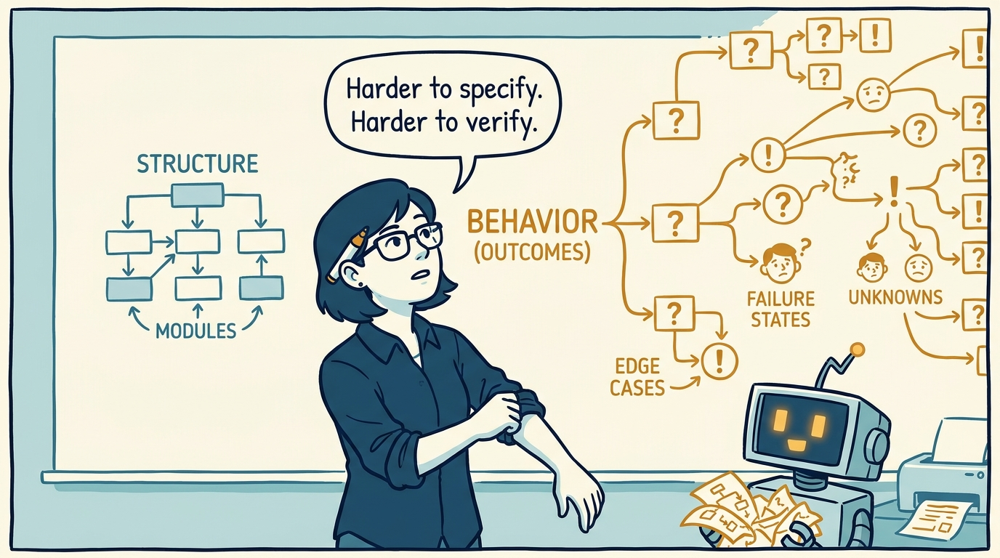
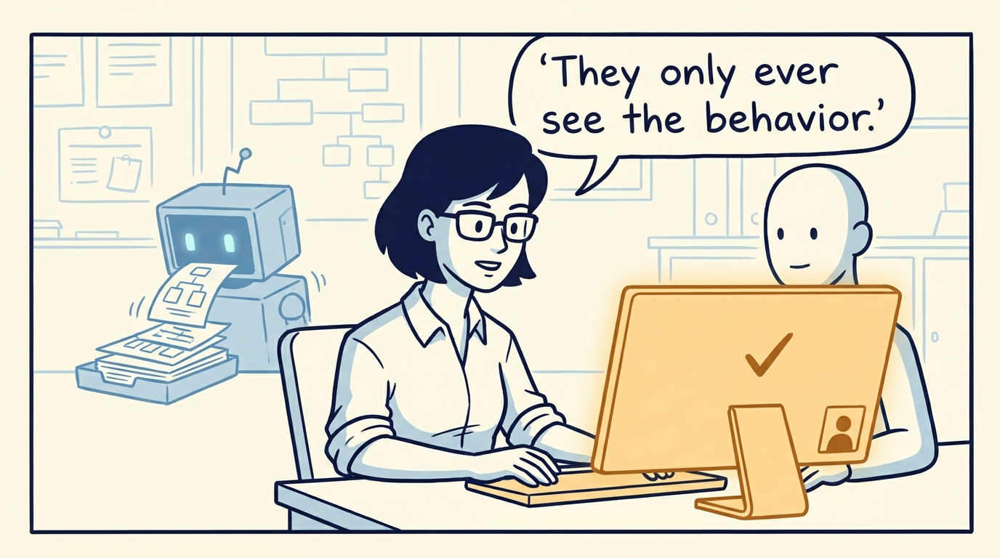

<!-- comic-style
{
  "cast": "MAYA: a pragmatic staff engineer / architect, short dark hair, glasses, rolled-up sleeves, calm and slightly amused, often holding a marker. REX: an over-eager boxy robot AI assistant, one bent antenna, glowing rectangular eyes, perpetually excited; here he is a tireless structure-printer — he cheerfully spits out finished architecture diagrams, module maps, and scaffolded services like a printer spitting pages.",
  "style": "Clean two-tone explainer comic, thick ink outlines, flat colors with blue/teal accents on a light cream background, generous white space, hand-lettered speech bubbles with SHORT readable text (max 8 words per bubble). Recurring motif: STRUCTURE (boxes-and-arrows diagrams, module maps, server racks) is drawn in cool blue/teal; BEHAVIOR and OUTCOMES (what a user experiences on a screen, a payment clearing, a happy user) glow warm amber. Simple geometric office and whiteboard settings mixing people with software symbols, no photorealism, no dense text, no title text."
}
-->

An eight-panel walk through the whole idea: structure was the proxy we could see, behavior is the thing users get — and now that Rex prints structure for free, everyone ends up writing the same spec.

**Panel 1:** *We were enamored with structure. Users never see it — they only ever see the behavior.*

**Panel 2:** *Structure-worship was rational: structure was visible early; behavior only showed up in production, the most expensive place to be wrong.*

**Panel 3:** *AI changes the one load-bearing variable: producing — and re-producing — structure is no longer expensive.*

**Panel 4:** *Give an agent vague intent and it builds a plausible structure for the wrong behavior. The constraint is the spec, not the build.*

**Panel 5:** *Product management already made this trip: from output to outcome. Structure is engineering's output; behavior is its outcome.*

**Panel 6:** *The borders were made of artifacts. When the artifacts converge, five disciplines become concurrent authors of one spec.*

**Panel 7:** *Hohpe's warning, kept: behavior is harder than structure — to specify, to verify, to agree on. The bar goes up, not down.*

**Panel 8:** *Structure moves from the thing we lovingly author to the thing we rigorously review. What we face now is what users always saw.*
