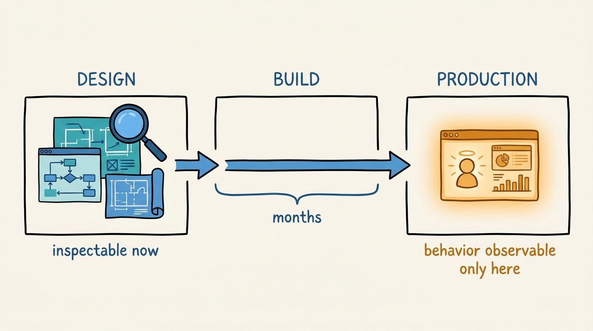
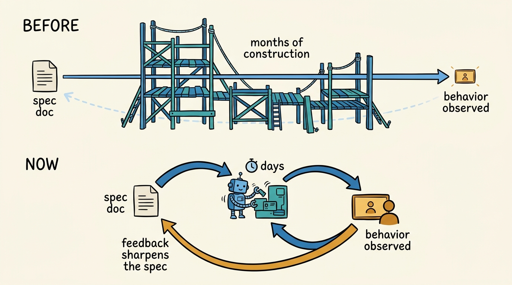
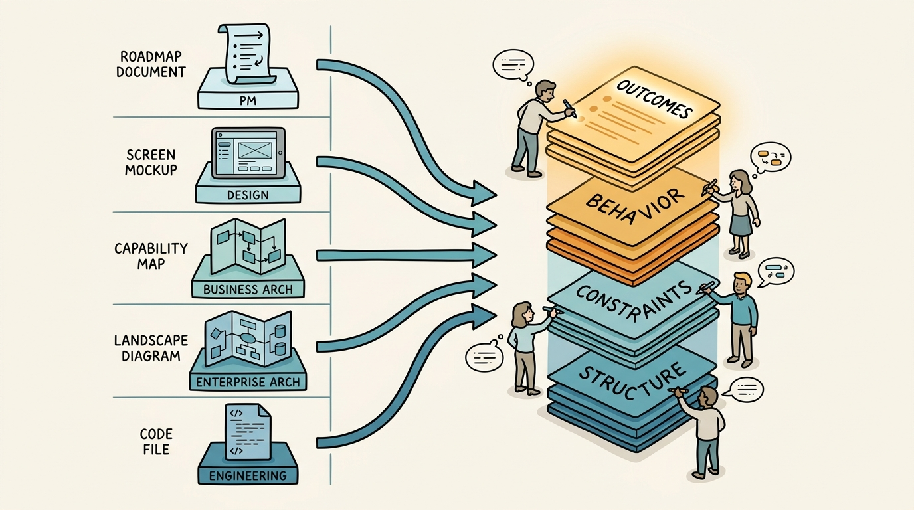
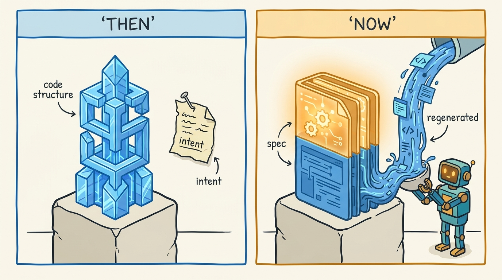

> **KEY POINTS:**
>
> * **We optimized what we could control, not what users experience.** For decades the profession's center of gravity was structure — separation of concerns, loose coupling, domain boundaries, deployment topology — because structure was expensive to build and behavior was hard to specify. But end users never see the structure. They only see the behavior. Structure was a proxy, and it made sense only while construction was the bottleneck.
> * **AI removes the constraint that justified the proxy — and software is making a trip product management already made.** When agents can produce and regenerate structure cheaply, attention snaps to the thing structure was always in service of: behavior — and because end-to-end systems now come together in days, behavior can finally be *observed* early instead of only specified in advance. Product management went through the identical correction — from output to outcome — when shipping features stopped being the bottleneck. It is one pattern, seen twice.
> * **When every discipline's scarce work becomes specifying behavior and outcomes, the borders between them collapse — and the work gets harder, not easier.** Product managers, designers, enterprise and business architects, and engineers converge on drafting sections of the same spec. But behavior is harder to specify, verify, and agree on than structure ever was. The shift raises the bar; it does not lower it.

 
Gregor Hohpe recently posted [an observation on LinkedIn](https://www.linkedin.com/posts/ghohpe_structure-behavior-activity-7486322897817538561-Bc1T) that I have not been able to put down. His argument, compressed: an AI-led SDLC pushes developers and architects away from *looking at structure* and toward *defining behavior* — and that is a huge step forward. The profession has spent decades absorbed in structural questions — are the concerns separated, is everything loosely coupled and modular, are the domain boundaries right, how many servers and how are they load balanced — while losing sight of a plain fact: *"the end users don't see the structure. They only see the behavior."* Now that producing structure has become cheap, we can finally give behavior the attention it was always owed — with an honest warning attached: while highly valuable, this is also harder. And he signs off with a wink at Barry O'Reilly: who would have thought it would be the *agents* that finally get us off the structuralism train?

It is a short post, but it names something big: the deepest change AI brings to software development is not faster coding. It is a change in *what the work is about*. And — this is the part I want to add — it is not the first time a discipline has made exactly this move. Product management made the same trip a decade ago, under a different name: **from output to outcome**. Seen together, the two shifts are one pattern. And that pattern, followed to its end, starts to dissolve the borders between fields we have always treated as separate: product management, design, enterprise architecture, business architecture, and software engineering.

This note works through that argument: why we were structuralists, what AI changed, why product management's story is the same story, and what happens when every discipline's scarce work converges on the same activity.

## Why We Were Structuralists

Let's start by being fair to structure, because the point is not that fifty years of software engineering were a mistake.

Behavior — what the system does for a real user in a real situation — is a lagging indicator and only fully observable when the system runs, in production, under real load, in front of real people. That is the last possible moment, and the most expensive place to discover you were wrong. Specifications of behavior existed, but they were prose: nobody could execute them, verify them, or keep them synchronized with code that changed daily.

Structure, by contrast, was visible *early*. You could review a module diagram before a line was written. You could check coupling, count dependencies, argue about domain boundaries at the whiteboard. And structure genuinely correlated with what everyone feared most: the cost of change. In a world where construction was slow and expensive — where a wrong boundary meant months of rework by hand — structural discipline was the best available predictor of whether a system would survive its own evolution.

**Figure 1:** *Why structure became the proxy: it was inspectable at the whiteboard, while behavior only showed up months later, in production — the most expensive place to be wrong.*

So the profession did the rational thing. It optimized the proxy it could see and control:

| What we could inspect early | What actually mattered |
| --- | --- |
| Separation of concerns, module boundaries | Whether the user's job gets done |
| Loose coupling, dependency direction | How the system behaves at the edges and under stress |
| Domain models, layer diagrams | Whether the behavior changes safely when needs change |
| Deployment topology, load balancing | What the user experiences when things fail |

A whole professional identity grew around the left column. Design reviews reviewed structure. Architecture boards approved structure. Career ladders rewarded fluency in structural pattern languages. None of that was foolish — it was an honest adaptation to a real constraint: **structure was expensive to build and behavior was impossible to specify verifiably, so structure became our stand-in for quality.**

The trouble with a proxy is only ever that it eventually gets mistaken for the goal. Hohpe's sentence is the diagnosis: we sometimes forgot that end users don't see the structure. No user has ever thanked a team for its hexagonal architecture. Users experience behavior — the system responded, the payment cleared, the answer was right, the failure was handled gracefully. Structure was always in service of behavior. We just spent so long in the service quarters that we started treating them as the house.

## What AI Changed

AI-driven SDLC changes exactly one variable in that fifty-year equation, but it is the load-bearing one: **producing structure is no longer expensive.**

An agent can scaffold a service, split a module, introduce a queue, or rearrange boundaries in minutes. More importantly, it can do it *again* — regeneration is nearly as cheap as generation, which quietly devalues the thing structural discipline was hoarded for: the cost of changing your mind. When rework by hand cost months, getting the structure right up front was precious. When restructuring costs an afternoon of agent time plus review, the up-front structural bet is no longer where the risk lives.

And cheap structure has a second effect, just as important as the first: it collapses the feedback loop on behavior itself. Recall why behavior made such a poor object of engineering attention — it was a lagging indicator, only fully observable once the system ran, and building the system took months. That lag is what made structure the only thing we *could* inspect early. When an agent can assemble a working end-to-end system in days, the lag largely disappears. Behavior stops being something you can only argue about in prose and becomes something you can observe, this week, in a running system — put it in front of real users, watch what happens, and let what you see sharpen the specification. Cheap structure does not just force us to face behavior; it finally hands us the instrument for studying it.

**Figure 2:** *The second effect of cheap structure: the feedback loop on behavior collapses from quarters to days — behavior becomes something you observe and learn from, not just something you specify in advance.*

Where does the risk live instead? Exactly where it always secretly lived: in whether anyone can say, precisely, **what the system should do**. Give an agent a vague intent and it will produce a plausible structure for the wrong behavior — flawlessly modular, beautifully decoupled, wrong. The binding constraint on an AI-led SDLC is not the ability to build; it is the quality of the specification of behavior: what should happen, for whom, under which conditions, at which edges, with which trade-offs when goals conflict.

This is the mechanism behind Hohpe's "forces." It is not that AI *invites* us to think about behavior — the industry has accepted such invitations before and politely declined (behavior-driven development literally had the word in its name in 2006, and still mostly became a test-naming convention). It is that AI removes the activity we used to hide in. When structure took months, "we're building" was a legitimate answer to "what does it do?" Now structure takes hours, and the question arrives immediately, and it turns out the question was always the hard part.

The economics echo a pattern from [[ai-is-the-reactor-not-the-plant]]: when one stage of a value chain becomes abundant, value migrates to the stages that stay scarce. Generation of structure became abundant. Specification of behavior stayed scarce. The work moves accordingly.

## Product Management Already Made This Trip

Here is the part that convinces me this is a durable shift and not commentary on a hype cycle: **another discipline already lived through exactly this correction, one bottleneck earlier.**

For years, product management's unit of achievement was the *output*: the feature shipped, the release delivered, the roadmap item checked off. Roadmaps were lists of outputs; success was velocity against the list. Melissa Perri gave the failure mode its name — the **build trap**: organizations so busy measuring what they ship that they stop asking what shipping it *changed*. The correction, when it came, had a slogan sharp enough to survive: **outcomes over output**. Josh Seiden's definition of an outcome is worth quoting precisely, because of the word it turns on: an outcome is *"a change in customer behavior that drives business results."*

Look at the two shifts side by side:

| | Software engineering | Product management |
| --- | --- | --- |
| **What we optimized** | Structure — the artifact we could design and review | Output — the feature we could ship and count |
| **Why it was rational** | Construction was expensive; structure predicted cost of change | Delivery was expensive; shipping was the visible bottleneck |
| **What users actually experience** | Behavior | Outcomes — changes in *their* behavior |
| **What broke the proxy** | AI made structure cheap to produce | Agile/continuous delivery made shipping cheap and constant |
| **Where the scarce work moved** | Specifying intended behavior | Specifying intended outcomes |
| **The failure mode it named** | Structure-worship; architecture as an end in itself | The build trap; the feature factory |

Same shape, twice. A discipline optimizes the controllable artifact instead of the intended effect, because the artifact is visible and the effect is hard to specify and measure. Then the artifact stops being scarce — and the discipline is forced, uncomfortably, to face the effect directly.

And notice that the two right-hand destinations are not merely analogous — they *connect*. Seiden's outcome is a change in customer behavior. A system's behavior is what produces that change. Specify the outcome and you have constrained the behavior; specify the behavior and you had better be able to say which outcome justifies it. The engineer's new scarce work and the product manager's scarce work are two altitudes of the same description: **what should happen in the world, and what should the system do to cause it.**

## The Borders Collapse

Which brings us to the consequence I think is still underrated.

Our discipline borders were drawn along the old division of labor, and the old division of labor was organized around *artifacts*: product managers owned requirement documents, designers owned mockups, business architects owned capability maps, enterprise architects owned landscape diagrams and standards, engineers owned code and its structure. Each border existed because each artifact demanded its own craft, its own tools, and its own full-time attention — and because translating between the artifacts was itself expensive, we built roles, rituals, and entire meeting genres around the handoffs.

But watch what the shift does to each of those crafts. When structure is generated, the engineer's contribution moves up to specifying behavior. When mockups are generated, the designer's contribution moves up to specifying interaction behavior and its intent. When capability maps and landscape diagrams are generated, the architects' contribution moves up to specifying which outcomes the capabilities exist to produce and which constraints the behavior must respect. The product manager was already there, holding outcomes. Every discipline's residual work — the part the agents cannot do, because it is a decision about what should be true rather than a derivation of what follows — lands on the same patch of ground:

| Discipline | Old scarce artifact | Residual scarce work |
| --- | --- | --- |
| Product management | Roadmaps, requirement docs | Which customer and business outcomes, in which order, at what evidence threshold |
| Design | Mockups, flows | How the product should behave in interaction — and why that behavior serves the outcome |
| Business architecture | Capability maps | Which capabilities the outcomes require, and what each is worth |
| Enterprise architecture | Landscape diagrams, standards | Which constraints behavior must respect across the estate — cost, risk, compliance, evolution |
| Software engineering | Code and its structure | What the system should do precisely — edges, failure modes, trade-offs — stated verifiably |

Read the right-hand column top to bottom: it is one document. Not five artifacts to hand off between five roles — one layered specification of intended outcomes and the behavior that produces them, drafted at different altitudes by people with different expertise. The borders between the disciplines were load-bearing when the artifacts were separate crafts. When the artifact converges, the borders stop being walls and become sections of the same spec.

**Figure 3:** *The borders were made of artifacts. When the artifacts converge, five disciplines become concurrent authors of one layered spec — outcomes at the top, behavior and constraints below.*

I want to be careful here, because this claim is easy to inflate. Border collapse does not mean the *expertise* collapses. A designer's judgment about interaction, an enterprise architect's judgment about systemic risk, a product manager's judgment about evidence and markets — these remain distinct, hard-won, and non-interchangeable. What collapses is the *artifact boundary* and the translation industry built on top of it: the ritual by which intent degrades as it is re-expressed from strategy deck to requirements doc to design file to architecture diagram to ticket to code. When all of those become views of one specification, the disciplines stop being sequential stations and become concurrent authors.

## What the Shared Artifact Looks Like

It is fair to ask whether this converged specification is a real thing or a rhetorical convenience. This is the question my [[what-is-spec-driven-product-architecture]] work tries to answer constructively, so I will use it as the worked example — not because it is the only possible shape, but because building it taught me what the shape demands.

Spec-driven product architecture moves the specification boundary above software design: the spec is a structured model of a whole product domain, connecting the layers the disciplines used to own separately — customer groups and jobs to be done, strategy and KPIs, product capabilities, implementation-facing product bricks, teams, roadmaps, and the evidence that grounds it all. The model is plain structured files in a repository, authored and validated by humans and AI agents together, and rendered into documentation nobody has to keep synchronized by hand.

Two properties matter for this note's argument:

- **It is outcome-anchored at the top and behavior-shaped at the bottom.** The model starts from customers, their jobs, and the outcomes that define success — Seiden's territory — and refines downward into capabilities and bricks whose whole justification is the behavior they enable. A brick with no path upward to an outcome is a visible anomaly, not a hidden one. The old borders — product to design to architecture to engineering — appear inside the model as *adjacent layers of one structure*, not as separate documents in separate tools owned by separate departments.
- **It is specific enough for agents to work in.** An agent asked to "write a product strategy" produces plausible prose. An agent asked to extend a validated, cross-referenced model — preserve these identifiers, respect this schema, keep references consistent, pass validation — produces something other agents and other humans can check, compare, and build from. The discipline that structure-thinking taught us for fifty years does not disappear; it gets repointed at the specification itself. The spec becomes the thing that must be well-structured, loosely coupled, and evolvable — because the spec is now the long-lived artifact, and the code is increasingly its regenerable projection.

That last inversion is worth sitting with: we spent decades structuring code and leaving intent in prose. The shift ends with intent structured and code fluid.

**Figure 4:** *The inversion: we spent decades structuring code and leaving intent in prose. Now the spec becomes the long-lived, well-structured artifact — and code its regenerable projection.*

## The Warning: Behavior Is Harder

Hohpe ends with a warning — *while highly valuable, this is also harder* — and it deserves more than a nod, because everything in this note becomes hype the moment that clause is dropped.

Behavior is harder than structure in at least three compounding ways:

- **Harder to specify completely.** A structure is finite: components, relations, done. Behavior is a space — inputs times states times timing times failure modes — and it explodes combinatorially. Every practitioner who has tried to write "complete" acceptance criteria knows the tail never ends. Specifying behavior well means choosing which parts of the space to pin down precisely and which to leave to judgment — itself a judgment call that structure never demanded.
- **Harder to verify.** You can check a structure against a diagram by looking. Behavior can only be verified by exercising it — testing, simulation, production observation. Fast end-to-end assembly shortens that loop enormously — exercising behavior in a working system is now a days-away option, not a quarters-away one — but the most important behaviors (what happens under conditions you did not anticipate) resist advance verification by definition. This is the ground where Barry O'Reilly — the postscript's addressee — has been working for years: residuality theory is explicitly a break with the *structuralist* tradition of treating a system as a static picture, insisting instead that systems are processes revealed under stress, and that design should proceed by stressing naive designs to see what survives. The postscript's joke has an edge: architecture's own avant-garde spent a decade arguing us off the structuralism train, and what finally moved the crowd was the agents making structure too cheap to worship.
- **Harder to agree on.** Structural debates were contained: engineers argued with engineers, and the loser's objection rarely reached the CFO. Behavior is where every discipline's claims meet — product's outcome, design's interaction, architecture's constraint, engineering's precision — which is exactly *why* the borders collapse, and exactly why the collapsed conversation is more demanding than any of the separate ones were. One shared spec means the disagreements that handoffs used to bury now have to be resolved, explicitly, in one place.

And one more caution, from the earlier notes in this journal: cheap structure is not *ignorable* structure. Generated architecture still fails in structured ways — [[breaking-vibe-monolith]] is about what happens when it quietly congeals — and a human still has to understand what was generated well enough to own it, the whole argument of [[outsource-thinking-not-understanding]]. Structure leaves the center of the craft; it does not leave the craft. It moves from the thing we lovingly author to the thing we rigorously review.

## What to Do on Monday

| Role | Move | What it buys you |
| --- | --- | --- |
| **Engineer** | Before asking an agent to build, write the behavior first: what should happen, at which edges, under which failures — in a form someone could check the result against. Judge your specs the way you used to judge designs. | The agent's structural output becomes verifiable against intent instead of merely plausible. |
| **Architect** | Reallocate review time: less on whether the structure matches the pattern language, more on whether anyone can state the behavior and constraints the structure must serve. Treat the spec as the artifact whose structure you now own. | Your structural judgment lands where it still compounds — on the long-lived artifact. |
| **Product manager** | Push your outcome definitions one level down: not just "which metric moves" but which *behavior* — of the user and of the system — moves it. Expect to co-author with engineers and designers in the same document, not upstream of them. | Your outcomes become executable context for agents and teams instead of slideware. |
| **Designer / business architect** | Find where your artifact's intent currently degrades in translation to other artifacts, and move that intent into the shared spec instead. | Your judgment survives contact with delivery instead of dissolving at the handoff. |
| **Leader** | Stop staffing the translation chain as if artifact handoffs were the work. Fund one shared, validated specification and the cross-discipline conversation it forces. | You collect the actual dividend of the shift: intent that survives from strategy to running system. |

## Closing Thought

Every discipline, given a hard goal and an expensive craft, eventually starts worshipping the craft. Software engineering optimized structure because structure was what we could see, control, and be excellent at while construction was the bottleneck. Product management counted outputs for the same reason. Neither was foolish; both were adaptations to constraints — and both proxies quietly became the point.

AI does not make software development easier. It removes the layer of legitimate, absorbing, skillful work that stood between us and the questions we were always ultimately responsible for: What should this system do? For whom? What should change in the world because it exists? Those questions were forever deferred at the bottom of the backlog while we argued about boundaries and shipped features. Now the structure takes an afternoon, the feature ships itself, and the questions are standing at the front of the queue with no one left to hide behind.

The disciplines that grew up around the proxies will find that the walls between them were made of artifacts, and the artifacts are melting. What remains is one conversation, at several altitudes, about behavior and outcomes — the conversation users were having with us all along, whether we attended or not. They never saw the structure. They only ever saw the behavior. Now, finally, so must we.

## To Probe Further

* Gregor Hohpe, [LinkedIn post](https://www.linkedin.com/posts/ghohpe_structure-behavior-activity-7486322897817538561-Bc1T) (2026) — the anchor observation: an AI-led SDLC forces the move from structure to behavior; "the end users don't see the structure. They only see the behavior"; and the honest warning that behavior is harder.
* Gregor Hohpe, [*The Software Architect Elevator*](https://architectelevator.com/) (2020) — the same author's earlier frame: architects create value by riding between the business penthouse and the technical engine room. This note argues the elevator ride is becoming everyone's commute.
* Barry O'Reilly, [*Residues: Time, Change, and Uncertainty in Software Architecture*](https://leanpub.com/residuality) — the explicit break with structuralism the postscript nods to: systems as processes revealed under stress, not static pictures; design by stressing naive architectures and keeping what survives.
* Josh Seiden, [*Outcomes Over Output*](https://www.senseandrespondpress.com/managing-outcomes) (2019) — the canonical statement of the product-side shift, with the definition this note's analogy turns on: an outcome is "a change in customer behavior that drives business results."
* Melissa Perri, [*Escaping the Build Trap*](https://melissaperri.com/book) (2018) — the diagnosis of output-worship: organizations measuring shipping instead of change, the feature factory as the product twin of structure-worship.
* Marty Cagan, *Inspired* (2018) and *Empowered* (2020) — the operating model the border collapse points toward: teams given outcomes to achieve rather than outputs to deliver.
* Dan North, [*Introducing BDD*](https://dannorth.net/introducing-bdd/) (2006) — the historical precedent: renaming tests to "behaviors" changed what engineers wrote down. The industry saw the destination twenty years ago; it took agents to make the trip compulsory.
* [[what-is-spec-driven-product-architecture]] — the worked example of the converged artifact: a structured, validated product-domain model connecting customers, strategy, capabilities, bricks, teams, roadmap, and evidence, co-authored by humans and agents.
* [[ai-is-the-reactor-not-the-plant]] — when generation becomes abundant, value migrates to what stays scarce. Here: specification of behavior.
* [[outsource-thinking-not-understanding]] — generated structure still has to be understood by a human who can own it; the last human mile applies to architecture too.
* [[breaking-vibe-monolith]] — the counterweight: cheap structure quietly congeals into expensive structure if nobody reviews it. Structure leaves the center of the craft, not the craft.

## Questions to Consider

Use these if your organization is adopting AI-led development and the role boundaries are starting to feel warm to the touch.

* In your last design review, how much time went to structure (boundaries, coupling, topology) versus behavior (what the system should do, at which edges, under which failures)? Is that ratio a decision or a habit?
* Could your team state, in a form an agent could work against and a reviewer could verify, what your current project is supposed to *do* — not how it is shaped?
* Where does intent degrade most in your delivery chain — strategy deck to requirements, requirements to design, design to tickets, tickets to code? What would it mean to hold that intent in one shared, validated artifact instead?
* Product management learned to ask "what changed for the customer?" instead of "what did we ship?" What is your engineering organization's equivalent question — and does anyone ask it?
* If structure became free tomorrow, what fraction of your architects' and senior engineers' current work would remain? Is that fraction where your best judgment is currently pointed?
* Who in your organization can specify behavior precisely — edges, failure modes, trade-offs? Are they in the room where outcomes are decided, or five handoffs downstream?
* Which of your discipline borders exist because the expertise differs, and which exist only because the artifacts used to?
