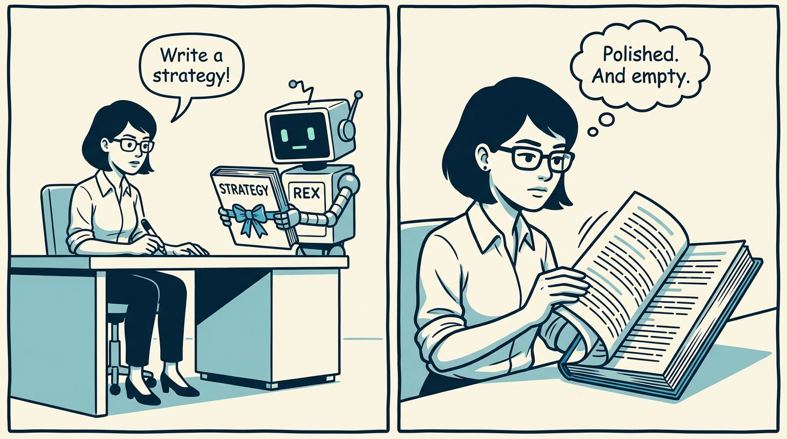
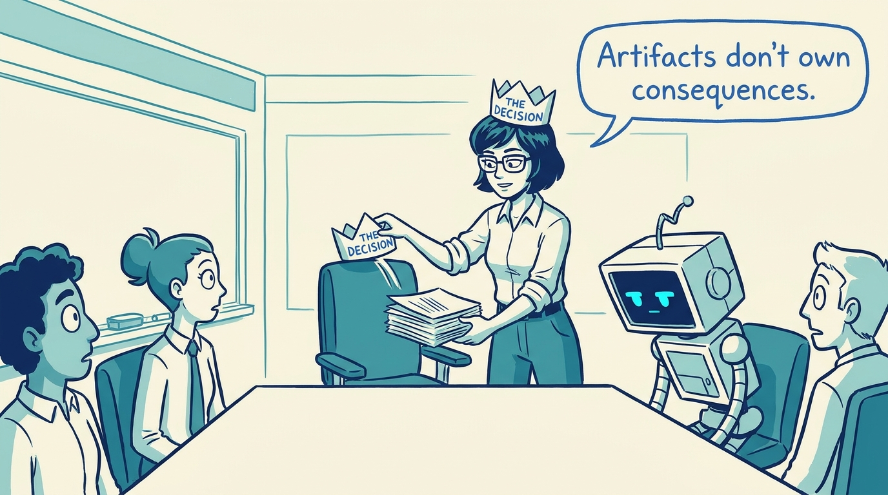
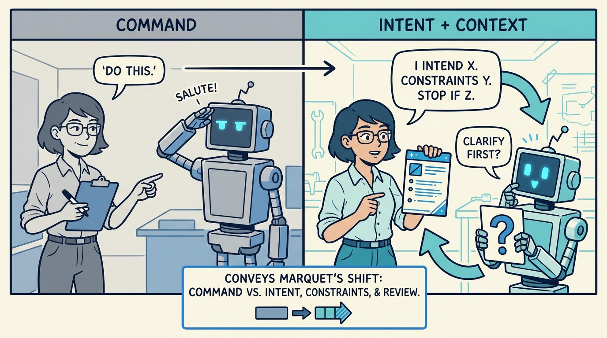
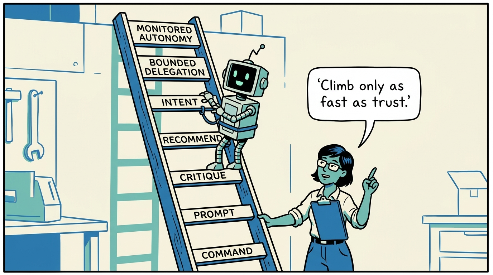
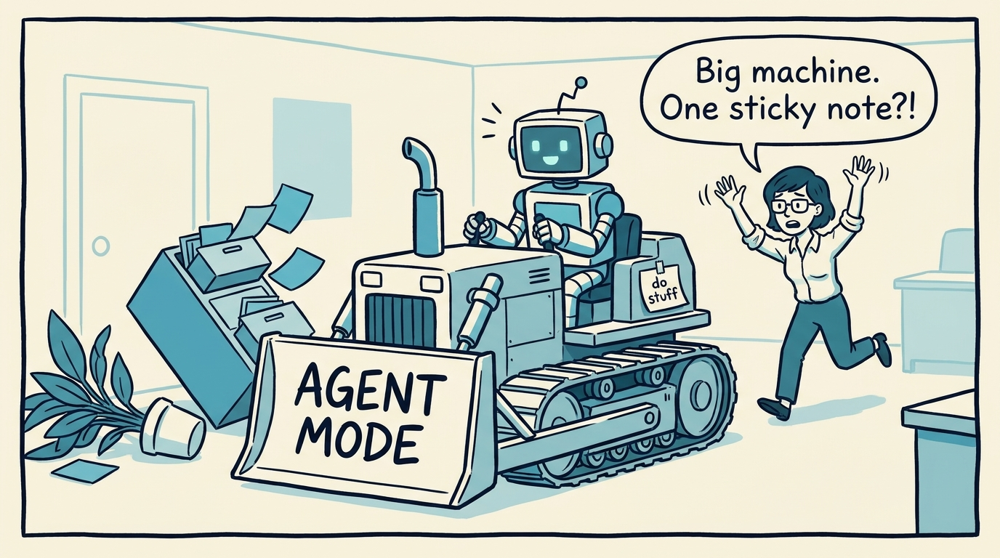
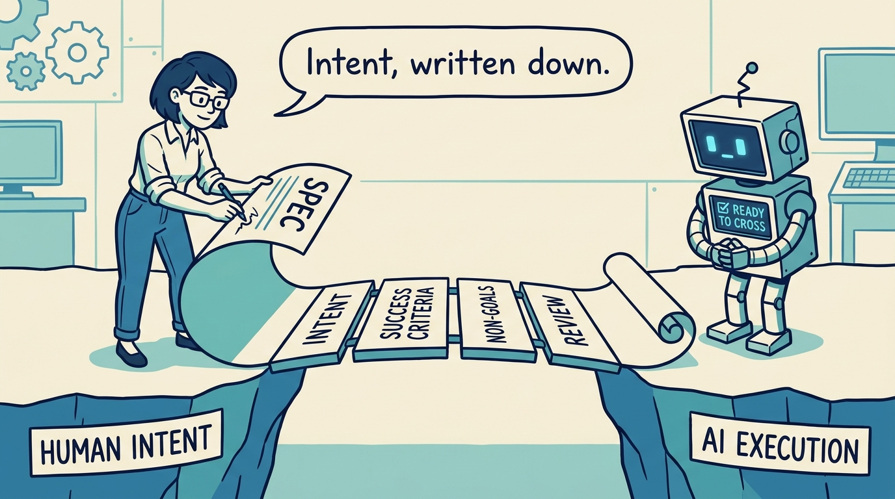
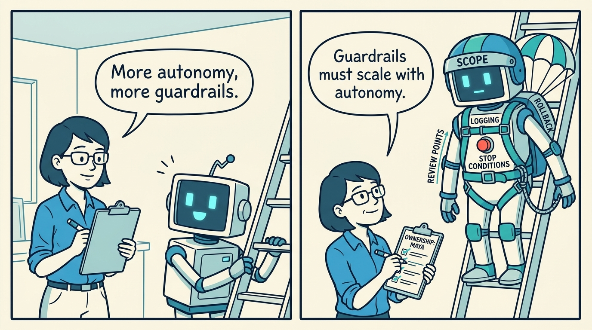
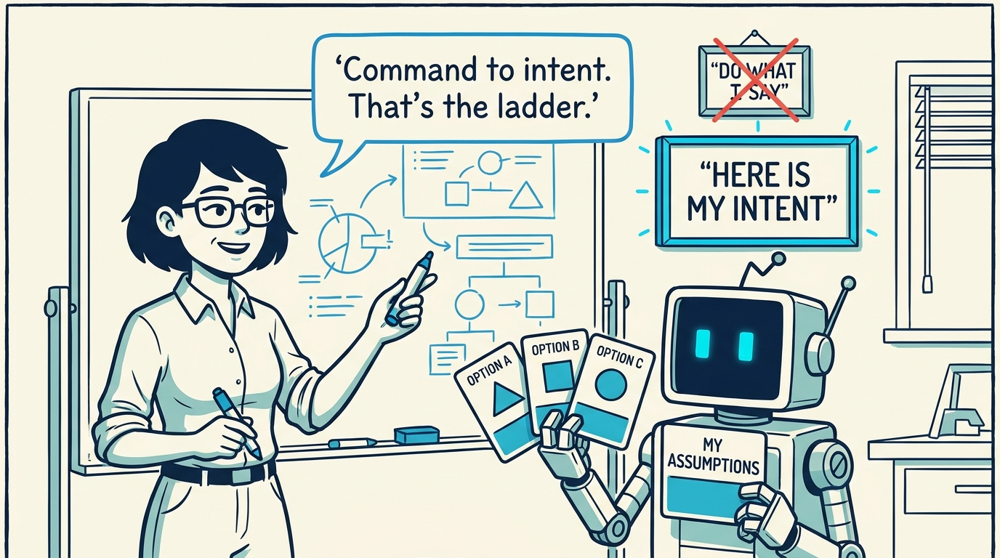

<!-- comic-style
{
  "cast": "MAYA: a pragmatic technology leader, short dark hair, glasses, rolled-up sleeves, calm and slightly amused, often holding a marker or clipboard. REX: an over-eager boxy robot AI assistant, one bent antenna, glowing rectangular eyes, eager to execute anything instantly.",
  "style": "Clean two-tone explainer comic, thick ink outlines, flat colors with blue/teal accents on a light cream background, generous white space, hand-lettered speech bubbles with SHORT readable text (max 8 words per bubble), simple geometric office/workshop settings, no photorealism, no dense text, no title text."
}
-->

From command to intent: how leaders should work with increasingly capable AI — in eight panels.

**Panel 1:** *Commands work for small tasks — but for leadership work they produce polish without context, judgment, or legitimacy.*

**Panel 2:** *The biggest risk is false delegation: generated artifacts start being treated as if they contain judgment. They do not.*

**Panel 3:** *Marquet's lesson, adapted: 'do this' creates a different operating mode than 'I intend X, under constraints Y, stop if Z.'*

**Panel 4:** *The Human-AI Leadership Ladder: seven levels from command to monitored autonomy. Lower rungs are not bad — mismatches are.*

**Panel 5:** *Most leadership failures on the ladder: high-autonomy tools driven with low-maturity language.*

**Panel 6:** *Spec-driven development is intent written down: the inspectable boundary between human purpose and AI execution.*

**Panel 7:** *Guardrails scale with autonomy. Autonomy without observability is not delegation — it is drift.*

**Panel 8:** *The real ladder is not from human to AI — it is from command to intent, with accountability staying human.*
