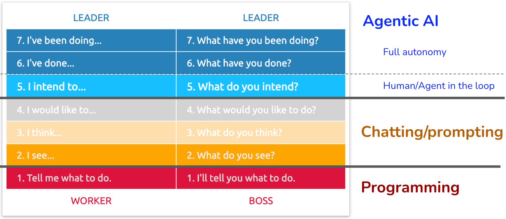
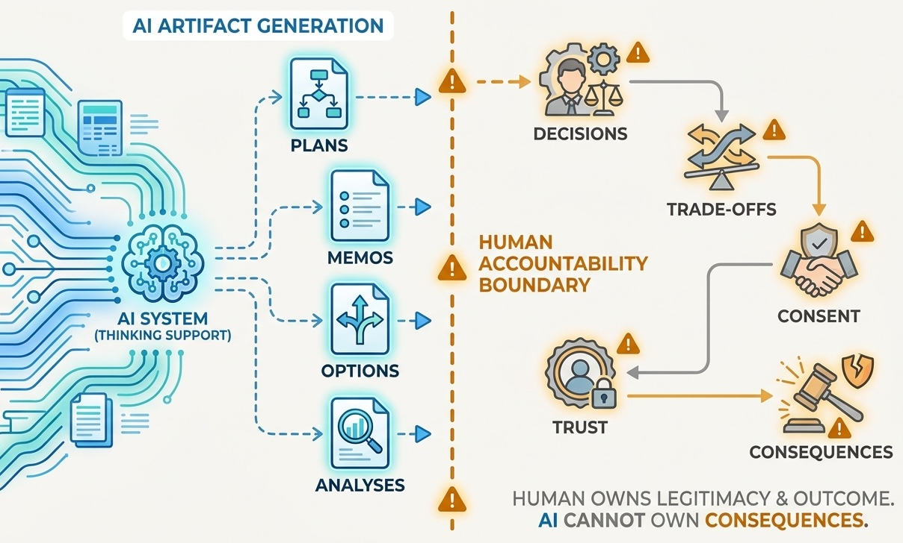
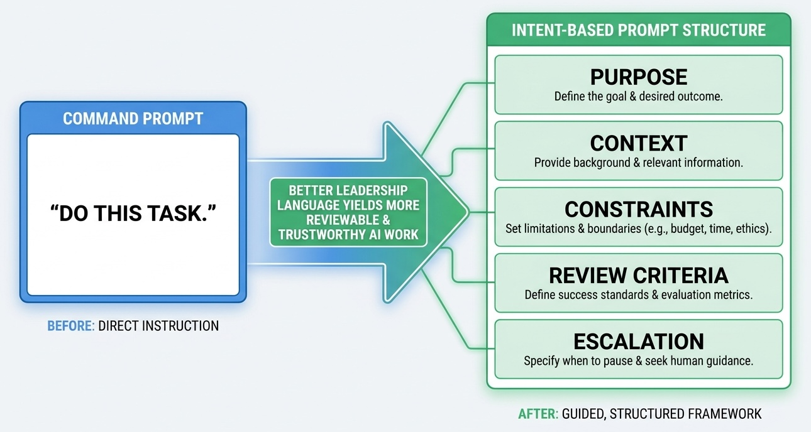
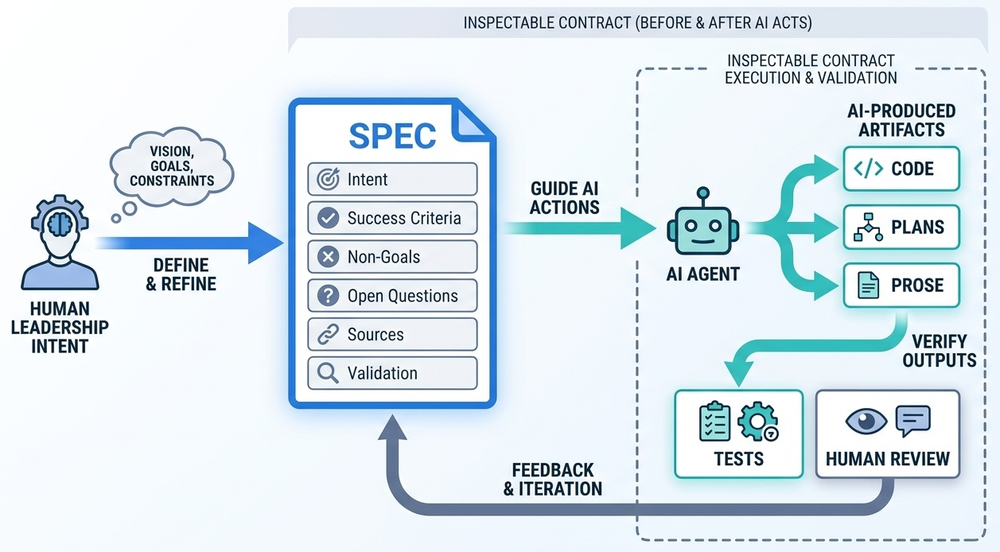
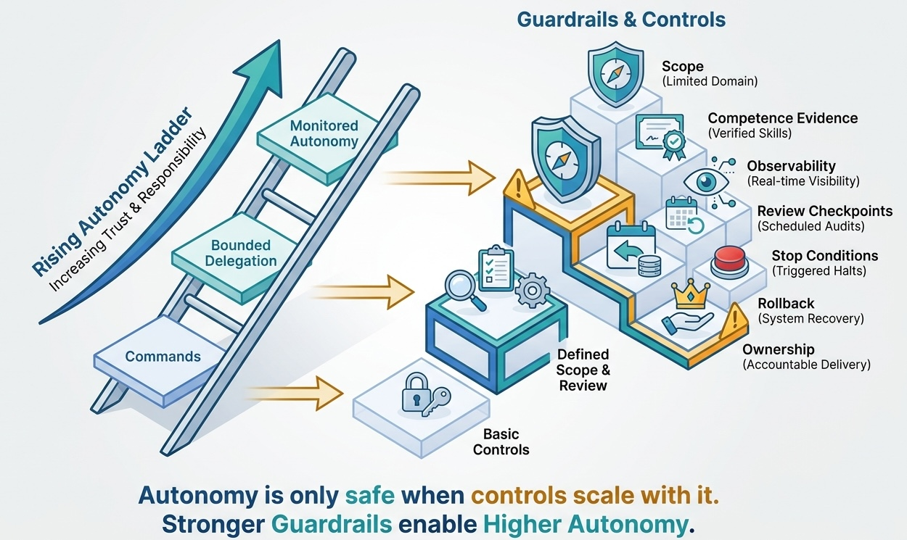

> **KEY POINTS:**
>
> * Better prompts are useful, but they are not enough for AI-assisted leadership work.
> * David Marquet's Leader-Leader model offers a practical analogy: move from "do what I say" to clear intent, competence, control boundaries, and accountability.
> * Spec-driven development is one practical way to do this: the spec turns intent into a reviewable contract before AI starts producing implementation or prose.
> * AI can act on stated intent, but it cannot own consequences. Leaders still own purpose, trade-offs, consent, escalation, and trust.
> * The more autonomy an AI system receives, the stronger the guardrails must become: scope, evidence, logging, review points, stop conditions, and human ownership.

Many leaders are learning to prompt AI better. That is useful, but it is not the real transition.

The deeper shift is from **prompting** to **intent-based collaboration**. When AI is used only for small tasks, a good prompt may be enough: summarize this text, draft that email, compare these options. But as AI systems start helping with architecture reviews, delivery planning, incident analysis, policy drafting, research, code changes, and multi-step workflows, the leadership problem changes. The question is no longer only "What should I ask AI to do?" It becomes "What kind of intent, context, boundaries, and review discipline does this work require?"

This is where David Marquet's [Leader-Leader](https://davidmarquet.com/books/turn-the-ship-around-book/) and Intent-Based Leadership ideas become useful. Marquet's work is about human organizations, not AI systems. The point is not that AI becomes a person, a peer, or a moral agent. The point is that his model gives technology leaders a language for moving beyond command-and-control without losing accountability.

In AI work, that language matters. Command-style interaction says: **do this**. Intent-based interaction says: **here is what I am trying to achieve, here is the context, here are the constraints, here is where you may act, here is where you must stop, and here is how I will judge the result**.

Spec-driven development is the same shift made concrete. A spec is not only a requirements document. In AI-assisted work, it is the written expression of intent: what outcome matters, what boundaries apply, what success looks like, what questions remain open, and how the work will be reviewed.

That is a different leadership posture.

**Figure 1:** *The useful lesson from the Leader-Leader model is not that AI becomes a leader. It is that better work requires clearer intent, stronger context, and explicit control boundaries.*

## The Leadership Problem Hidden Inside AI Adoption

Most AI adoption starts with commands:

* "Summarize this document."
* "Write a strategy memo."
* "Create a rollout plan."
* "Review this architecture."
* "Tell me which option is best."

For simple work, commands are fine. If the task is narrow, low-risk, and easy to verify, there is no need to overcomplicate it. But technology leaders rarely work only on narrow tasks. They work on ambiguous decisions, conflicting constraints, incomplete information, political context, team capacity, customer impact, delivery risk, and long-term consequences.

That is where command-style prompting becomes brittle. A model can produce something polished without understanding what matters. It can optimize for the surface of the request while missing the operating reality behind it. It can give a confident recommendation without knowing which constraints are non-negotiable, which stakeholders will resist, which teams are already overloaded, or which risks the organization cannot absorb.

The risk is not only bad output. The bigger risk is **false delegation**: leaders start treating generated artifacts as if they contain judgment, ownership, and legitimacy.

They do not.

**Figure 2:** *AI can produce artifacts, but leaders still own judgment, legitimacy, and consequences.*

AI can expand the surface area of thinking. It can generate options, expose assumptions, critique plans, draft alternatives, and execute bounded work. But leaders still own the hard parts:

| AI can help with... | Leaders still own... |
| --- | --- |
| Generating options | Deciding what matters in this context |
| Drafting plans | Choosing an accountable path |
| Comparing trade-offs | Naming which trade-offs are legitimate |
| Finding risks | Deciding which risks are acceptable |
| Rewriting messages | Earning trust with real people |
| Executing bounded tasks | Setting boundaries, review points, and escalation paths |

That is why the leadership model matters. If leaders keep interacting with AI only as a command receiver, they will either underuse it or overtrust it. The better path is to become more explicit about intent.

## What Marquet's Model Contributes

In *Turn the Ship Around!*, Marquet describes moving away from a traditional leader-follower model toward a leader-leader model: people closer to the work take more ownership, think more actively, and act with clearer intent. His later work in [Leadership Is Language](https://davidmarquet.com/books/leadership-is-language/) emphasizes that leadership is not only about decisions. It is also about the words and operating habits that shape whether people comply, contribute, or think.

The important ideas for AI-era technology leadership are:

* **Intent beats instruction when the work is complex.** Instructions tell someone what action to take. Intent explains what outcome matters and why.
* **Control requires competence and clarity.** Delegation without capability and shared understanding is not empowerment. It is negligence.
* **Language shapes behavior.** "Do this" creates a different operating mode than "I intend to achieve this outcome under these constraints; help me reason about the path."
* **Ownership must stay visible.** In human organizations, ownership can be distributed. With AI systems, responsibility can be supported but not transferred.

These ideas adapt well to AI work if we keep the boundary clear. AI systems do not have human commitment, judgment, courage, social trust, or moral accountability. They do not own the consequences of a bad rollout, a broken customer promise, a compliance failure, or a team losing confidence in leadership.

But AI systems can work from richer intent. They can use context, constraints, examples, policies, tools, and feedback loops. They can help leaders think better if leaders express more than a command.

The leadership move is not to pretend the AI is a person. The leadership move is to make the work legible enough that an AI system can help without becoming the hidden decision-maker.

## The Boundary of the Analogy

The phrase "AI teammate" can be useful in casual conversation, but it can also blur an important distinction. People can accept responsibility. AI systems cannot. People can understand trust, status, fear, ambition, fatigue, incentives, and consequences from the inside. AI systems can model some of those patterns, but they do not live with the outcomes.

So the analogy needs limits.

| In human Leader-Leader systems | In human-AI collaboration |
| --- | --- |
| People are developed to think, decide, and own outcomes. | AI systems are configured, prompted, evaluated, and bounded. |
| Control can move closer to people doing the work. | Permissions can move closer to the workflow only with guardrails. |
| Competence includes skill, judgment, and professional responsibility. | Competence must be demonstrated through tests, examples, evaluations, and observed behavior. |
| Clarity includes shared purpose and organizational context. | Clarity must be supplied through prompts, context windows, policies, memory, tools, and review. |
| Accountability can be distributed across humans. | Accountability remains with humans and organizations. |

This distinction protects the article from two weak extremes.

The first extreme is command-and-control AI use: leaders reduce AI to a faster clerk and miss the opportunity to improve thinking. The second extreme is naive autonomy: leaders let AI produce or execute important work without enough context, review, or ownership. Both fail for the same reason. They treat the interaction model as a tooling detail, when it is actually a leadership system.

## The Human-AI Leadership Ladder

The ladder below is not a moral ranking. Lower levels are not bad. Sometimes the right move is a direct command. The problem is using the wrong level for the risk and ambiguity of the work.

Use lower levels for narrow, low-risk, easily verified tasks. Move higher only when intent is clear, competence is proven, control is bounded, and review is built in.

| Level | Mode | Typical language | Good for | Failure mode |
| --- | --- | --- | --- | --- |
| 1 | Command | "Do this exact task." | Formatting, extraction, conversion, simple transformations. | Brittle outputs; no shared context. |
| 2 | Prompt/request | "Draft a proposal for..." | First drafts, summaries, quick alternatives. | Polished but generic artifacts. |
| 3 | Critique/reflection | "Here is my thinking; challenge it." | Finding gaps, assumptions, contradictions, blind spots. | AI stays trapped inside the frame you gave it. |
| 4 | Recommendation | "Compare options and recommend one." | Trade-off exploration and decision preparation. | Recommendations hide assumptions or overfit to incomplete context. |
| 5 | Intent | "I intend to achieve X under constraints Y; help design the path." | Ambiguous leadership work where context matters. | Requires human clarity, judgment, and review discipline. |
| 6 | Bounded delegation | "Execute these steps within these limits; escalate if..." | Repeatable multi-step work with known boundaries. | Silent scope creep, missed exceptions, weak observability. |
| 7 | Monitored autonomy | "Operate within this policy and report exceptions." | Mature, well-instrumented workflows with strong controls. | Dangerous without auditability, rollback, and accountable ownership. |

The ladder becomes useful when leaders start asking: **What level is this work really at?**

If you ask AI to reformat meeting notes, Level 1 is enough. If you ask it to challenge your migration plan, Level 3 may be right. If you ask it to compare adoption options for AI-assisted development across an engineering organization, Level 4 or 5 is more appropriate. If you ask an agent to open issues, modify files, run checks, and propose a pull request, you are already near Level 6. If you let systems operate continuously across production workflows, you are approaching Level 7, and the governance burden increases sharply.

Most leadership failures happen when people use high-autonomy tools with low-maturity language.

Spec-driven development is one way to raise the maturity of the language before the AI starts acting. A vague task such as "build this feature" or "rewrite this article" leaves the agent to infer intent. A lightweight spec forces the human to make intent, success criteria, constraints, and review expectations visible first. That is what allows AI-assisted work to move up the ladder without turning into hidden delegation.

## The Shift Is in the Language

Here is the difference between a command and an intent statement.

**Command-style prompt:**

> Write a strategy for adopting AI-assisted development across engineering.

This may produce a plausible document. It may even be useful as a first draft. But it gives the AI almost none of the leadership context: why this matters, what constraints exist, what the organization is ready for, what must be protected, and how the output will be judged.

**Intent-based prompt:**

> I intend to help our engineering leadership team decide how to introduce AI-assisted development over the next two quarters without reducing code quality, weakening security review, or overwhelming managers. We have 180 engineers across eight product groups, uneven AI experience, strong security concerns, and pressure to improve delivery speed.  
>
> Help me compare three adoption paths: a central enablement team, embedded champions, and broad access with lightweight guardrails. For each path, identify prerequisites, risks, manager workload, security implications, early signals of success, and reasons to stop. Ask clarifying questions before recommending a path.

The second prompt is longer, but length is not the point. The difference is leadership structure:

| Prompt element | Leadership function |
| --- | --- |
| "I intend to..." | States purpose and ownership. |
| "over the next two quarters" | Defines time horizon. |
| "without reducing..." | Names constraints and non-negotiables. |
| "180 engineers..." | Supplies operating context. |
| "compare three paths" | Defines the decision space. |
| "prerequisites, risks..." | Makes evaluation criteria explicit. |
| "reasons to stop" | Builds in escalation and safety. |
| "Ask clarifying questions" | Prevents premature confidence. |

This is why intent-based interaction is not just prompt engineering. Prompt engineering often focuses on getting a better output from the model. Intent-based leadership focuses on making the work, boundaries, and accountability clear enough that the output can be trusted, challenged, and used.

**Figure 3:** *Intent-based language turns a request into a reviewable boundary for AI-assisted work.*

## Spec-Driven Development Is Intent Written Down

Spec-driven development is often described as a software delivery practice: write the spec, let an AI agent or developer implement it, then use tests and review to check whether the result matches the spec. That is useful, but the leadership lesson is broader.

The spec is the place where intent becomes inspectable.

Without a spec, AI-assisted work often depends on an implicit agreement between the human and the model. The leader knows the context, constraints, and quality bar, but the AI sees only the immediate prompt and whatever context happens to be available. The result can look coherent while missing the actual intent.

With a spec, the collaboration changes. The AI is no longer asked to guess what good means. The spec gives it a target, boundaries, evidence, and review criteria. More importantly, it gives humans something to inspect before and after the work.

**Figure 4:** *A spec makes intent inspectable before AI acts and reviewable after it produces work.*

This is why [[spec-driven-authoring]] matters in this journal. For substantive writing, the sibling `spec.md` states the intent, audience, success criteria, non-goals, open questions, decisions, sources, and changelog before the post is treated as done. The spec is the authoring contract; the article is the published artifact.

The same pattern applies to code, product architecture, policy, process design, and organizational change. [[what-is-spec-driven-product-architecture]] moves the idea upward: the specification is not only a feature brief or technical design, but a structured source model that connects product value, delivery, implementation, teams, roadmap, and evidence.

In ladder terms, the spec is what helps a team move from Level 2 or 3 to Level 5 or 6:

| Spec element | Leadership function | Ladder effect |
| --- | --- | --- |
| Intent | Names the outcome and accountable purpose. | Moves from task execution to outcome orientation. |
| Audience or users | Identifies who the work must serve. | Prevents generic output. |
| Success criteria | Defines how the result will be judged. | Turns review into a checkable activity. |
| Non-goals | Sets boundaries and prevents scope creep. | Makes delegation safer. |
| Open questions | Makes uncertainty visible. | Creates escalation triggers. |
| Sources and context | Grounds the work in existing knowledge. | Reduces invention and context loss. |
| Decision log | Records why the path was chosen. | Keeps accountability visible. |
| Tests, validation, or review checklist | Checks whether the result matches intent. | Demonstrates competence before more autonomy is granted. |

A good spec does not remove judgment. It concentrates judgment where it belongs: before work starts, at review points, and when trade-offs appear. It also prevents the common AI failure where a polished artifact hides that nobody agreed what problem was being solved.

The practical leadership rule is straightforward: **when the work is consequential enough that a bad result would matter, do not rely on a prompt alone. Write the intent down as a spec.**

## Example 1: Architecture Trade-Off Review

A principal engineer wants help deciding whether to move a set of services toward event-driven architecture.

**Weak interaction:**

> Should we use event-driven architecture for our order platform?

The AI returns familiar points: decoupling, scalability, eventual consistency, observability, operational complexity. The answer is not wrong, but it is also not a decision. It does not know the team's operational maturity, current incident patterns, ownership model, customer impact, or migration appetite.

**Intent-based interaction:**

> I intend to decide whether our order platform should move selected workflows toward event-driven architecture in the next six months. The goal is to reduce coupling between inventory, payments, and fulfillment without increasing incident response time or making debugging harder for on-call teams.  
>
> Context: we have six services, two teams, uneven eventing experience, a growing number of cross-service incidents, and limited observability. Payments must remain strongly auditable. Fulfillment can tolerate some delay, but customer communication cannot be inconsistent.  
>
> Help me evaluate where event-driven architecture is appropriate, where request/response should remain, what capabilities we must build first, and what migration sequence would reduce risk. State assumptions, ask clarifying questions, and separate "do now" from "defer."

The second interaction does not delegate architecture judgment. It improves the conditions for judgment. The leader still decides. But the AI can now contribute more usefully because the intent, constraints, and evaluation criteria are visible.

| Without intent | With intent |
| --- | --- |
| AI gives a generic pattern comparison. | AI evaluates the pattern against operational maturity, service boundaries, auditability, and migration risk. |
| The leader receives plausible advice but must reconstruct the context afterward. | The leader uses AI to stress-test a context-rich decision. |
| The output may sound confident while hiding assumptions. | The interaction requires assumptions and clarifying questions to be surfaced. |

## Example 2: Delivery Risk Review

An engineering director wants AI to help assess whether a product group can commit to a major quarterly plan.

**Weak interaction:**

> Review this roadmap and tell me if it is realistic.

The answer may list risks, dependencies, and suggestions. But realism depends on things the roadmap does not contain: team fatigue, unfinished migrations, hiring gaps, incident load, stakeholder politics, and the credibility of past estimates.

**Intent-based interaction:**

> I intend to decide whether this product group can commit to the Q3 roadmap without creating hidden delivery risk. I do not want a generic risk list. I want help identifying where the plan is likely to break.  
>
> Context: the team has 22 engineers, two new managers, one unresolved reliability program, and three customer commitments already in flight. Last quarter, the team delivered 70% of planned scope and carried over two platform dependencies.  
>
> Review the roadmap against capacity, dependency risk, operational load, manager attention, and reversibility. Produce three outputs: risks that require leadership action, risks the team can manage locally, and questions I should ask before approving the plan.

This moves the interaction from "give me an answer" to "help me exercise judgment." The AI becomes a reasoning aid, not the approver.

| Without intent | With intent |
| --- | --- |
| The director receives a polished risk summary that may miss the organization's real failure modes. | The director asks AI to evaluate the plan against specific capacity, dependency, and operational constraints. |
| The AI may optimize for completeness. | The AI is directed toward decision usefulness. |
| Approval pressure remains hidden. | The prompt makes the leadership decision explicit: whether to commit, change scope, or pause. |

## Guardrails Scale With Autonomy

The higher you move on the ladder, the less useful it is to think in terms of "better prompts" alone. At Levels 5 through 7, leaders need an operating model.

Before giving AI more autonomy, ask three questions:

1. **Is the intent clear?** The outcome, non-goals, constraints, quality bar, and decision owner are explicit.
2. **Is competence demonstrated?** The AI system has performed this kind of work reliably under similar conditions, and its output can be evaluated.
3. **Is control bounded?** Permissions, data access, budget, workflow scope, time horizon, escalation paths, and stop conditions are defined.

If any answer is no, do not increase autonomy. Improve clarity, reduce scope, add review, or keep the work at a lower ladder level.

| Guardrail | Why it matters | Practical test |
| --- | --- | --- |
| Scope | Prevents the AI from expanding the task silently. | Can you state what the system may and may not touch? |
| Competence evidence | Prevents trust from being based on demos or confidence. | Have you seen reliable performance on representative work? |
| Observability | Makes AI-assisted work inspectable. | Can a human reconstruct what happened and why? |
| Review checkpoints | Keeps judgment in the loop. | Does the workflow stop before consequential decisions? |
| Stop conditions | Defines when the system must pause. | Are uncertainty, errors, missing context, or policy conflicts explicit escalation triggers? |
| Rollback | Reduces the cost of mistakes. | Can you undo or contain the action quickly? |
| Ownership | Keeps accountability human. | Is one person or team accountable for the outcome? |

The principle is simple: **autonomy without observability is not delegation; it is drift**.

**Figure 5:** *As AI autonomy increases, guardrails must scale with it; otherwise delegation becomes drift.*

## Common Failure Modes

Intent-based AI collaboration is easy to praise and hard to practice. These are the traps I would watch for.

**Mistaking longer prompts for clearer intent.**  
Some prompts are long because they are precise. Others are long because the leader has not decided what matters. Intent-based prompting should sharpen the work, not bury it under context.

**Treating AI fluency as leadership.**  
A leader who can generate polished memos quickly is not necessarily leading. Leadership begins when the generated work becomes a decision, a trade-off, a commitment, or a change in how people work.

**Delegating judgment through the back door.**  
Asking AI to "recommend the best option" can be useful. Accepting that recommendation without testing assumptions is abdication.

**Using agentic language too loosely.**  
"Agentic AI" should mean a system can plan, act, observe, and continue within boundaries. If there are no boundaries, stop conditions, or audit trail, the word "agentic" is covering a governance gap.

**Anthropomorphizing the system.**  
AI may write in a confident, cooperative, or reflective tone. That does not mean it understands responsibility. Friendly language can make weak delegation feel safer than it is.

**Hiding the human decision.**  
If a plan says "AI recommended..." but does not name who approved the path and why, accountability has become foggy. That is a leadership smell.

## What This Means for Technology Leaders

This article complements [[prepare-for-ai-future]], where the core leadership capabilities are agency, judgment, and persuasion. The ladder here is more operational. It describes how those capabilities show up in daily AI-assisted work.

For principal and staff engineers, the ladder means using AI to deepen technical reasoning, not just produce more documents. A strong leader asks AI to expose assumptions, generate alternatives, simulate consequences, and critique trade-offs, then uses human judgment to decide.

For engineering managers, it means making AI-assisted work visible enough that teams can learn from it. Managers need to know when AI is being used, what review is expected, and how quality is protected. Otherwise AI adoption becomes private, uneven, and hard to improve.

For directors, VPs, and CTOs, it means matching autonomy to organizational readiness. A tool can be powerful before the organization is ready to absorb it. Leaders need policy, enablement, governance, and learning loops, not just access.

For architects, it means shifting from artifact production to decision stewardship. AI can draft diagrams and compare patterns. The architect's contribution is to connect those artifacts to operating constraints, team capabilities, long-term evolvability, and stakeholder understanding.

Across all roles, the pattern is the same: AI can do more of the heavy lifting, but leaders must become more explicit about the work.

## A Practice for This Week

Pick one AI interaction that matters: a strategy memo, architecture review, planning risk assessment, policy draft, incident analysis, or stakeholder update. Rewrite the prompt as an intent statement.

If the work is consequential, do not stop at a better prompt. Write a small spec first. It can be one page. The point is not ceremony; the point is to create a reviewable boundary between human intent and AI execution.

Use this structure:

1. **Intent:** I intend to...
2. **Context:** The situation is...
3. **Constraints:** We must not...
4. **Decision space:** The options or paths are...
5. **Evaluation criteria:** Judge the answer by...
6. **Boundaries:** You may do... You must not do...
7. **Review point:** Stop and ask before...
8. **Escalation:** If you find..., surface it explicitly.

For spec-driven development, add three more fields:

1. **Inputs:** Source files, APIs, policies, examples, or documents the AI should use.
2. **Validation:** Tests, build commands, review checklist, or acceptance criteria that prove the work matches the spec.
3. **Changelog:** What changed in the spec or implementation and why.

Then ask AI to respond in this order:

1. Restate the intent in its own words.
2. List assumptions.
3. Ask clarifying questions.
4. Propose an approach.
5. Identify risks and stop conditions.
6. Produce the artifact only after the frame is clear.

This simple practice changes the interaction. It slows the work down at the right moment: before confidence outruns clarity.

The same habit scales. For a small task, the spec may be a few bullets in the prompt. For a feature, it may be a tracked specification with acceptance tests. For product architecture, it may be a structured source model. For a durable article like this one, it is a sibling `spec.md` that makes the writing contract visible. In every case, the leadership move is the same: make intent explicit before asking AI to act.

## Final Thought

The future of AI-assisted leadership will not be defined only by model capability. It will also be defined by the quality of the intent people put around the work.

Weak leaders will use AI to produce more artifacts faster. Stronger leaders will use AI to think more clearly, test more options, expose more assumptions, and make better decisions with people who understand the reasoning.

That is the real leadership ladder: not from human to AI, but from command to intent.

## To Probe Further

* [Turn the Ship Around!](https://davidmarquet.com/books/turn-the-ship-around-book/), by David Marquet
* [Leadership Is Language](https://davidmarquet.com/books/leadership-is-language/), by David Marquet
* [Intent-Based Leadership](https://www.intentbasedleadership.com/about-us), Intent-Based Leadership International
* [[spec-driven-authoring]]
* [[what-is-spec-driven-product-architecture]]
* [[prepare-for-ai-future]]

## Questions to Consider

Use these questions to assess whether you are merely prompting AI or leading AI-assisted work with intent.

* Which AI interactions in your current workflow are still command-style because the work is genuinely simple?
* Where are you asking AI for recommendations without giving enough context, constraints, or evaluation criteria?
* Which AI-assisted tasks in your team deserve a lightweight spec before work begins?
* What work have you quietly delegated to AI without clear review points?
* Which workflow could move one level up the ladder safely this month?
* What stop conditions would make your AI-assisted work more trustworthy?
