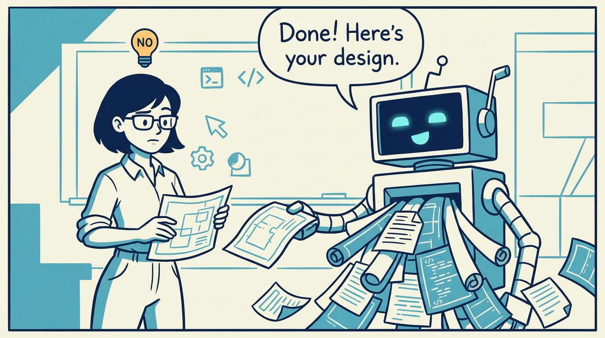
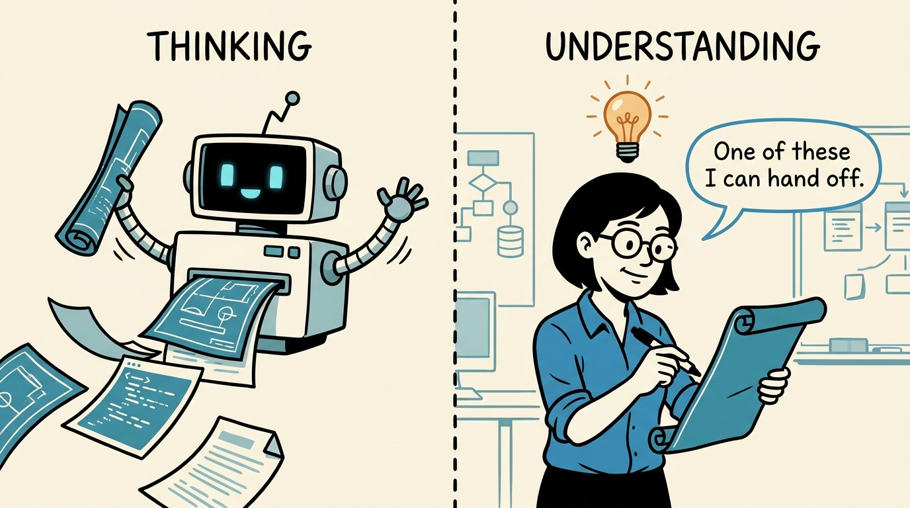
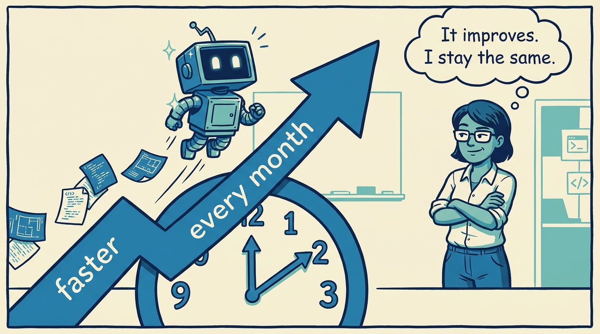
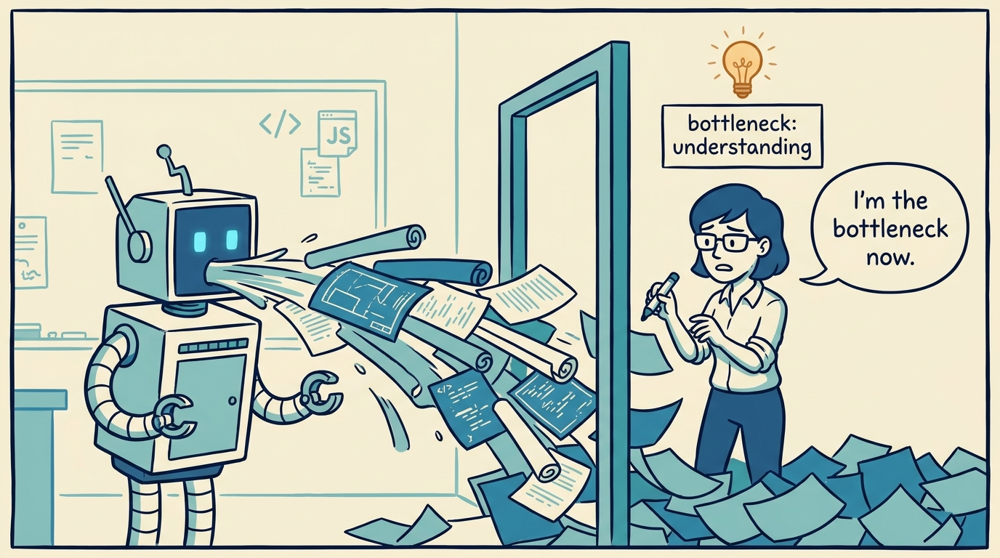
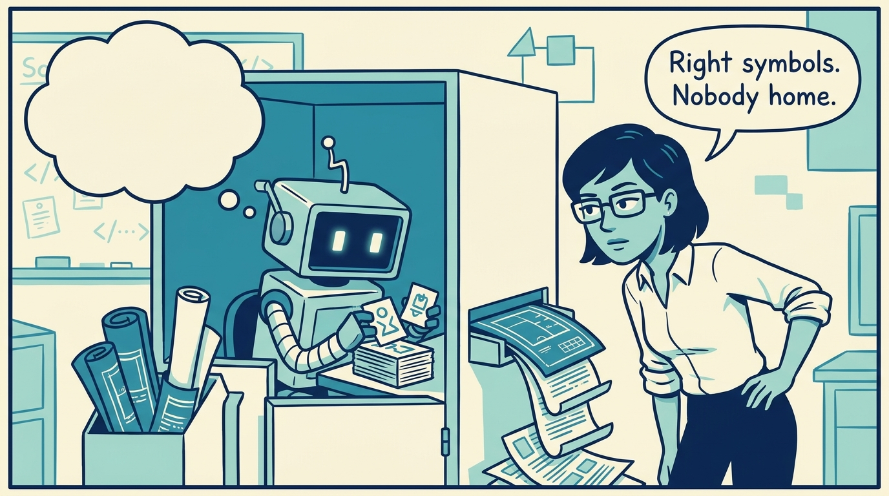
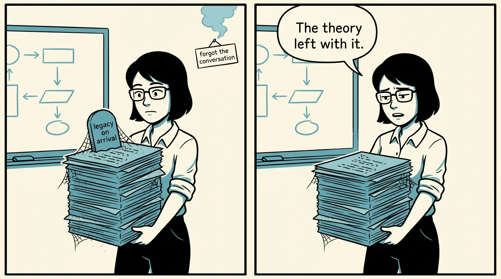
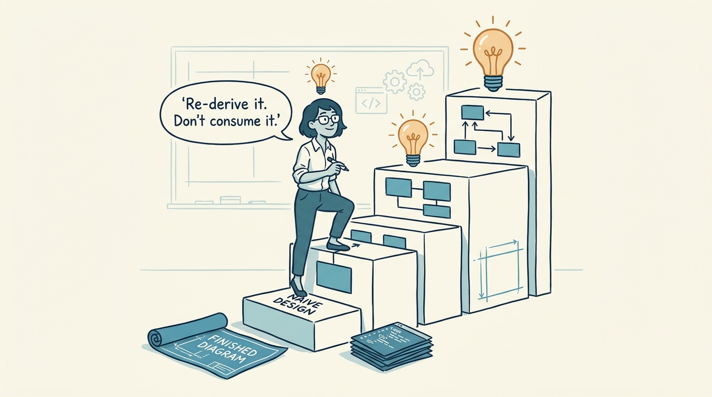
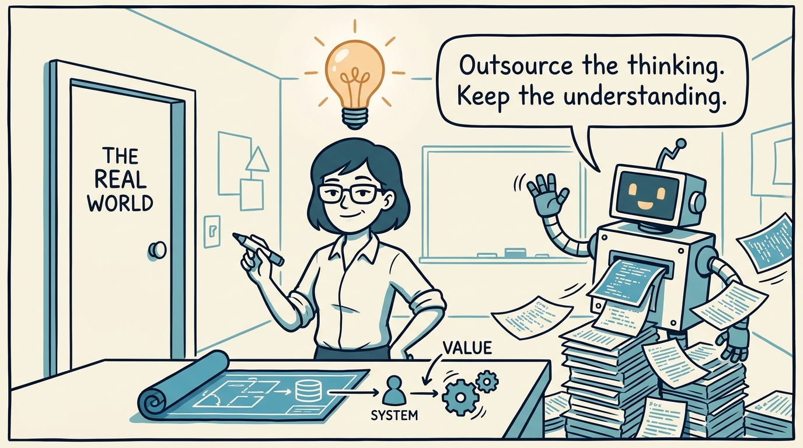

<!-- comic-style
{
  "cast": "MAYA: a pragmatic staff engineer / architect, short dark hair, glasses, rolled-up sleeves, calm and slightly amused, often holding a marker. REX: an over-eager boxy robot AI assistant, one bent antenna, glowing rectangular eyes, perpetually excited; here he is a tireless artifact-printer — he cheerfully spits out finished diagrams, code, and documents like a printer spitting pages, but never carries any of them.",
  "style": "Clean two-tone explainer comic, thick ink outlines, flat colors with blue/teal accents on a light cream background, generous white space, hand-lettered speech bubbles with SHORT readable text (max 8 words per bubble). Recurring motif: finished ARTIFACTS (rolled blueprints, code pages, doc sheets) are printed effortlessly by Rex in blue/teal, but UNDERSTANDING is a glowing warm-amber lightbulb that only ever appears above a HUMAN head, never above Rex. Simple geometric office and whiteboard settings mixing people with software symbols, no photorealism, no dense text, no title text."
}
-->

An eight-panel walk through the whole idea: you can hand Rex the thinking, but the understanding has to stay in a human head.

**Panel 1:** *AI produces the artifact in seconds. Having it and understanding it are not the same thing.*

**Panel 2:** *Thinking produces the artifact. Understanding is grasping it — and only one of the two is outsourceable.*

**Panel 3:** *AI keeps improving. You stay roughly the same — which is exactly why the next panel matters.*

**Panel 4:** *Multiply the thinking and the strain moves to the one thing left human: understanding. 'I am becoming the bottleneck.'*

**Panel 5:** *Producing the right symbols is not understanding them. Consume the output blindly and you become the booth too.*

**Panel 6:** *The real asset was the theory in a head. If the author was a model that forgot the chat, the code is legacy on arrival.*

**Panel 7:** *You understand a design by re-deriving it — naive version first, one decision at a time — not by nodding at the finished thing.*

**Panel 8:** *Outsource the thinking. Keep the understanding — it's what stands at the door where the artifact finally meets the world.*
