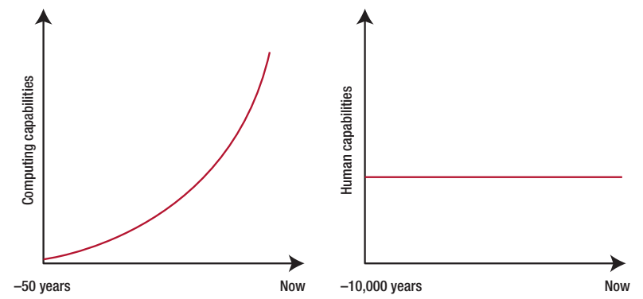

> **KEY POINTS:**
>
> * **Thinking and understanding are not the same.** Thinking — creating, making options, code, and analysis — is exactly what AI does now, cheaply and well, and passing it on is the main goal. Understanding — knowing how something was made and if it has value — is where the product meets real life, and it remains yours.
> * **AI keeps getting better; people stay about the same.** The model’s ability grows steadily; your focus, memory, and how fast you truly understand something stay almost the same. That difference does not remove the human — it moves the main challenge to understanding, the one thing AI cannot provide for you.
> * **So the work left is the final human step.** Value happens only when the product connects with a real problem and real people — and that connection stays human even if everything before it is automated. Code you don’t understand is outdated from the start; a solution for which no one knows the reason can’t be trusted, fixed, or supported. The goal is to build understanding on purpose — recreate the work instead of just using it, rather than consume it.

 
There is a line that has been going around, and it is sharper than most of what gets said about AI: **you can outsource your thinking, but you cannot outsource your understanding.** Andrej Karpathy has been repeating it — and he keeps thinking about it. I keep thinking about it too, so this note is my attempt to work out *why* it is true, and what follows from it if it is.

It sounds strange at first. If AI can do the thinking — and more and more it can, faster and often better than we can — then surely understanding comes with it? You asked a question, you got an answer, and the answer is correct. What else is there to understand?

Actually, there is a lot. Because "thinking" and "understanding" are not just two words for the same thing. Thinking means making something — a draft, a diagram, a function, an argument, a plan. Understanding means a person truly grasping how creation fits together, why it looks the way it does, and whether it works for what you need. The first can be done by a machine. The second is where you deal with the real world, and the real world does not accept a substitute.

## The Line We Keep Blurring

Watch what happens when the two collapse into one.

You ask an AI to design a service, and it quickly creates a clear, believable plan. You ask it to write the migration, and it's ready. You ask for the risk analysis, and it appears well organized, with the risks listed by importance. At every step, a result was *created* and it is easy to think that at every step, understanding was *gained*. The organization now "has" a design, "has" a migration, "has" a risk analysis.

But having the result and truly understanding it are different things, and the gap between them is where problems with AI often happen. You can have a correct architecture diagram but not know why it chose a queue over a direct call, what will fail if traffic triples, or which assumption is the critical mistake. You can deliver a migration you did not write and cannot now fix. You can show a risk analysis in which the biggest risk you would not recognize if it came up to you.

The result shows *thinking happened here.* It does not show *understanding is here.* The main point of this note is that these are different ideas — the first is now easy and can be handed off, but the second is not, and mixing them up is the common mistake of this time.

## AI Improves. You Stay the Same.

Start with the asymmetry that makes all of this urgent, because it is easy to miss and it changes everything.

**AI is improving on a set schedule.** This is not just a feeling; it can be measured. METR, a testing group, tracks how long a task an AI can do on its own, and finds that the length of task a top AI can handle with a 50% success rate has been **doubling about every seven months** since 2019. The reason is the scaling laws — the observed fact, from Kaplan and then DeepMind's "Chinchilla" study, that AI gets better in a predictable way as you add more parameters, more data, and more computing power. No matter what else is true, the machine's progress has been going upward, and it has been doing that for years.

**You are not improving on a set schedule.** Your working memory stays the same. You read about as fast as you did ten years ago. The speed at which you can truly learn a new system — follow it, question it, sense where it is weak — is fixed by biology, not by any update plan. Hans Moravec noticed this back in 1988: the things that are hard for machines but easy for us (like a one-year-old's perception and common sense) are the deep, old, unchangeable parts of our minds, while the things that are easy for machines (like formal reasoning and searching) are the newer, thinner layer. The parts of human thinking that matter most for *understanding* are exactly the parts that do not improve with scale.

**Figure 1:** *The asymmetry, drawn to scale. Computing capability has curved steeply upward over decades; human capability is a flat line over ten thousand years. Note the axes — the machine's whole story fits in fifty years; ours barely moves across a hundred centuries.*

Put the two curves on the same chart and the simple conclusion is despair: the machine is moving ahead, so the human is being left behind. But that is the wrong way to see it. The gap does not make the human *unimportant*. It makes the human the *bottleneck* — which is a very different, and much more interesting, outcome.

Karpathy, watching AI agents write code faster than he could keep up with, described the feeling exactly: **"I am becoming the bottleneck,"** he said — "even in knowing what we are trying to build, why it matters, and how to guide my agents." Notice *where* the bottleneck happened. Not in creating the code — the machine handled that. It happened in *knowing what we are building and why it matters.* It happened in understanding.

This is the pattern that runs through everything below. When you speed up one part of a process and leave the others the same, the pressure moves to what you did not speed up — the same idea explored in [[ai-is-an-amplifier-not-an-accelerator]]. Speed up *thinking* but keep *understanding* human, and understanding becomes the limit. The rare resource in the AI era is not creation. It is understanding. And understanding does not come from the model — it has to come from you.

## Thinking Is Not Understanding

Why can't the model just give you understanding along with the output? Because of a difference that existed long before AI and that AI has only made clearer.

In 1980, the philosopher John Searle asked you to imagine a person locked in a room, following an elaborate rulebook for manipulating Chinese characters. Symbols come in through a slot; the person looks them up, applies the rules, and passes symbols back out. To a Chinese speaker outside, the answers are perfect — the room "passes the test." But the person inside understands **not one word of Chinese.** They are manipulating shapes according to syntax, with no access to meaning. Searle's conclusion, which has survived four decades of argument: **"syntax is neither constitutive of nor sufficient for semantics."** Producing the right symbols is not the same as understanding them.

That is the clearest description of what a language model does, and — importantly — what happens when you accept its output without thinking. The model produces the right symbols. If you take them and pass them on without understanding them, *you have become the room.* The output is right; the understanding is missing. The structure moved through the system; the meaning never appeared.

Understanding, it turns out, is a special and demanding thing. Michael Polanyi gave us the other side of the idea in 1966 with one sentence: **"we can know more than we can tell."** Real understanding has an *unspoken* core — the feeling of how a system will act, the pattern-recognition that tells an experienced engineer "this will break under load" before they can explain why. That unspoken part is exactly what cannot be written down and given to someone. It has to be *developed*, in a person, by working with the thing.

Philosophers who study understanding as its own subject — different from just knowledge — agree on one thing: to understand something is to **see how it all fits together**, the network of connections and reasons, not just to know a true fact about it. You can *know that* the design uses a queue. You *understand* it only when you see what the queue is protecting against, what it costs, and what would go wrong without it. The first is a simple fact. The second is a mental framework. AI is great at giving the first. The second: it cannot be given, because it is not something that can be handed over — it has to be developed.

| Thinking (outsourceable) | Understanding (not outsourceable) |
| --- | --- |
| **Producing** an artifact — a draft, a design, code, an analysis. | **Grasping** the artifact — how it works, why it's shaped this way. |
| *Syntactic*: the right symbols, correctly arranged. | *Semantic*: the meaning behind the symbols, and their dependencies. |
| Can be **stated and handed over** — it's in the output. | Has a **tacit core** — "we know more than we can tell." |
| Gets **cheaper and faster** every model release. | Runs at **human speed**; the model can't do it for you. |
| The machine is now very good at this. | The machine cannot do this *for* you — only *with* you. |

## Understanding Is Where the Artifact Meets Reality

Here is why the difference matters. **An artifact has no value until it connects with reality — and that connection is a human action.**

Theodore Levitt taught generations of managers a line he borrowed from an ad man named Leo McGivena: *people don't want a quarter-inch drill, they want a quarter-inch hole.* Clayton Christensen built an entire theory — "jobs to be done" — on the same insight: nobody wants your product; they want the progress it makes in their life. The value was never in the thing produced. It was in the thing the produced thing *does*, for a real person, in a real situation.

AI is an amazing drill. It creates artifacts — holes waiting to be used — faster than ever before. But the value of any of them is still decided when they meet the real world: does this design work with *our* traffic, *our* old system, *our* rules? Does this analysis deal with the risk *this* customer really faces? Does this code do the job *this* team needs, in a way *this* team can keep using? These questions can’t be answered in theory or by the model ahead of time. They are answered where the artifact meets reality — and someone has to be there, understanding both sides, to answer them.

This is the **last human mile.** The term comes from telecom: the network can be incredibly fast across the country, but the last part to each home — the "local loop" — is slow, costly, and unexciting because it can’t be mass-produced; it has to be connected to each specific door. AI has built an amazing long-distance network for thinking. But the last mile — linking a general artifact to a specific situation and person — still has to be done by hand, for each door. Harvard's Karim Lakhani and colleagues, writing in *Harvard Business Review*, explain it clearly: the challenge to AI’s value "is rarely model quality or data availability, but rather the last mile of transformation where technical capability must meet organizational design." The models are ready. The mile is not.

**Figure 2:** *Thinking can be mass-produced; value cannot. The last human mile — where a generic artifact is connected to a specific reality and specific people — stays human, and it doesn't get shorter as the models get better.*

And notice: the last mile does not get shorter as the models get better. A better model makes a better artifact, faster — which means *more* artifacts reaching the last mile, each still needing a human to link it to reality. Improving the long-distance network does nothing for the local loop. If anything, it overwhelms it.

## Two Things You Have to Understand: How, and Whether

When an AI hands you something, there are two distinct questions you cannot delegate, and it is worth separating them because they fail in different ways.

**How was it built?** You need to understand how the artifact works inside well enough to take full control — to change it, fix it, defend it, and predict what it will do in situations its creator never thought of. In software, we have known how important this is for forty years, but almost no one talks about it. In 1985, Peter Naur wrote an important paper called *Programming as Theory Building.* He said: **the real thing a programmer creates is not the code — it is a *theory* in their mind**, "the knowledge a person must have not only to do things smartly but also to explain them, answer questions about them, and discuss them." The code is just a copy of that theory. And here is the part that should stop you in the age of AI: Naur said this theory **cannot be rebuilt from the documentation alone.** "A program dies," he wrote, "when the programmer team that understands it is gone." Bringing the theory back from the artifact alone is, in his words, *"impossible."*

Think about what it means when the "programmer team" that understood the theory was an AI model that has already forgotten the conversation. **AI-generated code you don't understand is not a benefit. It is broken from the start** — code with no real understanding behind it, exactly the problem Naur said kills programs. Addy Osmani, a Google engineering leader, calls this **comprehension debt**, "the growing gap between how much code is in your system and how much any person truly understands." Simon Willison, a strong AI supporter, has a clear rule: he won't add AI-written code to his project "if I can't explain exactly what it does to someone else." This rule follows Naur's idea. If you can't explain it, you don't understand it, and you're adding a dead program to a working system.

**Is it any good?** The second question is not about how it works but about its value — and it is a judgment that needs you to stand where the artifact meets the real world. Is this the right thing to have made? Does it meet the real need, respect the real limits, avoid harm that no one mentioned? A model can generate many options and rank them according to a given goal. It cannot tell you if the goal was the right one, because that needs understanding of a context — this organization, these people, this history, these values — that is outside the prompt. This is the human responsibility that [[prepare-for-ai-future]] says becomes *more* important, not less, as generation gets easier: AI can widen the range of ideas, but "direction, accountability, and consent stay human-led." You can be given the answer. You cannot be held responsible for whether it was the right question.

| You cannot outsource understanding *how*... | ...nor understanding *whether*. |
| --- | --- |
| Grasp the artifact's internal logic well enough to **own, change, and debug** it. | Judge whether it's the **right thing** — serves the real need, respects the real constraints. |
| Naur: the value is the **theory in your head**, not the code; it can't be revived from documentation. | The worth is decided at **contact with reality** — this org, these people, this context. |
| Fail here and you have **comprehension debt** — legacy on arrival, a dead program in a live system. | Fail here and you ship a **confident answer to the wrong question**, with no one accountable. |
| The question is **correctness and maintainability**. | The question is **value and judgment**. |

## The Cost of Outsourcing Understanding

You might accept all this and still think: fine, but in real life, using the tool *creates* understanding. I work with the AI, so I understand what we made together. Unfortunately, the evidence shows the opposite — and it shows this often enough to take seriously, even if each study has flaws.

The oldest warning is the clearest. In 1983, Lisanne Bainbridge wrote a paper on industrial automation called *Ironies of Automation*, and its main point fits AI perfectly. When you automate the routine parts of a task and leave the human to handle only the exceptions, you create a problem: the human's skill **weakens** because they no longer practice the routine — and yet the exceptions, when they come, need *more* skill than ever, because they are the hardest cases, coming without preparation. Automating the easy 90% doesn't leave a human ready for the hard 10%. It leaves a rusty human facing the hard 10% unprepared. Replace "AI writes the straightforward code" and "the human fixes the subtle failure," and you have described many engineering teams today.

Recent studies agree. A 2025 study from Microsoft and Carnegie Mellon surveyed 319 knowledge workers about their real AI use and found a clear, worrying link: **"higher confidence in GenAI is linked to less critical thinking."** The more you trust the tool, the less you check its output — which is the opposite of what understanding needs. An Anthropic trial in 2026 gave engineers a task with and without AI help, then tested their understanding: the AI-assisted group scored **17% lower on understanding** — and importantly, the problem came from *passive* use, not from active, question-driven use. (A well-known 2025 MIT Media Lab study went further, using EEG to show less brain activity in people who wrote essays with ChatGPT, and called this "cognitive debt" — though that study is small and not peer-reviewed, so treat it as a warning, not proof.) All these studies point the same way: **passively handing off thinking quietly weakens understanding** — and it happens while your *confidence* stays high, which is the risky part. You feel like you understand. The feeling of understanding and the real understanding have separated, just like the feeling of speed and the real speed did in the amplifier studies.

None of this argues against using AI. It argues against using it *passively* — against confusing "the output showed up" with "I now understand." The tool is not the problem. Thinking that generation replaces understanding is the problem.

## Manufacturing Understanding: Re-derive, Don't Consume

So if understanding doesn't come automatically with the artifact — and using the tool passively actually reduces it — how do you get it? You have to *create* it on purpose. And the best way we have is old, and it has nothing to do with reading the finished product more carefully. **You understand a design by re-creating it — not by just accepting the answer, but by following the steps that make it.**

This is one of the most reliable findings in the history of systems. John Gall gave it a law in 1975: *"A complex system that works is invariably found to have evolved from a simple system that worked. A complex system designed from scratch never works."* Christopher Alexander, the architect whose ideas seeded much of software design, described the same move as building through "structure-preserving transformations… introducing differentiations one after the other" — you start with a whole, simple thing, and you refine it one decision at a time, each step growing out of the last. And it rhymes with the deepest version of the whole idea, the line found on Richard Feynman's blackboard when he died: **"What I cannot create, I do not understand."** Understanding and re-creation are the same act. To understand a design is to be able to *rebuild* it — to see why each piece is there because you watched the problem that put it there.

This is exactly the "last human mile" problem I have been trying to solve in a small side project — [a step-by-step system-design explorer](https://zeljkoobrenovic.github.io/spec-driven-system-design-interviews/). The problem it attacks is precise: how do you make a human genuinely *understand* a system design — possibly one an AI generated — rather than just nod at a finished diagram? A finished architecture, handed over whole, is a Chinese Room: all the right boxes, none of the theory. So the explorer refuses to hand it over whole. Instead, it teaches every design as an **emergent human path**:

- **Start naive.** A URL shortener begins as one client talking to one server. That's it. Anyone can hold that in their head.
- **Expose one problem.** The server can't keep its mappings in memory — they'd vanish on restart. *Now* you need a database. The database is not asserted; it is *motivated*, by a problem you just felt.
- **Make one decision.** Add the database. Then: if one server fails and stops everything — add a load balancer. Then: redirects happen much more than creations and focus on a few popular links — add a cache. Then the data is too large for one machine — split it up. Then delays between regions cause problems — move closer to users.

Each step brings exactly one problem and solves it with exactly one choice. By the end you see a split-up, cached, multi-region, edge-boosted system — the same complex diagram an AI would have produced all at once — but now **you understand every part, because you saw the problem that created it.** You did not just accept the design. You *re-created* it, and by doing that you built the knowledge in your mind that Naur says is the real value. The final diagram is the same. The understanding is what matters.

**Figure 3:** *Understanding is re-derived, not consumed. Start naive; let each problem motivate exactly one decision. The design at the top is the same one an AI would generate in a single shot — but now every box has a reason you personally watched arrive.*

This idea goes far beyond system design interviews and is the main point of this note. When an AI gives you something you need to own — a design, a proof, a plan, a diagnosis — **do not take it as a finished product. Rebuild it as a process.** Ask: what is the simplest version that would work? What causes the next part? Make the AI show its work not as *how the model made it* — that is not important and often made up — but as *how a person would get there,* starting simple and improving one choice at a time. That rebuilding is how you create understanding. It is the last human step, done carefully, one step at a time. It is also, not by chance, the way to keep the amplifier's effect positive — better design, not more force, the approach [[breaking-vibe-monolith]] supports, and the trust-first idea behind [[risc-for-ai-software-development]].

## What to Do on Monday

A difference matters only if it changes how you act. Here is what happens when you take "outsource thinking, not understanding" seriously.

| Move | What it looks like | What it buys you |
| --- | --- | --- |
| **Name the two acts separately** | For every AI task, ask yourself: am I outsourcing the *thinking* or the *understanding*? Outsourcing thinking is okay. Outsourcing understanding is the problem. | You avoid falling into the trap of "the output showed up, so we're finished" — a common AI-era error. |
| **Re-derive, don't consume** | Before accepting a generated design or solution, rebuild it step by step: start with the simplest version, then handle one problem and one decision at a time. | You understand Naur's theory yourself. The diagram stays the same; now it belongs to you. |
| **Apply the Willison rule** | Don't deliver code, a plan, or an analysis unless you can clearly explain it out loud to a coworker right now. | You avoid hidden misunderstandings early instead of facing bigger problems later during production. |
| **Use AI actively, not passively** | Question the output. Make it explain its choices, show other options, and reveal assumptions. Using AI with questions builds understanding; just accepting its answers weakens it. | You achieve the study's *good* result, not the one with 17% less understanding. |
| **Staff and budget the last mile** | Prepare for the human effort needed to link general results to your specific situation — this work does not get smaller as models get better; it actually grows. | The "it's almost finished" demo won't turn into a situation where many people don't understand what you delivered. |
| **Watch your confidence** | When your trust in the tool grows, use it as a sign to check things *more*, not less. Feeling like you understand and actually understanding can be very different. | You avoid moving forward, sure but mistaken, beyond the point where you stopped truly understanding. |

None of these is about getting a better model. They are about the thing the better model cannot do for you — which is where the leverage was the whole time.

## Closing Thought

You can give your thinking to others because thinking creates a product, and products can be made by anything that handles symbols well enough — which machines now do very well. You cannot give your understanding to others because understanding is not a product. It is a structure that exists only in a mind, built only through direct experience with the thing, and it is what separates a correct result from a trustworthy one, a design from a design you can stand behind, a solution from a solution that truly solves a real person's real problem.

AI keeps improving at thinking. It will keep getting better. And you will stay about the same — which sounds like losing, until you realize what it means. It means the rare thing, the key thing, the thing the whole system now depends on, is the one thing that was always yours: the understanding. The models gave us an amazing tool for making products. The work left — the steady, unexciting, completely human work — is understanding them well enough to decide what they are worth, why, and whether to trust them when they finally face the world.

Thinking was never the hard part. Understanding always was. AI just made it impossible to keep pretending otherwise.

## To Probe Further

* Andrej Karpathy, [Sequoia Ascent 2026 notes](https://karpathy.bearblog.dev/sequoia-ascent-2026/) — the source of the line this note elaborates ("you can outsource your thinking, but you can't outsource your understanding") and the companion admission, "I am becoming the bottleneck of even knowing what we are trying to build, why it is worth doing, and how to direct my agents." Karpathy popularized it, crediting an earlier tweet; the original author is uncertain.
* Peter Naur, [*Programming as Theory Building*](https://pages.cs.wisc.edu/~remzi/Naur.pdf) (1985) — the keystone: what a programmer builds is a *theory* in the head, not the code; "the death of a program happens when the programmer team possessing its theory is dissolved," and reviving the theory from documentation alone is "strictly impossible." The rigorous case that AI-generated code you don't understand is legacy on arrival.
* John Searle, [*Minds, Brains, and Programs*](https://plato.stanford.edu/entries/chinese-room/) (1980) — the Chinese Room; "syntax is neither constitutive of nor sufficient for semantics." Producing the right symbols is not understanding them; consume AI output uncritically and *you* become the room.
* Michael Polanyi, *The Tacit Dimension* (1966) — "we can know more than we can tell." Understanding has a tacit core that cannot be written down and handed over; it has to be built in a person.
* Lisanne Bainbridge, [*Ironies of Automation*](https://www.sciencedirect.com/science/article/abs/pii/0005109883900468) (1983) — automating the routine erodes the skill needed for the exceptions, which are the hardest cases and now arrive cold. The seminal warning, transferring directly to AI.
* Hao-Ping (Hank) Lee et al. (Microsoft Research / Carnegie Mellon), [*The Impact of Generative AI on Critical Thinking*](https://www.microsoft.com/en-us/research/publication/the-impact-of-generative-ai-on-critical-thinking-self-reported-reductions-in-cognitive-effort-and-confidence-effects-from-a-survey-of-knowledge-workers/) (CHI 2025) — across 319 knowledge workers, "higher confidence in GenAI is associated with less critical thinking." Peer-reviewed; self-reported.
* Judy Hanwen Shen & Alex Tamkin (Anthropic), [*How AI Impacts Skill Formation*](https://www.anthropic.com/research/AI-assistance-coding-skills) (2026) — a randomized trial: AI-assisted engineers scored ~17% lower on a comprehension quiz, with the damage concentrated in *passive* delegation. Preprint; strong design.
* Nataliya Kosmyna et al. (MIT Media Lab), [*Your Brain on ChatGPT*](https://arxiv.org/abs/2506.08872) (2025) — EEG evidence of reduced neural engagement and lower essay "ownership" among LLM users; coins "cognitive debt." **A small, non-peer-reviewed preprint — directional, not conclusive.**
* Addy Osmani, [*Comprehension Debt*](https://addyosmani.com/blog/comprehension-debt/) (2026) — "the growing gap between how much code exists in your system and how much of it any human being genuinely understands." The modern name for outsourced understanding coming due.
* Simon Willison, [*Not all AI-assisted programming is vibe coding*](https://simonwillison.net/2025/Mar/19/vibe-coding/) (2025) — the working rule from a pro-AI programmer: don't commit code "if I couldn't explain exactly what it does to somebody else." Naur's theory-building as a one-line commit policy.
* METR, [*Measuring AI Ability to Complete Long Tasks*](https://metr.org/blog/2025-03-19-measuring-ai-ability-to-complete-long-tasks/) (Kwa et al., 2025) — the length of task AI can complete has doubled roughly every seven months. The quantitative "AI accelerates while humans stay flat" contrast. Preprint.
* Hans Moravec, *Mind Children* (1988) — Moravec's paradox: adult-level test performance is easy for machines; a one-year-old's perception is "difficult or impossible." Why the parts of us that do the understanding are the parts that don't scale.
* Karim Lakhani, Jared Spataro & Jen Stave, [*The "Last Mile" Problem Slowing AI Transformation*](https://hbr.org/2026/03/the-last-mile-problem-slowing-ai-transformation) (*HBR*, 2026) — the obstacle "is rarely model quality… but rather the last mile of transformation where technical capability must meet organizational design."
* Theodore Levitt / Clayton Christensen — "people don't want a quarter-inch drill, they want a quarter-inch hole" (Levitt credited Leo McGivena); extended by Christensen's [*jobs to be done*](https://hbr.org/2005/12/marketing-malpractice-the-cause-and-the-cure). Value lives at the point of use, not production.
* John Gall, *Systemantics* (1975) — Gall's Law: "a complex system that works is invariably found to have evolved from a simple system that worked." The case for re-deriving from naive.
* Christopher Alexander, [*The Origins of Pattern Theory*](https://www.patternlanguage.com/archive/ieee.html) (OOPSLA 1996 / *IEEE Software* 1999) — building through "structure-preserving transformations… introducing differentiations one after the other." Design as one-decision-at-a-time emergence.
* [[ai-is-the-reactor-not-the-plant]] — value and work live in the plant around the model. This note: the plant's most human part is understanding.
* [[ai-is-an-amplifier-not-an-accelerator]] — amplify one stage and the strain moves to the one you didn't. Multiply thinking and understanding becomes the bottleneck.
* [[prepare-for-ai-future]] — as generation gets cheap, judgment, agency, and accountability become the scarce, human inputs. They all rest on understanding.
* [[risc-for-ai-software-development]] — trust and inspectability as the adoption bottleneck; understanding is what makes output inspectable.
* [[breaking-vibe-monolith]] — the way out of brute-force AI development is better structure, not more force — the same move as re-deriving a design one decision at a time.

## Questions to Consider

Use these if your team is leaning on AI to produce things you'll have to stand behind.

* For the last thing AI produced for you, did you *understand* it — could you explain it, defend it, and debug it — or did you just *have* it? Be honest about which.
* Which parts of your work are you outsourcing the *thinking* on (fine), and which are you quietly outsourcing the *understanding* on (not fine)?
* If the AI that wrote your critical code "left the team" tomorrow — forgot the conversation, which it did — does the theory of that code live in any human head? Or is it legacy on arrival?
* Would your AI-assisted work pass the Willison test: could you explain exactly what it does to a colleague, right now, without looking?
* Is your confidence in a tool making you scrutinize its output *more*, or *less*? Which way should it be pushing you?
* When you accept a generated design, do you consume it whole — or do you re-derive it, naive version first, one decision at a time, until you own every box?
* Where is *your* last human mile — the point where a generic artifact has to meet your specific reality and your specific people? Who is walking it, and are they staffed to?
* Your team is producing more than ever. Is it *understanding* more than ever — or has the gap between what exists and what anyone grasps started to grow?
