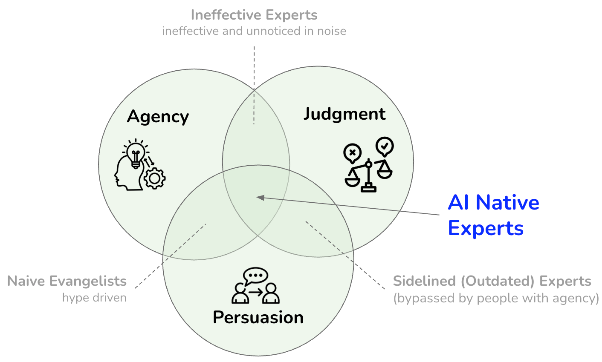

> **KEY POINTS:**
>
> * Technology leaders must evolve from **artifact-makers to decision-makers**.
> * **AI amplifies productivity** but demands **more human leadership**.
> * **Agency, judgment, and persuasion** will define technical and organizational impact.

What if the next architecture diagram, decision memo, roadmap brief, or risk analysis you would normally spend hours preparing could be drafted in seconds? AI is changing the landscape for nearly every knowledge profession, and technology leadership is no exception. Principal and staff engineers, engineering managers and directors, VPs of Engineering, CTOs, and architects are all at a transition point.

For technology leaders, the question is shifting from "How should we work today?" to "What kind of leadership remains valuable as routine work is automated?" Technical leadership is bigger than artifacts and frameworks. AI makes that point sharper by forcing leaders to lean harder into judgment, initiative, and influence.

The stakes differ by role. Principal and staff engineers need to turn AI-generated options into coherent technical direction. Engineering managers need to help teams adopt AI without losing quality, accountability, or learning. Directors, VPs, and CTOs need to connect adoption with strategy, risk, investment, and organizational capacity. Architects need to make system-level choices understandable and actionable. Different titles, same shift: less value in producing artifacts by hand, more value in deciding what should happen next.

## Reskilling: Agency + Judgment + Persuasion

In a 2025 essay, Jakob Nielsen [argued](https://www.uxtigers.com/post/ai-transition-career-transition) that the most important skills in the AI transition are **agency**, **judgment**, and **persuasion**. He was writing about UX, but the argument applies just as strongly to people accountable for technical direction, engineering execution, and organizational change.

When AI can draft candidate architecture diagrams, RFCs, migration plans, or stakeholder summaries faster than you can open the right tool, your value no longer lies primarily in producing artifacts. It lies in how you evaluate them, how you guide teams through ambiguity and trade-offs, and how you turn ideas into decisions that work in the real world.

People who combine all three become **AI-savvy experts** who can lead, influence, and navigate complexity. Those who lack one of the three are more likely to be marginalized, sidelined, or trapped in hype.

**Figure 1:** *To thrive in the AI era, experts must combine agency, judgment, and persuasion—without all three, they risk becoming marginalized, sidelined, or lost in hype.*

The rest of this note looks at what that transition means for technology leaders and how to respond before AI commoditizes more of the work that once looked distinctive. The scenarios below are illustrative composites, not case studies; use them as prompts for reflection rather than as proof that every organization will follow the same path.

## Why You Cannot Simply Delegate This to AI

AI can support agency, judgment, and persuasion, but it cannot fully own them because these skills sit where information meets accountability. A model can generate options, arguments, summaries, and risks. It cannot be responsible for the consequences, repair trust after a bad call, understand the informal history of a team, or decide which trade-offs are legitimate for your organization.

| Skill | AI can help by... | Leaders cannot delegate... |
| --- | --- | --- |
| Agency | Surfacing opportunities, drafting experiments, finding patterns, and reducing the cost of starting. | Choosing to act before there is a mandate, taking responsibility for the initiative, and creating momentum across people who did not ask for change. |
| Judgment | Comparing options, listing trade-offs, stress-testing assumptions, and exposing blind spots. | Deciding what matters here, now, with these people, constraints, politics, customers, risks, and values. |
| Persuasion | Drafting narratives, adapting language for audiences, preparing objections, and improving clarity. | Earning trust, reading the room, handling resistance, and making a decision feel legitimate to the people who must live with it. |

The pattern is simple: AI can expand the surface area of thinking, but leaders still own direction, accountability, and consent. The more AI contributes, the more important it becomes to know which parts must remain human-led.

## 1. Agency: The Era of Waiting is Over

There was a time when senior technical leaders could wait for requirements to roll in, produce a reference model, review a plan, or escalate a decision, and move on. That time has passed. AI doesn't wait. Neither do modern product teams.

Image by <a target="_blank" href="https://www.istockphoto.com/en/portfolio/baona">baona</a> from <a target="_blank" href="https://www.istockphoto.com/">iStock</a>

The leaders most likely to thrive with AI take initiative. They create momentum rather than waiting for it, and they do not need permission to begin leading change.

**Scenario:** A mid-size logistics company is seeing inefficiencies across its microservices: latency, duplication, and poor observability. A principal engineer does not wait for a formal initiative. She uses AI tools to review design documents, trace dependency patterns, and identify likely areas of redundancy. Then she builds a small event-driven prototype with observability built in and brings the engineering manager and platform team into the conversation. She does not ask if it is her job; she makes it her job. That's agency.

When agency is missing, AI adoption becomes something that happens *to* the organization instead of something leaders shape deliberately.

| Without agency | With agency |
| --- | --- |
| Teams wait for a formal mandate, experiment in private, duplicate effort, and argue about AI in the abstract. | A leader starts a bounded experiment, shares what worked and failed, and creates enough evidence for a real decision. |
| Risk-averse stakeholders define the pace by default because nobody has shown a responsible path forward. | The leader brings security, delivery, and product concerns into the experiment early, making responsible adoption easier to support. |

To assess your agency, ask yourself:
* Are you sparking conversations about how AI will reshape your tech stack or delivery model?
* Have you tested AI-driven design tools to cut down repetitive effort in your own workflow?
* Are you advocating for technical, architectural, or operating-model changes that align with new business needs—even if nobody asked yet?

Agency means moving from "solution provider" or "escalation handler" to strategic instigator. As AI absorbs more routine work, technology leaders must bring more leadership to the work that remains.

## 2. Judgment: When AI Gives You 10 Options, Can You Choose the Right One?

AI is prolific. It can produce many plausible designs, plans, trade-off summaries, and metrics. But the real question is which one works here, now, with your teams, constraints, and organizational history. AI does not know that context. Accountable leaders do.

Image by <a target="_blank" href="https://www.istockphoto.com/en/portfolio/marrio31">marrio31</a> from <a target="_blank" href="https://www.istockphoto.com/">iStock</a>

**Scenario:** A VP of Engineering asks AI to draft three plausible plans for introducing AI-assisted development across the organization. One plan centralizes expertise in a platform team, another embeds champions in every product group, and a third opens access broadly with lightweight guardrails. On paper, all three could work. But she knows two product groups are already under delivery pressure, security wants auditable usage, and managers need time to learn what good AI-assisted work looks like. She chooses a staged adoption plan: a small enablement team, clear policy, a few visible pilots, and manager coaching before broad rollout.

This is judgment: choosing through technical, organizational, and human constraints at the same time.

| AI can suggest... | Leaders must decide... |
| --- | --- |
| Several plausible architecture options | Which option fits the team's skills, risk tolerance, and operating model |
| A rollout plan for a new tool or practice | Whether the organization has the capacity, trust, and governance to absorb it |
| A policy draft or decision memo | What trade-offs are acceptable, who must be consulted, and where accountability sits |
| A list of risks and mitigations | Which risks matter in this context and which ones are noise |
| A polished stakeholder summary | Whether the story is honest, useful, and tied to outcomes people care about |

When judgment is missing, polished AI output and market hype can create false confidence. The danger is not that AI suggests a bad option; it is that a leader accepts a plausible option, or follows the fashionable one, without understanding whether the organization can execute it.

| Without judgment | With judgment |
| --- | --- |
| A leader forwards an AI-generated rollout plan because it looks complete or matches the latest hype cycle. Teams are overloaded, security pauses the rollout, and managers lose trust in the initiative. | A leader treats the AI plan as input, tests it against team capacity and governance constraints, and stages adoption through pilots. |
| The loudest metric wins because the recommendation sounds data-driven. | The leader asks what the metric hides: operational load, migration risk, learning cost, customer impact, or reversibility. |

To assess your judgment skills, ask yourself:
* Can you look at five viable AI-generated options and quickly eliminate the ones that will not fly in your context?
* Are you connecting technical choices with business constraints, team skills, and cultural readiness?
* Do you balance optimization with delivery risk and long-term maintainability—even if it is less flashy?

Judgment turns outputs into outcomes. Without it, leaders are left with only more generated artifacts.

## 3. Persuasion: Influence Is the New Essential Skill

Being right is not enough. Many technically sound proposals fail because they never gain support.

Image by <a target="_blank" href="https://www.istockphoto.com/en/portfolio/martin-dm">martin-dm</a> from <a target="_blank" href="https://www.istockphoto.com/">iStock</a>

In flatter, faster-moving organizations, technology leaders cannot simply hand off decisions. They need to influence across engineering, legal, finance, operations, and sometimes marketing.

**Scenario:** A staff engineer at a SaaS company proposes migrating key services to a modular platform model using containers and service meshes. Engineering is interested. Leadership is not. So he reframes the proposal not as a technical upgrade, but as a way to reduce release friction, improve SLAs for premium customers, and simplify compliance reporting. Suddenly, the proposal is easier for non-technical stakeholders to evaluate.

This is persuasion: making the right decision legible and compelling to other people.

When persuasion is missing, good technical direction dies as a private conviction. The proposal may be correct, but it does not become a decision.

| Without persuasion | With persuasion |
| --- | --- |
| A staff engineer explains the migration in terms of containers, meshes, and platform purity. Finance hears cost, product hears delay, and leadership shelves the proposal. | The same engineer explains how the change reduces release friction, protects premium SLAs, and simplifies compliance reporting. Stakeholders can now evaluate the trade-off. |
| A manager tells teams to "use AI more" without a story about why, where, and how quality will be protected. | The manager connects AI use to a concrete workflow, explains guardrails, and shows how the team will review AI-assisted work. |

To practice your persuasion skills, try this:

* Replace "Kubernetes is more scalable" with "This lets us launch new customer features two weeks faster."
* Translate "reduces tech debt" into "frees up developer time for revenue-generating features."
* Use visual storytelling or simulations to explain the impact—not just the architecture.
* Your artifacts are only as useful as your ability to sell the story behind them.

Tools change. The need to influence does not.

## Immediate Practices: What to Do This Week

Nielsen frames the current period as a short transition toward AI-native work. The practical question, then, is what technology leaders should do now, in their own teams and routines. The answer is not a transformation program; it is a set of habits you can start practicing immediately.

Image by <a target="_blank" href="https://www.istockphoto.com/en/portfolio/BlackJack3D">BlackJack3D</a> from <a target="_blank" href="https://www.istockphoto.com/">iStock</a>

**Automate Low-Risk Work First**  
Do not make manual diagramming, dependency documentation, or first-pass status writing your default. Use AI to draft templates, compare patterns, summarize constraints, and produce first-pass governance text. Treat AI as a fast assistant that needs supervision: useful for breadth and speed, but not a substitute for accountability.

**Develop Judgment Intentionally**  
Start collecting real examples of AI-generated designs, plans, and recommendations, then review them critically. What's missing? What's unscalable? What's politically impossible? Build decision trees. Run technical and organizational "tabletop exercises" with peers to hone your instincts.

**Practice Persuasion in Small Moments**  
Try explaining your technical choices to someone in sales. Or your CFO. Can you make them care? Can you translate abstract tech into tangible business value? Don't wait for the big presentation. Influence happens in hallway chats and Slack threads.

**Keep Fundamentals Sharp—But Look Up**  
Keep your fundamentals sharp (cloud, security, scalability), but widen your lens. Read about AI governance, ethics, team dynamics, product strategy, and operating models. The best technology leaders of tomorrow will be technical enough to build trust and broad enough to guide business impact.

Try a simple one-week practice loop:

1. Pick one real decision, plan, or communication you already need to produce.
2. Ask AI for three materially different options, not one answer.
3. Reject at least one option and write down why it would fail in your context.
4. Ask AI for risks, then compare them with the risks your organization would actually care about.
5. Rewrite the recommendation for a non-technical stakeholder.
6. Share the result with one peer and ask where your judgment was weak.

## Mindset Shifts for the AI Transition Era

The practices above are about what to do this week. The deeper shift is how you orient yourself over the next few years. Nielsen's article goes beyond skills; it is also a prompt to rethink how technical leadership works when AI changes the cost of analysis, drafting, and experimentation.

Image by <a target="_blank" href="https://www.istockphoto.com/en/portfolio/Eoneren">Eoneren</a> from <a target="_blank" href="https://www.istockphoto.com/">iStock</a>

**Don’t just automate—rethink the work.**  
The goal is not only to make old routines faster. It is to ask which routines should change when AI can draft, compare, critique, and simulate options. Some of this is available now; some is still frontier work. The important habit is experimentation.

**Expect the practice to keep changing.**  
Agency, judgment, and persuasion are durable capabilities, but the way leaders practice them will keep changing as AI improves. Today's agency may mean starting a careful pilot; tomorrow it may mean orchestrating AI agents across product, security, and operations workflows. Today's judgment may mean reviewing generated plans; tomorrow it may mean deciding how much autonomy to grant a system. Today's persuasion may mean rewriting a technical proposal for finance; tomorrow it may mean helping people trust, contest, and improve decisions made with AI in the loop.

**Move before the playbook is settled.**  
Nobody knows exactly what AI-native engineering leadership looks like yet. That is your chance. If you invent and test now, you will learn faster than those waiting for consensus.

**Choose your environment wisely.**  
Working at an AI-native or AI-first organization will accelerate your learning. If you are in a culture that blocks responsible experimentation, your growth will slow. If you are in a cautious culture with real governance concerns, use judgment: disciplined adoption beats denial and hype.

**Retire low-value habits.**  
Mastering legacy frameworks can still matter when those systems run the business. Clinging to outdated governance models is different. Be willing to trade technical prestige for future-relevant judgment.

**Prepare for flatter leadership.**  
Teams are flattening. The future technology leader is not a gatekeeper, but a guide. Your ability to influence across autonomous teams will define your impact.

## You Are Not Being Replaced, But the Work Is Changing

Nielsen uses a stark analogy: around 2030, old skills may be the equivalent of "being an experienced mammoth hunter." The point is not that every old skill disappears overnight. The point is that expertise loses value when the work around it changes.

That might sound dramatic, but the direction is plausible. AI may increasingly draft code, compare options, and detect performance risks. But it will not automatically know that your customer ops team is burned out, or that your sales lead needs a feature by next quarter, or that your team is already quietly resisting the platform shift.

That's where you come in. Your value is no longer in drawing boxes—it's in drawing people together.

Technology leadership should always connect technology with people, outcomes, and change. AI is a powerful tool. But leadership is still a human job.

## Final Thoughts

[Gregor Hohpe argues](https://architectelevator.com/architecture/multiple-dimensions/) that architects do not need to be the smartest people in the room; their work is to make everyone else smarter. The same principle applies to principal engineers, staff engineers, engineering managers, directors, VPs, and CTOs.

That insight is even more relevant in an AI-driven world. Effective leadership is not about knowing everything. It is about helping people and intelligent systems work better through the right tools, guidance, and context.

The future will likely favor leaders who enhance collective intelligence, whether human or artificial.

The more powerful the tools become, the more technology leadership depends on human agency, contextual judgment, and the ability to align people around meaningful decisions. AI changes the medium of the work, but it does not remove the need for accountable leadership.

## To Probe Further
* [Use the AI Transition Period to Transition Your Career](https://www.uxtigers.com/post/ai-transition-career-transition), by Jakob Nielsen, 2025
* [Think Like An Architect, Part 2: Architects See More Dimensions](https://architectelevator.com/architecture/multiple-dimensions/), by Gregor Hohpe, 2020

## Questions to Consider
Use the following questions to consider how AI is changing your role and which capabilities will matter most going forward.

* *What parts of your workflow could AI take over today?*
* *How are you preparing to guide AI-generated outputs with human context?*
* *When was the last time you had to convince a non-technical stakeholder to back a technical choice?*
* *How would you reframe a technical decision in business terms?*
