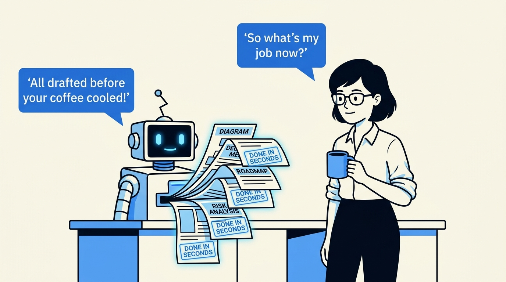
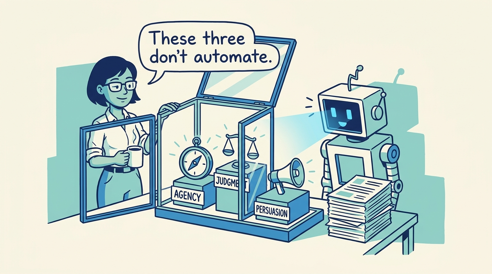
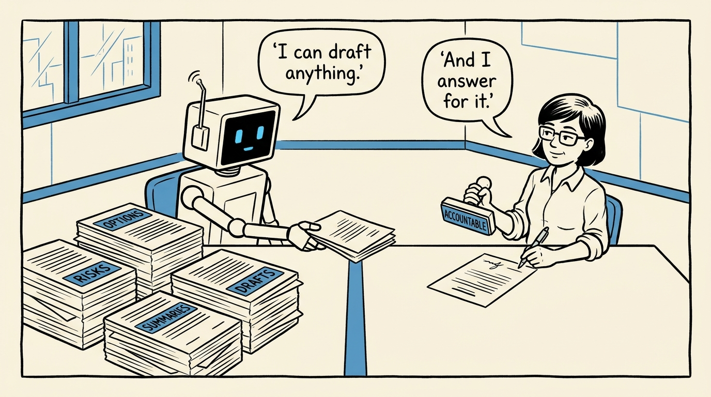
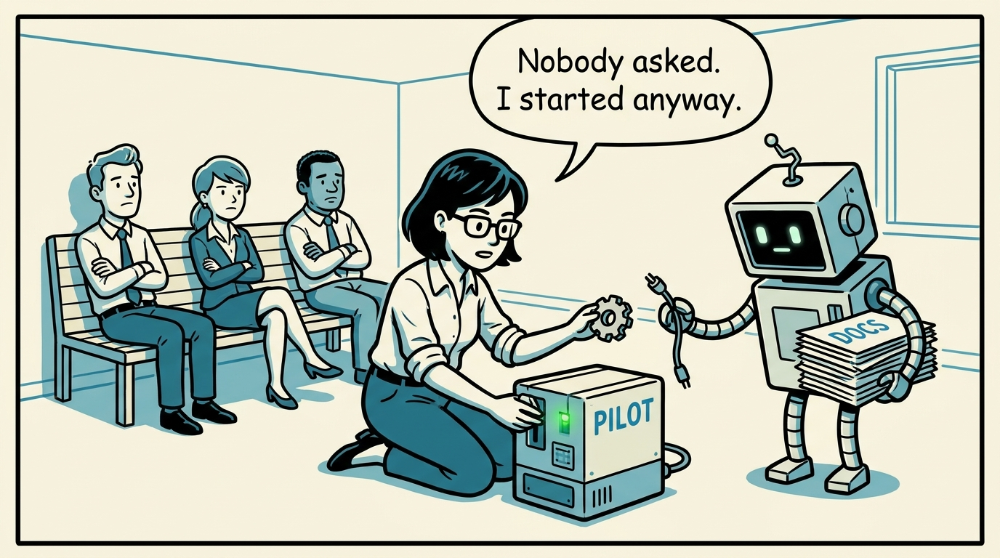
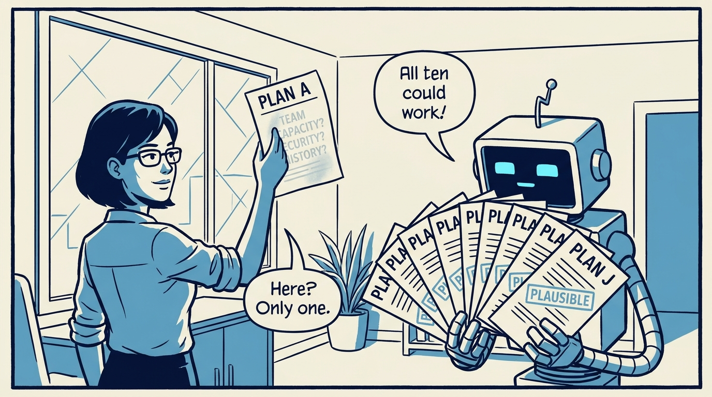
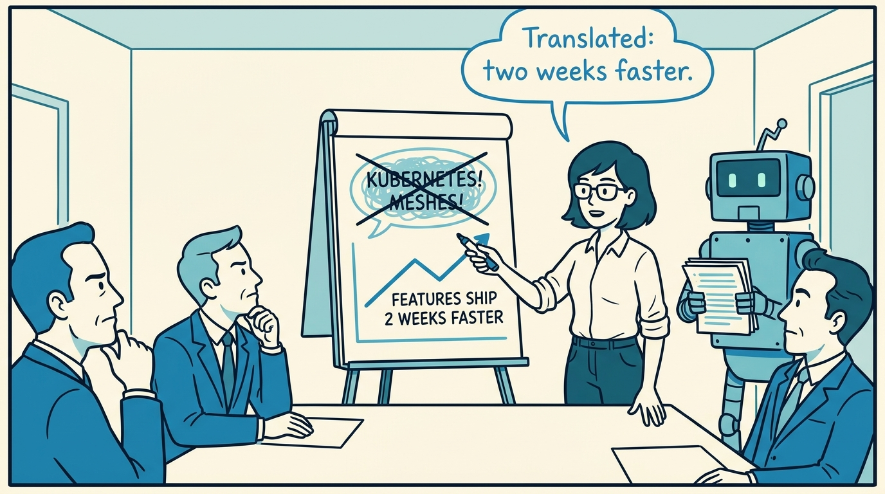
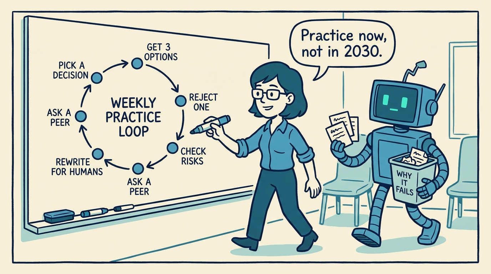
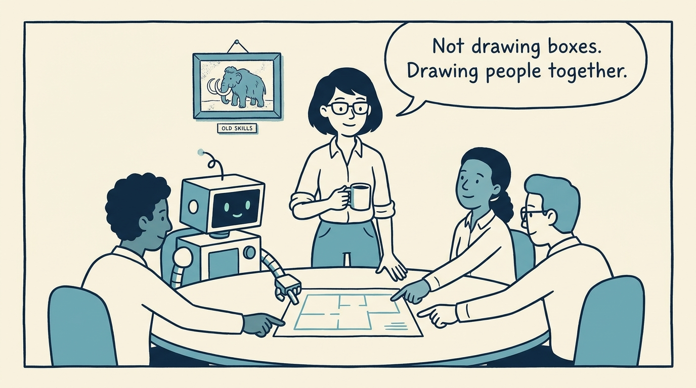

<!-- comic-style
{
  "cast": "MAYA: a pragmatic technology leader, short dark hair, glasses, rolled-up sleeves, calm and slightly amused, often holding a marker or coffee mug. REX: an over-eager boxy robot AI assistant, one bent antenna, glowing rectangular eyes, perpetually printing or presenting too many documents.",
  "style": "Clean two-tone explainer comic, thick ink outlines, flat colors with blue/teal accents on a light cream background, generous white space, hand-lettered speech bubbles with SHORT readable text (max 8 words per bubble), simple geometric office/meeting-room settings, no photorealism, no dense text, no title text."
}
-->

What technology leadership looks like when AI does the heavy lifting — in eight panels.

**Panel 1:** *The artifacts that once took leaders hours now take seconds — which forces the real question: where does leadership value live?*

**Panel 2:** *Agency, judgment, persuasion: the three skills that define leadership impact when routine work is automated.*

**Panel 3:** *AI can suggest options, risks, and narratives. It cannot be responsible for consequences — accountability stays human.*

**Panel 4:** *Agency: the era of waiting is over. Leaders start bounded experiments and create the evidence for real decisions.*

**Panel 5:** *Judgment: AI makes plausibility cheap. The leader's value is knowing which option survives this team, this risk, this history.*

**Panel 6:** *Persuasion: being right is not enough. Direction becomes a decision when stakeholders can evaluate it in their own terms.*

**Panel 7:** *The one-week loop: pick a real decision, demand three options, reject one in writing, stress-test risks, rewrite, get feedback.*

**Panel 8:** *The work changes, the job remains: connect technology with people, outcomes, and change — and make everyone smarter.*
