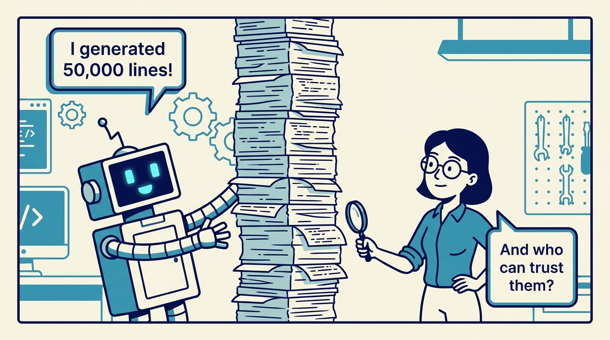
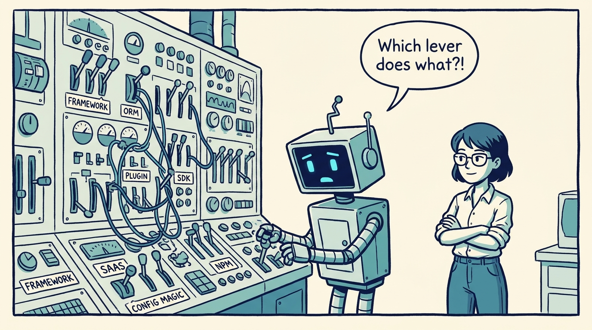
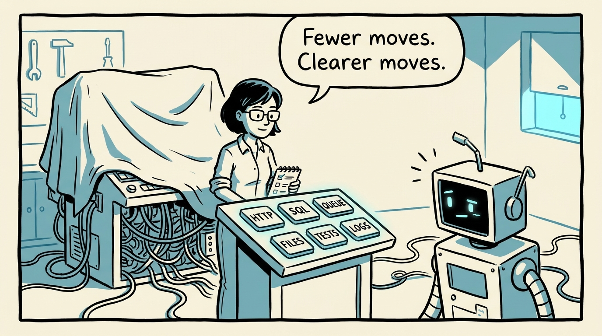
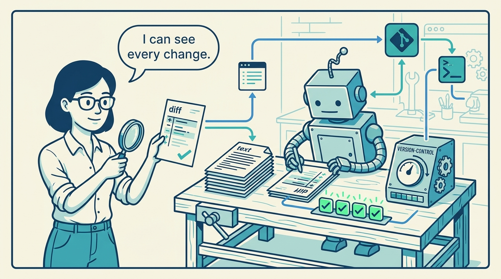
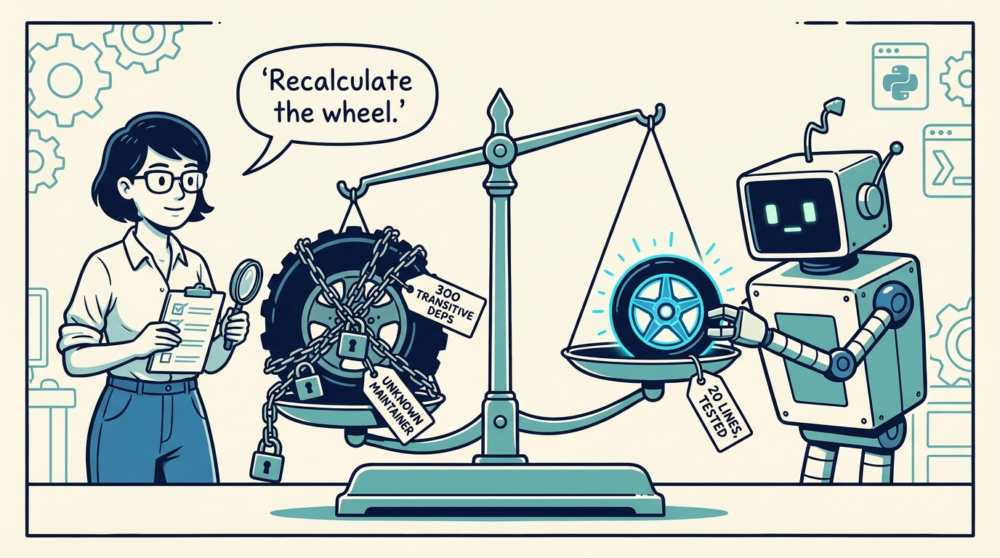
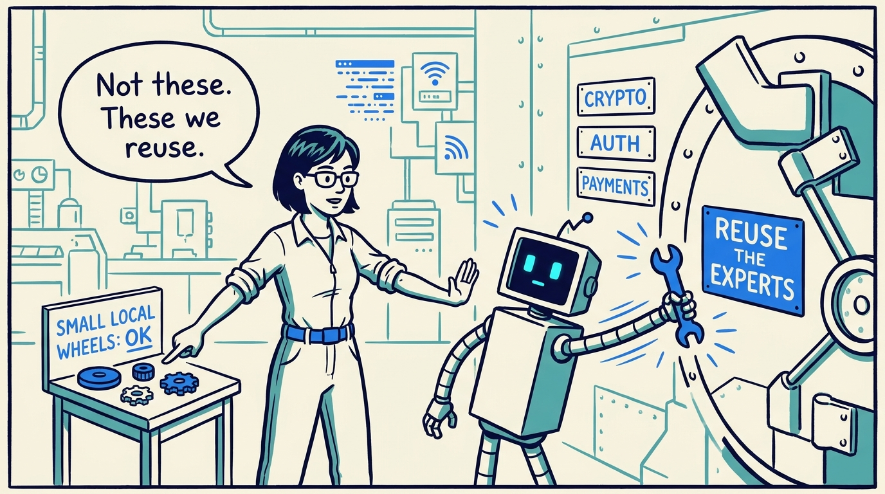
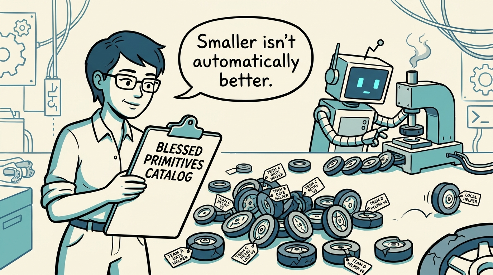
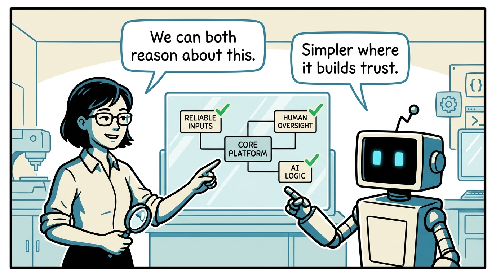

<!-- comic-style
{
  "cast": "MAYA: a pragmatic staff engineer, short dark hair, glasses, rolled-up sleeves, calm and slightly amused, often holding a checklist or magnifying glass. REX: an over-eager boxy robot AI assistant, one bent antenna, glowing rectangular eyes, perpetually producing too much of everything.",
  "style": "Clean two-tone explainer comic, thick ink outlines, flat colors with blue/teal accents on a light cream background, generous white space, hand-lettered speech bubbles with SHORT readable text (max 8 words per bubble), simple geometric workshop/control-room settings mixing machinery with software symbols, no photorealism, no dense text, no title text."
}
-->

Why smaller platform surfaces make AI-generated software easier to trust — in eight panels.

**Panel 1:** *The bottleneck is not how much code AI can generate — it is how much of it engineers can understand, verify, and trust.*

**Panel 2:** *Frameworks, libraries, SaaS APIs, plugins, conventions: this is the instruction set the agent — and its reviewer — must decode.*

**Panel 3:** *The RISC move: prefer a smaller, more regular platform surface when it makes generated systems easier to inspect and maintain.*

**Panel 4:** *Files, diffs, tests, and version control: a reduced instruction set where the agent's work remains visible and reviewable.*

**Panel 5:** *AI changes the economics: is the imported wheel really simpler and safer than the small wheel we can generate, test, and own?*

**Panel 6:** *Judgment still rules: security-sensitive, edge-case-heavy wheels are reused; only small, local, testable wheels get generated.*

**Panel 7:** *The risks of RISC thinking: local-code sprawl, fragmentation, false confidence. Reduction needs stewardship, not ideology.*

**Panel 8:** *The goal is not minimalism — it is the smallest reliable platform humans and AI can reason about together.*
