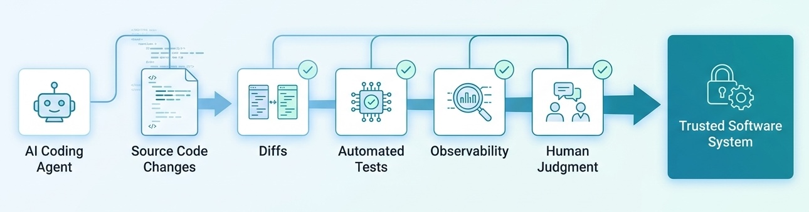
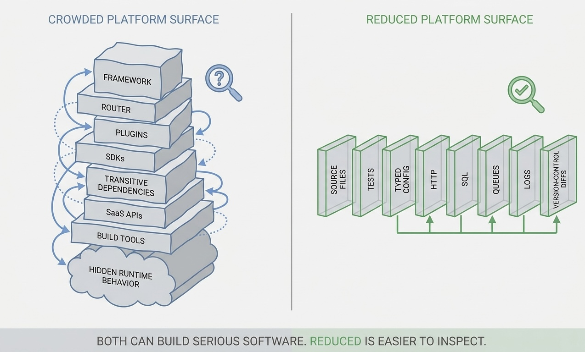
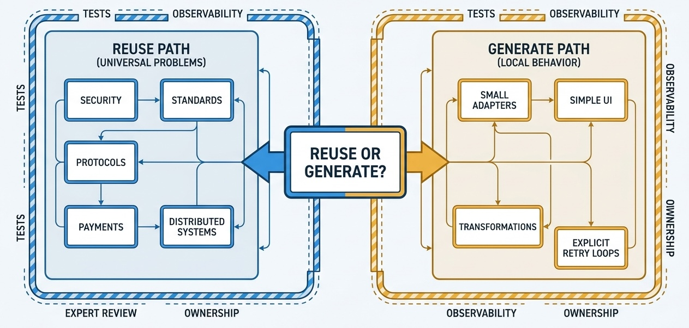
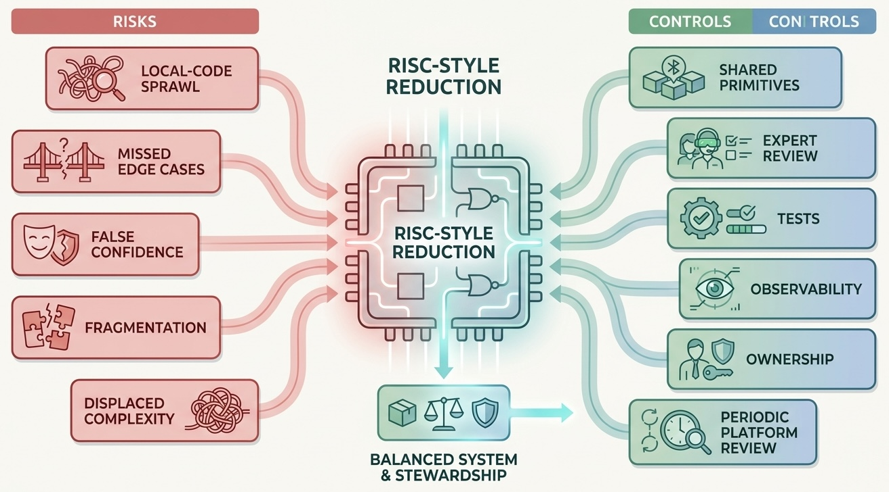

> **KEY POINTS:**
>
> * The **bottleneck** for AI-assisted software development is not only whether AI can generate code. It is whether engineers can **understand, verify, and trust** what it generates.
> * RISC — **Reduced Instruction Set Computer** — is a useful analogy for the platform surface we ask AI to build on: frameworks, libraries, dependencies, SaaS APIs, runtime conventions, and architectural patterns.
> * Reduced platforms can make AI-generated systems easier to review, test, debug, secure, and maintain.
> * **AI changes the economics of abstraction**. If AI can cheaply generate small, fit-for-purpose code, reinventing the wheel may sometimes be safer than importing a large opaque wheel.
> * **Simple does not mean primitive**. The goal is the smallest reliable platform humans and AI can reason about together.
 
 
Software engineering is learning the wrong lesson from AI if the only question is "How much code can we generate?"

The harder question is: **How much of the generated system can we trust?**

Trust does not come from confidence in the model's tone. It comes from inspectability, tests, observability, understandable abstractions, limited blast radius, and the ability of experienced engineers to reason about what the system is doing. As AI tools produce larger changes faster, trust becomes the adoption bottleneck. Teams will not let AI agents modify important systems freely if the resulting code is too large, too indirect, too dependent on unknown packages, or too hard to debug.

This is why the old RISC argument feels newly relevant. RISC stands for **Reduced Instruction Set Computer**: a family of computer-architecture ideas built around simpler, more regular instructions rather than ever more complex ones.

In their classic paper, David Patterson and David Ditzel argued that increasing architectural complexity was not automatically cost-effective. Computer architects had been adding more complex instructions, partly because earlier economics made that attractive. But the assumptions changed. Compilers often used only a small part of the available instruction set. Complex instructions were harder to implement, debug, and optimize. Simpler, more regular architectures could be faster, more feasible, and easier to support.

The analogy is not perfect, but it is useful. In AI-assisted software development, the "instruction set" is no longer CPU opcodes. It is the platform surface we ask AI to use.

Frameworks. Libraries. SaaS APIs. Message brokers. Build tools. Generated clients. State-management patterns. Dependency-injection conventions. ORM behavior. Cloud services. Npm packages. CI plugins. Security middleware. Observability agents. Feature-flag systems. Testing frameworks. Deployment templates.

This is the instruction set an AI coding agent has to understand. It is also the instruction set **you** have to understand when you review, operate, debug, and maintain what the agent produces.

And unlike a classic CPU instruction set, this one is fluid. It changes as frameworks release new versions, dependencies shift, SaaS APIs evolve, platform teams add conventions, security tools introduce new rules, and AI-generated code changes the local codebase. The agent is not reasoning over a stable machine. Neither are you. You are both working against a moving platform surface.

The more complex and fluid that instruction set becomes, the harder it is for humans to trust the generated result.

## The Trust Bottleneck

AI can already generate a lot of software-shaped text. That does not mean teams can responsibly adopt all of it.

An experienced engineer reviewing AI-generated code needs to answer several questions:

* What did the AI change?
* Which dependencies did it introduce?
* Which framework conventions did it rely on?
* Which behavior is explicit, and which behavior is hidden behind abstractions?
* Which edge cases are covered?
* Which assumptions are untested?
* How would we debug this in production?
* Who will maintain it after the agent leaves the session?

If the answer is "we are not sure, but the demo works," trust is low.

This is the central barrier to AI adoption in software engineering. It is not only model capability. It is the review burden. The larger and more indirect the generated system is, the more work humans must do to regain confidence.

Complex platforms multiply that burden. AI may produce code that is syntactically valid and locally plausible, but it may also compose abstractions in ways the team does not fully understand. A generated React component with state-management hooks, routing conventions, schema validators, form libraries, CSS-in-JS, build-time transformations, analytics wrappers, generated API clients, and transitive npm dependencies may work. It may also be difficult to inspect in the time available.

The problem is not React specifically. The problem is platform surface area.

Every hidden behavior increases the trust cost.

**Figure 1:** *Trust comes from inspectable review surfaces, not from the model generating more code.*

## What RISC Contributes as an Analogy

RISC did not mean "do less computing." It meant designing a smaller, more regular instruction set that could be implemented efficiently, understood clearly, and supported well by compilers.

The AI-era analogy is not "use primitive tools forever." It is:

> Prefer a smaller, more regular, more transparent platform surface when that makes AI-generated systems easier for humans to inspect, test, and maintain.

Patterson and Ditzel were writing about hardware cost-effectiveness. The relevant lesson for software is that complexity has to earn its place. Extra instructions, abstractions, and features are not automatically free simply because they exist. They may increase design time, debugging effort, implementation risk, and compiler burden.

In modern software, complexity often enters through good intentions:

* A framework saves time.
* A library handles edge cases.
* A SaaS platform avoids building infrastructure.
* A dependency provides a mature implementation.
* An abstraction keeps code DRY.
* A plugin integrates with the ecosystem.

All of that can be true. But AI changes the tradeoff.

If the cost of generating small, purpose-built code goes down, then the value of a large general-purpose abstraction must be reconsidered. The abstraction still has value when it carries real expertise, security, performance, ecosystem compatibility, or operational maturity. But it is less obviously valuable when the team uses only a small fraction of it and pays for the rest in dependency risk, cognitive load, and review complexity.

That is the RISC move: ask whether the complex instruction is still cost-effective under new economics.

## The Instruction Set for AI Development

For a human developer, a framework can be an accelerator. For an AI agent, it is both an accelerator and an instruction set.

The agent has to know which patterns are allowed, which are idiomatic, which versions matter, which APIs are deprecated, which plugins interact, which generated files should not be edited, which configuration is magical, which runtime behavior comes from convention, and which errors mean what.

That is a lot of instruction decoding.

A reduced platform gives the agent fewer legal moves. That sounds limiting, but it can improve trust.

| Platform surface | Large instruction set | Reduced instruction set |
| --- | --- | --- |
| UI | Framework, router, state library, build plugins, CSS pipeline, form library, component kit. | HTML, CSS, plain JavaScript, DOM APIs, small local helpers. |
| Messaging | Full enterprise messaging framework with many abstractions and extension points. | Queue/topic primitives, outbox/inbox, retries, idempotency keys, explicit handlers. |
| Data access | Heavy ORM with lazy loading, change tracking, generated proxies, migrations, conventions. | SQL, small repository functions, explicit transactions, typed query boundaries. |
| Configuration | Layered config framework with inheritance, plugins, environment merging, dynamic overrides. | Typed config object, explicit sources, fail-fast validation. |
| Background jobs | General workflow engine for all cases. | Small job runner, explicit state machine, retry table, visible transitions. |
| Frontend state | Global state framework for every page. | Local state, URL state, explicit event handlers, simple persistence. |
| Integrations | Large SDK hiding HTTP behavior. | Thin client over documented HTTP calls with contract tests. |

The reduced side is not always better. It is better when it gives the team enough capability with less hidden behavior.

The question is not "Can AI use the framework?" The question is "Can humans and AI together reason about the result?"

**Figure 2:** *A reduced platform narrows the instruction set that both the AI agent and the human reviewer must understand.*

## Claude Code and Codex as RISC-Like Tools

Claude Code and Codex are useful examples of this principle in practice. Their most powerful substrate is often not an elaborate application platform. It is the filesystem: text files, source code, configuration, tests, scripts, and generated diffs.

That is a remarkably reduced instruction set.

An agent can:

* read files
* search text
* edit source
* apply patches
* run tests
* inspect build output
* show diffs
* update documentation
* leave changes in version control for human review

Those operations are simple, but they compose into sophisticated development work. More importantly, they are inspectable. A human reviewer can see exactly which files changed. The build either passes or fails. Tests can be added next to behavior. A diff can be reviewed, reverted, split, or discussed. The source remains the shared surface between human intent and AI execution.

This is very different from asking AI to operate primarily through opaque SaaS configuration, hidden workflow state, UI-only admin panels, or deeply nested platform conventions. In those environments, the agent may still act, but the human review surface becomes weaker. What changed? Where is the source of truth? How do we diff it? How do we test it? How do we roll it back? How do we know the agent did not rely on a hidden setting?

The filesystem is not glamorous, but it is a strong AI platform because it is:

| Text-first primitive | Why it helps AI-assisted development |
| --- | --- |
| Source files | The behavior is explicit and reviewable. |
| Plain text config | Changes can be searched, diffed, and versioned. |
| Tests | Claims can be checked mechanically. |
| Build scripts | Reproducibility is visible. |
| Diffs | Human review has a concrete artifact. |
| Version control | Rollback, blame, history, and collaboration are built in. |
| Documentation | Intent and constraints can live next to implementation. |

This is the RISC analogy in miniature. The primitives are small. The composition can be powerful. The trust comes from the fact that the work remains visible.

The same lesson applies beyond coding agents. If you want AI to help with architecture, product modeling, operations, or governance, the work becomes more trustworthy when the source of truth is text-first, structured enough to validate, and stored somewhere humans can inspect. That is why [[spec-driven-authoring]] matters: the spec and the post are both files. The agent can edit them, but the human can review the exact change.

## Fewer Dependencies, Fewer Hidden Risks

Dependencies are not bad. Good dependencies concentrate expertise. They encode hard-won knowledge. They handle security, accessibility, protocol details, browser quirks, cloud integration, performance, and compatibility. Avoiding all dependencies is a path to amateur infrastructure.

But dependencies also carry hidden risk:

* transitive vulnerabilities
* abandoned packages
* incompatible upgrades
* surprising defaults
* opaque runtime behavior
* license constraints
* supply-chain exposure
* dependency conflicts
* inconsistent abstractions
* debugging paths the team does not know

AI-generated code can amplify these risks because the model may choose a package that looks common, plausible, or convenient without understanding the organization's maintenance appetite. It may add a dependency for a problem that would take twenty lines to solve locally. It may import a framework pattern because it has seen that pattern often, not because the system needs it.

The old software instinct says "do not reinvent the wheel." That is usually sound. But it was formed under a particular economic assumption: human time is expensive, and writing custom code is slow.

AI changes that assumption.

If an AI agent can generate a small, readable, tested implementation in minutes, the wheel conversation changes. The question becomes:

> Is the wheel we import simpler, safer, and more maintainable than the wheel we can generate and own?

Sometimes the answer is still yes. Cryptography, authentication, payment processing, distributed consensus, database engines, accessibility primitives, protocol implementations, and security-sensitive infrastructure should not be casually rewritten because an AI agent can produce code.

But sometimes the answer is no. A tiny event dispatcher, a small DOM component, a simple CSV parser for a narrow internal format, a visible retry loop, a one-page admin interface, or a purpose-built mapping function may be better as local code than as another dependency.

The point is not "reinvent everything." The point is "recalculate the economics."

## Reinventing the Wheel, Carefully

"Reinventing the wheel" has been a warning label for decades. It protects teams from wasting time, underestimating edge cases, and building poor substitutes for mature tools.

In the AI era, the warning still matters. But it should not end the conversation.

There are at least three kinds of wheels:

| Wheel type | Reuse or generate? | Reason |
| --- | --- | --- |
| Hard, universal, high-risk wheels | Reuse mature implementations. | Security, correctness, standards, and operational maturity matter more than local simplicity. |
| Medium-complexity product wheels | Decide case by case. | Domain fit, maintainability, team expertise, and evaluation cost determine the answer. |
| Small, local, narrow wheels | Often generate and own. | A small purpose-built implementation may be easier to inspect than a general dependency. |

AI makes the third category larger. It lowers the cost of writing small, local code. It also makes it easier to generate tests, examples, documentation, and variants.

That does not remove the need for judgment. It increases it.

Before accepting AI-generated custom code, ask:

* Is the behavior small enough to understand in one sitting?
* Are the edge cases known and testable?
* Is failure local and recoverable?
* Can we write property, regression, or golden tests?
* Is the code more understandable than the dependency it replaces?
* Will future engineers know they own it?
* Is there a clear reason not to use a mature library?

If the answer is no, reuse. If the answer is yes, generating the wheel may be reasonable.

**Figure 3:** *AI lowers the cost of local code, but judgment still decides whether reuse or generation carries less risk.*

## Simple Does Not Mean Primitive

A reduced platform is not a primitive platform. RISC machines were not less serious computers. They moved complexity to places where it could be managed effectively: compilers, pipelines, registers, caches, and implementation discipline.

The software analogy should be equally disciplined.

Simple foundations can still be powerful:

* HTML, CSS, and DOM APIs are not toys.
* SQL is not primitive.
* HTTP is not obsolete.
* Files, queues, tables, and events are still durable abstractions.
* Explicit state machines are often easier to operate than hidden workflow magic.
* Small typed functions can be more reliable than generic frameworks when the domain is narrow.

The reduced-platform argument is not against abstraction. It is against unnecessary abstraction at the boundary where AI generates code and humans must review it.

Good abstraction compresses understanding. Bad abstraction hides it.

AI makes that distinction more important. A human team can gradually learn a complex framework through repeated use. An AI agent may produce code that looks fluent in the framework without sharing the team's actual operational understanding. The generated code can pass the smell test while using the abstraction in a brittle way.

Reduced platforms make the failure modes more visible.

## Example: Frontend Without the Framework Reflex

Consider a small internal tool: a dashboard for reviewing failed imports, retrying records, and annotating known issues.

The default modern reflex might be:

* create a React app
* add a router
* add a component library
* add a table package
* add a form library
* add a state-management pattern
* add a build system
* add several lint and test plugins
* generate API client code

That may be reasonable if the organization has a strong frontend platform and the tool will grow into a serious product surface.

But for a narrow internal workflow, an AI agent might be able to generate a simpler version:

* one HTML page
* one CSS file
* one JavaScript module
* direct DOM rendering
* explicit fetch calls
* small local state object
* a few focused tests for data transformation and actions

This is not automatically better. The direct DOM version may lack accessibility, component reuse, routing, design-system consistency, and long-term maintainability. But it is easier to inspect. A reviewer can see most of the behavior in one file. There are fewer transitive dependencies. The browser platform carries more of the weight.

The right decision depends on context.

The RISC-style question is: **What is the smallest platform that lets us build this reliably and review it confidently?**

Not: "What is the smallest platform possible?"

Not: "What is the trendiest stack?"

Not: "What can AI generate most quickly?"

## Example: Messaging Without a Giant Abstraction

Messaging frameworks often grow because distributed systems are full of edge cases: retries, ordering, poison messages, idempotency, dead letters, schema evolution, observability, replay, backpressure, exactly-once illusions, and operational recovery.

Those concerns are real. A mature framework may be worth it.

But many systems use only a small subset of patterns:

* publish an event after a database transaction
* consume messages idempotently
* retry failed processing
* move poison messages aside
* record processing status
* expose metrics

An AI agent working inside a huge messaging framework has to choose from many abstractions. It may use them inconsistently. It may hide important behavior behind configuration. It may produce a solution that works in the happy path but is hard to debug.

A reduced platform might instead define a small local instruction set:

* `outbox_messages` table
* `message_id` idempotency key
* explicit handler function per message type
* retry count and next-at timestamp
* dead-letter table
* structured logs
* dashboard query
* contract test per message shape

This is less magical. It is also more inspectable.

Again, the point is not to rebuild Kafka, SQS, RabbitMQ, or a workflow engine. The point is to avoid wrapping a simple domain need in a platform so broad that neither the AI nor the reviewer can reason about the generated system.

## AI Changes the Economics of Abstraction

Frameworks and reuse became dominant for good reasons. They save human time, encode expertise, standardize patterns, and reduce duplicated work.

But abstraction has always had costs:

* learning cost
* debugging cost
* upgrade cost
* dependency risk
* mismatch with local needs
* hidden performance behavior
* loss of mechanical sympathy
* difficulty removing the abstraction later

When human implementation is expensive, teams tolerate these costs because the alternative is writing too much code by hand. When AI lowers the cost of generating fit-for-purpose code, the balance changes.

The new tradeoff is not "reuse versus build." It is:

| Traditional question | AI-era question |
| --- | --- |
| Will this framework save us implementation time? | Will this platform make AI-generated code easier or harder to trust? |
| Does this package already solve the problem? | Is the package smaller and safer than generated local code? |
| Can we avoid writing boilerplate? | Would explicit boilerplate make review and debugging easier? |
| Can we standardize on one abstraction? | Does the abstraction match the small set of patterns we actually need? |
| Does the demo work quickly? | Can we test, observe, and maintain the result confidently? |

Sometimes the framework still wins. Sometimes the reduced platform wins. The point is that the economics are no longer the same.

AI does not make architecture irrelevant. It makes architectural judgment more important.

## Reduced Platforms Need Stronger Evaluation

A reduced platform is not a substitute for evaluation.

Smaller code can still be wrong. Custom code can still miss edge cases. AI can still hallucinate APIs, mishandle concurrency, forget security checks, or produce plausible tests that do not prove much.

The benefit of reduction is that evaluation becomes more tractable.

If the generated system has fewer layers, fewer dependencies, and fewer hidden behaviors, reviewers can test more of the actual behavior directly. They can write golden tests. They can exercise state transitions. They can inspect logs. They can reason about failure paths. They can ask AI to explain the whole mechanism without traversing a deep dependency graph.

For AI-assisted development, the evaluation suite should become part of the platform contract:

| Evaluation layer | What it provides |
| --- | --- |
| Unit tests | Fast checks for local behavior and edge cases. |
| Contract tests | Confidence that boundaries and integrations behave as expected. |
| Golden tests | Stable examples that reveal regressions in generated behavior. |
| Property tests | Broader coverage for small, rule-based functions. |
| Mutation or fault tests | Evidence that tests fail when behavior breaks. |
| Observability | Runtime visibility into what the system is doing. |
| Dependency checks | License, vulnerability, freshness, and ownership signals. |
| Review checklist | Human judgment over design, maintainability, and fit. |

This connects directly to [[spec-driven-authoring]] and [[leadership-ladder]]. A spec defines the intent, constraints, success criteria, and review points. A reduced platform makes the implementation easier to inspect. Evaluation checks whether the generated system actually matches the spec.

All three are needed.

## Where Complexity Still Belongs

Reduced platforms are dangerous when they become ideology.

Some complexity belongs in shared platforms. Some libraries should be reused precisely because they are complex and battle-tested. Some frameworks are the simplest reliable choice because the organization already knows them, has tooling around them, and has learned their failure modes.

Use mature abstractions when:

* the domain is security-sensitive
* standards compliance matters
* edge cases are numerous and non-obvious
* performance requires deep expertise
* interoperability is more important than local simplicity
* the organization already has strong platform ownership
* the framework provides observability, accessibility, security, or reliability that local code would likely miss

Reduce or generate when:

* the behavior is narrow and local
* the framework would be used for only a tiny slice of its capability
* generated code is easier to read than framework configuration
* the team can test the behavior exhaustively enough
* operational failure is local and recoverable
* external dependency risk exceeds local maintenance risk
* the abstraction would make AI-generated changes harder to review

The rule is not "less code." The rule is "less unearned complexity."

## A RISC-Like Platform Strategy for AI Teams

If an engineering organization wants AI-assisted development to become trustworthy, it can deliberately design a reduced platform surface.

That might mean:

1. **Define blessed primitives.** Name the small set of platform capabilities AI agents should prefer: HTTP handlers, SQL queries, queues, DOM updates, typed config, explicit state machines, test harnesses, logging, metrics.
2. **Keep source text-first where possible.** Prefer files, schemas, specs, tests, and configuration that can be searched, patched, diffed, and reviewed.
3. **Publish small examples.** Give AI agents canonical examples that are short, current, and easy to imitate.
4. **Limit dependency introduction.** Require explicit review for new packages, SaaS SDKs, framework plugins, or build tools.
5. **Prefer explicit local code at the edges.** Use readable adapters over magical integrations when the boundary is important.
6. **Keep generated code close to tests.** Every AI-generated behavior should come with tests that explain what it is supposed to do.
7. **Make observability part of the pattern.** Logs, metrics, traces, and failure states should be generated with the code, not added later.
8. **Use specs as the instruction decoder.** The spec tells the agent what outcome matters, which primitives to prefer, what not to touch, and how the result will be evaluated.
9. **Review platform drift.** Periodically ask which abstractions AI agents misuse, which dependencies create review burden, and which patterns should be reduced.

This is not a call to freeze technology. It is a call to make the platform legible.

The organization should be able to say: "When AI writes code here, these are the primitives it should reach for first. These are the abstractions that require justification. These are the tests and checks that must accompany the change."

That is a reduced instruction set for AI software development.

## The Human Role

RISC did not remove compiler writers or computer architects. It changed where their judgment mattered.

A reduced platform for AI does not remove software engineers. It changes what they should focus on.

The engineer's work shifts toward:

* choosing the platform surface
* deciding when abstraction earns its place
* writing specs that constrain AI work
* reviewing generated code for clarity and fit
* designing tests that actually fail when behavior is wrong
* maintaining shared examples
* pruning dependencies
* improving observability
* deciding when local code has become a framework and needs a different owner

AI can generate code. It cannot decide how much complexity your organization can trust.

That is leadership work. It requires the agency, judgment, and persuasion described in [[prepare-for-ai-future]]: agency to challenge default complexity, judgment to know when simplicity is safe, and persuasion to convince teams that less platform surface can sometimes increase delivery confidence.

## The Risks of RISC Thinking

Every analogy becomes dangerous when it starts making decisions for you. RISC is no exception.

A reduced platform can lower the trust burden, but it can also create new failure modes if teams treat "smaller" as automatically better. RISC was not a slogan for minimalism. It was a disciplined design response to a changing cost model. The same has to be true for AI-assisted software development.

The main risks are predictable:

| Risk | What it looks like | How to contain it |
| --- | --- | --- |
| Local-code sprawl | Every team asks AI to generate its own table component, retry loop, date helper, parser, workflow runner, or SDK wrapper. | Keep a catalog of blessed primitives. Promote repeated local code into shared ownership when it becomes common. |
| Missed hard edge cases | A small generated implementation passes happy-path tests but misses accessibility, security, concurrency, performance, internationalization, protocol, or failure-recovery details. | Reuse mature libraries for hard universal problems. Require stronger tests and expert review for any generated replacement. |
| False confidence | The code is short and readable, so reviewers assume it is correct. | Treat small code as easier to evaluate, not automatically safe. Add tests that would fail if the behavior is wrong. |
| Platform fragmentation | The organization reduces dependencies but ends up with inconsistent local patterns that are hard to teach, operate, or support. | Define shared examples, naming conventions, review rules, and escalation points for platform patterns. |
| Displaced complexity | The code looks simpler because complexity moved into manual operations, hidden data assumptions, fragile deployment steps, or undocumented human knowledge. | Review the whole system: code, data, operations, observability, rollback, ownership, and support paths. |
| AI-generated frameworks in disguise | A small helper grows feature by feature until it becomes an undocumented internal framework with one maintainer and no clear contract. | Set thresholds for when local code should be extracted, replaced by a mature dependency, or given explicit platform ownership. |

**Figure 4:** *Reduced platforms need stewardship; otherwise simplicity can turn into fragmented local complexity.*

The most serious mistake is reducing the wrong thing. Removing a framework is not progress if the team also removes accessibility, validation, security controls, observability, or operational maturity. Avoiding a dependency is not progress if the local alternative quietly recreates half of it badly.

The right question is not "Can AI generate this ourselves?" AI can generate many things. The better question is:

> If we own this smaller implementation, can we evaluate it, operate it, evolve it, and explain why it is safer than the alternative?

Sometimes the answer will be no. In those cases, the mature framework, library, or SaaS platform is the reduced choice because it reduces the organization's total burden. It concentrates complexity where expertise, testing, documentation, and operational experience already exist.

This is why RISC thinking has to be paired with platform stewardship. A reduced instruction set should be deliberately designed, documented, tested, and revisited. It should not be improvised separately in every AI prompt.

## Final Thought

The RISC lesson is not that simple always beats complex. It is that complexity must be justified under current economics.

In the AI era, the economics are changing. The cost of producing code is falling. The cost of trusting code is not falling at the same rate. That changes the value of frameworks, dependencies, and abstractions.

The next generation of AI-assisted software development may not be won by teams with the largest instruction set. It may be won by teams that deliberately reduce the platform surface until humans and AI can reason about the system together.

RISC makes AI less risky because it makes the generated system smaller, more regular, more inspectable, and easier to evaluate.

Not primitive. Not anti-framework. Not nostalgic.

Just simpler where simplicity increases trust.

## To Probe Further

* [The Case for the Reduced Instruction Set Computer](https://people.eecs.berkeley.edu/~culler/courses/cs252-s05/papers/p25-patterson.pdf), by David A. Patterson and David R. Ditzel
* [[leadership-ladder]]
* [[spec-driven-authoring]]
* [[fashion-driven-software-development]]
* [[prepare-for-ai-future]]

## Questions to Consider

Use these questions when deciding how much platform surface to expose to AI-assisted development.

* Which frameworks or dependencies does your team use for only a small fraction of their capability?
* Which abstractions make AI-generated code harder to review?
* Which small wheels would be safer to generate, test, and own locally?
* Where would explicit code be easier to debug than framework configuration?
* What platform primitives should AI agents prefer by default?
* Which dependencies require human approval before an AI agent can introduce them?
* What tests or observability would make AI-generated code trustworthy enough to merge?
