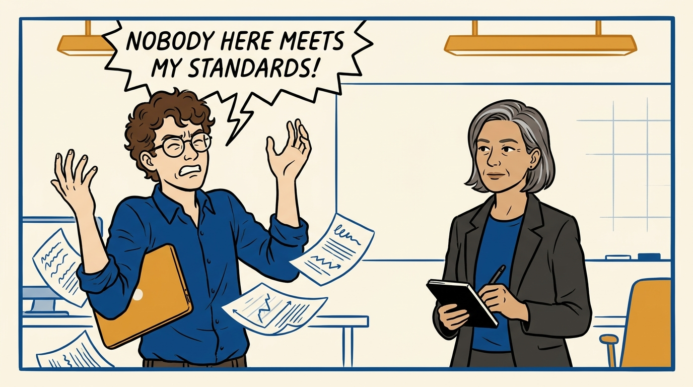
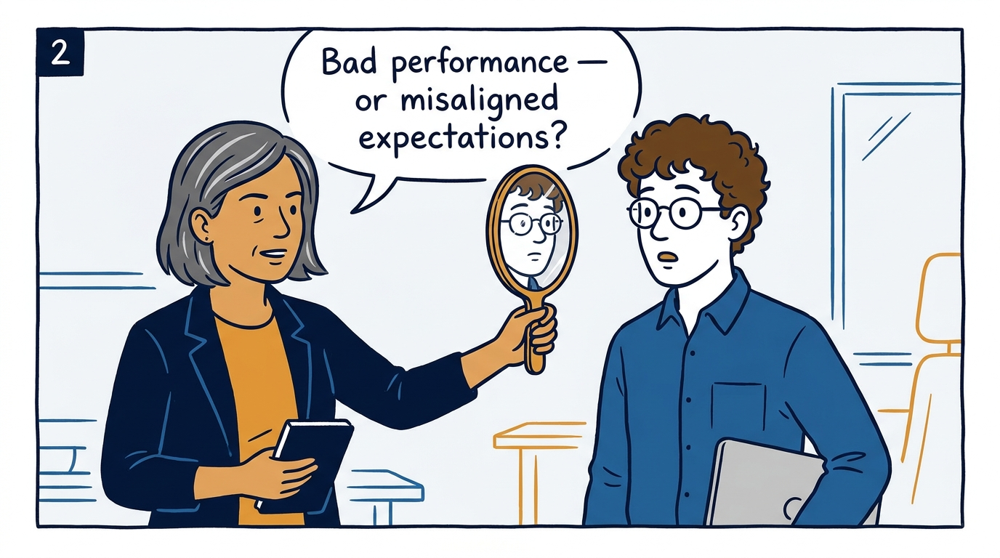
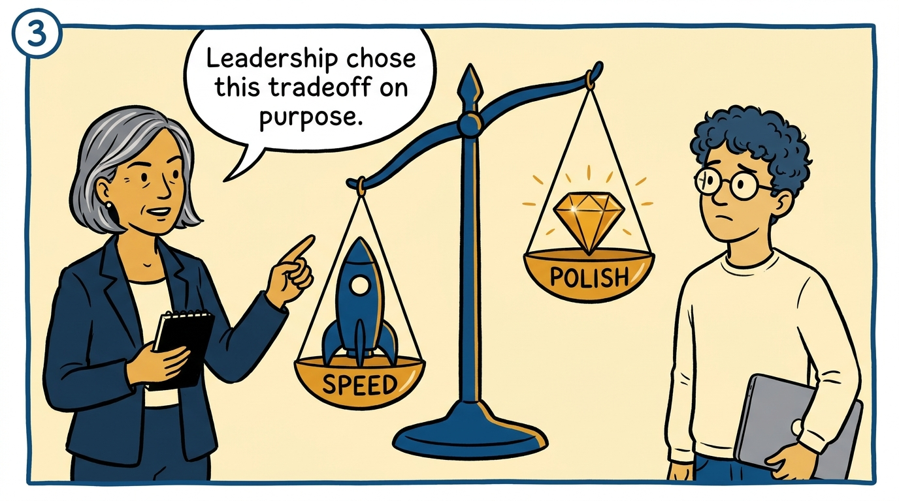
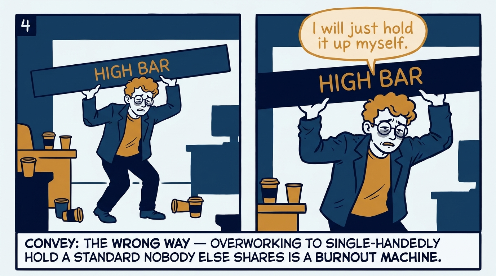
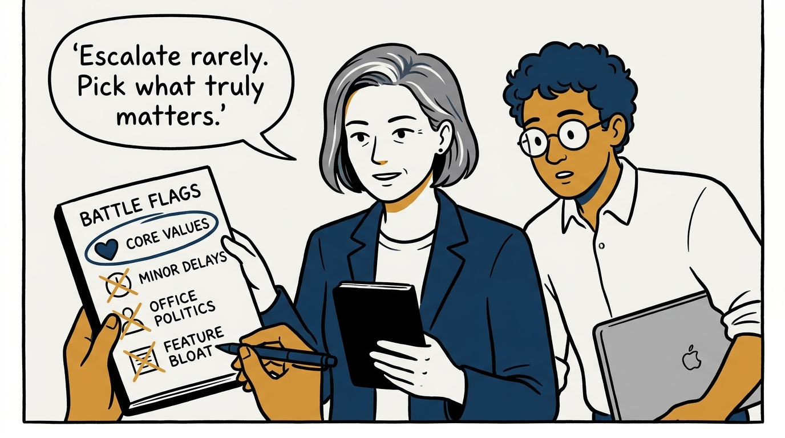
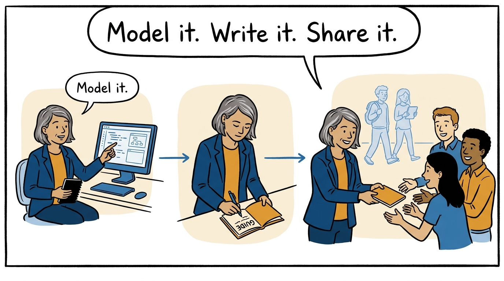
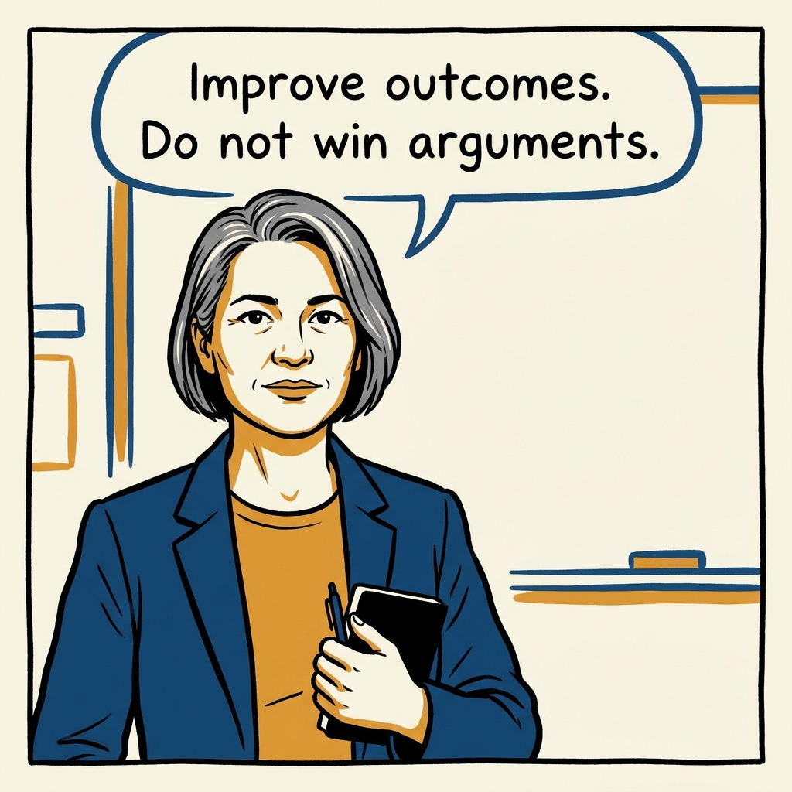

Why misaligned standards are an alignment problem to diagnose, not a battle to win — in seven panels.

<!-- comic-style
{
  "cast": "VERA: a calm, seasoned engineering executive, short gray-streaked hair, dark blazer over a plain t-shirt, carries a small black notebook. LEO: an eager young engineering manager, curly hair, round glasses, laptop under one arm.",
  "style": "Clean two-tone explainer comic, thick ink outlines, flat colors with deep blue and amber accents on a light background, generous white space, hand-lettered speech bubbles with SHORT readable text, no photorealism."
}
-->

**Panel 1:** *The hook: frustration that everyone else is below the bar.*

**Panel 2:** *The reframe: audit first — check whose expectations are miscalibrated.*

**Panel 3:** *The diagnosis: most gaps are deliberate tradeoffs leadership already accepted.*

**Panel 4:** *The wrong way: quietly absorbing the gap until burnout.*

**Panel 5:** *The discipline: choose the few battles that matter, let the rest go.*

**Panel 6:** *The principle: raise standards by model, document, share — never by decree.*

**Panel 7:** *The closer: the goal is better outcomes, not won arguments.*
