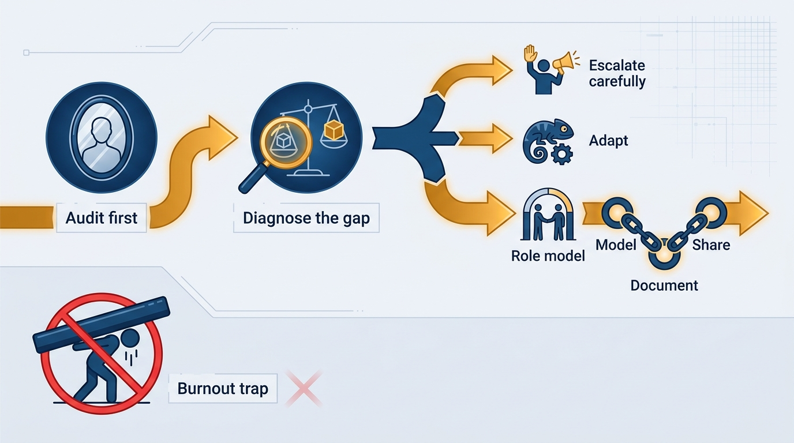
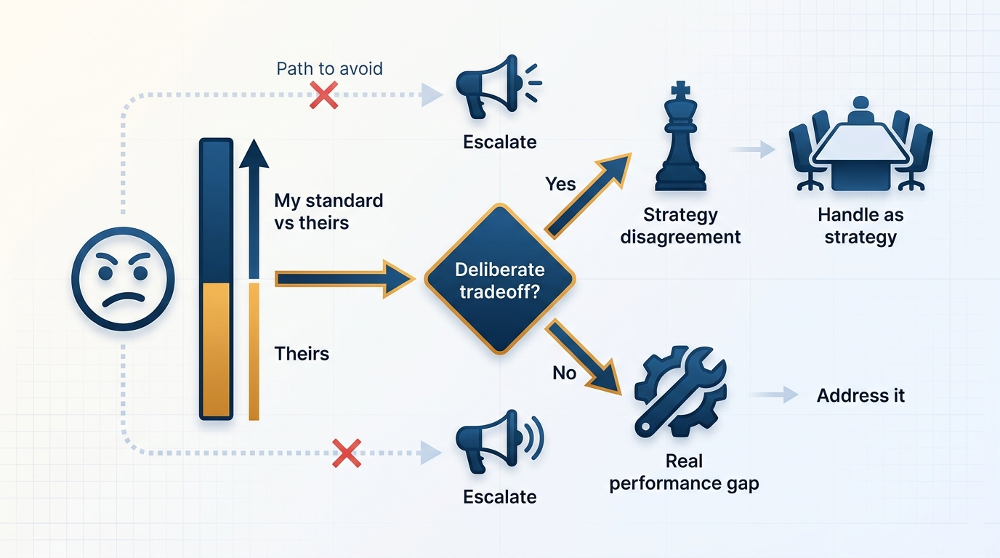
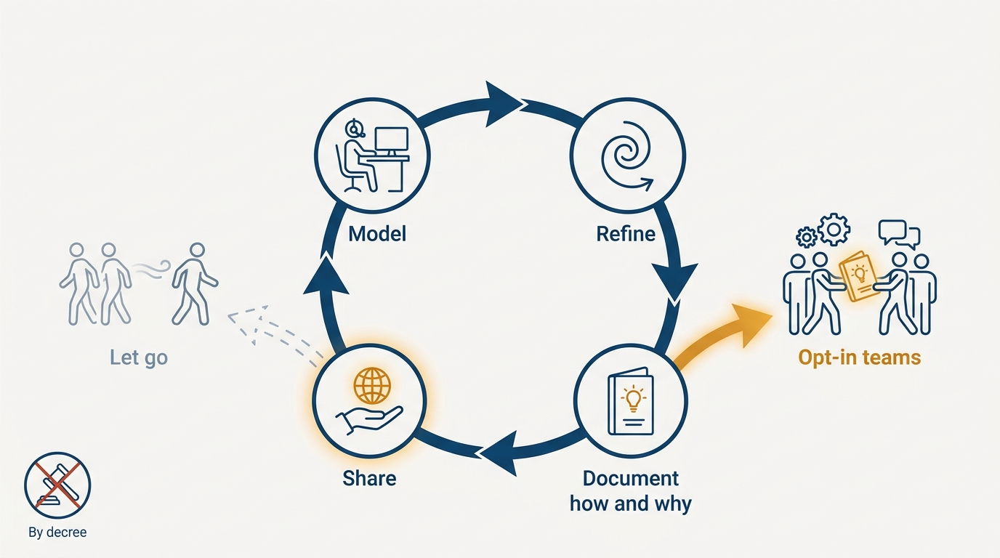

> **Status**: DRAFT
>
> **Principle**: I calibrate my standards against what the organization actually supports before I fight for them. Misaligned standards are an alignment problem to diagnose, not a performance problem to win: much of what feels like others underperforming is a deliberate tradeoff leadership has already accepted. I escalate carefully and only when it matters, I refuse to burn out compensating for constraints that will not change, and where I want the bar raised, I raise it by role modeling — model the approach, document it, share it with teams that opt in — rather than by force.

## Statement

My standards are mine; the organization's tolerances are the organization's. Keeping the two calibrated is my job, and it has a sequence:

- **Audit first.** Before acting on frustration, I ask whether I am consistently operating at a higher standard than my organization supports, whether I am overworking to maintain standards others don't share, and whether my frustration about performance is actually frustration about misaligned expectations.
- **Diagnose the gap.** A standard the organization doesn't meet is usually not incompetence — it is often a deliberate tradeoff (speed, cost, focus) that leadership knowingly tolerates. I check before I escalate.
- **Escalate carefully.** When I do raise an issue, I frame it as impact-driven rather than personal criticism, I distinguish ethical obligation from frustration, I accept that pushing too hard can label me as "difficult," and I prepare for slow change rather than immediate resolution.
- **Refuse the burnout trap.** I do not compensate indefinitely for a peer's underperformance that management is unwilling to address, and I do not grind against constraints that realistically won't change. I choose the battles that matter most.
- **Raise the bar by role modeling, not force.** Where I want a higher standard, I model it visibly, refine it until it works, write a practical guide that explains how *and* why, share it with interested teams — and let go of the teams that don't engage.
- **Adapt when necessary.** Some seasons reward flexibility over rigidity; some lessons are not worth learning and some penalties not worth paying.

**Figure 1:** *The calibration sequence: audit, diagnose, then act — and never via the burnout trap.*

## How to Read This

This record is for my leadership team, so they understand how I choose battles and why I do not fight every one — and for future me, when frustration next masquerades as principle. It is a vision of how I operate, not a quality manifesto or a performance-management guide. The working checklist — the self-audit questions, the misalignment diagnosis, the model–document–share sequence, the final alignment check — lives in the **Checklist** tab of this post.

## Rationale

**Frustration about performance is often frustration about misaligned expectations.** When I am the only person upset about a standard, the most likely explanation is not that everyone else is wrong — it is that leadership has knowingly accepted a tradeoff I have not. Diagnosing that first turns an emotional grievance into an answerable question: is this a deliberate choice, and if so, do I disagree with the *strategy*, not the execution? Escalating a performance issue that leadership sees as acceptable is really an attempt to hold the CEO accountable for a known, deprioritized issue — which is a strategy disagreement wearing a quality costume, and should be handled as one, per [[working-with-your-ceo-peers-and-engineering]].

**Figure 2:** *Diagnose before escalating: a knowingly accepted tradeoff is a strategy question, not a performance problem.*

**Compensating for unshared standards is a burnout machine.** Overworking to single-handedly hold a bar nobody else is held to does not raise the organization's standard — it hides the gap, exhausts me, and postpones the honest conversation. The question is never only "is this standard right?" but "is the penalty for lowering my standard here actually acceptable?" Often it is. This is [[managing-energy]] applied to quality: energy spent grinding against immovable constraints is energy stolen from battles I could actually win.

**Role modeling outperforms escalation and force.** Force produces compliance that evaporates when attention moves on; escalation spends relationship capital and often changes nothing. What durably raises a standard is demonstrating a better approach visibly and consistently, refining it until it works, documenting it so it explains how and why — evaluating outcomes rather than assuming superiority — and sharing it with teams that opt in. The teams that engage become the proof; the teams that don't are let go of, not besieged. Adoption by evidence survives; adoption by decree does not.

**Figure 3:** *Raising the bar by evidence: model, refine, document, share — and let go of teams that do not engage.*

**Winning arguments is not the goal.** The final check on any standards battle is whether I am improving outcomes or just winning arguments, and whether I am preserving relationships while maintaining integrity. A won argument that erodes a relationship and changes no outcome is a loss.

## What This Means in Practice

| What this principle says | What it does **not** say |
| --- | --- |
| Diagnose whether a gap is a deliberate tradeoff before escalating. | Never escalate — ethical obligations still get raised, carefully. |
| Accept that leadership may knowingly tolerate a lower standard. | Abandon my standards — I keep them, and choose where to apply them. |
| Raise standards through model–document–share. | Force adoption on teams that don't engage — I let go of those. |
| Refuse to overwork compensating for unshared standards. | Stop caring about quality — I stop *subsidizing* misalignment, not caring. |
| Adapt when the season rewards flexibility. | Standards are relative and nothing is worth fighting for — some penalties are worth paying. |

## Anti-Patterns

- **Overworking to hold a standard nobody else shares.** Quietly absorbing the gap between my bar and the organization's — nights, weekends, heroics — until burnout arrives and the standard collapses anyway.
- **Escalating a deliberate tradeoff to the CEO as a performance problem.** Trying to hold the CEO accountable for an issue leadership has knowingly deprioritized, then being surprised when the escalation reads as not understanding the strategy.
- **Winning arguments instead of improving outcomes.** Measuring success by debates won and points conceded, while the actual outcomes — and the relationships needed to change them — deteriorate.
- **Standards by decree.** Mandating a higher bar without modeling it, documenting it, or proving it works, and mistaking the resulting compliance theater for adoption.
- **Grinding against immovable constraints.** Treating every organizational tolerance as a battle to fight, rather than choosing the few that matter most and adapting on the rest.
- **The lesson not worth learning.** Clinging to a standard whose enforcement costs more — in energy, relationships, and focus — than the standard ever returns.

## Related Records

- [[inspected-trust]] — how I verify the organization's work against standards; this record calibrates the standards themselves against what the organization supports.
- [[organizational-values]] — the values the organization commits to collectively; this record covers my personal bar where it exceeds or diverges from them.
- [[working-with-your-ceo-peers-and-engineering]] — careful escalation and company-first framing when a standards gap turns out to be a strategy disagreement.
- [[managing-energy]] — the burnout trap this record refuses is an energy-management failure in quality clothing.
- [[leadership-styles]] — role modeling is one deliberate style among several; this record explains when I reach for it.

## Scope and Revisiting

This principle governs how I handle every gap between my personal standards and the organization's tolerances — technical, operational, and behavioral. I revisit it whenever I notice sustained frustration (the audit trigger), when a role-modeled approach fails to spread (evidence the approach, not the audience, may be wrong), and at each change of role or company, when the tolerances reset and the calibration must start over.

## Authoritative References

- Will Larson, *The Engineering Executive's Primer* (O'Reilly, 2024) — the "Calibrating Your Standards" chapter this record's checklist distills; the principle above is my operating commitment to it.
