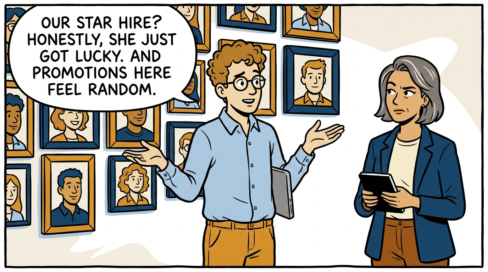
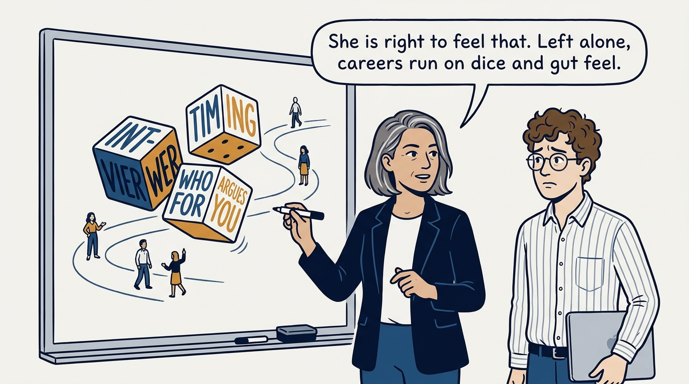
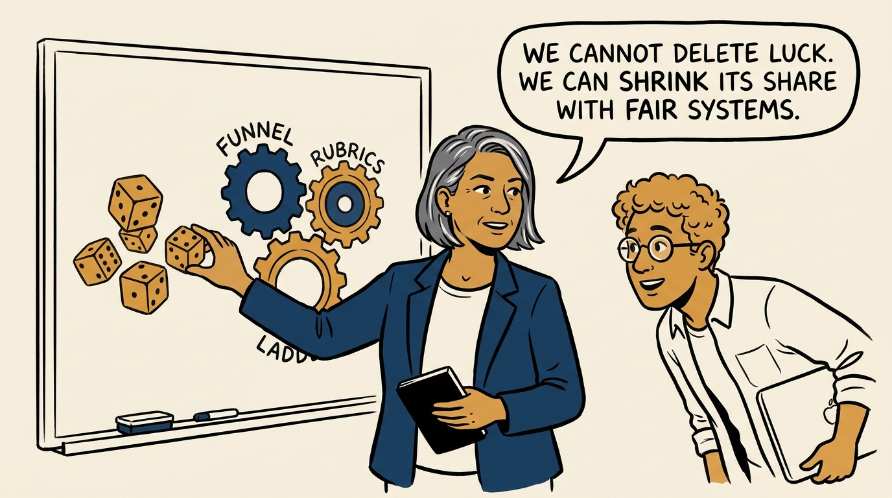
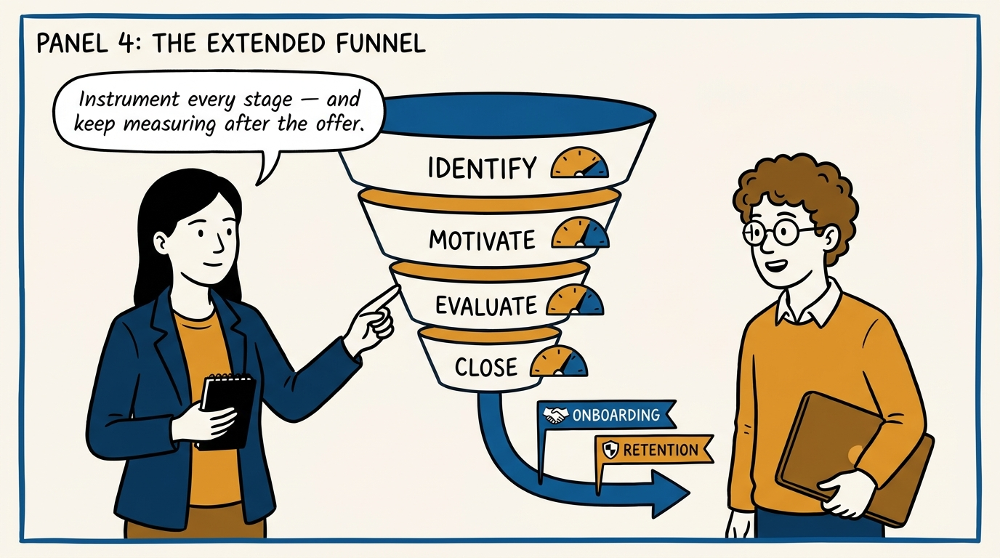
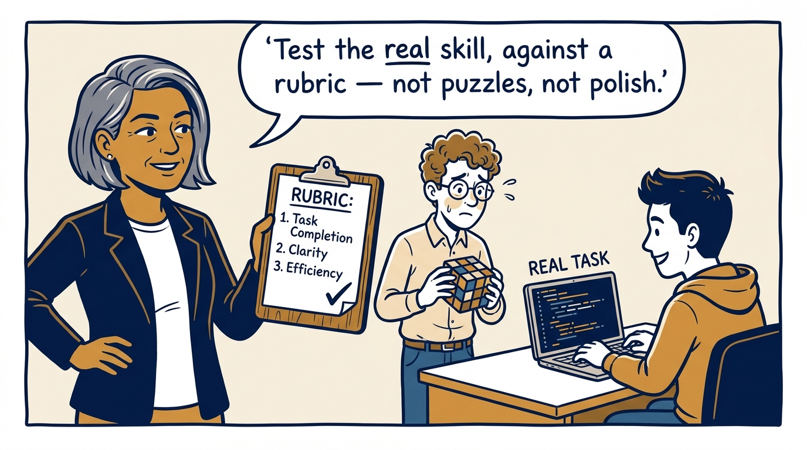
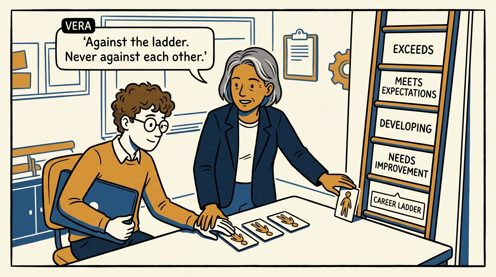
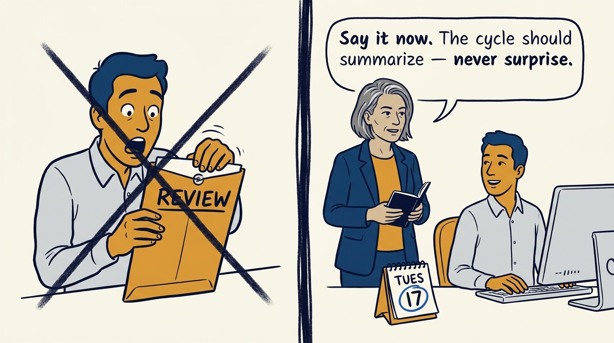
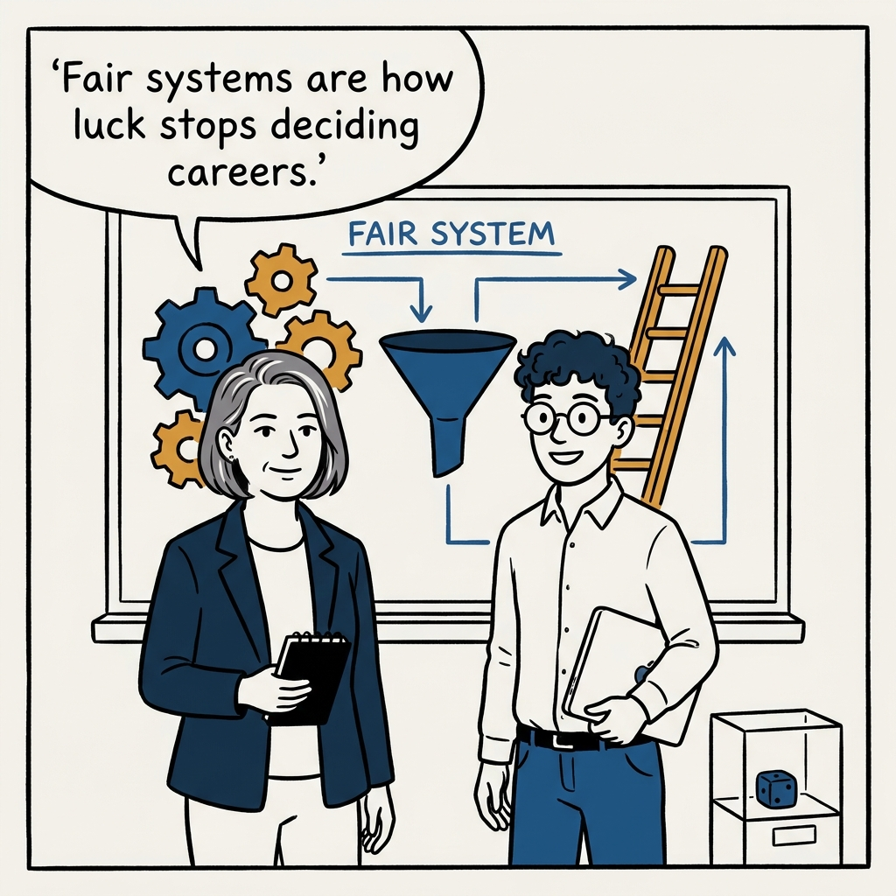

How fair systems — funnels, rubrics, and ladders — take luck out of the driver's seat of careers, in eight panels.

<!-- comic-style
{
  "cast": "VERA: a calm, seasoned engineering executive, short gray-streaked hair, dark blazer over a plain t-shirt, carries a small black notebook. LEO: an eager young engineering manager, curly hair, round glasses, laptop under one arm.",
  "style": "Clean two-tone explainer comic, thick ink outlines, flat colors with deep blue and amber accents on a light background, generous white space, hand-lettered speech bubbles with SHORT readable text, no photorealism."
}
-->

**Panel 1:** *The hook: when hiring and promotion look like luck, something is wrong.*

**Panel 2:** *The problem: left alone, careers are decided by noise, not work.*

**Panel 3:** *The principle: fair systems steadily shrink luck's share of career outcomes.*

**Panel 4:** *The funnel: identify, motivate, evaluate, close — measured at every stage, and past the offer.*

**Panel 5:** *The loops: realistic work samples scored against rubrics — never polish by accident.*

**Panel 6:** *Calibration: performance is measured against the ladder's expectations, never as a ranking of people.*

**Panel 7:** *Feedback: delivered immediately — a performance cycle is a summary, not an ambush.*

**Panel 8:** *The closer: fair systems are how luck stops deciding careers.*
