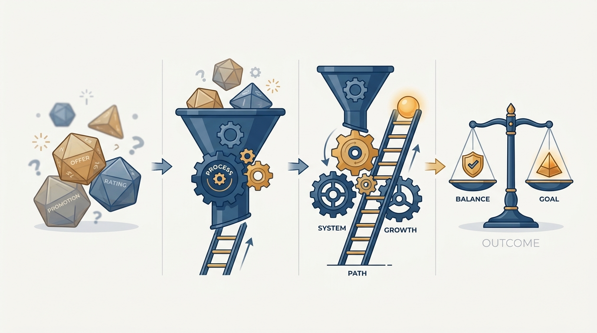
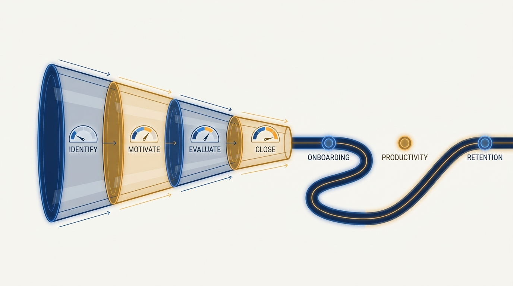
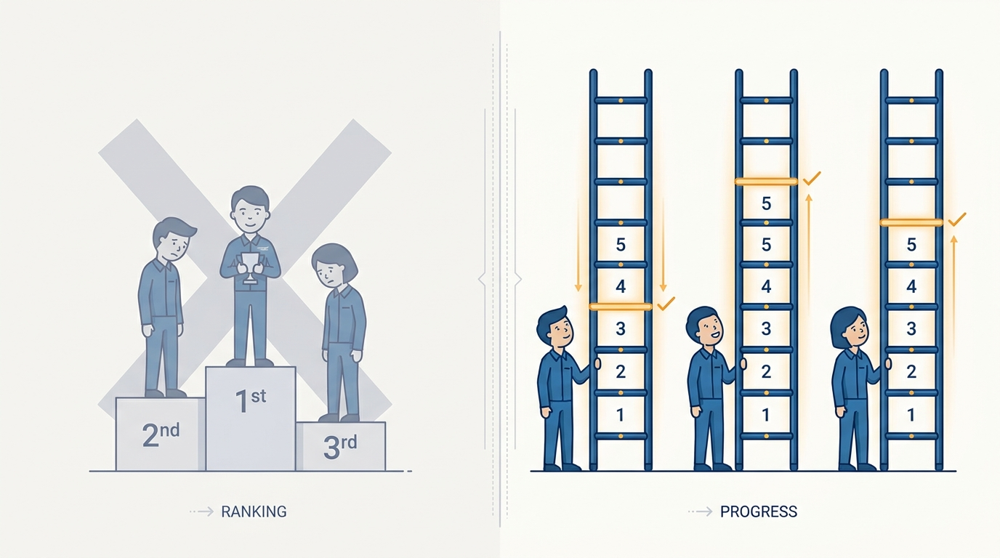

> **Status**: DRAFT
>
> **Principle**: Careers run on luck more than we admit, so I build systems that reduce luck's share: humane, instrumented hiring funnels; interview loops that test real skills against explicit rubrics; cold sourcing that reaches beyond homogeneous networks; career ladders with crisp level boundaries; and calibration that compares people against expectations rather than against each other. The systems stay simple enough to understand, and they never replace immediate feedback — a performance cycle is a summary, not a surprise.

## Statement

Careers in my organization should be decided by the work, not by who happened to interview someone, which manager argued well in calibration, or which quarter a project landed. Luck cannot be eliminated, but its share can be shrunk. My operating model has four parts:

- **An instrumented hiring funnel.** Hiring is identify → motivate → evaluate → close, and each stage is measured: conversion rates, source quality, drop-off points, interviewer load, offer acceptance, candidate experience. The funnel extends past the offer — onboarding success, time to productivity, impact, promotion timing, retention — because hiring is part of the organization's lifecycle, not just recruiting.
- **Humane, designed interview loops.** Every interview knows what signal it checks and uses a format that actually reveals it — realistic work samples over artificial puzzles. Interviewers write feedback independently before group discussion, new interviewers pair with experienced ones, and kindness to candidates is a design requirement, not a nice-to-have.
- **Ladders with crisp boundaries.** Career ladders are self-contained and short, with clearly defined levels, so people can self-assess against them. Few ladders, created only when enough people justify them.
- **Calibration against the ladder, not against each other.** Designations state performance against expectations. Calibration is a quest for consistency: participants read the reviews rather than watch presentations, distributions are studied but never forced into a curve, and calibrators need psychological safety to do honest work.

**Figure 1:** *The thesis: luck cannot be eliminated from careers, but fair systems steadily shrink its share.*

## How to Read This

This is an **appendix record**: grounded not in *The Engineering Executive's Primer* like this journal's core records, but in Will Larson's earlier, manager-focused book *An Elegant Puzzle* — read here through an executive lens. The book addresses the manager running these systems; I read it as the executive who owns their design and fairness, even where managers operate them daily.

The boundary with [[hiring]] matters: that record covers my *role* in hiring as an executive — where I personally engage, what I delegate, how I keep hiring an executive priority. This record covers the *systems underneath*: the funnel, the loops, the ladders, the designations, and the calibration machinery that make careers fair regardless of who is watching. The working checklist lives in the **Checklist** tab of this post.

## Rationale

**Luck is the default allocator; fairness has to be built.** Left alone, careers are decided by noise. Every fair process I build — a rubric, a ladder, a calibration norm — transfers some of luck's share back to the work itself. Growth follows the same logic: it comes from navigating change, not from tenure, so I map years into eras and transitions and never assume company growth automatically creates personal growth.

**Unmeasured funnels hide their failures.** Without instrumentation, hiring debates run on anecdote: the loudest recent story wins. With conversion rates, source quality, drop-off points, and offer-acceptance data, the funnel tells me where to improve first. And it must extend past the offer — a loop that produces hires who onboard slowly, plateau, and leave is a failing loop, whatever its acceptance rate says.

**Referral networks reproduce themselves.** Referrals are limited by network size and skewed by network homogeneity — hiring only through them means hiring people who look like the people we already have. Cold sourcing is the deliberate counterweight: a small, consistent weekly investment, tracked like any other source, in close partnership with recruiters.

**Figure 2:** *The instrumented funnel: identify → motivate → evaluate → close — and it does not end at the offer.*

**Interviews measure what they test, not what we hope.** An undesigned interview tests polish and confidence by accident. So loops start from funnel metrics, identify the skills that matter, design a test per skill with a rubric, and group tests into coherent interviews. Then the discipline: iterate interviews a little, rubrics a lot; review the funnel after 10–20 candidates; refresh annually; use hiring committees to detect patterns and keep the loop fair. Independent written feedback before group discussion keeps eight opinions from collapsing into one loud one.

**Comparing people to each other corrupts everything downstream.** The moment designations become a ranking of people, calibration becomes a courtroom and managers become advocates. Comparing against the ladder keeps the question answerable — did this work meet these written expectations? — and makes the classic failure modes visible: designation momentum, tit-for-tat favoritism, level drift, crisis- or retention-driven designations handed out under pressure.

**A cycle must never be the first time someone hears it.** Cycles summarize; they do not inform. Weak-performance feedback is given immediately, when it can still change the outcome. A designation that surprises its recipient is a management failure.

## What This Means in Practice

| What this principle says | What it does **not** say |
| --- | --- |
| Fair process shrinks luck's share of career outcomes. | Process eliminates luck. It cannot; it can only reduce it. |
| Every interview knows its signal and has a rubric. | Interviews become mechanical. Kindness and genuine interest are design requirements. |
| People are measured against a written ladder. | People are ranked against each other. Never. |
| Distributions are studied in calibration. | A curve is forced. It is not. |
| Weak-performance feedback is immediate. | Cycles are pointless. They summarize and make the system consistent. |
| Specialized roles are possible. | They are cheap. They need a sponsor, a mission, a ladder, and dedicated calibration from day one. |

Two practices deserve emphasis. First, **the system stays simple**: ladders self-contained and short, few of them, a stable cycle cadence, the whole apparatus understandable by the people it evaluates — a performance system nobody can explain is a fairness risk in itself. Second, **specialized roles are created reluctantly**: only for a real problem an existing ladder cannot absorb, with eyes open to class-system dynamics, brittle design, and task offloading, and with the success requirements secured up front — sponsor, self-sustaining mission, ladder from day one, role models, dedicated calibration.

**Figure 3:** *Calibration done right: against the ladder's written expectations, never against each other.*

## Anti-Patterns

- **The unexplainable system.** A performance apparatus so intricate that employees cannot predict how their work maps to outcomes — complexity is where bias hides.
- **Stack ranking by another name.** Any calibration habit that quietly turns "against expectations" into "against each other," including forced curves.
- **The heroic gut-feel interview.** Interviewers freestyle, test polish by accident, and discover in the debrief that nobody checked the core skill.
- **Feedback groupthink.** Group discussion before independent written feedback — the loudest voice becomes the loop's only signal.
- **Referral monoculture.** Treating a homogeneous referral stream as a healthy pipeline because it is cheap.
- **The cycle-time ambush.** Saving weak-performance feedback for the formal cycle, then presenting the accumulated case as a verdict.
- **Designation momentum.** Last cycle's rating silently becoming this cycle's starting point, in either direction.
- **The casual specialized role.** A niche role created to solve a staffing headache, with no sponsor, no ladder, and no calibration home — a career dead end in the making.

## Related Records

- [[hiring]] — my role in hiring as an executive; this record is the systems underneath it.
- [[engineering-onboarding]] — the extended funnel's first segment: onboarding success and time to productivity.
- [[calibrating-your-standards]] — how I calibrate my own standards; this record is how the organization calibrates its designations.
- [[measuring-engineering-organizations]] — the measurement discipline the instrumented funnel belongs to.
- [[organizational-design]] — appendix sibling: the structures these careers grow inside.
- [[engineering-culture]] — appendix sibling: the culture that makes fair process credible.

## Scope and Revisiting

This principle governs the career, hiring, and performance systems of my organization — the parts managers run daily and I own structurally. I revisit it when the instrumentation shows the funnel degrading, when a calibration cycle produces surprises or visible favoritism, at annual interview-loop refreshes, and whenever the organization's size changes enough that ladders, levels, or cycle cadence stop fitting.

## Authoritative References

- Will Larson, *An Elegant Puzzle: Systems of Engineering Management* (Stripe Press, 2019) — the careers, hiring, and performance-management material this record distills.
- Many of the book's chapters began as freely available essays on [lethain.com](https://lethain.com/), where the underlying arguments can still be read.
