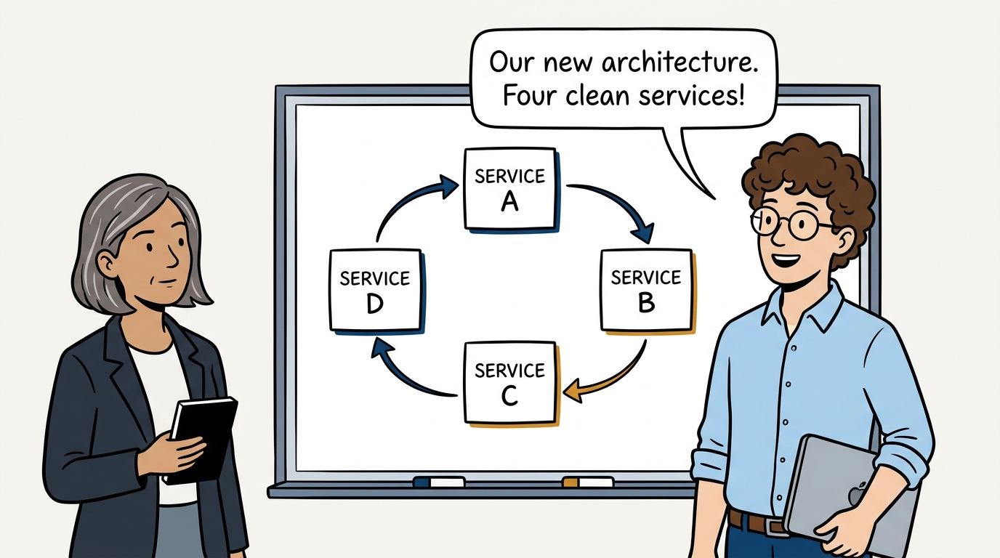
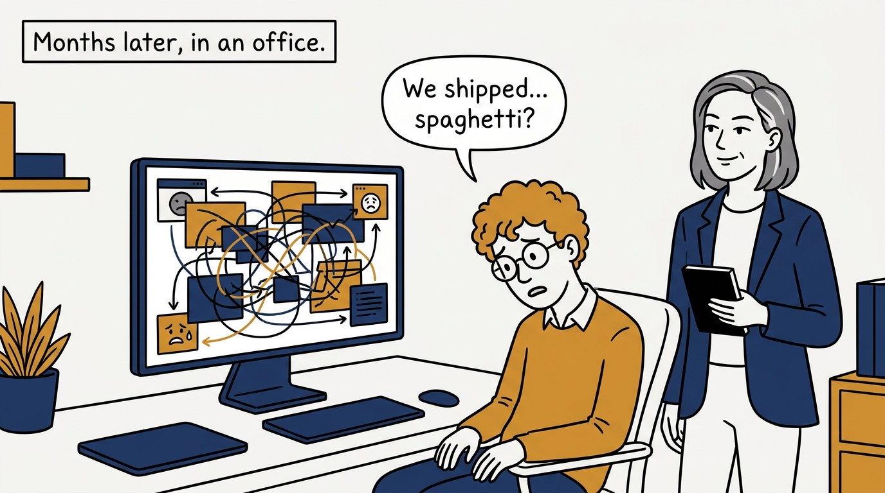
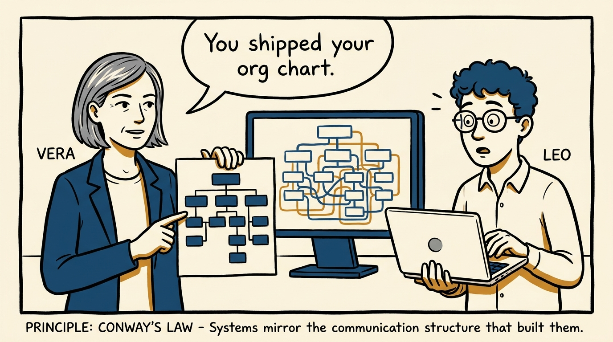
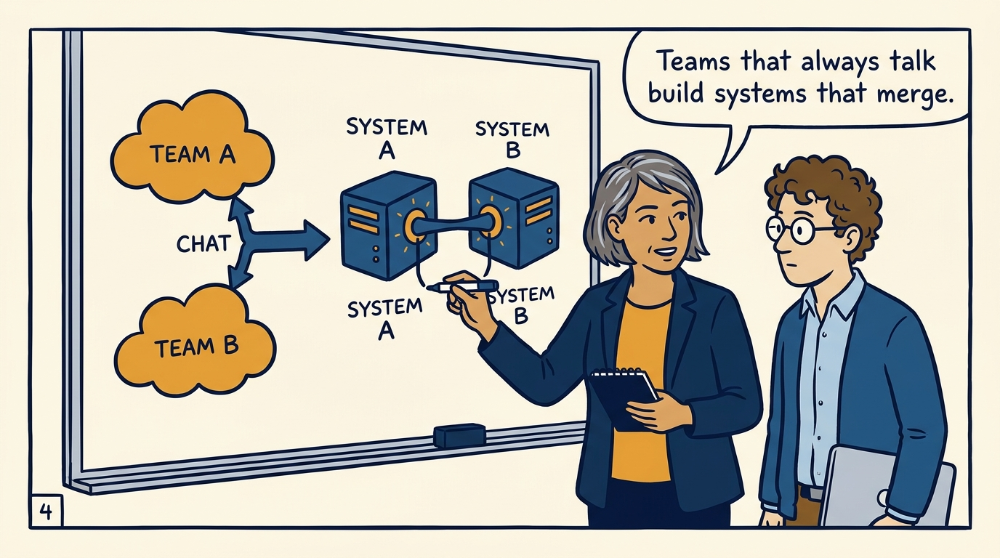
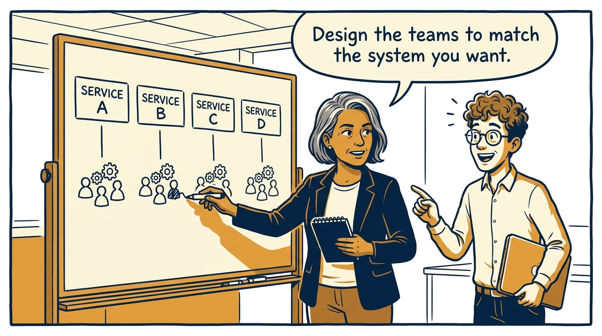
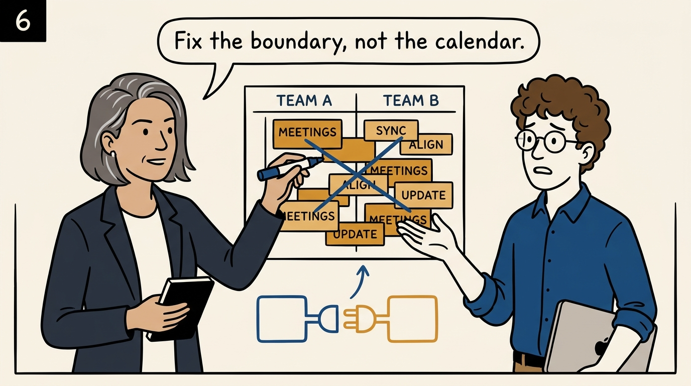
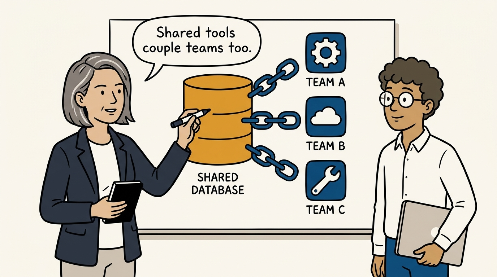
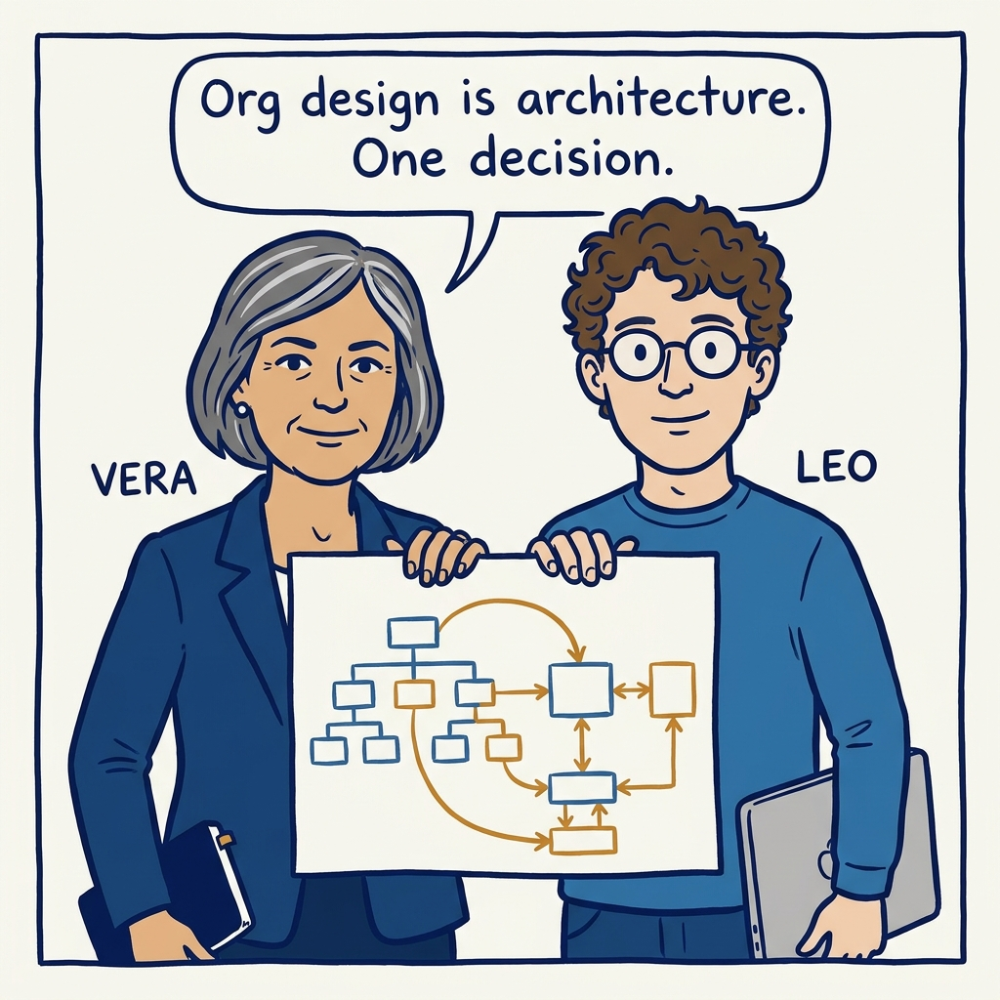

You ship your org chart — Conway's law and the reverse maneuver, in eight panels.

<!-- comic-style
{
  "cast": "VERA: a calm, seasoned engineering executive, short gray-streaked hair, dark blazer over a plain t-shirt, carries a small black notebook. LEO: an eager young engineering manager, curly hair, round glasses, laptop under one arm.",
  "style": "Clean two-tone explainer comic, thick ink outlines, flat colors with deep blue and amber accents on a light background, generous white space, hand-lettered speech bubbles with SHORT readable text, no photorealism."
}
-->

**Panel 1:** *The hook: a clean four-service architecture, designed on a whiteboard.*

**Panel 2:** *The problem: the shipped system ignored the whiteboard.*

**Panel 3:** *The principle: Conway's law — the system mirrors the organization that built it.*

**Panel 4:** *How it works: every standing communication path becomes a seam — or a weld — in the system.*

**Panel 5:** *The maneuver: reverse Conway — reshape the teams, and the architecture follows.*

**Panel 6:** *The reframe: constant coordination is a design smell — a better boundary beats another meeting.*

**Panel 7:** *The hidden lever: shared databases and tools are communication structures — Conway's law applies to them too.*

**Panel 8:** *The closer: org design is your most powerful architectural decision — make it on purpose.*
