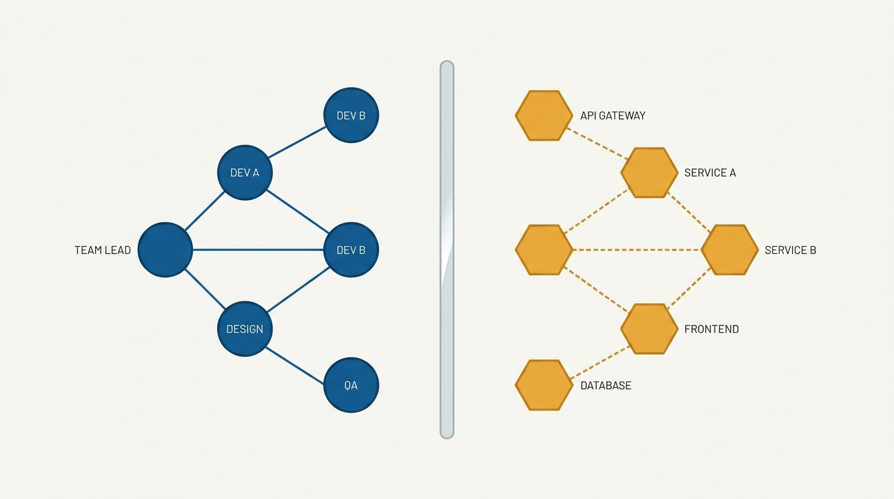
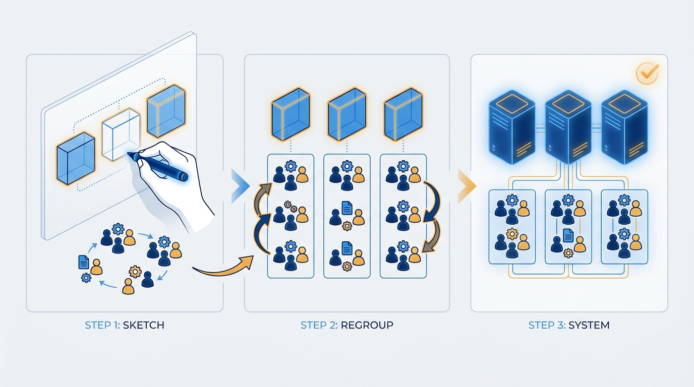

> **Status**: DRAFT
>
> **Principle**: I treat organizational design as my most powerful architectural decision. Systems mirror the communication structures that build them, so I harness the force instead of fighting it: I clarify the architecture we actually want, then shape team boundaries to produce it — the reverse Conway maneuver. I treat unnecessary cross-team communication as a design smell rather than a virtue, involve technical leaders in every team-structure decision, and read tool choices and shared services as architecture in disguise.

## Statement

My operating model for Conway's law has five parts:

- **Architecture first, org chart second.** We define the architecture we actually want — designed for fast flow of change, not just technical elegance. Team design and software design are one decision, made together.
- **Audit the force before it audits you.** I regularly ask whether our current structure could even produce the architecture we want — and the sharper version: *is there a better design unavailable to us because of our organization?*
- **Run the reverse Conway maneuver.** When structure and target architecture disagree, I change the structure. Teams are arranged around business capabilities, own their part of the system, and deliver from design through deployment with minimal handoffs.
- **Treat communication as expensive bandwidth.** Teams should talk because of real dependencies, not because poor boundaries force them to. When two teams must constantly coordinate, I fix the API or the boundary before I schedule another sync.
- **Read tools as architecture.** Shared teams, databases, and tools are coupling forces. Shared tooling belongs where collaboration is actually needed; separate tools where boundaries should be clean.

**Figure 1:** *Conway's law: the system you ship mirrors the communication structure that built it — same shape on both sides of the mirror.*

## How to Read This

This is an **appendix record**: unlike the core records in this journal, grounded in Will Larson's *The Engineering Executive's Primer*, this one is grounded in Matthew Skelton and Manuel Pais's *Team Topologies* — read here through an executive lens, complementing the Primer-grounded records. I read the book as the executive who signs off on both the org chart and the architecture, and therefore cannot pretend they are separate documents. If you work in my organization, this record explains why reorg proposals get architectural review and why I ask "which teams will have to talk for this to ship?" before approving a system design. The working checklist — all nine sections — lives in the **Checklist** tab of this post.

## Rationale

**The force is real whether or not I acknowledge it.** Organizations produce designs that copy their communication structures: if the teams owning two components barely talk, the interface between them will be wrong; if one team owns both halves, they will merge. Every org chart I approve is therefore an architecture diagram in draft form. Ignoring the force does not neutralize it — it hands the architectural decision to whoever last drew the reporting lines.

**Since the force is inevitable, I point it at the target.** The naive reading of Conway's law is fatalistic: we will ship our org chart, so be it. The executive reading is the reverse Conway maneuver: decide the architecture we want, then shape team boundaries so that the natural, low-friction thing to build *is* that architecture. This is why technical leaders belong in every team-structure conversation, and why boundaries drawn by budget or politics are architectural malpractice — still architecture, just accidental.

**Figure 2:** *The reverse Conway maneuver: design the team structure first, so the architecture you want is the one the organization naturally produces.*

**Fast flow needs bounded teams, not busy channels.** The point of the maneuver is flow: clear, bounded responsibility per team; components loosely coupled and highly cohesive; version expectations and cross-team testing explicit; changes shipped safely without excessive coordination. Every handoff and mandatory sync is latency built into the org chart. Centralized specialist teams are queues every dependent team must stand in, so I reduce reliance on them wherever a stream-aligned team can own the capability directly.

**Unnecessary communication is a symptom, not a KPI.** Most organizations celebrate communication — more meetings, more channels, more alignment. I read it differently: if two teams designed to be independent are in constant contact, the boundary between them is wrong. The fix is rarely a coordination forum; it is a better API, a platform, or a redrawn boundary that removes the need to coordinate. Well-defined paths between the *right* teams are deliberate design; everything else is accidental chatter coupling the systems underneath it.

**Figure 3:** *Communication as expensive bandwidth: a few deliberate, load-bearing lines beat a web of accidental chatter — the chatter couples the systems underneath it.*

**Tools draw boundaries whether we notice or not.** A shared ticketing system, database, or deployment pipeline is a communication structure, and Conway's law applies to it. Shared tools belong where teams genuinely collaborate; separate tools where boundaries should be crisp. When a tool forces unrelated teams to interact, it is quietly redesigning my architecture. The same lens applies to visibility: teams need the operational information they depend on, behind security controls that protect without blinding.

**The law can be over-applied.** Naive uses do damage too: fragmenting into many small component teams (maximizing handoffs), creating complicated-subsystem teams where no deep expertise is required, or dressing up a headcount cut or a fiefdom as a "Conway-aligned reorg." Every reorganization gets evaluated for its impact on delivery, architecture, and team cognitive load — not just the reporting lines it tidies.

## What This Means in Practice

| What this principle says | What it does **not** say |
| --- | --- |
| Org design and architecture are one decision, made together. | The org chart dictates everything; architects are redundant. |
| Change the team structure to get the architecture you want. | Reorganize often; churn is fine as long as it is "Conway-aligned". |
| Unnecessary cross-team communication is a design smell. | Teams should not talk to each other. |
| Reduce reliance on centralized specialist teams where possible. | All shared and platform teams are dissolved on sight. |
| Tool choices are architectural decisions. | One tool policy fits every team. |
| Technical leaders sit in team-structure decisions. | Engineers draw the org chart alone; managers merely execute it. |

Concretely: no reorg is approved without an architectural impact assessment, and no target architecture without asking which team structure would naturally produce it. When delivery is slow, I look at dependency and communication patterns before individual performance. And a proposed new cross-team coordination meeting prompts one question first: what boundary failure is it compensating for?

## Anti-Patterns

- **Designing the system and the organization separately.** Two documents, two owners — and the org chart silently wins.
- **The accidental architecture.** Boundaries drawn by budget, politics, or history — then years wondering why the system is tangled the same way.
- **Communication as a virtue metric.** Celebrating cross-team meeting volume while the boundaries that made the meetings necessary go unexamined.
- **The shared-everything trap.** Shared teams, databases, and tools creating coupling nobody chose, defended because sharing sounds efficient.
- **Component-team confetti.** Many small component teams in Conway's name, maximizing handoffs and destroying flow.
- **The fiefdom reorg.** Reorganizations run to cut headcount or build empires, labeled as architecture work.
- **Managers without the lens.** Team-structure decisions made by people who do not realize they are architectural decisions.

## Related Records

- [[organizational-design]] — sizes and staffs the organization as a system; this record names the architectural force the structure exerts.
- [[engineering-strategy]] — the target architecture worth maneuvering toward comes from strategy, not taste.
- [[org-chart-problems]] — appendix sibling; why the reporting-lines view of the organization misleads.
- [[team-first-boundaries]] — appendix sibling; drawing the boundaries the maneuver needs, starting from cognitive load.
- [[four-fundamental-team-topologies]] — appendix sibling; the team types that make the maneuver concrete.

## Scope and Revisiting

This principle governs how I connect organizational structure to system architecture: reorgs, team-boundary changes, shared-service decisions, and tool standardization all pass through it. I revisit it whenever a significant architecture change or reorg is proposed, whenever delivery slows in ways that trace to cross-team dependencies, and whenever I catch an org-chart decision made without anyone asking what system it will produce.

## Authoritative References

- Matthew Skelton & Manuel Pais, *Team Topologies: Organizing Business and Technology Teams for Fast Flow* (IT Revolution Press, 2019) — the Conway's-law chapter this record's checklist distills.
- The authors maintain further material, patterns, and case studies at [teamtopologies.com](https://teamtopologies.com/).
