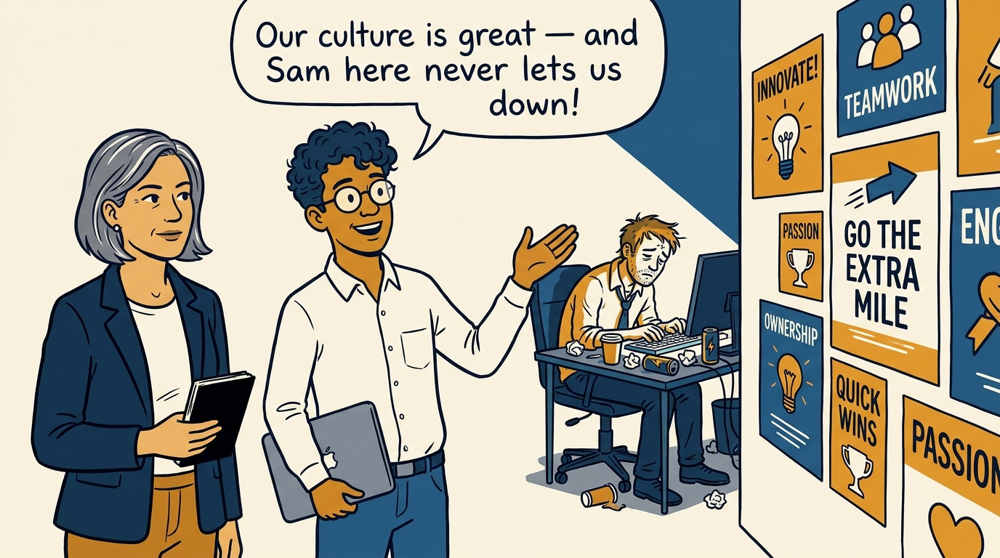
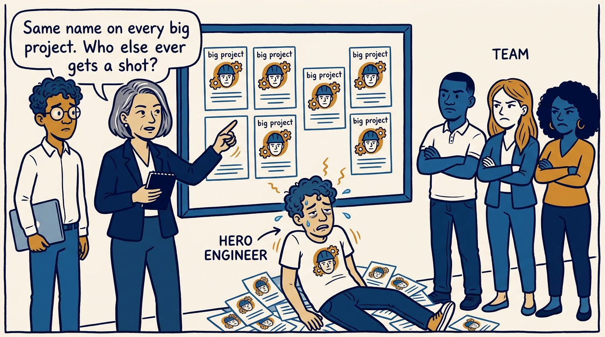
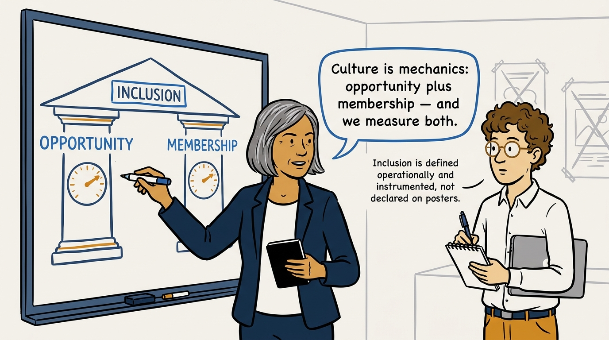
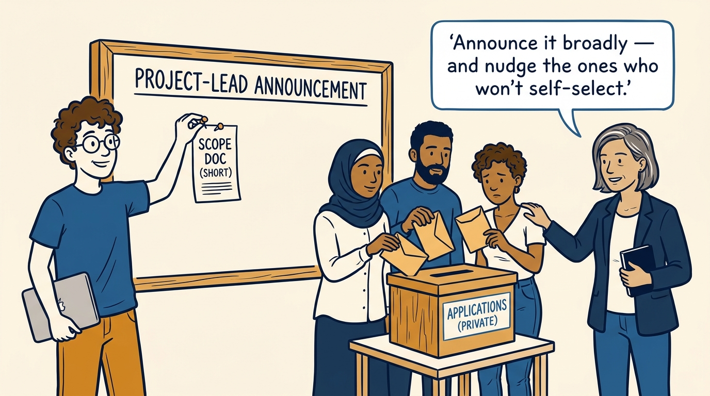
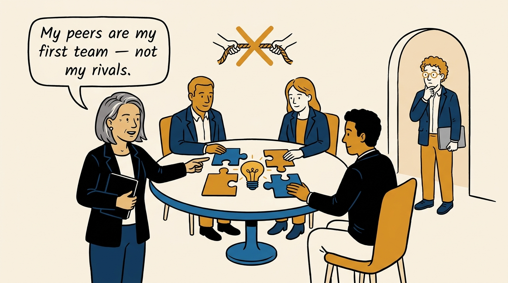
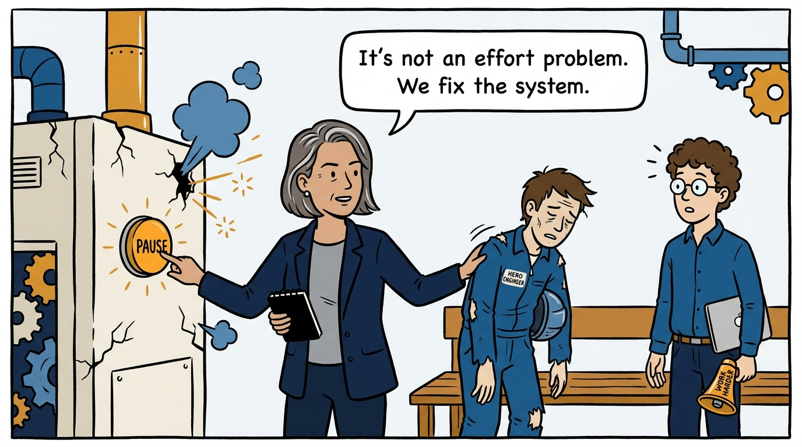
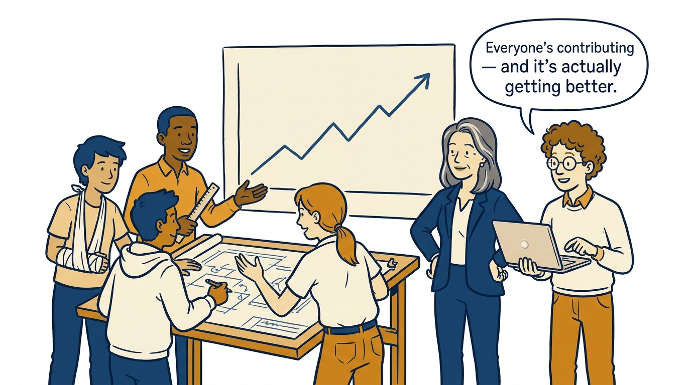
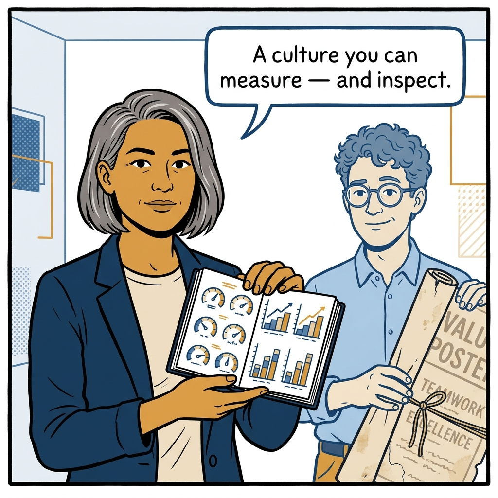

Culture is mechanics, not posters — why heroes get systems fixed instead of medals, in eight panels.

<!-- comic-style
{
  "cast": "VERA: a calm, seasoned engineering executive, short gray-streaked hair, dark blazer over a plain t-shirt, carries a small black notebook. LEO: an eager young engineering manager, curly hair, round glasses, laptop under one arm.",
  "style": "Clean two-tone explainer comic, thick ink outlines, flat colors with deep blue and amber accents on a light background, generous white space, hand-lettered speech bubbles with SHORT readable text, no photorealism."
}
-->

**Panel 1:** *The hook: great posters, one always-on hero — and Leo is proud of both.*

**Panel 2:** *The problem: every opportunity goes to the same few people — the hero burns out, the rest check out.*

**Panel 3:** *The principle: inclusion is opportunity plus membership — both built deliberately, both measured.*

**Panel 4:** *How it plays out: scope doc, broad announcement, private applications — and a personal nudge to those who hold back.*

**Panel 5:** *The identity shift: peers as the first team — collaboration at the top instead of a zero-sum contest.*

**Panel 6:** *Kill your heroes: stop doing it harder — pause the broken system and fix the design.*

**Panel 7:** *The reset pays off: a redesigned system the whole team can carry — improving one sprint at a time.*

**Panel 8:** *The closer: not a slogan — a culture you can measure and inspect.*
