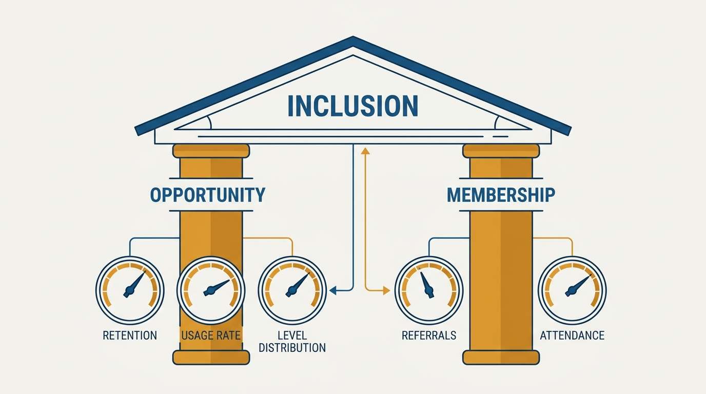
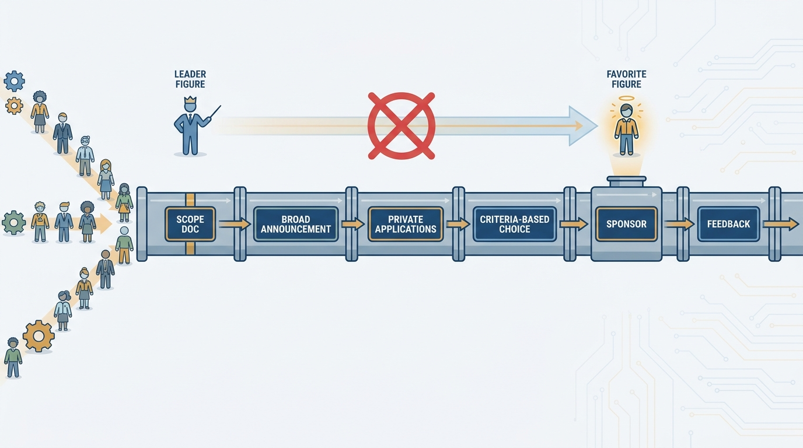
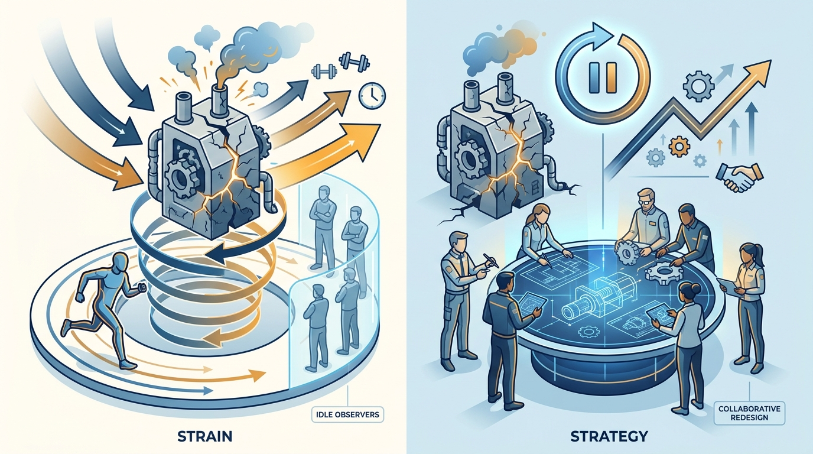

> **Status**: DRAFT
>
> **Principle**: I build culture through mechanics, not slogans. Inclusion is access to opportunity and to membership, and I measure both. Important people decisions run on rubrics and structured processes, respected even when inconvenient. My peers are my first team. Company freedoms are managed deliberately, not imported from other contexts. And hero culture is a system-design failure I reset — not a work ethic I reward.

## Statement

Culture is not what I say in all-hands; it is what my organization's mechanics reward, measure, and tolerate. My operating model has five parts:

- **Inclusion is opportunity plus membership.** Everyone gets access to *opportunity* — professional success and development — and to *membership* — participating as a version of themselves they are comfortable with. Both are built deliberately and both are measured.
- **Important people decisions run on structure.** Promotions, hiring, performance designations, management transitions, project-lead selection, and senior-role fills all use rubrics and structured processes — respected even when inconvenient.
- **Peers are my first team.** My identity shifts from "my team" to "my peer team" — and I ask the same shift of my leadership bench.
- **Freedoms are managed deliberately.** Every positive freedom can reduce a negative freedom, and vice versa; I balance them consciously instead of importing another company's practices.
- **Heroes get systems fixed, not medals.** When a project only survives on someone's heroic effort, the problem is system design, not insufficient effort — and my job is the reset.

**Figure 1:** *Inclusion is operational: two pillars — opportunity and membership — each with its own measurements.*

## How to Read This

This is an **appendix record**. The core of this journal is grounded in Will Larson's *The Engineering Executive's Primer*; this record is grounded in his earlier, manager-focused book, *An Elegant Puzzle: Systems of Engineering Management*, read through an executive lens: the same mechanics, applied across an organization with more leverage and less excuse.

The boundary with [[organizational-values]] matters: that record is about the values we *state* — how they are selected, written, and kept honest. This record is about the *mechanics* that make culture real: who gets opportunities, how they are selected, what gets measured, what gets rewarded. Values without these mechanics are posters.

The working checklist — all six sections — lives in the **Checklist** tab of this post.

## Rationale

**Opportunity pools by default.** Left alone, important work flows to the same few names, again and again. Not malice; convenience under deadline pressure. Rubrics, structured project-lead selection, explicit education budgets, and direct outreach to people who would not put themselves forward interrupt that default. And because the default reasserts itself quietly, I measure: retention by cohort, usage rate (who actually gets picked), level distribution across backgrounds, and time at level before promotion. When the numbers say opportunity is pooling, no stated value contradicts them.

**Membership is what makes people stay after opportunity gets them in.** Someone can have every professional opportunity and still leave, because they never got to participate as themselves. So I invest in a *portfolio* of membership-building formats — recurring social events inside working hours, ERGs, offsites, coffee chats across teams — and avoid events that exclude people through diet, physical ability, caregiving, or timing. Here too I measure: referral rate by cohort, attendance, coffee-chat completion — in partnership with HR.

**Structured selection is fairer *and* produces better leaders.** The fair version of filling a project lead — scope document, broad announcement, private applications, at least three working days, a nudge to strong candidates who will not self-select, criteria-based evaluation, a sponsor, feedback to rejected applicants, a public record — is slower than tapping the obvious person. It is also how the obvious person stops being the only person. For senior roles, the structured tools — feedback from four or five coworkers, a 90-day plan, a strategy document with feedback, presentations to peers and to an executive — double as development: every applicant leaves stronger, selected or not.

**Figure 2:** *Fair selection is a pipeline, not a tap on the shoulder — slower per decision, and the reason the obvious person stopped being the only person.*

**Zero-sum peers make every cultural mechanism fail.** If my leadership team competes for scarce rewards, every rubric becomes a negotiation and every selection a turf claim. So I work the peer relationship deliberately: learn what peers are working on and what constrains them, and spend enough time together that they are people, not abstract roles to project motives onto. The identity shift — from "my team" to "my peer team first" — is discussed explicitly, not assumed.

**Hero culture is the anti-mechanic.** When "work harder" becomes the default answer, the organization has substituted effort for design. The hero burns out; teammates who cannot contribute around the hero become alienated; and the project stays broken anyway, because projects fail one sprint at a time and are fixed the same way. My first question in a struggling system is whether this is an effort issue or a system-design issue — almost always the latter. Short bursts of effort covering months of bad process get stopped, not celebrated. Where I set the original direction, I say so, cut losses quickly, and reset. Where I do not control policy, I help the team reach a reset point — and I step back from systems that absorb effort without improving, rather than pushing more people into hero mode.

**Figure 3:** *Doing it harder versus resetting the system: heroes keep broken machines limping; redesign is what actually fixes them.*

## What This Means in Practice

| What this principle says | What it does **not** say |
| --- | --- |
| Inclusion is defined operationally and measured. | Inclusion is a sentiment or a training session. |
| Important people decisions run on rubrics and structured processes. | Process replaces judgment — the criteria are still mine to set. |
| Internal candidates get a structured path to senior roles. | Internal candidates are preferred by default — evaluation stays fair. |
| Heroic effort signals a broken system to reset. | Hard work is suspect. Effort matters — inside a working system. |
| Peers are my first team. | My own organization comes second in care — only in identity. |

The concrete toolkit:

- **Rubrics** for promotions, hiring, performance designations, and management transitions — used consistently, even when inconvenient.
- **Structured project-lead selection** — the full pipeline, recorded publicly, tracking over time who gets leaned on for important work.
- **A membership portfolio** — recurring events in working hours, ERGs, offsites, coffee chats — measured with HR as a partner.
- **Deliberate freedom management** — name the positive freedoms we enable and the negative freedoms we protect; balance freedom with consequence; keep or change processes on fit, not fashion.
- **System resets** — named ownership of the original direction, quick loss-cutting, and a refusal to let bursts of effort mask process failure.

## Anti-Patterns

- **Culture as posters.** Stated values with unmeasured mechanics — the failure mode this record and [[organizational-values]] together prevent.
- **The usual suspects.** Every important project going to the two people who always deliver — burning them out and teaching everyone else that applying is pointless.
- **Process theater.** Running the structured selection with the winner already chosen. One discovered instance destroys years of credibility.
- **Exclusion by event design.** Team bonding built around one format — late-night drinks, physical activities — that quietly filters out caregivers, non-drinkers, and others.
- **Importing culture blindly.** Adopting another company's freedoms or rituals without checking which negative freedoms they erode here.
- **Rewarding the hero.** Celebrating whoever kept the broken system alive — guaranteeing the system stays broken and the hero keeps burning.

## Related Records

- [[organizational-values]] — the values we state; this record is the mechanics that make them real.
- [[hiring]] — the rubric discipline here extends structured hiring to every people decision.
- [[gelling-your-engineering-leadership-team]] — the peer-first identity shift is what a gelled first team runs on.
- [[managing-energy]] — hero burnout is the organizational version of that record's personal energy failure.
- [[careers-and-performance]] — appendix sibling: the career and performance mechanics that opportunity feeds into.
- [[organizational-design]] — appendix sibling: the structures these cultural mechanics operate within.

## Scope and Revisiting

This principle governs how I allocate opportunity, build membership, select leaders, and respond to struggling systems anywhere in my organization. I revisit it when the measurements say the mechanics are not working — opportunity pooling despite the rubrics, membership metrics flat despite the portfolio — and whenever I catch myself about to tap the usual person instead of running the process.

## Authoritative References

- Will Larson, *An Elegant Puzzle: Systems of Engineering Management* (Stripe Press, 2019) — the culture chapters this record's checklist distills.
- Many of the book's chapters began as freely available essays on [lethain.com](https://lethain.com/).
