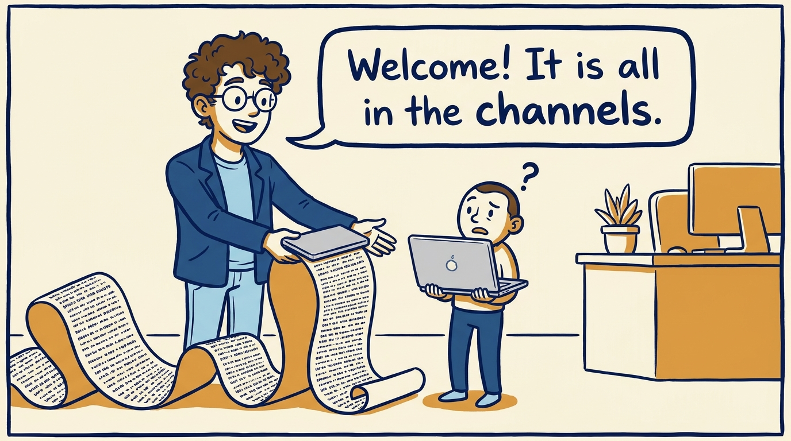
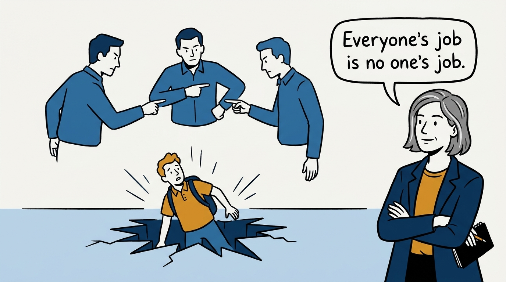
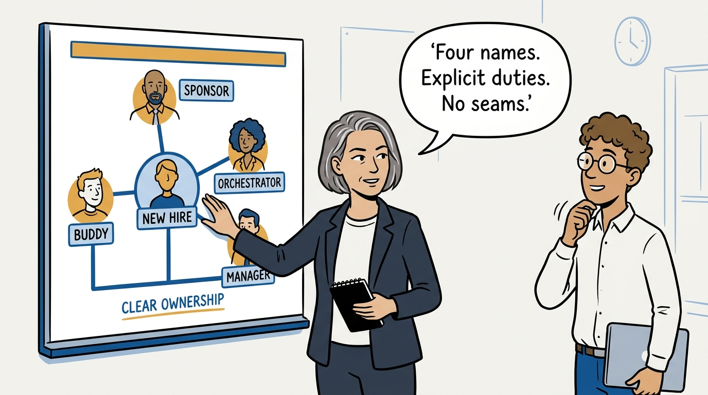
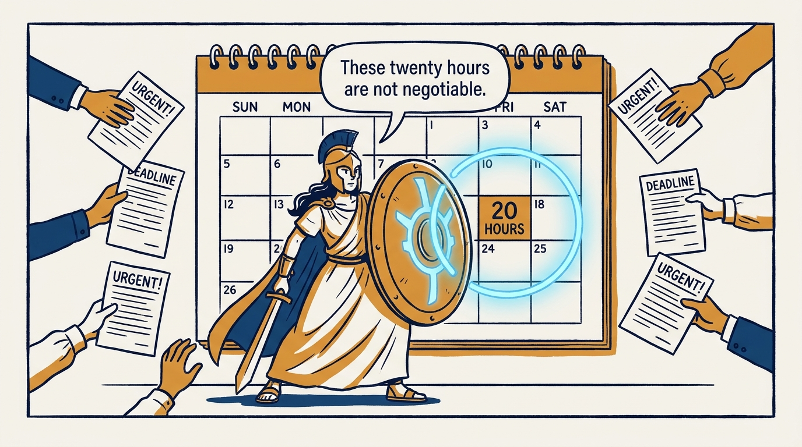
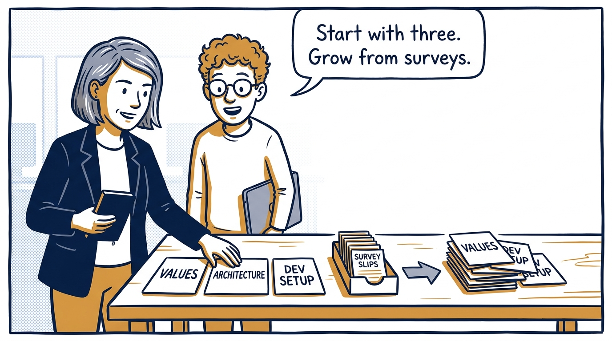
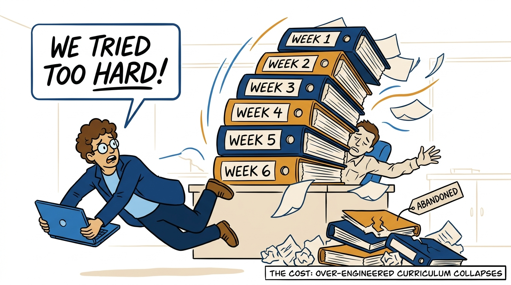
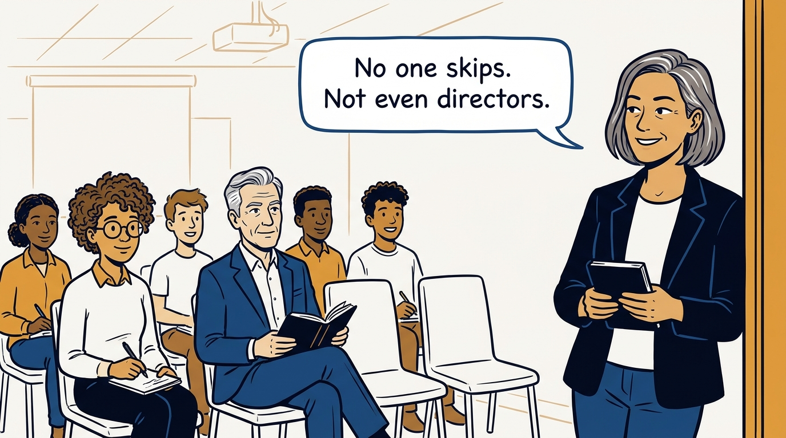
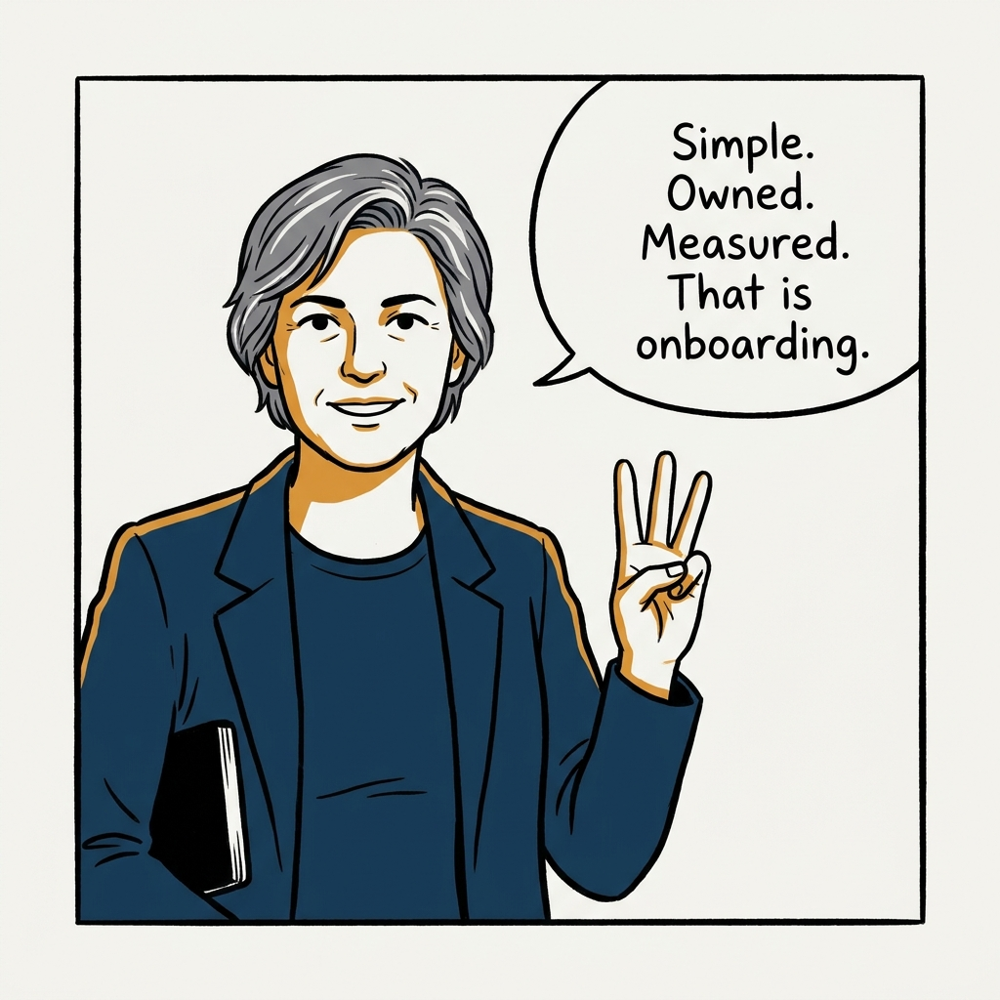

Why onboarding fails from unclear ownership and trying too hard — never from starting simple — in eight panels.

<!-- comic-style
{
  "cast": "VERA: a calm, seasoned engineering executive, short gray-streaked hair, dark blazer over a plain t-shirt, carries a small black notebook. LEO: an eager young engineering manager, curly hair, round glasses, laptop under one arm.",
  "style": "Clean two-tone explainer comic, thick ink outlines, flat colors with deep blue and amber accents on a light background, generous white space, hand-lettered speech bubbles with SHORT readable text, no photorealism."
}
-->

**Panel 1:** *The hook: a laptop, a channel list, and good luck.*

**Panel 2:** *The problem: diffuse ownership — the new hire falls through the seam.*

**Panel 3:** *The principle: four named roles close the ownership seam.*

**Panel 4:** *The fragile part: an orchestrator without protected time is a program on paper only.*

**Panel 5:** *The curriculum: three core sessions, strengthened by evidence.*

**Panel 6:** *The wrong way: the over-engineered program that collapses and gets abandoned.*

**Panel 7:** *The rule: everyone attends, at every level.*

**Panel 8:** *The closer: start simple, own it clearly, measure it quarterly.*
