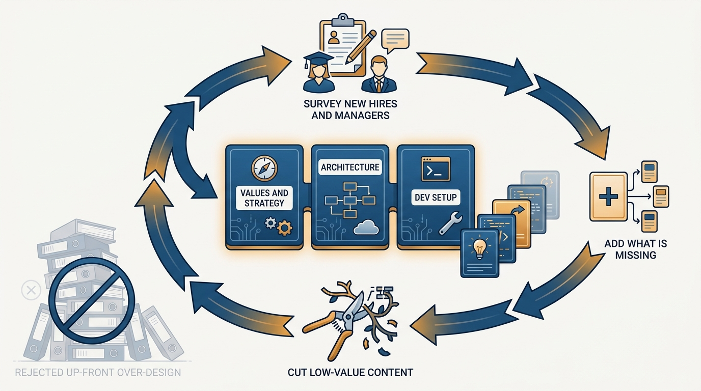
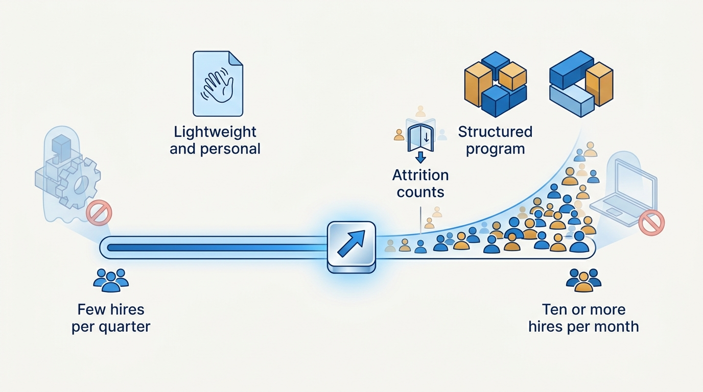

> **Status**: DRAFT
>
> **Principle**: I run engineering onboarding as a program with a measurable goal — a rising share of engineers productive within three months, with "productive" defined — and, above all, with clear ownership: an executive sponsor, a program orchestrator with protected time, the team manager, and an onboarding buddy, each with explicit duties. The curriculum starts with three core sessions and is strengthened by surveys, not up-front design. Everyone attends, at every level. Onboarding programs fail from unclear ownership and from trying too hard — not from starting simple.

## Statement

Onboarding turns hires into colleagues, and I run it as a program, not a vibe. My commitments:

- **Clear goals, defined and measured.** The goal is to increase the percentage of engineers productive within their first three months and to build the foundation for long-term impact. "Productive" is defined at our company, with concrete success metrics — time to first PR, first deploy, survey results.
- **Clear ownership above all.** Four named roles carry the program: I am the **executive sponsor** (select the orchestrator, define metrics and cadence, review data monthly, meet outlier new hires, publicly reinforce the program's importance); a **program orchestrator** owns the curriculum with protected time — at least 20 hours a month; the **team manager** runs a personalized plan, weekly 1:1s, a buddy assignment, and 1–3 starter projects; an **onboarding buddy** does daily check-ins in the first weeks and surfaces early friction.
- **Start with three core sessions.** Engineering values and strategy, technical architecture overview, development environment setup. Everything else is added because surveys of new hires and managers say it is missing — not because it seemed complete on a whiteboard.
- **Everyone attends.** All engineers, all engineering managers, all levels. Senior hires do not skip. Other functions may join by request, not by default.
- **Size investment to hiring volume.** Hiring 5–10+ engineers a month justifies a structured program; infrequent hiring justifies a lightweight, personalized one. Attrition-driven hiring counts too.
- **Measure and iterate quarterly.** Time-to-productivity, satisfaction scores, first-quarter performance trends, recurring friction — reviewed and acted on.

**Figure 1:** *Clear ownership: four named roles with explicit duties close the seam a new hire could fall through.*

## How to Read This

This record is for the leaders who own a piece of onboarding under my sponsorship — especially the program orchestrator I appoint — and for peer executives who want to know how new engineers become productive here. It states the program's shape, not one company's syllabus. The working checklist — the per-role duties, the curriculum design moves, the failure modes, and the quick-start version for starting from scratch this month — lives in the **Checklist** tab of this post.

## Rationale

**Diffuse ownership is the root failure mode.** Onboarding is everyone's responsibility in general and therefore no one's in particular: the manager assumes the program covers it, the program assumes the manager covers it, and the new hire falls through the seam. Naming four roles with explicit, non-overlapping duties closes the seam. The most fragile role is the orchestrator — a program owned by someone with no protected time decays within two quarters, which is why the ≥20 hours/month allocation is a minimum expectation, not an aspiration, and why orchestrator transition continuity is planned rather than improvised.

**The worst programs come from trying too hard, not from starting simple.** An over-engineered curriculum — weeks of sessions, elaborate content, heavy internal engagement — collapses under its own maintenance cost and is abandoned, leaving less than a simple program would have delivered. Three core sessions that reliably happen beat twelve that decay. The strengthening mechanism is empirical: survey new hires a month in, survey managers and tech leads on common gaps, remove low-value theoretical content, emphasize practical context. The curriculum is grown from evidence, the same way [[calibrating-your-standards]] grows standards from demonstrated outcomes rather than decree.

**Figure 2:** *The growth mechanism: three core sessions, then survey-driven additions and pruning — never up-front over-design.*

**Attendance without exceptions protects the program and the hires.** The senior hire who skips onboarding misses exactly what seniority cannot substitute for — this company's values, strategy, architecture, and ways of working — and their exemption signals to everyone else that the program is optional busywork. Requiring attendance at every level, per the expectations set in [[gelling-your-engineering-leadership-team]], is a cheap, visible statement that context is not beneath anyone.

**Investment must match volume.** A structured program for a company hiring twice a quarter is overhead; a personalized ad-hoc ramp for a company hiring ten engineers a month is negligence. I size the investment to actual hiring volume — including attrition-driven hiring, which replaces context the organization just lost — and I coordinate with company-wide onboarding by reusing its content while keeping engineering onboarding, and its feedback loops, owned within Engineering.

**Figure 3:** *Sizing the program: investment follows hiring volume — attrition included — in both directions.*

## What This Means in Practice

| What this principle says | What it does **not** say |
| --- | --- |
| Start with three core sessions and grow from survey evidence. | Design the complete curriculum up front — over-design is the failure mode. |
| Assign an orchestrator with ≥20 protected hours/month. | Make onboarding a side-of-desk duty that loses to every deadline. |
| Require attendance for all engineers and managers, all levels. | Force other functions in by default — Product and others join by request. |
| Size the program to hiring volume. | One fixed program shape forever — light when hiring is rare, structured when it is not. |
| Reuse company-wide onboarding content. | Hand engineering onboarding to another function — ownership and feedback stay in Engineering. |

As sponsor, my monthly rhythm is concrete: review the onboarding data, meet with outlier new hires — the excellent experiences and the struggling ones — and publicly reinforce that the program matters.

## Anti-Patterns

- **The orchestrator with no protected time.** Appointing an owner whose onboarding hours are the first casualty of every sprint — the program then exists on paper and nowhere else.
- **Senior hires skipping onboarding.** Exempting the staff engineer or new director as too senior for it, losing the one window where the organization's context is systematically transferred — and telling everyone else the program is optional.
- **The over-engineered curriculum.** Weeks of polished sessions nobody can sustain, followed by quiet abandonment. Trying too hard is how good intentions produce the worst programs.
- **Onboarding by osmosis.** No program, no buddy, no starter projects — the new hire is handed a laptop and a channel list and expected to reconstruct the company from commit history.
- **Set-and-forget.** A program built once and never surveyed, drifting from the actual gaps until its content describes a company that no longer exists.
- **Orchestrator turnover with no continuity plan.** The program lives in one person's head; when they change roles, it resets to zero.

## Related Records

- [[hiring]] — the system that ends where this one begins: at the accepted offer.
- [[onboarding-peer-executives]] — onboarding applied to a very different audience: my executive peers.
- [[first-90-days]] — my own ramp follows the same conviction that early context determines long-term impact.
- [[gelling-your-engineering-leadership-team]] — the expectations that make managers accountable for their piece of onboarding.
- [[measuring-engineering-organizations]] — time-to-productivity and satisfaction metrics feed the same measurement discipline.

## Scope and Revisiting

This principle governs onboarding for engineers and engineering managers in any organization I lead; my own ramp and peer executives are covered elsewhere. I revisit it quarterly through the measure-and-improve review, and structurally whenever hiring volume changes regime — a hiring surge, a freeze, or an attrition wave each justify resizing the program.

## Authoritative References

- Will Larson, *The Engineering Executive's Primer* (O'Reilly, 2024) — the "Engineering Onboarding" chapter this record's checklist distills; the principle above is my operating commitment to it.
- Will Larson, [Running your engineering onboarding program](https://lethain.com/engineering-onboarding-programs/) — the freely available companion essay.
