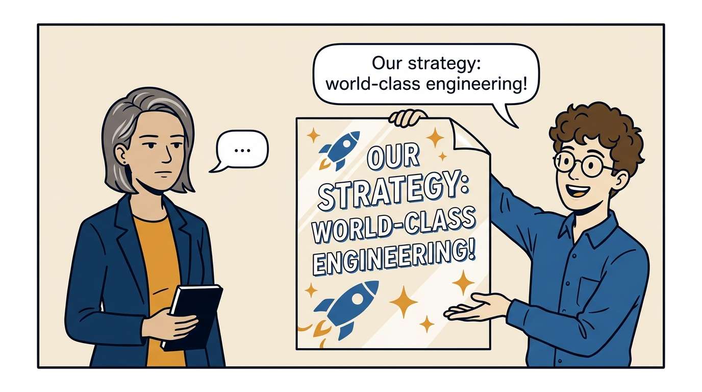
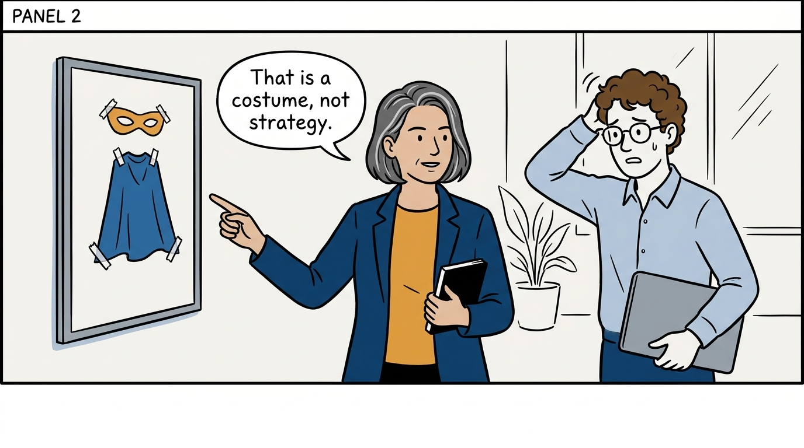
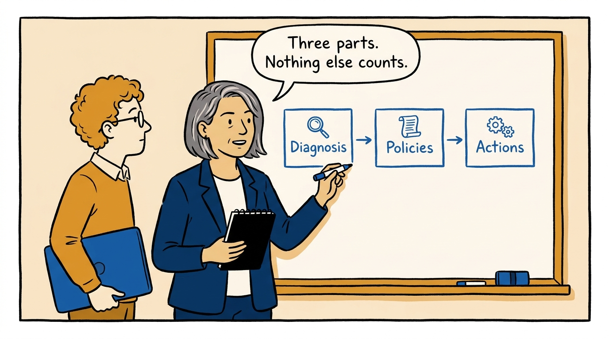
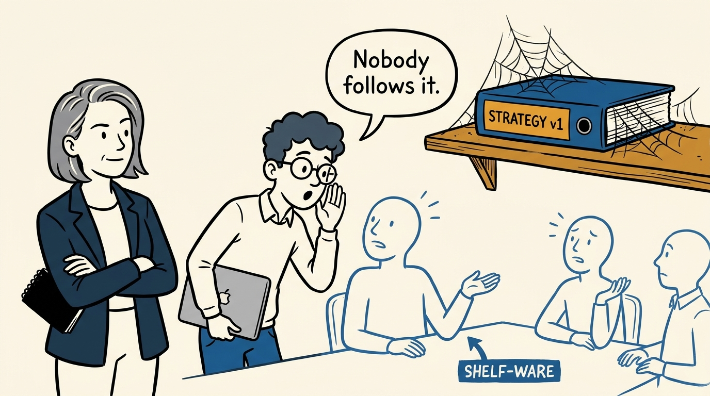
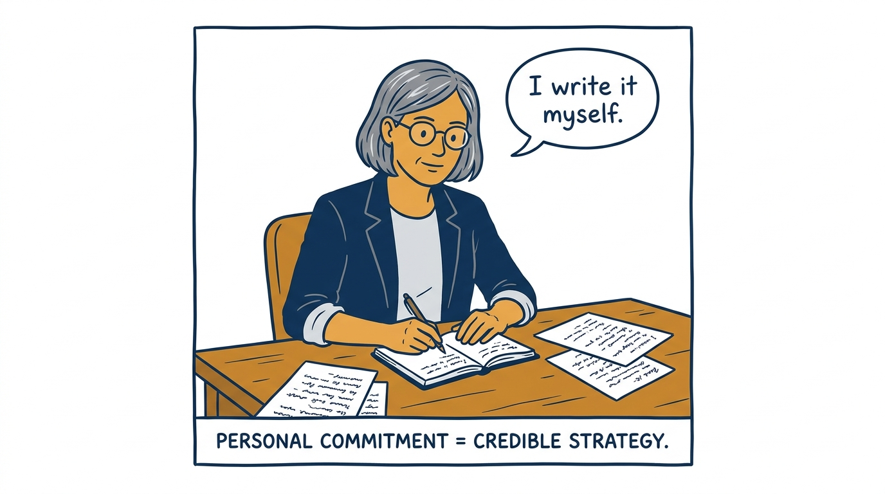
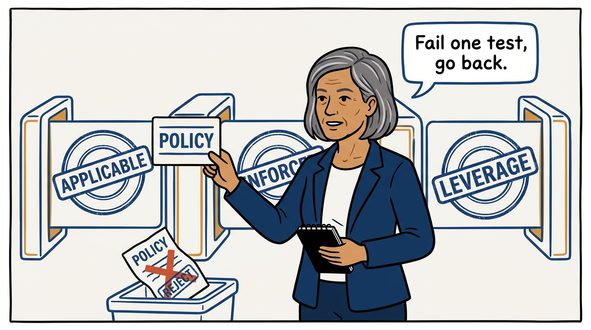
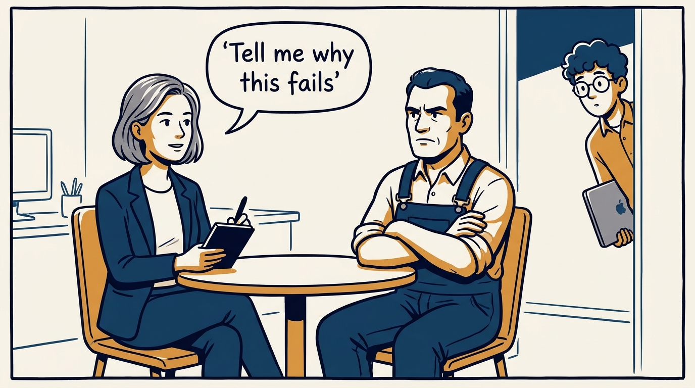
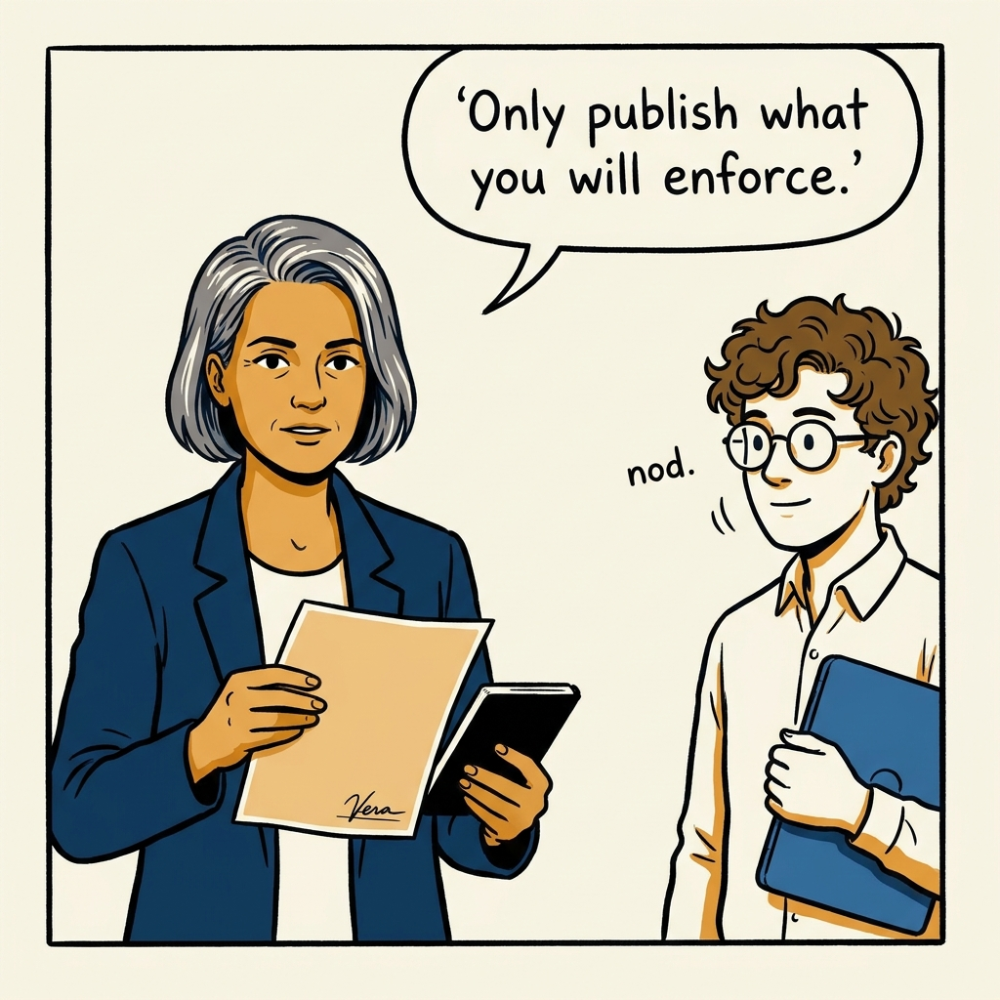

What makes a real engineering strategy — and why I only publish what I will enforce — in eight panels.

<!-- comic-style
{
  "cast": "VERA: a calm, seasoned engineering executive, short gray-streaked hair, dark blazer over a plain t-shirt, carries a small black notebook. LEO: an eager young engineering manager, curly hair, round glasses, laptop under one arm.",
  "style": "Clean two-tone explainer comic, thick ink outlines, flat colors with deep blue and amber accents on a light background, generous white space, hand-lettered speech bubbles with SHORT readable text, no photorealism."
}
-->

**Panel 1:** *The hook: a shiny vision statement, presented as a strategy.*

**Panel 2:** *The problem: it sounds good and changes nothing — a vision statement wearing a strategy costume.*

**Panel 3:** *The principle: a strategy has exactly three parts — diagnosis, guiding policies, coherent actions.*

**Panel 4:** *The wrong way: strategy by committee — sponsored, not owned, and dead on the shelf.*

**Panel 5:** *My move: I write the strategy personally — visible commitment is what makes enforcement credible.*

**Panel 6:** *The quality bar: every policy must be applicable, enforced, and leverage-creating — or it goes back.*

**Panel 7:** *How it survives: seek out the skeptics before launch — the people who could kill it shape it first.*

**Panel 8:** *The closer: short, honest, and enforced — only publish what you are willing to enforce.*
