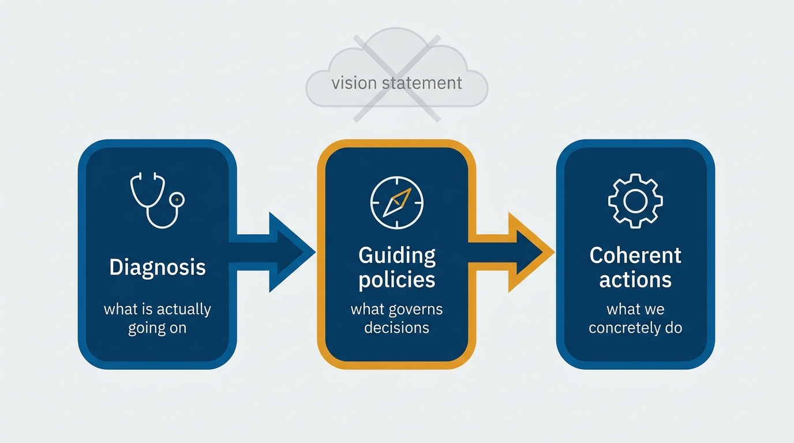
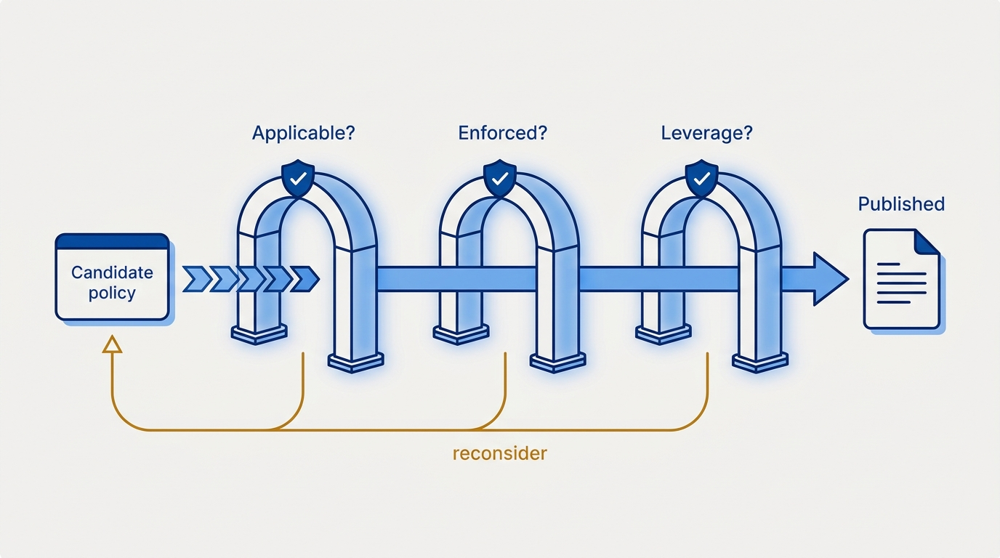
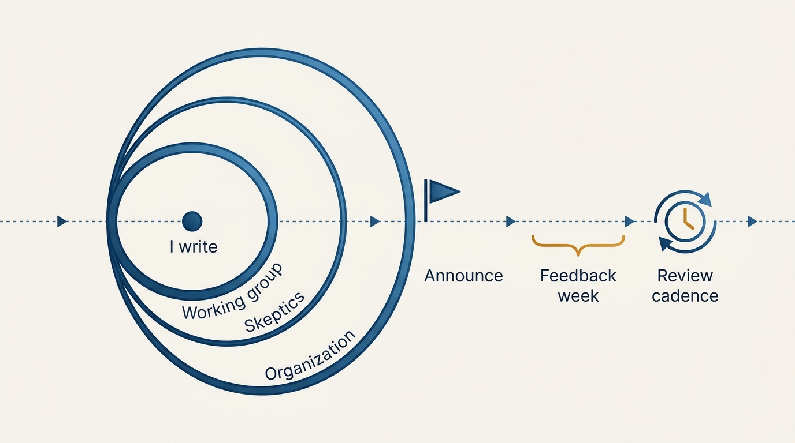

> **Status**: DRAFT
>
> **Principle**: I write engineering strategy personally, and I only start once I am confident in my diagnosis of the organization and willing to enforce what I publish. A strategy has three parts — diagnosis, guiding policies, coherent actions — and every policy must be applicable in real trade-offs, enforced with accountability, and leverage-creating. A policy that fails any of those three tests gets reconsidered, not published.

## Statement

Engineering strategy is one of the few artifacts I do not delegate. I run it as a personal writing project with a disciplined process around it:

- **Before starting**, I check four preconditions: I am confident in my diagnosis, I am willing and able to enforce the strategy, I believe it creates real leverage (not just sounds good), and I am ready to personally write it.
- **The document has exactly three parts** — Rumelt's kernel: a **diagnosis** (what is actually going on), **guiding policies** (what principles govern decisions), and **coherent actions** (what concrete actions implement the policies).
- **Every guiding policy passes a quality bar**: *applicable* — useful in real trade-offs; *enforced* — there is accountability; *leverage-creating* — it produces compounding impact. Failing any one of these sends the policy back.
- **The process is as deliberate as the document**: a small working group first, skeptics actively sought out, socialization before announcement, a short feedback window, and a committed review cadence after launch.

**Figure 1:** *Rumelt's kernel: diagnosis grounds policies, policies drive actions — anything outside the flow is costume.*

## How to Read This

This record describes how I produce a strategy — it is not a strategy itself. The strategy for a given organization is always a separate, company-specific document. The phase-by-phase working checklist lives in the **Checklist** tab of this post. Annual planning mechanics are also deliberately out of scope here; [[planning]] covers those, and keeping strategy and planning separate is part of the point: strategy constrains decisions, planning allocates a year.

## Rationale

**Delegated strategy is dead strategy.** A strategy written by a working group and "sponsored" by the executive has no enforcement behind it. The organization detects this immediately: policies that cost something get waived, exceptions multiply, and the document becomes shelf-ware. Writing it personally is not vanity — it is the visible commitment that makes enforcement credible.

**Diagnosis is the hard part, and the part most strategies skip.** A useful diagnosis names root causes and real constraints, not symptoms. That is why I review the roadmap, the financial plan, and business priorities; incorporate survey data; and validate the diagnosis with senior engineering managers, staff+ engineers, product leadership, and executive peers. I actively seek out skeptics — a diagnosis that has only been confirmed by people who agree with me is untested. And I avoid copying assumptions from previous roles: the diagnosis must be of *this* organization.

**Policies without enforcement are decoration.** The three-part quality bar (applicable, enforced, leverage-creating) exists because most strategy documents fail it. "We value quality" is not applicable in a trade-off. A tech-stack standard nobody checks is not enforced. A rule that merely prevents annoyance does not create leverage. The bar keeps the document honest — and short.

**Figure 2:** *The quality bar: a policy that fails any of the three gates gets reconsidered, not published.*

**Socializing beats announcing.** I iterate the diagnosis 1:1 with a small working group, meet likely strong dissenters before launch, and incorporate valid feedback without weakening the core intent. By the time the strategy is announced, the people who could kill it have already shaped it.

**Figure 3:** *Socialize outward before announcing: by launch day, the people who could kill the strategy have shaped it.*

**Missing company strategy is not an excuse.** When the business, product, or investment strategy above me is undocumented, I clarify it myself — even informally: cash-flow constraints, competitive threats, the distribution model, how success is measured. Engineering strategy has to plug into *something*; if that something is unwritten, I write down my best understanding and validate it.

## What This Means in Practice

| What this principle says | What it does **not** say |
| --- | --- |
| I personally write the strategy. | I write it alone — a working group and skeptics shape it throughout. |
| Every policy is enforced. | Every decision is centralized — the strategy explicitly defines what teams decide independently. |
| Exceptions have a defined approval path. | Exceptions are forbidden — they are evaluated through an ongoing process. |
| The diagnosis names real constraints. | The diagnosis is circulated verbatim — sensitive content is removed before wider circulation. |
| Launch includes a feedback window. | Launch is a referendum — the window is short (about a week) and the core intent survives it. |

The guiding policies themselves cover three areas in my strategies: **resource allocation** (explicitly defined, mapped to the diagnosis, investing in unowned-but-critical areas like security, reliability, and developer productivity), **fundamental rules** (organization-wide standards with a defined exception path and a written *why* for each rule), and a **decision-making model** (what teams decide independently, what requires review, and how escalation works).

## Anti-Patterns

- **Vision-statement strategy.** Aspirational language ("world-class engineering") with no diagnosis, no policies that bind, no actions. Sounds good; changes nothing.
- **Strategy by committee.** Fully delegating the writing, then discovering the executive is unwilling to enforce what the committee produced.
- **Confirmation-only validation.** Reviewing the diagnosis only with people who already agree, and never meeting the strong dissenters until after launch.
- **Unenforced standards.** Publishing rules with no accountability, then treating every violation as an isolated surprise.
- **Strategy frozen in time.** No review cadence — the strategy is launched once and never checked against reality. I commit to reviewing impact in about two months and refreshing annually.

## Related Records

- [[planning]] — annual planning allocates within the constraints strategy sets.
- [[first-90-days]] — the implicit strategy documented during my ramp is the raw material for the explicit one.
- [[organizational-values]] — values and strategy reinforce each other; values without enforcement fail the same way policies do.
- [[measuring-engineering-organizations]] — the measurements that tell me whether the strategy is creating visible leverage.
- [[inspected-trust]] — ongoing review of a strategy is inspection applied to my own artifact.

## Scope and Revisiting

This principle governs how I produce engineering strategy wherever I hold the executive role. I revisit it when a strategy I ran this way fails in practice — a policy that passed the quality bar but did not create leverage is a signal the bar itself needs work — and after each annual refresh cycle.

## Authoritative References

- Will Larson, *The Engineering Executive's Primer* (O'Reilly, 2024) — the "Engineering Strategy" chapter this record's checklist distills.
- Will Larson, [Writing an engineering strategy](https://lethain.com/eng-strategies/) — the freely available companion essay.
- Richard Rumelt, *Good Strategy Bad Strategy* (Crown Business, 2011) — the origin of the diagnosis / guiding policies / coherent actions kernel.
