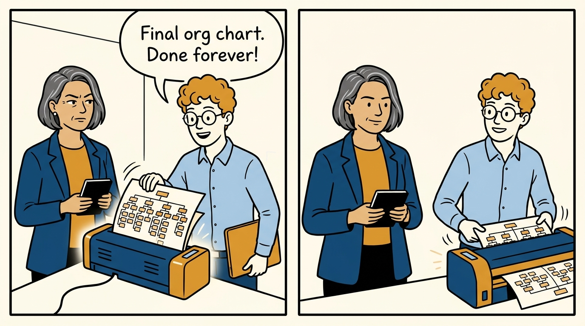
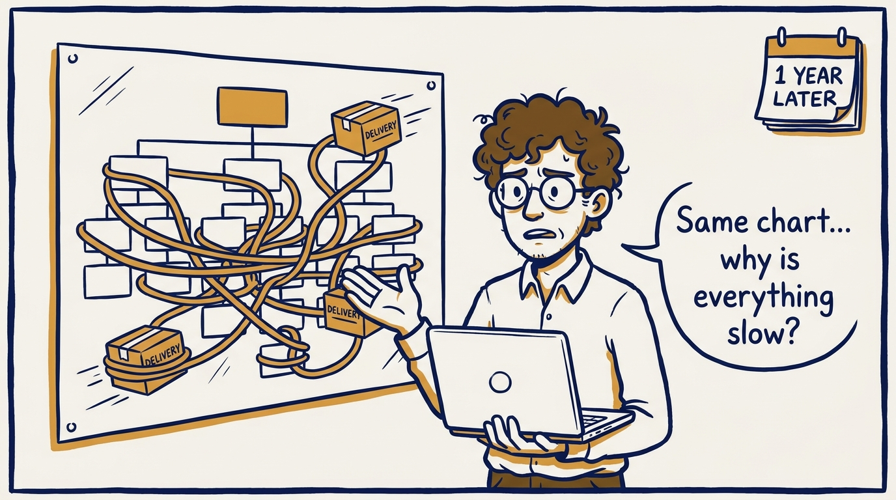
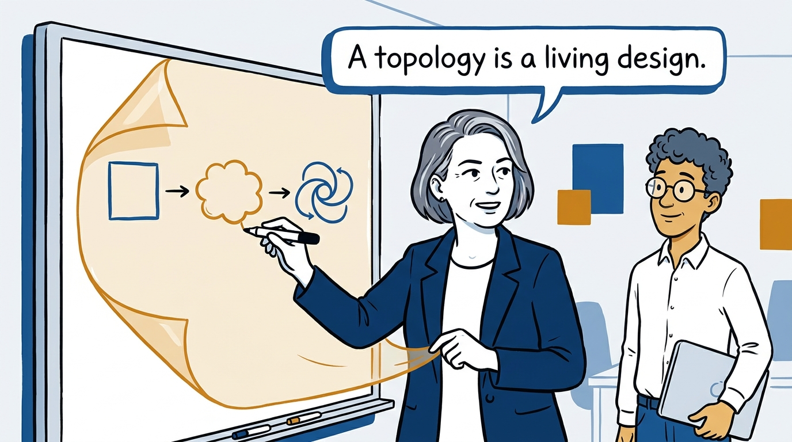
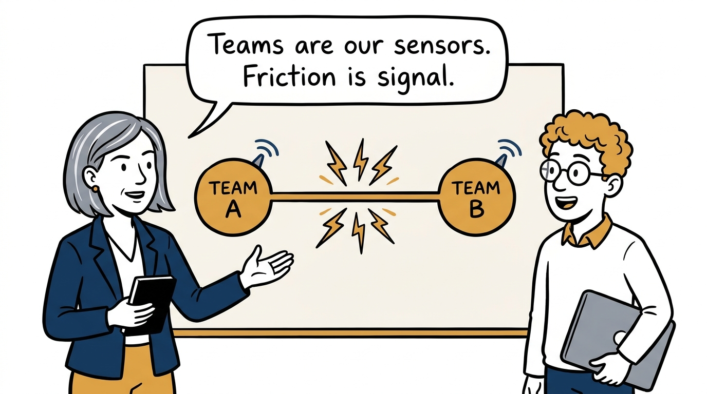
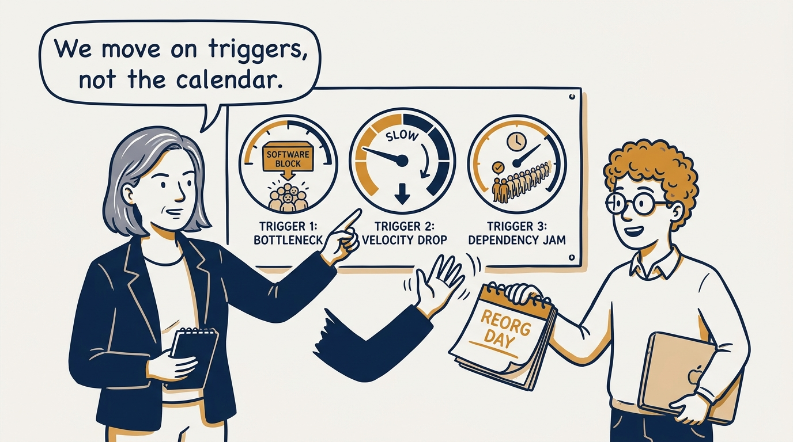
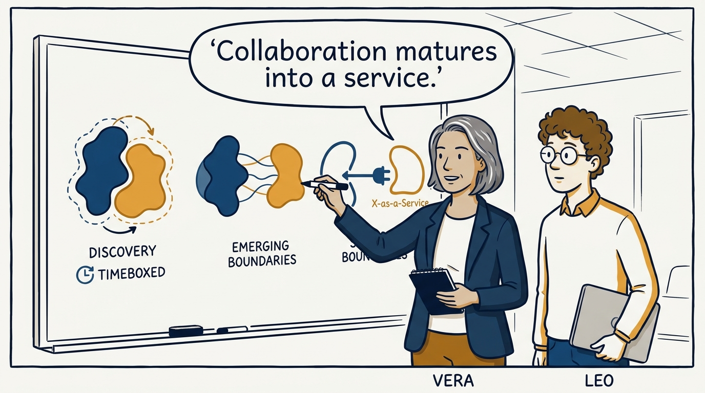
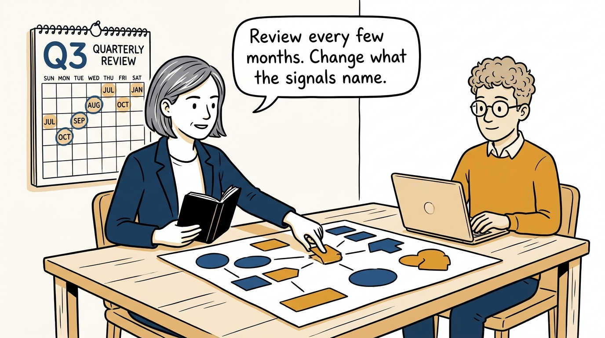
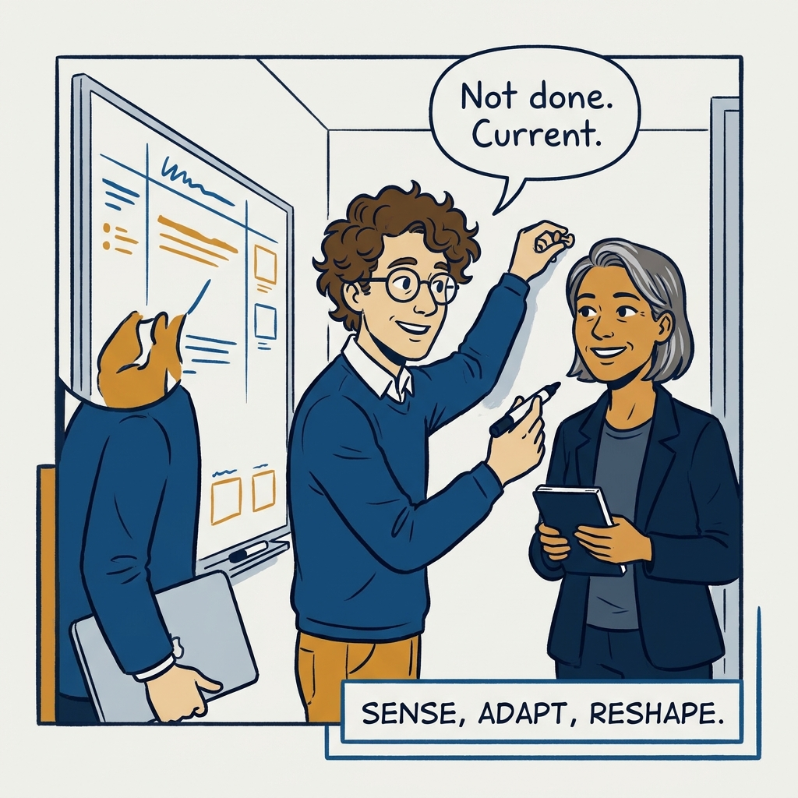

The org chart is never done — why team topologies must keep evolving, in eight panels.

<!-- comic-style
{
  "cast": "VERA: a calm, seasoned engineering executive, short gray-streaked hair, dark blazer over a plain t-shirt, carries a small black notebook. LEO: an eager young engineering manager, curly hair, round glasses, laptop under one arm.",
  "style": "Clean two-tone explainer comic, thick ink outlines, flat colors with deep blue and amber accents on a light background, generous white space, hand-lettered speech bubbles with SHORT readable text, no photorealism."
}
-->

**Panel 1:** *The hook: the org chart declared finished — laminated, even.*
**Panel 1:** *The hook: the org chart declared finished — laminated, even.*

**Panel 2:** *The problem: a year on, the same structure is strangling delivery.*
**Panel 2:** *The problem: a year on, the same structure is strangling delivery.*

**Panel 3:** *The principle: the topology is a living design, not a finished artifact.*
**Panel 3:** *The principle: the topology is a living design, not a finished artifact.*

**Panel 4:** *The mechanism: teams are the organization's sensors — friction between them is signal.*
**Panel 4:** *The mechanism: teams are the organization's sensors — friction between them is signal.*

**Panel 5:** *The discipline: defined triggers — software too big, cadence slowing, queues behind one team — not a reorg calendar.*
**Panel 5:** *The discipline: defined triggers — software too big, cadence slowing, queues behind one team — not a reorg calendar.*

**Panel 6:** *The lifecycle: collaborate to discover, then let stable boundaries mature into X-as-a-Service.*
**Panel 6:** *The lifecycle: collaborate to discover, then let stable boundaries mature into X-as-a-Service.*

**Panel 7:** *The rhythm: boundaries reviewed every few months — evidence moves one piece, the rest keep delivering.*
**Panel 7:** *The rhythm: boundaries reviewed every few months — evidence moves one piece, the rest keep delivering.*

**Panel 8:** *The closer: never done — current. An organization that can sense, adapt, and reshape itself.*
**Panel 8:** *The closer: never done — current. An organization that can sense, adapt, and reshape itself.*
