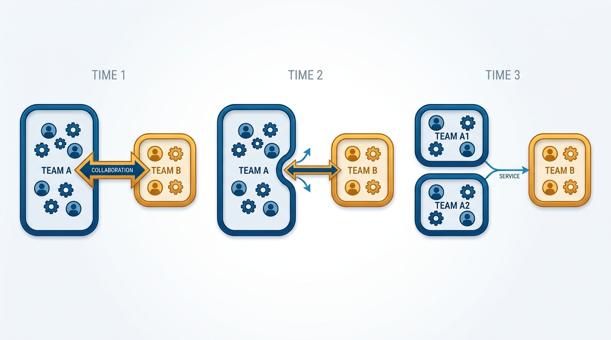
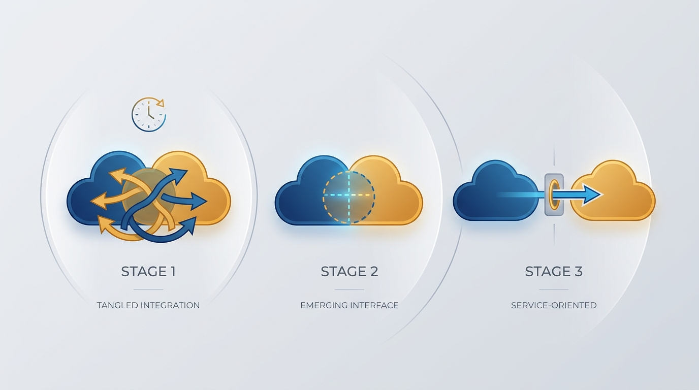
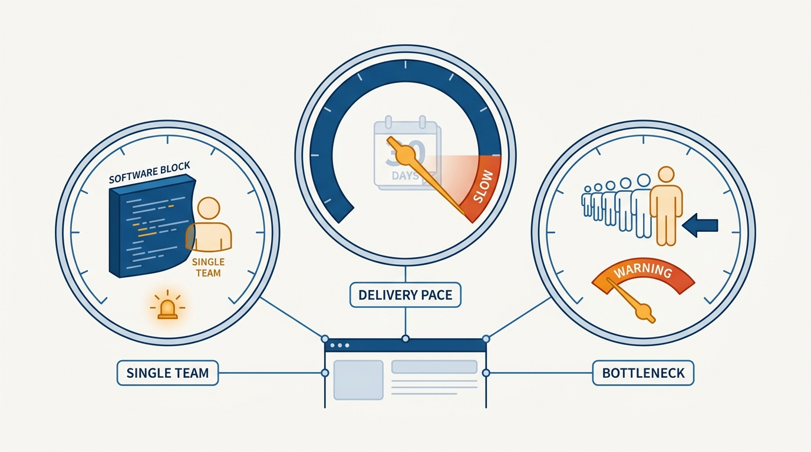

> **Status**: DRAFT
>
> **Principle**: I treat the team topology as a living design: teams are the organization's sensors, interaction friction is signal, and I evolve structures on defined triggers — software outgrowing its team, slowing delivery cadence, too much work waiting on one team — rather than on a reorg calendar. Collaboration exists for discovery and learning, is timeboxed with exit criteria, and matures into X-as-a-Service once the boundary is stable. I review team boundaries every few months, not every day or week — and not never.

## Statement

My operating model for evolving team structures has five parts:

- **Map before moving.** I keep a current map of every team's topology and every team-to-team interaction, with the mode labeled — collaboration, X-as-a-Service, or facilitating — and I check that each mode matches the work being done right now.
- **Treat collaboration as temporary and purposeful.** Every ongoing collaboration must be doing valuable discovery, capability building, or deficiency-fixing — timeboxed, with exit criteria toward a clearer service boundary.
- **Evolve on triggers, not on a calendar.** Three trigger families tell me the topology needs to change: software has grown too large for one team, delivery cadence is slowing, and many business services rely on many lower-level services.
- **Use teams as sensors.** Teams and their interactions are my richest signal about organizational health; I read them alongside operational data, customer signals, and delivery metrics, looking for weak signals before they become structural problems.
- **Review regularly, at the right frequency.** Team boundaries get reviewed every few months — often enough that structure tracks reality, rarely enough that teams can gel and deliver between reviews.

**Figure 1:** *A living design: the same teams over three snapshots — shapes, groupings, and interaction lines evolve as the work does.*

## How to Read This

This is an **appendix record**: unlike the core records in this journal, grounded in Will Larson's *The Engineering Executive's Primer*, this one is grounded in Matthew Skelton and Manuel Pais's *Team Topologies* — read here through an executive lens, complementing the Primer-grounded records. The sibling records [[static-team-topologies]] and [[team-interaction-modes]] define the vocabulary of team types and interaction modes; this record is about changing the arrangement over time. The working checklist — all ten sections, triggers included — lives in the **Checklist** tab of this post.

## Rationale

**A topology that cannot change is already wrong.** The org chart that perfectly fits today's product, technology, and market stops fitting the moment any of the three moves — and all three move constantly. The choice is not between a stable structure and a changing one; it is between deliberate evolution and silent decay. So I never declare the topology finished. I declare it *current*, and I keep the map that makes the next change legible.

**Collaboration is a mode of discovery, not a way of life.** Close collaboration between two teams is expensive — it blurs boundaries, raises cognitive load, and couples delivery. That price is worth paying for discovery, capability building, or fixing a real deficiency; it is waste when it quietly substitutes for better APIs, platforms, or ownership. So every collaboration has a stated purpose, a timebox, and exit criteria. The healthy lifecycle runs from close collaboration during discovery, to limited collaboration as the interface emerges, to X-as-a-Service once the boundary is stable and predictable delivery matters most — with the providing team owning the reliability and usability of what it now serves.

**Figure 2:** *The lifecycle: close collaboration for discovery, limited collaboration as the interface emerges, X-as-a-Service once the boundary is stable.*

**Defined triggers beat both restlessness and neglect.** Reorganizing on a calendar churns teams that were working; never reorganizing lets structure strangle delivery. Triggers resolve the dilemma. When software has grown too large for one team, the symptoms show: other teams waiting on one team for changes, the same changes landing on the same few people, bottlenecks forming around "who knows what." When delivery cadence is slowing, releases feel slower, throughput trends down year over year, work in progress rises, and changes wait on another team's action. When many business services rely on many lower-level services, stream-aligned teams lose end-to-end visibility, integration slows flow, and nobody can diagnose where problems occur. Each trigger names a structural response — split the team, remove the dependency, platformize the lower-level services — so the reorg conversation starts from evidence, not appetite.

**Figure 3:** *Triggers, not a calendar: software too big for one team, cadence slowing, work queuing behind a single team — when a gauge enters the warning zone, the topology changes.*

**Platforms are how I buy back flow.** When many teams depend on the same lower-level services, the fix is rarely more coordination — it is a platform: consistent developer experience, self-service access, documentation, service-level expectations, and real telemetry. Where the lower-level services are fragmented, an "outer platform" wrapper can present a coherent surface. The test is simple: the platform must be easier to consume than building a custom one-off.

**Sensing is the organ that makes evolution possible.** An organization that cannot sense cannot adapt — it just lurches. My sensors are the teams themselves: I regularly ask whether interaction modes still fit, whether collaboration is still effective, whether work flows smoothly, whether the platform provides what consumers actually need, and whether promises between teams are still realistic. Operations is a first-class sensory input, which is why I do not split "new work" teams from maintenance teams in ways that break learning: teams own both new services and existing systems where practical, production telemetry feeds design, and operational pain stays visible to the people who can remove it.

## What This Means in Practice

| What this principle says | What it does **not** say |
| --- | --- |
| The topology is a living design; evolution is expected. | Constant restructuring is healthy — permanent flux is a failure mode, not agility. |
| Collaboration is purposeful, timeboxed, and has exit criteria. | Collaboration is bad — it is the right mode for discovery and learning. |
| Structures change when a defined trigger fires. | Structures change when an executive gets restless or a calendar says so. |
| Teams and their friction are the organization's sensors. | Sensing replaces judgment — signals inform the decision; they do not make it. |
| Stable boundaries mature into X-as-a-Service. | Every interaction should be a service contract from day one. |
| Boundaries are reviewed every few months. | Boundaries are renegotiated weekly — teams need time to gel and deliver. |

Concretely: every proposed topology change must name the trigger that fired and the symptoms behind it. Every collaboration older than its timebox gets reassessed — continue, create a platform or service model, reorganize ownership, or split or merge teams. And interaction modes are explicit and written down, so people understand why different teams work together differently at the same time.

## Anti-Patterns

- **The laminated org chart.** Treating the topology as finished — until the structure that once served delivery quietly starts strangling it.
- **The reorg calendar.** Restructuring on a schedule or a whim, paying full re-gelling costs with no trigger and no evidence.
- **Permanent collaboration.** Two teams "collaborating" for years because nobody defined exit criteria — a standing substitute for the API, platform, or ownership change actually needed.
- **The bottleneck nobody names.** Every change queuing behind one team or one expert while the organization treats the wait as weather rather than as a trigger.
- **Sensing without acting.** Collecting metrics and feedback, seeing the weak signals, and filing them — sensing only counts if it can reshape structure.
- **Build-vs-run separation.** Splitting new-work teams from maintenance teams so thoroughly that operational learning never reaches design decisions.
- **Platform by decree.** Declaring a platform without self-service, documentation, or telemetry — harder to consume than the one-off it replaced.

## Related Records

- [[static-team-topologies]] — appendix sibling defining the four fundamental team types this record evolves between.
- [[team-interaction-modes]] — appendix sibling on the three interaction modes; this record governs when a mode should change.
- [[organizational-design]] — sizing and staffing the system; this record reshapes its boundaries and interactions.
- [[inspected-trust]] — organizational sensing echoes inspection: trusting teams and still going to the work to see what is really happening.
- [[engineering-strategy]] — topology evolution is strategy made structural; triggers tell me when the current structure no longer serves the strategy.

## Scope and Revisiting

This principle governs how I change team boundaries, interaction modes, and platform investments over time. I revisit it at every boundary review (every few months), whenever a trigger fires between reviews, and whenever I catch a collaboration outliving its purpose. The final health check in the Checklist tab is the standing test: clear purposes, explicit interactions, intentional collaboration, platforms that reduce cognitive load, operations feeding development, measured and improving flow — and an organization that can sense, adapt, and reshape itself as conditions change.

## Authoritative References

- Matthew Skelton & Manuel Pais, *Team Topologies: Organizing Business and Technology Teams for Fast Flow* (IT Revolution Press, 2019) — the evolution, sensing, and platform chapters this record's checklist distills.
- The authors maintain further materials, training, and case studies at [teamtopologies.com](https://teamtopologies.com/).
