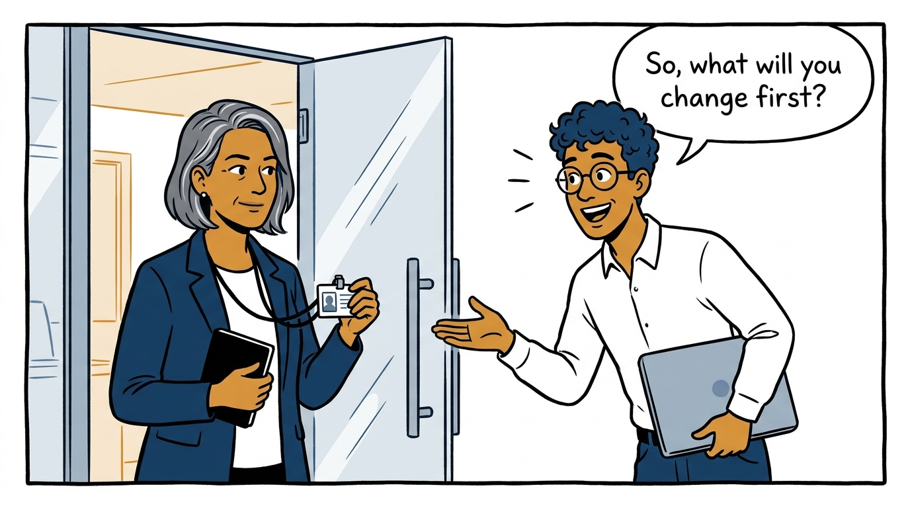
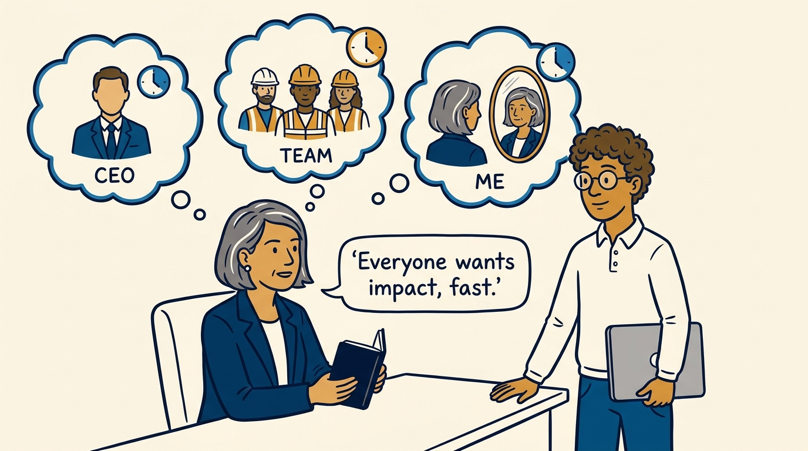
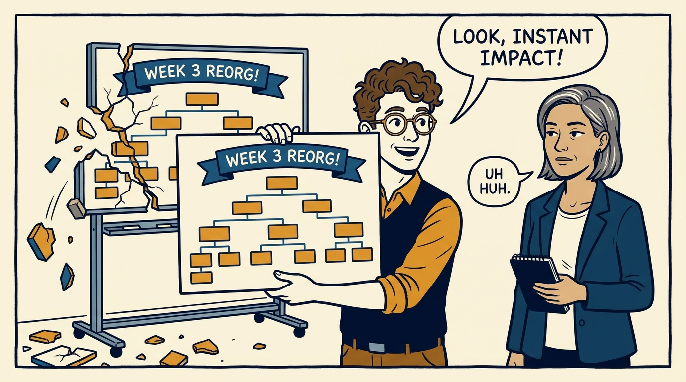
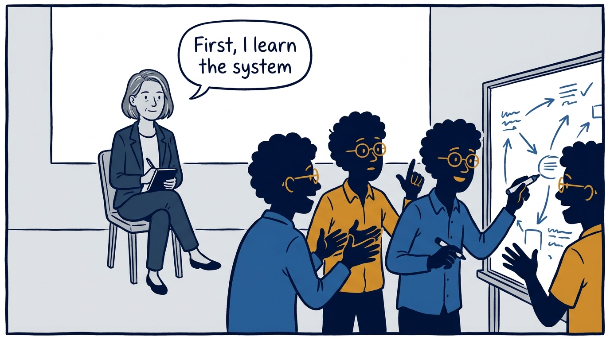
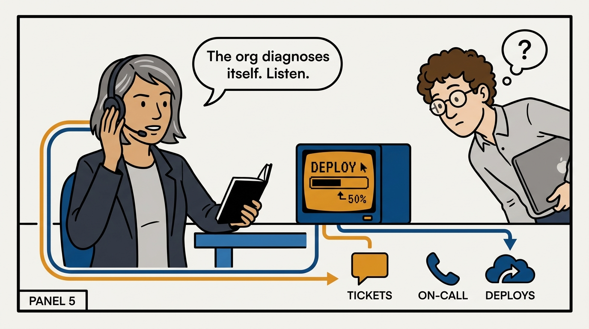
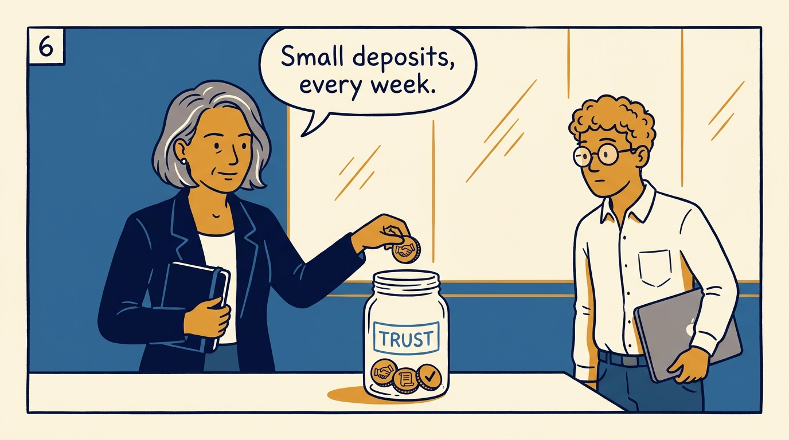
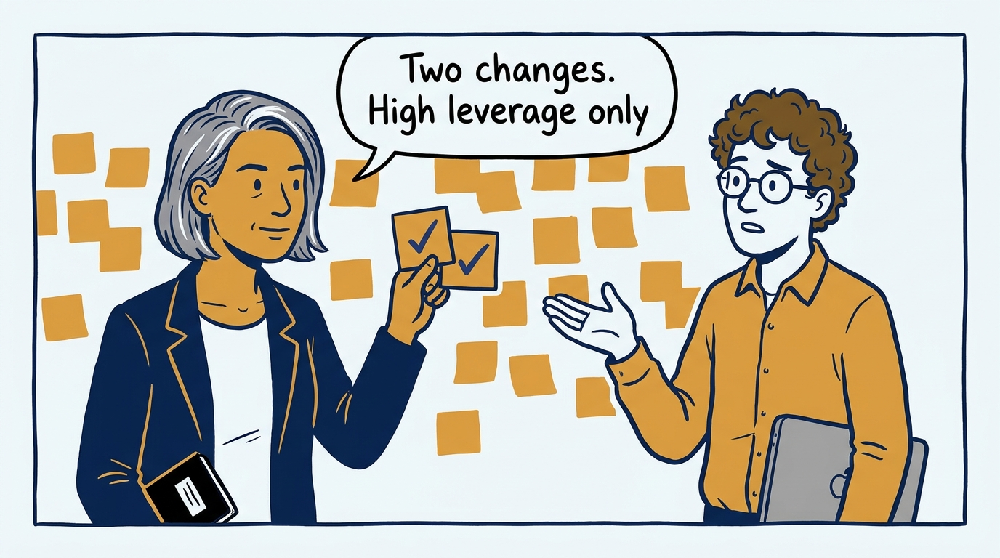
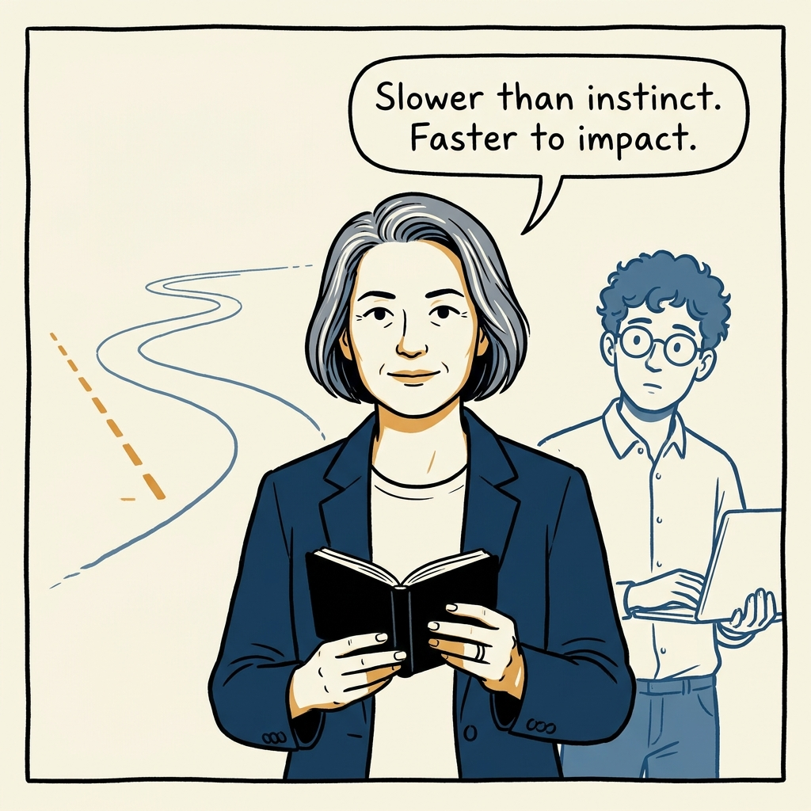

Why my first quarter in an executive role is a learning quarter — in eight panels.

<!-- comic-style
{
  "cast": "VERA: a calm, seasoned engineering executive, short gray-streaked hair, dark blazer over a plain t-shirt, carries a small black notebook. LEO: an eager young engineering manager, curly hair, round glasses, laptop under one arm.",
  "style": "Clean two-tone explainer comic, thick ink outlines, flat colors with deep blue and amber accents on a light background, generous white space, hand-lettered speech bubbles with SHORT readable text, no photorealism."
}
-->

**Panel 1:** *Day one: everyone expects the new executive to start changing things.*

**Panel 2:** *The problem: pressure from the CEO, the team, and yourself to demonstrate impact quickly.*

**Panel 3:** *The trap: quick-win theater — a visible change that later has to be unwound costs more trust than it bought.*

**Panel 4:** *The principle: treat the organization as a system you do not yet understand — and refuse to modify what you do not understand.*

**Panel 5:** *How it plays out: tickets, incidents, on-call, and a hands-on deploy tell you more than any report.*

**Panel 6:** *Build trust before conflict: small, consistent deposits compound into the reservoir hard calls will need.*

**Panel 7:** *Then act — but small: one or two high-leverage improvements that will still look good in two years.*

**Panel 8:** *The closer: move slower than your instincts — it is the fastest route to durable impact.*
