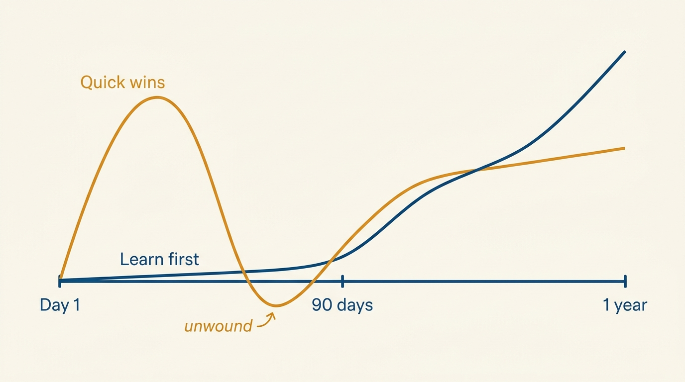
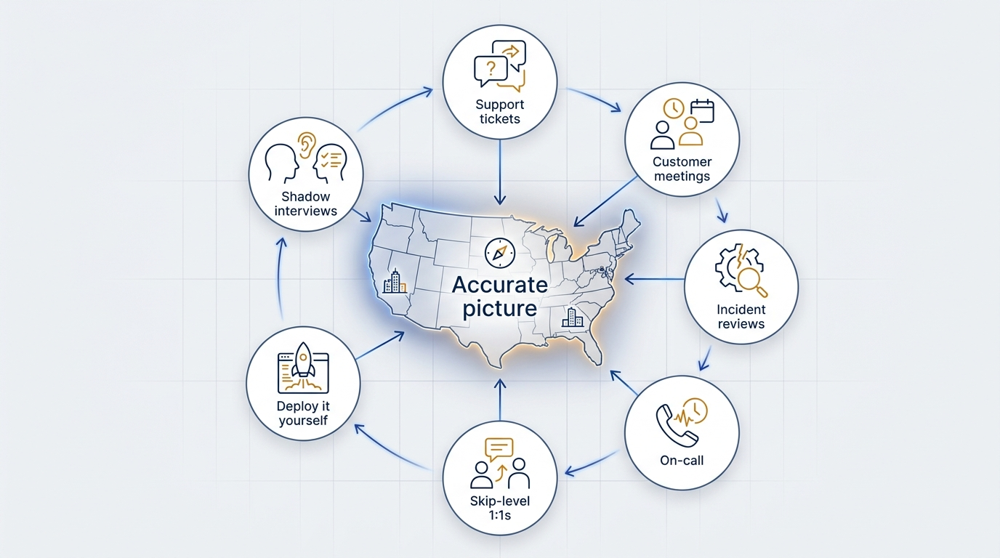
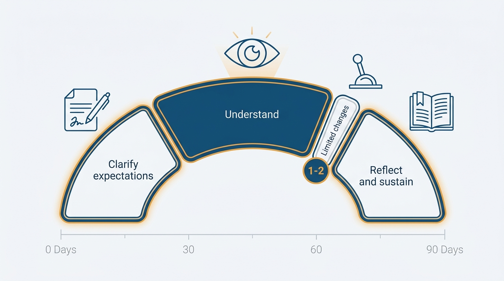

> **Status**: DRAFT
>
> **Principle**: In my first 90 days I prioritize learning over change. I clarify what success looks like, understand how the business makes money, build relationships before I need them, learn how work actually gets done, and only then make a small number of high-leverage changes. I move slower than my instincts tell me — because early trust and an accurate map of the organization are worth more than early visible wins.

## Statement

When I step into an engineering executive role, my first quarter is a learning quarter. I treat the organization as a system I do not yet understand, and I refuse to modify systems I do not understand.

Concretely, this means five commitments:

- **Prioritize learning over early change.** The instinct to "show impact fast" produces shallow, often wrong, interventions. I resist it.
- **Understand systems before modifying them.** Processes, org structures, and technical architectures all encode history. I learn the history before rewriting it.
- **Focus on durable improvements, not visible quick wins.** If a change would not still look good in two years, it is not why I was hired.
- **Build trust before conflict.** Every executive role eventually requires hard conflict. I build the relationship capital first, so conflict spends trust rather than destroying it.
- **Move slower than my instincts tell me.** My instincts were calibrated in a different company. Until they are recalibrated here, deliberate slowness is a feature.

## How to Read This

This record is a vision of how I operate, not a policy imposed on anyone else. The principle is the durable part; the working part — the concrete moves I expect myself to make in a new executive role — lives in the **Checklist** tab of this post. If you are my manager, this tells you what to expect from my first quarter. If you are on my team, this explains why I am asking questions instead of issuing directions.

## Rationale

**Early visible wins are a trap.** A new executive is under real pressure — from the CEO, from the team, from themselves — to demonstrate impact quickly. But the changes you can identify in week three are, almost by definition, the changes that are visible without context. The problems that matter are usually the ones the organization has already normalized, and you only find those by listening, shadowing, and reading. A quick win that later has to be unwound costs more trust than it bought.

**Figure 1:** *Two first-year trajectories: early visible wins that get unwound, versus deliberate learning that compounds.*

**The organization is the best source of its own diagnosis.** Support tickets, customer meetings, incident reviews, on-call rotations, and skip-level 1:1s contain the real state of the company. Deploying a trivial change myself tells me more about developer experience than any survey. Shadowing interviews tells me more about the hiring bar than any funnel report. I go to the primary sources.

**Figure 2:** *The organization diagnoses itself: primary sources feed the accurate map that early changes must wait for.*

**Trust is built in small, consistent deposits.** Attending existing forums before changing them, sharing what I am learning in weekly updates, closing loops with people who raised concerns — these are small acts, but they compound. When I later need to make an unpopular call, that reservoir is what makes it survivable. This connects directly to [[inspected-trust]]: trust and verification are built together from day one.

**Sustainability starts on day one.** Burnout cycles — mine or the team's — usually start with an unexamined pace set in the first months. I deliberately build external support (peer groups, coaching, self-care) and watch the team's pace from the start, per [[managing-energy]].

## What This Means in Practice

| What this principle says | What it does **not** say |
| --- | --- |
| Learn before changing. | Never change anything early — urgent, dire issues still get immediate attention. |
| Limit early changes to 1–2 high-leverage improvements. | Postpone all judgment — I form and write down hypotheses from week one. |
| Attend routine forums before changing them. | Accept every existing ritual forever. |
| Avoid "how we did it at my last job". | Discard prior experience — I apply it once I understand the local context. |
| Move slower than instinct. | Move slowly indefinitely — the learning quarter ends, and then I am accountable for direction. |

In practice, my first 90 days follow an arc: **clarify expectations** (written expectations from the CEO, measurable goals for the quarter) → **understand** (business model, people, execution systems, organizational health, technology) → **make limited changes** (one or two high-leverage improvements, often a weekly operational review) → **reflect and sustain** (write down what I am learning, build external support, protect the team's pace).

**Figure 3:** *The 90-day arc: understanding takes the widest share, and change stays deliberately limited.*

## Anti-Patterns

- **Quick-win theater.** Shipping a visible reorganization or process overhaul in month one to demonstrate decisiveness, before understanding why the current shape exists.
- **"At my last company…"** Importing solutions from a previous context without checking whether the constraints match. Prior experience is a hypothesis generator, not an answer key.
- **Disrupting without an alternative.** Removing a system — however flawed — before a working replacement exists.
- **Judgment without context.** Concluding who is strong or weak, which teams work, which technology is bad, from second-hand narrative instead of direct observation.
- **Skipping the business.** Diving into engineering internals without first understanding how the company makes money, where it spends it, and what must be true in 12 months.

## Related Records

- [[getting-the-job]] — everything before day one: finding and evaluating the role this quarter begins.
- [[engineering-strategy]] — the implicit strategy I document in the first 90 days becomes the explicit one I write later.
- [[inspected-trust]] — the trust built here is what inspection later draws on.
- [[managing-energy]] — the sustainability practices started in the first quarter.
- [[hiring]] — the hiring review begun here becomes an ongoing operating rhythm.

## Scope and Revisiting

This principle applies to my own ramp into any engineering executive role; the durations are guidelines, not a rigid calendar. I revisit it after each ramp — what the checklist missed, what it over-weighted — and when the role's context (company stage, urgency of turnaround) genuinely demands a faster arc.

## Authoritative References

- Will Larson, *The Engineering Executive's Primer* (O'Reilly, 2024) — the "First 90 Days" chapter this record's checklist distills; the principle above is my operating commitment to it.
- Will Larson, [Your first 90 days as CTO or VP Engineering](https://lethain.com/first-ninety-days-cto-vpe/) — the freely available companion essay.
