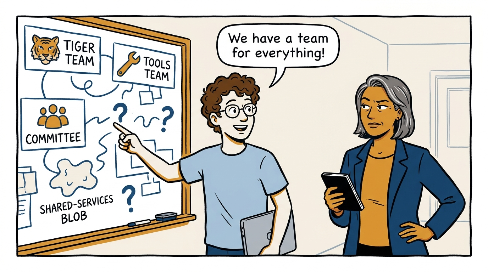
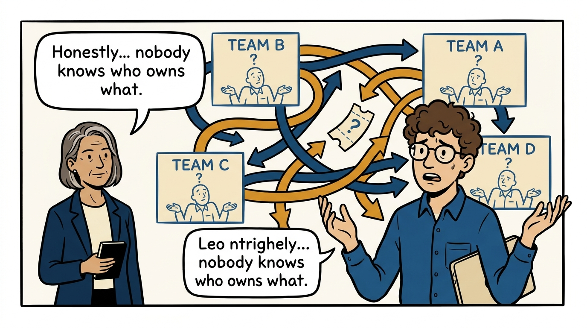
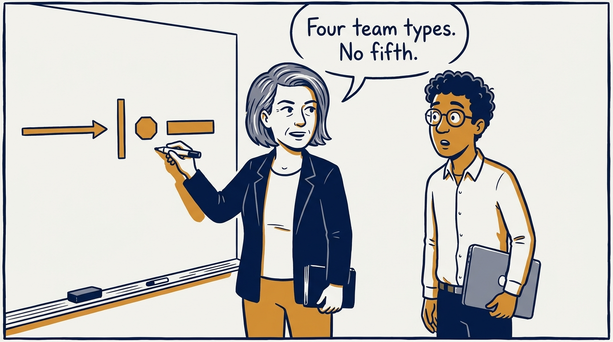
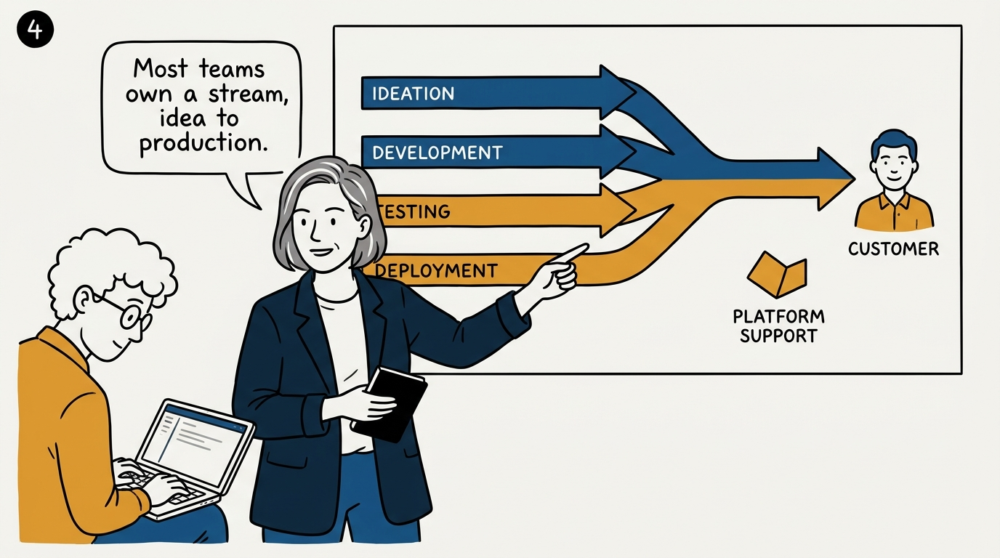
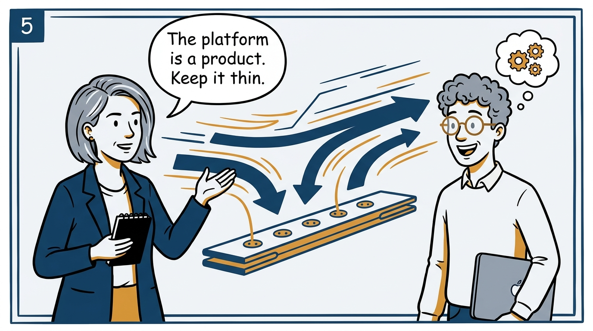
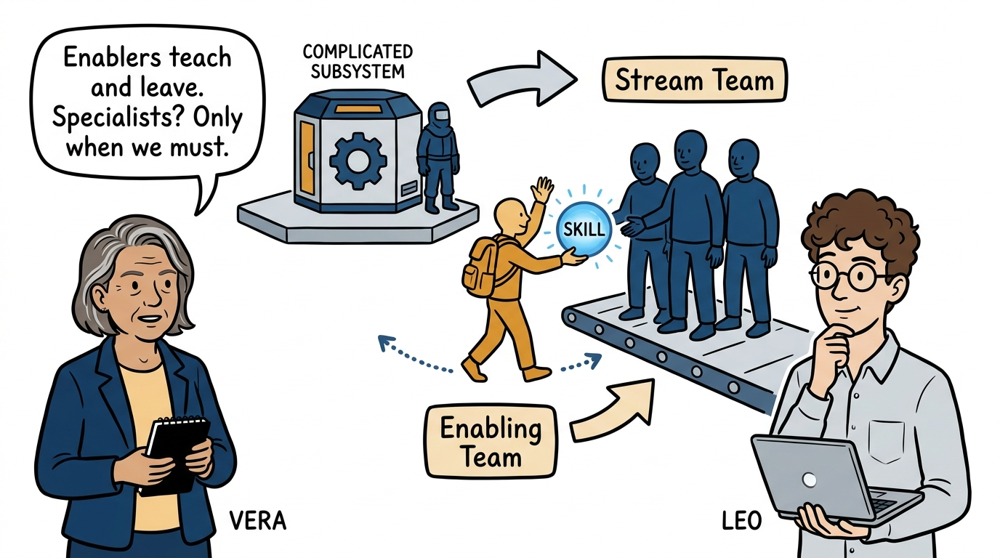
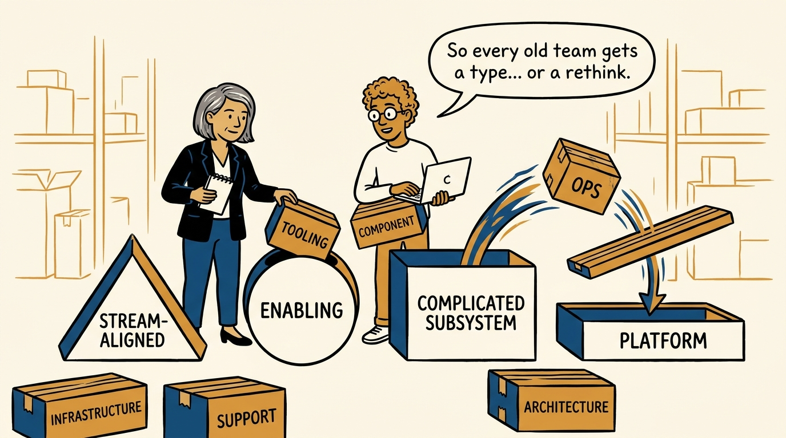
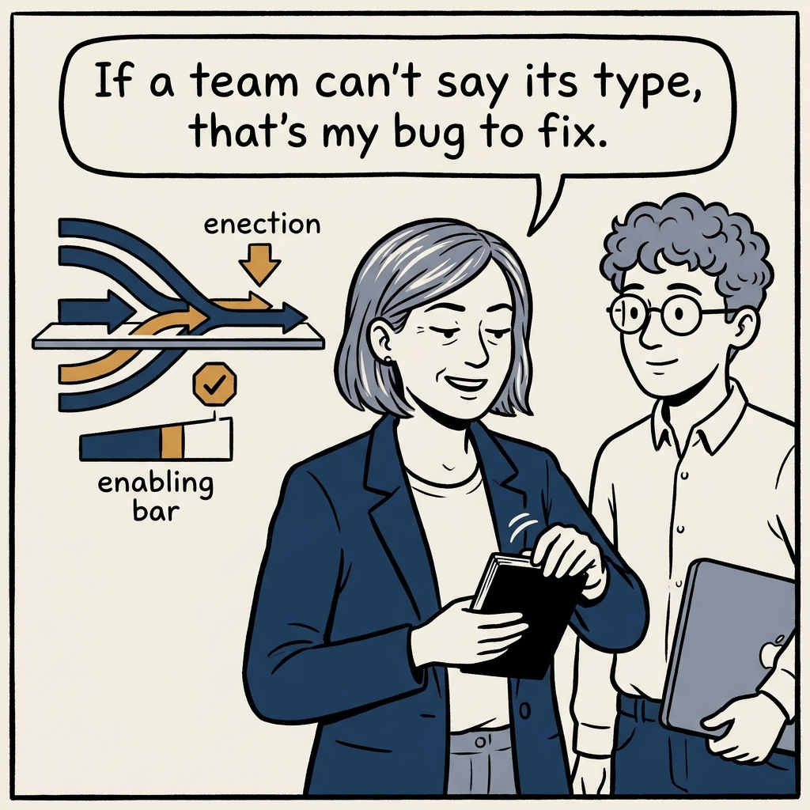

Four team types, no fifth — how a zoo of teams becomes an organization built for flow, in eight panels.

<!-- comic-style
{
  "cast": "VERA: a calm, seasoned engineering executive, short gray-streaked hair, dark blazer over a plain t-shirt, carries a small black notebook. LEO: an eager young engineering manager, curly hair, round glasses, laptop under one arm.",
  "style": "Clean two-tone explainer comic, thick ink outlines, flat colors with deep blue and amber accents on a light background, generous white space, hand-lettered speech bubbles with SHORT readable text, no photorealism."
}
-->

**Panel 1:** *The hook: a team for everything, and a type for nothing.*

**Panel 2:** *The problem: ambiguity between teams is where flow goes to die.*

**Panel 3:** *The principle: every team is one of four types — stream-aligned, enabling, complicated-subsystem, platform.*

**Panel 4:** *The majority: stream-aligned teams own a flow of change end to end — roughly six to nine for every other team.*

**Panel 5:** *The platform: an internal product with users and feedback — just big enough to make the streams faster.*

**Panel 6:** *The rare types: enabling teams time-box their help; complicated-subsystem teams stay few and justified.*

**Panel 7:** *The conversion: legacy teams get an explicit fate under the four types — no quiet exemptions.*

**Panel 8:** *The closer: an organization whose team boundaries are easy to explain — and whose ambiguities are the executive's to fix.*
