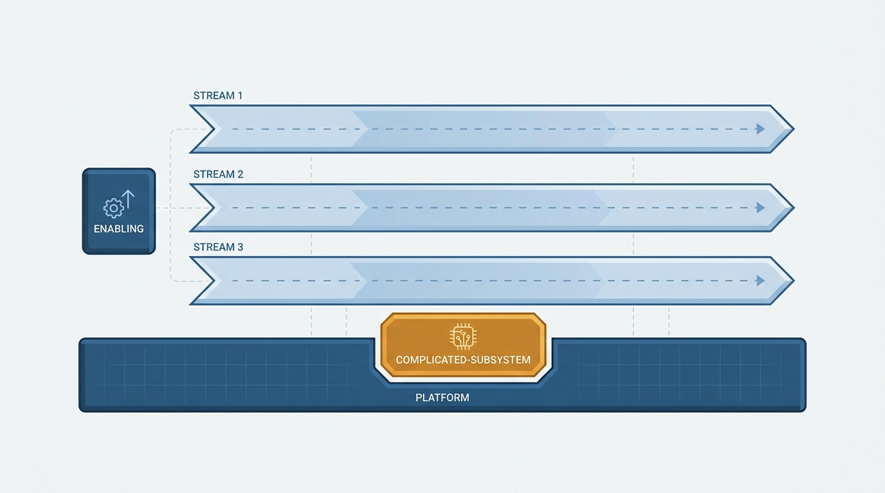
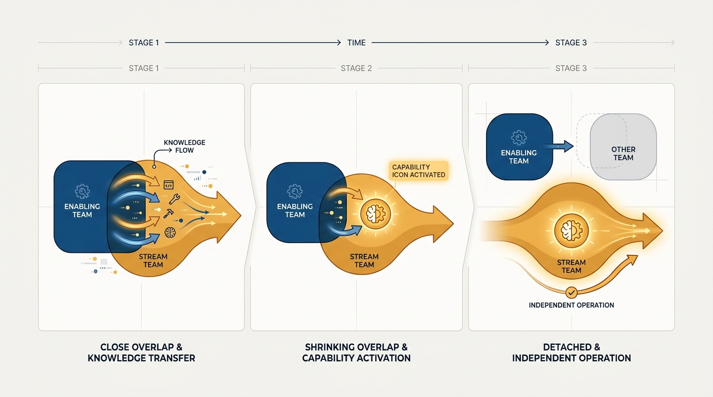
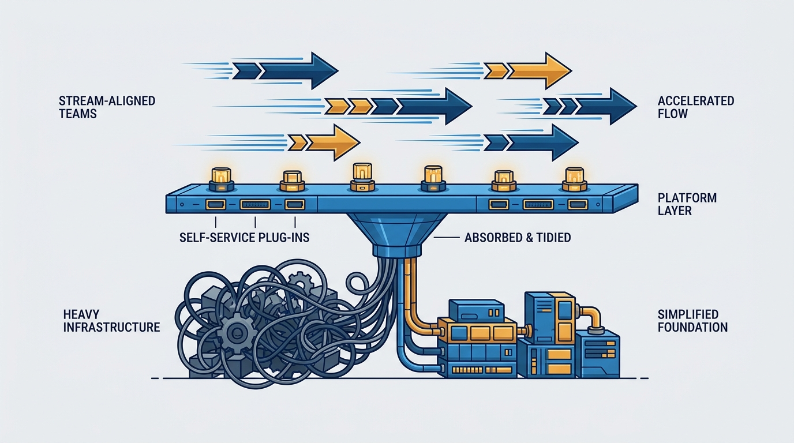

> **Status**: DRAFT
>
> **Principle**: I build organizations from exactly four team types: stream-aligned teams that own a flow of change end to end — the overwhelming majority — enabling teams that grow capability in other teams and then step away, complicated-subsystem teams only where deep specialism genuinely demands one, and platform teams that run the platform as an internal product whose sole job is to make stream-aligned teams faster. Any team that cannot name its type has an ambiguity problem, and ambiguity problems are mine to fix.

## Statement

My operating model for team types has five parts:

- **Four types, no fifth.** Every team is stream-aligned, enabling, complicated-subsystem, or platform. Vague "support," "ops," or "shared services" teams without a clear topology do not persist — each gets a type or gets restructured.
- **Stream-aligned is the default and the majority.** A stream-aligned team owns a continuous flow of change — a product, service, or customer need — from idea to production, with long-term ownership. I aim for roughly 6:1 to 9:1 stream-aligned teams against everything else.
- **Enabling teams grow capability, then leave.** Their goal is the *autonomy* of the teams they help. Engagements are time-boxed; a permanent dependency on an enabling team is a failure of the enabling team.
- **Complicated-subsystem teams are rare and justified.** They exist only where a subsystem genuinely requires specialist expertise most stream-aligned teams could not safely carry — and only in small numbers.
- **The platform is a product.** Platform teams provide self-service internal services that reduce cognitive load for the streams. They start from a thinnest viable platform and are judged by whether their users move faster.

**Figure 1:** *The four types in their canonical layout: stream-aligned flows ride on the platform; enabling and complicated-subsystem teams support from the side.*

## How to Read This

This is an **appendix record**: unlike the core records in this journal, grounded in Will Larson's *The Engineering Executive's Primer*, this one is grounded in Matthew Skelton and Manuel Pais's *Team Topologies* — read here through an executive lens, complementing the Primer-grounded records. The book gives teams a shared vocabulary; I read it as the executive who enforces that vocabulary, because a taxonomy only constrains an organization if someone refuses to approve teams outside it. If you lead teams in my organization, this record explains why every team charter names one of four types, and why "we're kind of a hybrid" is a question, not an answer. The working checklist — organization-level checks, per-type checks, and the conversion guides — lives in the **Checklist** tab of this post.

## Rationale

**A closed vocabulary forces every team's purpose into the open.** With an open-ended set of team types, each new problem breeds a new bespoke team — a tools team here, a shared-services team there — until nobody can explain who owns what. Four types is a deliberately small budget. When a proposed team fits none of them, that friction is the design working: either the purpose is unclear, or the responsibility belongs inside an existing stream.

**Flow is the thing being optimized, not utilization.** All four types serve one goal: a fast, safe, sustainable flow of change. That is why stream-aligned teams dominate — they are the only type that directly delivers value — and why the other three are legitimate only insofar as they make the streams faster. Teams stay loosely coupled, with minimal hand-offs. A supporting team that streams must wait on has inverted its purpose: support teams serve streams, they do not control them.

**Enabling that never ends is dependency, not enablement.** An enabling team's success metric is its own exit. It works with a stream-aligned team for a limited period, transfers the capability — a practice, a technology, a way of working — and steps away, sharing bad news about new tools as freely as good. The moment an enabling team becomes the permanent place where a certain kind of work goes, it is a bottleneck with a flattering name — or an ivory tower issuing guidance it never has to live with.

**Figure 2:** *Enabling done right: grow the capability, then step away — the engagement is time-boxed by design.*

**Specialism is a cost I pay only when I must.** A complicated-subsystem team — owning a video codec, a mathematical model, a reconciliation engine — is justified only when most stream-aligned teams could not safely change the subsystem and embedding the expertise everywhere would be impractical. It earns its keep by delivering higher quality and speed than the streams could themselves, collaborating closely during early exploration and reducing interaction once the subsystem stabilizes. Every such team adds a hand-off, so I keep their number small: a subsystem that has become teachable no longer warrants a dedicated team.

**A platform is a product or it is a tax.** What distinguishes a good platform team is how it behaves: it treats internal teams as customers, provides self-service APIs and task-focused documentation, defines support expectations, collects feedback, and measures developer experience. I insist on a thinnest viable platform — just big enough to accelerate the streams — because platforms naturally grow, dominate, and start dictating to the teams they exist to serve. Adoption is gradual and earned, not mandated on day one.

**Figure 3:** *The thinnest viable platform: a product layer judged by one measure — do the streams above it move faster?*

**Legacy team types get an explicit fate, not a quiet exemption.** Teams that predate the vocabulary each get a deliberate conversion path. Infrastructure teams move toward platform behavior — self-service, never owning application changes for others. Component teams are reviewed: dissolved into streams, or converted to platform, enabling, or complicated-subsystem teams — they do not exist merely because the architecture has a component. Tooling teams get a time-bound or product-oriented mission before drifting into isolated tool maintenance. Support aligns to streams of change, with dynamic swarming for cross-stream incidents, rather than centralizing production responsibility away from the people who build the software. And architecture becomes part-time enabling: architects support teams and shape APIs, boundaries, and interactions — considering Conway's Law — rather than imposing decisions from outside the flow.

## What This Means in Practice

| What this principle says | What it does **not** say |
| --- | --- |
| Every team is one of four types, named in its charter. | Existing teams are renamed overnight — conversion is deliberate, not cosmetic. |
| Most teams are stream-aligned, roughly 6:1 to 9:1. | The ratio is a law — it shifts the burden of proof, nothing more. |
| Enabling engagements are time-boxed; the goal is autonomy. | Enabling teams are cheap consultants to park hard problems with. |
| Complicated-subsystem teams exist only where specialism is proven. | Every gnarly module deserves its own team. |
| The platform is a product with users, feedback, and a thin scope. | The platform is mandatory, ever-growing, or above criticism. |
| Supporting teams serve streams and reduce their cognitive load. | Streams may outsource operating their own software wholesale. |

Concretely: no team is chartered without naming its type, ownership area, and interaction model. Reorg proposals are judged first on whether they improve flow of change, not utilization. Stream-aligned teams can build, run, and monitor their service in production, with specialists collaborating across skill boundaries rather than becoming internal hand-off stages. And once a year I re-run the health check: is the ratio holding, are enabling teams actually leaving, does each complicated-subsystem team still deserve to exist, and is the platform still thin?

## Anti-Patterns

- **The team-type zoo.** Tiger teams, tools teams, shared-services groups, standing committees — each with a bespoke charter nobody can state.
- **The vague ops team.** A "support" or "ops" team with no topology, absorbing whatever has no owner, becoming a hand-off stage for everyone.
- **The enabling team that never leaves.** Specialists who become the permanent place a capability lives, so streams never learn it — dependency dressed as help.
- **The subsystem land-grab.** Declaring every complicated-looking module a complicated subsystem, multiplying hand-offs to protect specialist turf.
- **The platform empire.** A platform grown past its thinnest viable scope, mandating adoption, slowing the streams it was built to accelerate.
- **Functional silos as stages.** Testing, QA, database, architecture, or operations as mandatory hand-off gates, so work pauses waiting for another silo.
- **Component teams by inertia.** A team existing because the architecture diagram has a box there, not because the box reduces anyone's cognitive load.

## Related Records

- [[organizational-design]] — appendix sibling on sizing and investment; this record supplies the vocabulary of team *purposes* those mechanics operate on.
- [[run-engineering-processes]] — the process layer that keeps team charters and health checks actually happening.
- [[static-team-topologies]] — appendix sibling on choosing a topology for a specific context; this record defines the types it chooses among.
- [[team-interaction-modes]] — appendix sibling on *how* the four types interact: collaboration, X-as-a-Service, facilitating.
- [[team-first-boundaries]] — appendix sibling on cognitive load and boundary sizing, the constraint the four types are designed to respect.

## Scope and Revisiting

This principle governs the vocabulary of team types in my organization: how teams are chartered, how legacy teams are converted, and how supporting teams are held to their supporting role. I revisit it whenever a proposed team resists classification, whenever the stream-aligned ratio drifts well outside 6:1 to 9:1, and at the yearly health check. The types are stable; the assignment of any given team to a type is not — that is what [[static-team-topologies]] is for.

## Authoritative References

- Matthew Skelton and Manuel Pais, *Team Topologies: Organizing Business and Technology Teams for Fast Flow* (IT Revolution Press, 2019) — the chapters on the four fundamental topologies this record's checklist distills.
- The authors maintain further materials, training, and updated patterns at [teamtopologies.com](https://teamtopologies.com/).
