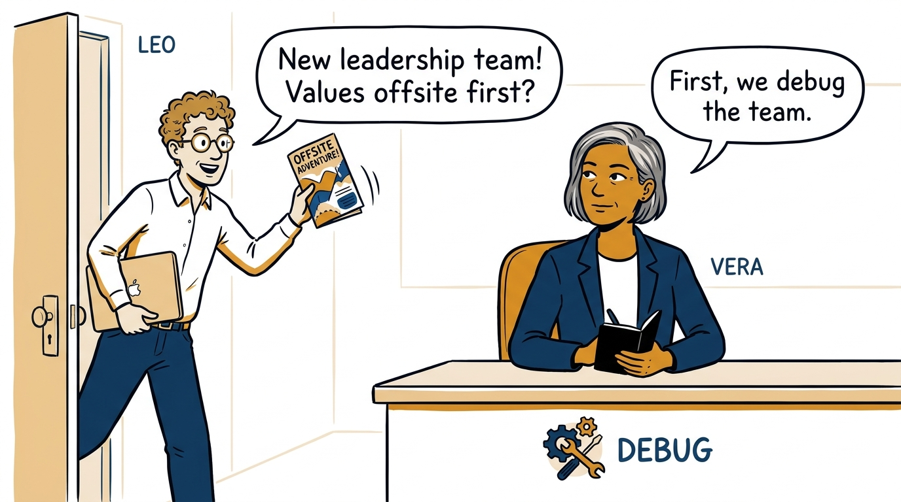
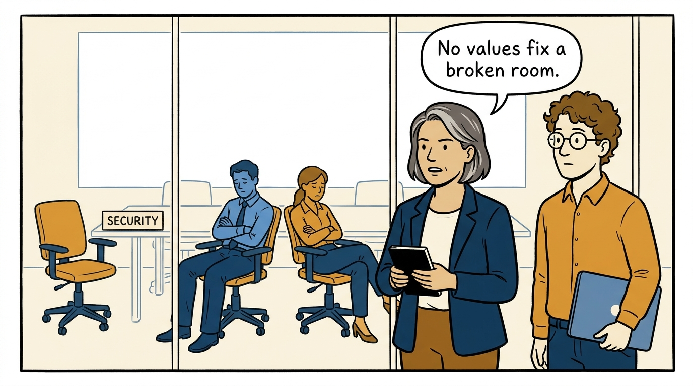
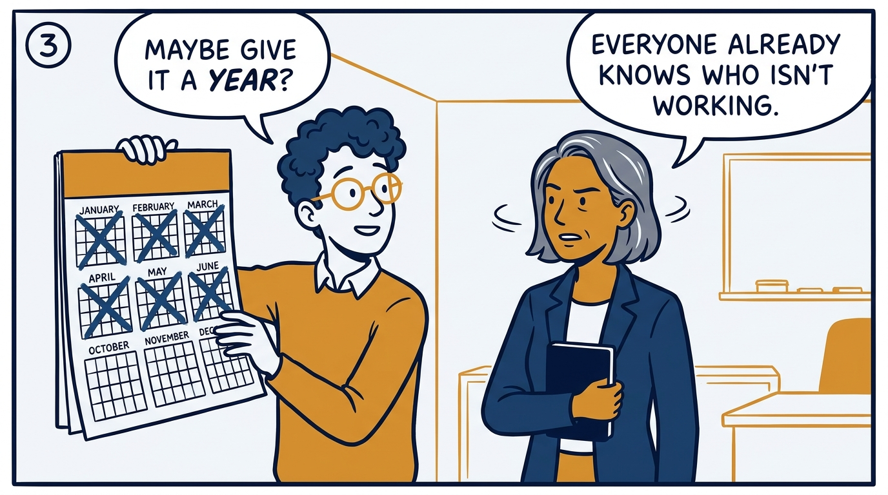
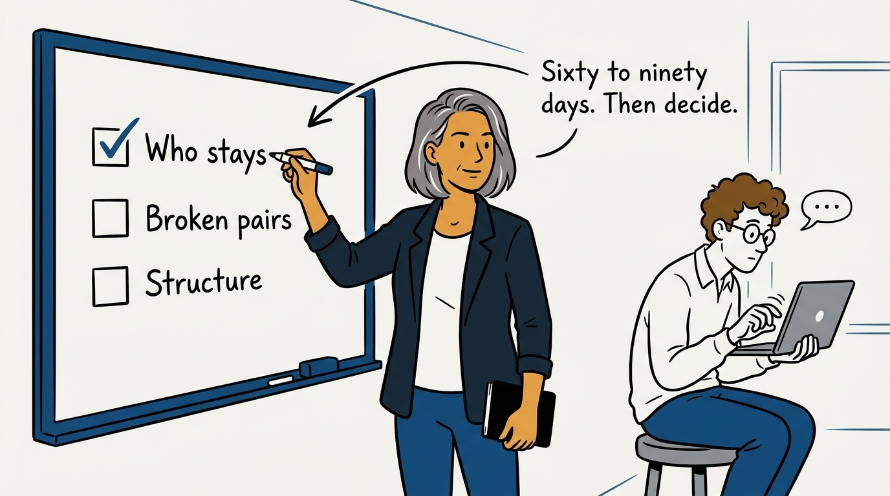
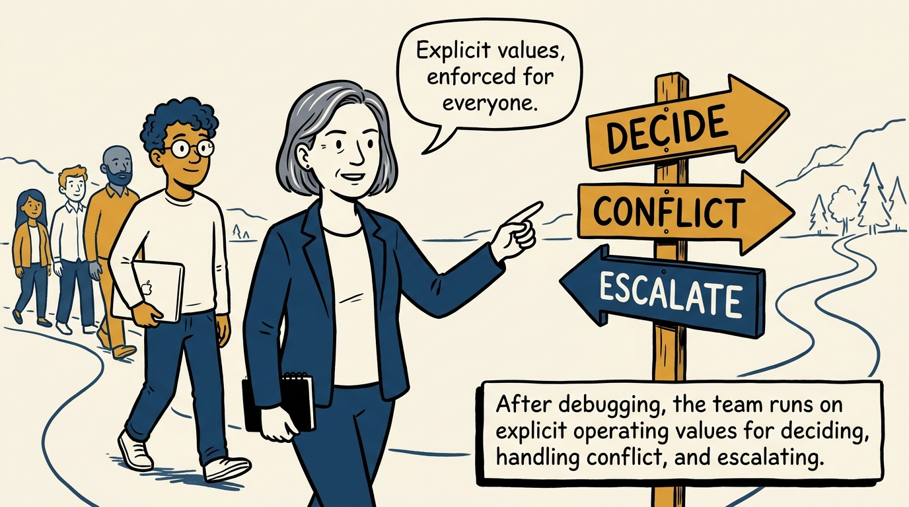
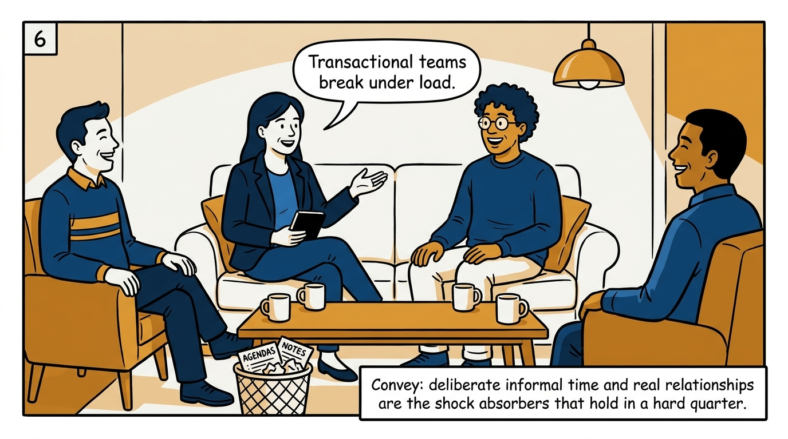
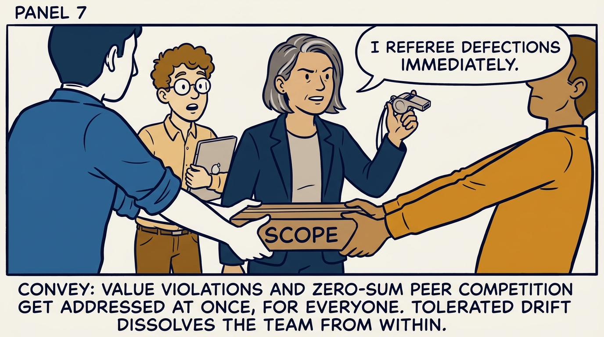
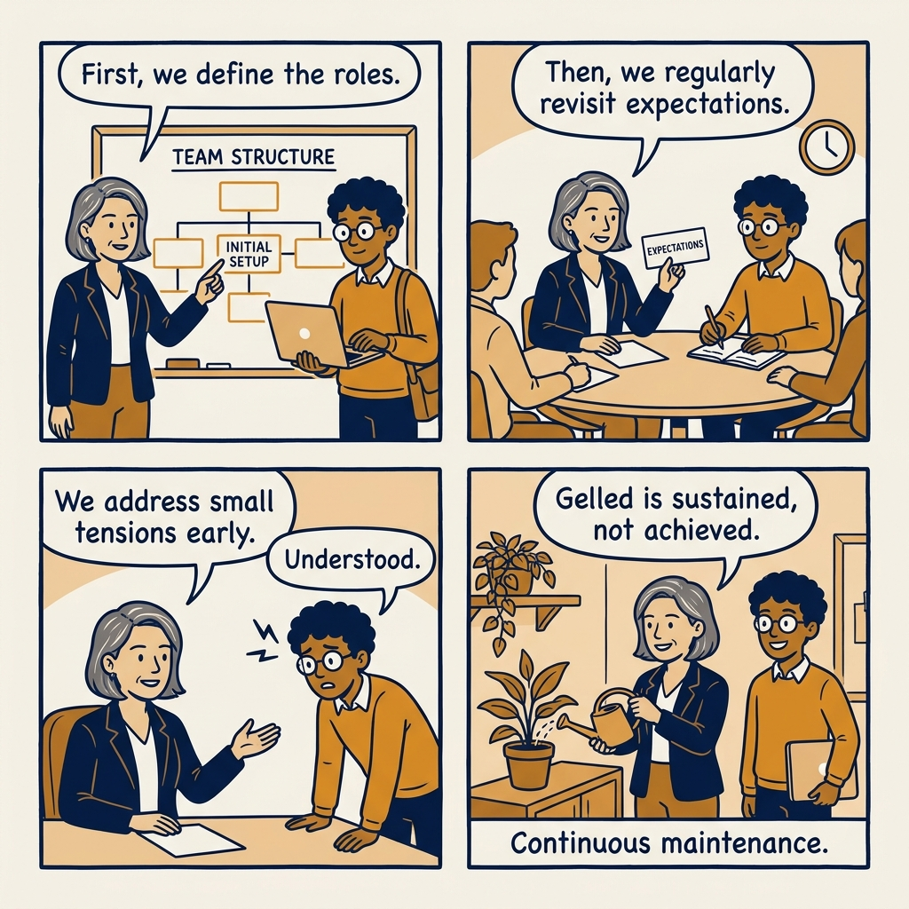

How a leadership team actually gels — debug it first, then operate it, then keep maintaining it.

<!-- comic-style
{
  "cast": "VERA: a calm, seasoned engineering executive, short gray-streaked hair, dark blazer over a plain t-shirt, carries a small black notebook. LEO: an eager young engineering manager, curly hair, round glasses, laptop under one arm.",
  "style": "Clean two-tone explainer comic, thick ink outlines, flat colors with deep blue and amber accents on a light background, generous white space, hand-lettered speech bubbles with SHORT readable text, no photorealism."
}
-->

**Panel 1:** *The tempting first move is a values offsite; the correct first move is debugging.*

**Panel 2:** *No amount of shared values compensates for broken composition, relationships, or structure.*

**Panel 3:** *Anti-pattern: knowing by month two and acting in month nine.*

**Panel 4:** *The principle: debug composition in the first 60-90 days, then act decisively.*

**Panel 5:** *Operate on explicit values: how we decide, handle conflict, and escalate.*

**Panel 6:** *Informal time is not a soft extra; it is the shock absorber.*

**Panel 7:** *Referee value violations immediately; never let collaboration curdle into rivalry.*

**Panel 8:** *Closer: a gelled team does not stay gelled on its own.*
