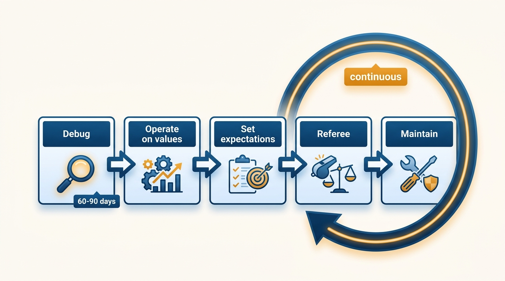
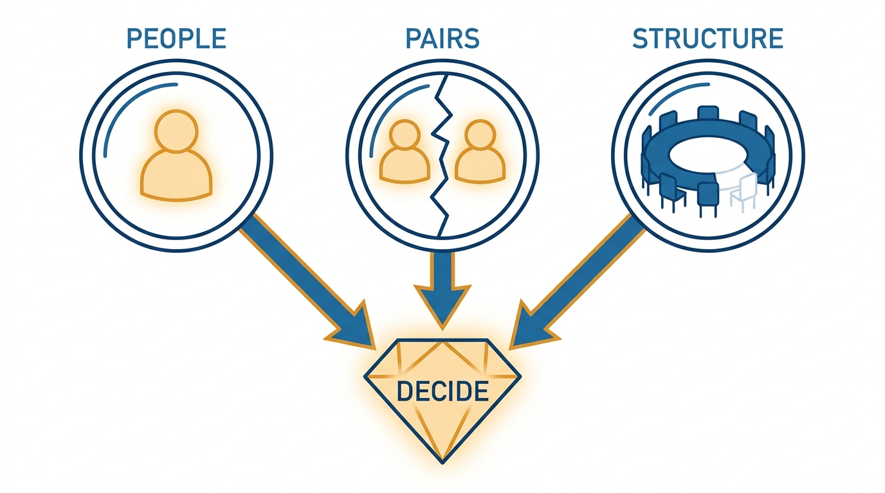
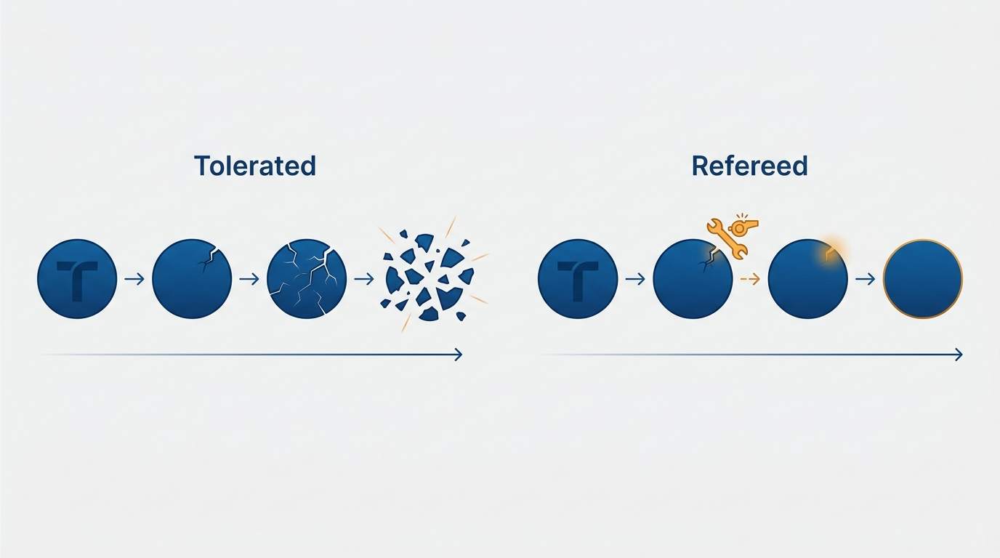

> **Status**: DRAFT
>
> **Principle**: A leadership team is built and maintained, never assumed. In my first 60–90 days I debug the team — assessing who should stay, which relationships are broken, and whether the structure brings the right leaders and domains into the room — and I act decisively on what I find, because early personnel decisions reset team dynamics. I then operate the team on explicit values (how we decide, how we handle conflict, when we escalate), clear structure and rituals, and deliberate space for human connection. I set explicit expectations for how members lead, work with peers, and navigate me; I referee defections from values immediately; and I keep maintaining the team, because a gelled team does not stay gelled on its own.

## Statement

The leadership team is my primary instrument as an executive, and it goes through a deliberate lifecycle:

- **Debug first (first 60–90 days).** I assess the current team: who may need to move on — distinguishing behavioral issues and active damage from simple underperformance — which relationship pairs are broken, whether the org structure brings the right leaders into the room, and whether key domains (Data, Security, Infrastructure) and the technical perspective itself are properly represented. I form hypotheses, actively try to disprove them, validate through 1:1s and observation — then act decisively.
- **Operate on explicit values.** How decisions are made, how conflicts are navigated, when to escalate versus resolve directly — clarified, aligned with company values, documented if helpful, and enforced consistently.
- **Give the team structure and humanity.** Recurring meetings and rituals, clear information flow from the exec team, explicit escalation pathways, a defined update cadence — and deliberate informal, unstructured time, because purely transactional relationships do not hold under pressure.
- **Set explicit expectations for members.** How they lead their teams and are evaluated (execution versus firefighting versus vision); how they engage cross-functionally and handle peer conflict; when to resolve versus escalate; that they build strong leadership teams of their own — "turtles all the way down"; and how to navigate me, including my working style, decision philosophy, and stakeholder priorities.
- **Referee defections immediately.** Value violations get addressed at once, consistently, for everyone — tolerated drift dissolves the team faster than any external pressure.
- **Prevent internal competition.** I watch for collaboration curdling into zero-sum rivalry, address perceived lack of opportunity, and reinforce that future capacity exceeds current capacity.
- **Maintain continuously.** Expectations revisited, composition re-evaluated periodically, values reinforced weekly, small tensions addressed before they grow.

**Figure 1:** *The leadership team lifecycle: debug first, operate deliberately, and maintain continuously — the loop never closes.*

## How to Read This

This record is for members of my engineering leadership team, present and future: it tells you what I expect, how the team operates, and why I act quickly on composition. It applies recursively — I expect each of you to run your own leadership team the same way. The working checklist — the debugging sequence, the operating mechanics, the member expectations, the maintenance rhythm — lives in the **Checklist** tab of this post.

## Rationale

**Gelling starts with debugging, not with values.** The tempting first move is a values offsite; the correct first move is an honest audit of composition. No amount of shared values compensates for a member actively damaging the team, a broken relationship pair poisoning every meeting, or a structure that leaves Security unrepresented and the technical perspective absent from the room. The debugging window is the first 60–90 days — the same window as [[first-90-days]], but focused on the team — and it ends in decisions, not observations.

**Figure 2:** *The debugging audit looks through three lenses — people, relationship pairs, and structure — and ends in decisions, not observations.*

**Early decisive personnel action resets team dynamics.** Everyone on the team already knows who is not working out; what they are watching is whether I know, and whether I will act. Moving quickly on the members who won't be part of the long-term team — and setting clear expectations for those who remain — resets the dynamics in a way slow-motion tolerance never does. Deferred personnel decisions do not age into easier ones; they age into a team that has learned the stated standards are negotiable.

**Unaddressed violations and peer competition dissolve teams from within.** A leadership team rarely fails by external shock; it fails by erosion. One tolerated value violation teaches everyone the values are decorative. Collaboration drifts into internal competition when members perceive opportunity as zero-sum — so I address the perception directly, create non-zero-sum growth paths, and reinforce that the organization's future capacity is larger than its current one. Refereeing is not an occasional intervention; it is a standing duty.

**Figure 3:** *Teams rarely fail by shock — they erode; refereeing the first defection is what keeps the circle whole.*

**Transactional teams fail under load.** A team whose members only meet inside agendas has no reserve to draw on when a hard quarter arrives. Deliberate informal time and genuine relationships are not soft extras; they are the shock absorbers. The same logic scales down: each member owes their own team the same investment, which is why "turtles all the way down" is an explicit expectation and not a slogan.

## What This Means in Practice

| What this principle says | What it does **not** say |
| --- | --- |
| Debug composition in the first 60–90 days and act decisively. | Clean house by default — the bar for moving someone out is behavioral damage, not unfamiliarity. |
| Move quickly on members who won't be part of the long-term team. | Skip diligence — hypotheses are actively disproven through 1:1s and observation first. |
| Define and enforce explicit team values. | Write a values poster — undocumented but consistently enforced beats documented and ignored. |
| Create space for human connection. | Mandate friendship — I build the conditions; the relationships are the team's to grow. |
| Referee value violations immediately, for everyone. | Zero tolerance for disagreement — conflict inside the values is healthy; defection from them is not. |

One concrete expectation deserves emphasis: members should not have to reverse-engineer me. I clarify my working style — risk tolerance, process preference — share my decision-making philosophy, make stakeholder prioritization explicit, and consider maintaining a personal README, per [[leadership-styles]].

## Anti-Patterns

- **Tolerating repeated behavioral drift.** Letting a member violate team values again and again because they are senior, tenured, or hard to replace — the fastest way to teach the team that the values are fiction.
- **The values offsite before the composition audit.** Investing in alignment rituals with a team whose membership, relationships, or structure are the actual problem.
- **Slow-motion personnel decisions.** Knowing by month two who won't be part of the long-term team and acting in month nine — spending the intervening months of team trust for nothing.
- **Purely transactional relationships.** A leadership team that only convenes around agendas and escalations, with no informal fabric — functional in calm weather, brittle in a crisis.
- **Letting collaboration curdle into competition.** Ignoring the signs of zero-sum behavior — hoarded scope, positioning against peers — until the team is a collection of rivals sharing a meeting.
- **The unrepresented domain.** Running a leadership team where key domains or the technical perspective itself have no seat, then wondering why decisions keep getting relitigated by reality.

## Related Records

- [[working-with-your-ceo-peers-and-engineering]] — the executive table around and above me; this record covers the team that reports to me.
- [[first-90-days]] — the ramp whose team-debugging slice this record takes long-term.
- [[organizational-values]] — the values of all of engineering; this record covers the leadership team's own working values.
- [[inspected-trust]] — a gelled team is one where inspection reads as support, not suspicion.
- [[leadership-styles]] — the working-style clarity (including a personal README) that members use to navigate me.

## Scope and Revisiting

This principle governs the leadership team reporting to me in any executive role — its composition, operation, and maintenance. The debugging phase recurs whenever the team materially changes: a reorganization, a merger, several new members. Beyond that, the maintenance rhythm *is* the revisiting: expectations revisited regularly, composition re-evaluated periodically, and the record itself reviewed when small tensions stop surfacing — silence being the more worrying signal.

## Authoritative References

- Will Larson, *The Engineering Executive's Primer* (O'Reilly, 2024) — the "Gelling Your Engineering Leadership Team" chapter this record's checklist distills; the principle above is my operating commitment to it.
- Will Larson, [Gelling your Engineering leadership team](https://lethain.com/gelling-engineering-leadership-team/) — the freely available companion essay.
