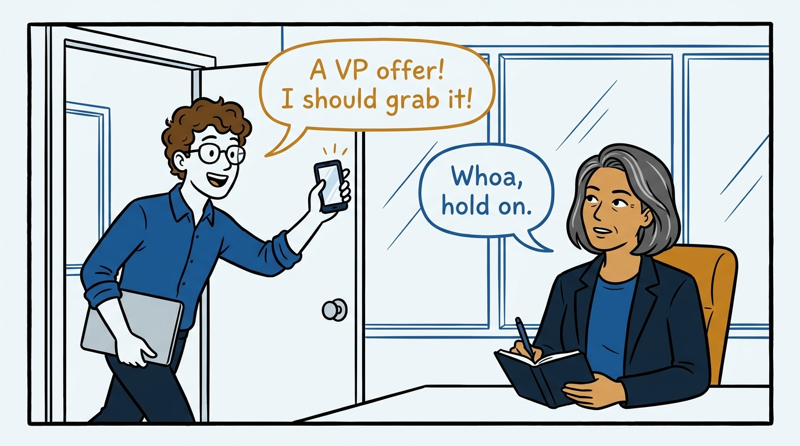
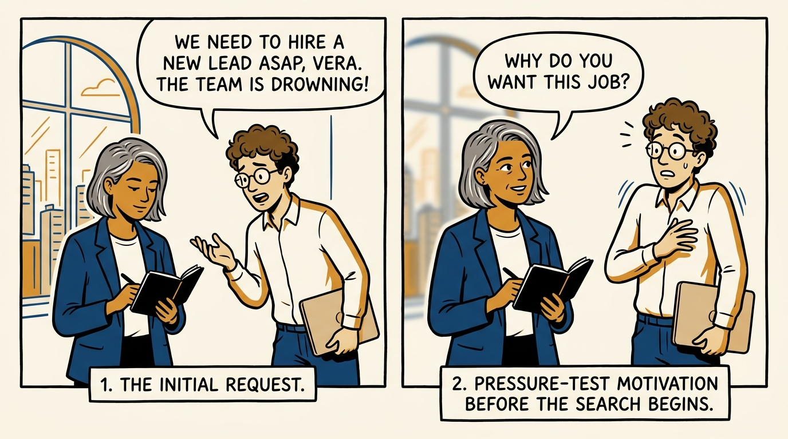
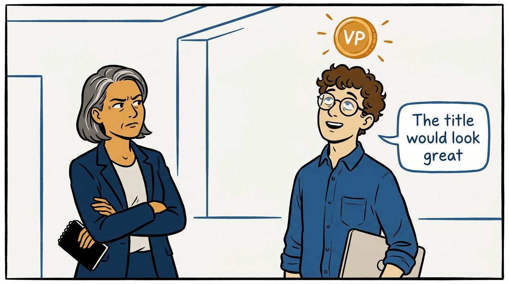
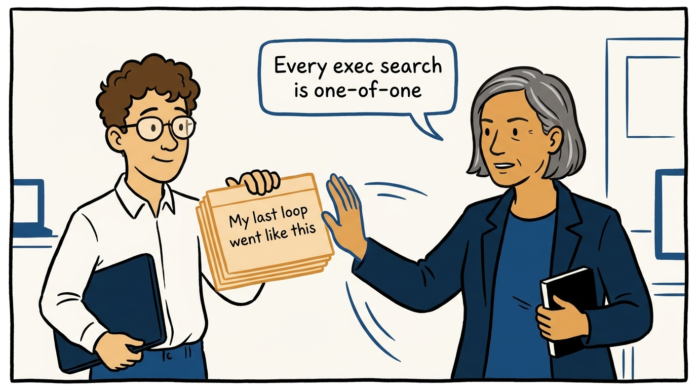
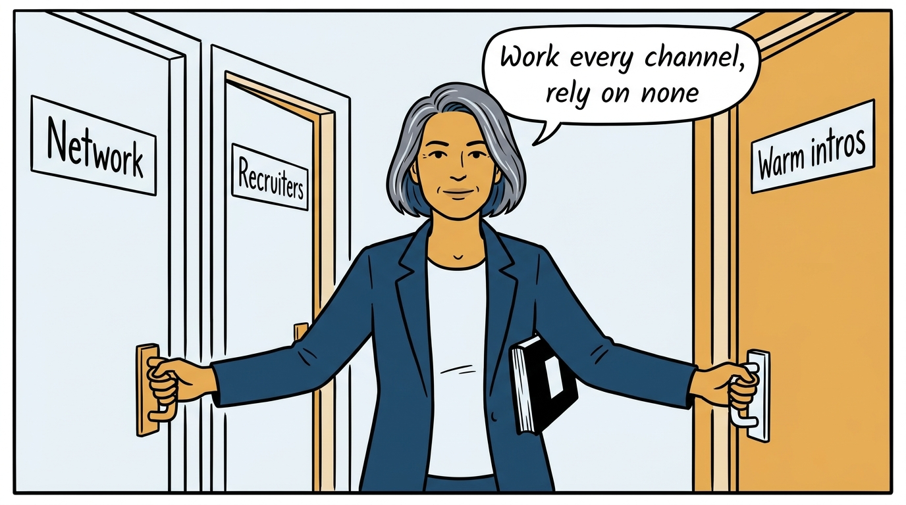
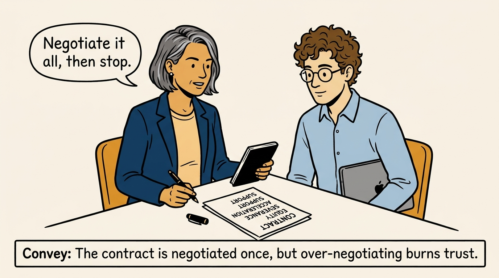
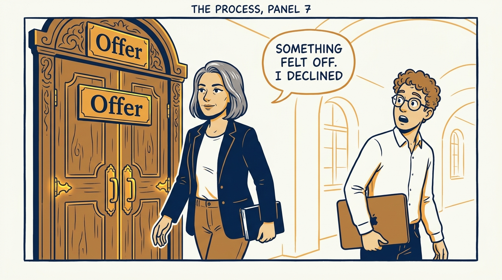
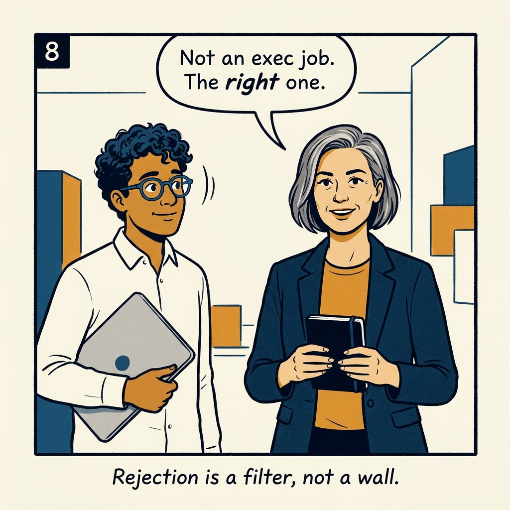

How I search for an executive role — the right one, not any one — in eight panels.

<!-- comic-style
{
  "cast": "VERA: a calm, seasoned engineering executive, short gray-streaked hair, dark blazer over a plain t-shirt, carries a small black notebook. LEO: an eager young engineering manager, curly hair, round glasses, laptop under one arm.",
  "style": "Clean two-tone explainer comic, thick ink outlines, flat colors with deep blue and amber accents on a light background, generous white space, hand-lettered speech bubbles with SHORT readable text, no photorealism."
}
-->

**Panel 1:** *The temptation: an executive offer appears, and grabbing it feels obvious.*

**Panel 2:** *First question, before any search: an honest, pressure-tested 'why'.*

**Panel 3:** *The wrong way: chasing the title degrades the search to 'whoever says yes first'.*

**Panel 4:** *The principle: every executive search is one-of-one — past loops predict nothing.*

**Panel 5:** *How it plays out: activate every channel — the best roles never reach a job board.*

**Panel 6:** *Negotiate the full contract once — and stop before negotiation spends the trust the role runs on.*

**Panel 7:** *The cost of the principle: sometimes diligence means declining — and that is the process working.*

**Panel 8:** *The closer: the goal is not an executive job — it is the right one.*
