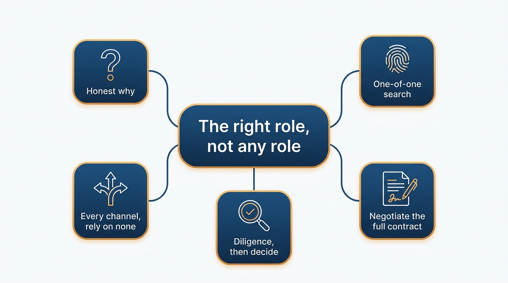
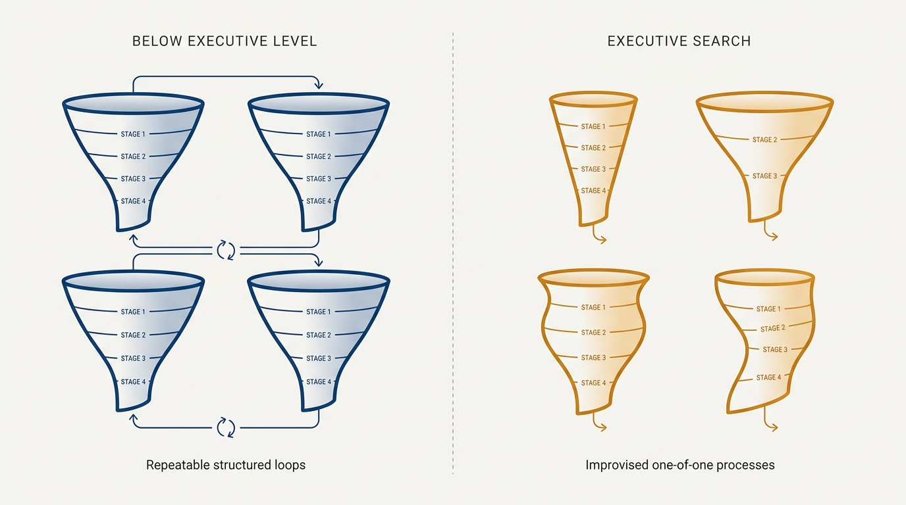
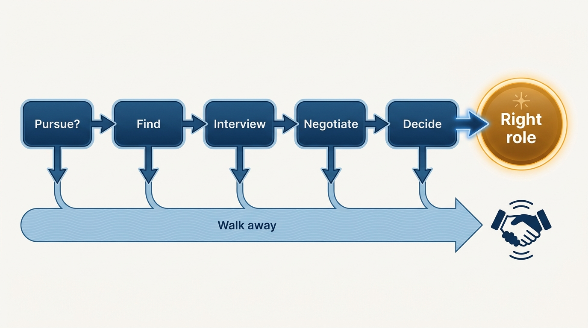

> **Status**: DRAFT
>
> **Principle**: I pursue the *right* executive role, not *an* executive role. I start by pressure-testing why I want the job at all, treat every search as a one-of-one process that past interview loops cannot predict, work my network and recruiters without relying on either alone, and negotiate the full contract — equity, acceleration, severance, role support — without over-negotiating trust away. I keep the freedom to walk away at every stage, because rejection is not failure; it is filtering toward a better fit.

## Statement

Before I pursue an engineering executive role, I make a small number of commitments to myself:

- **Start with an honest "why".** I articulate why I want the role, and I make sure the rationale is positive — growth, impact, learning — not ego or status. I pressure-test that reasoning with trusted peers, and I confirm I am motivated by the work, not just the title.
- **Treat the search as one-of-one.** Executive searches are unstructured and variable; role definitions differ significantly across companies. I do not over-generalize from past interview experiences.
- **Work every channel, rely on none.** I activate my network, build relationships with recruiters, and seek warm introductions through investors, founders, and operators — knowing the best roles often never reach a recruiter or a job board.
- **Negotiate the full contract.** Compensation, equity, acceleration, severance, bonus, start date, and role support all get clarified before I sign — and I stop before negotiation damages the trust the role will run on.
- **Do the diligence, then decide.** Time with the CEO, a conversation with a board member, meetings with every executive I will work with, the recent P&L, recent executive departures — and the willingness to walk away if something feels off.

**Figure 1:** *The five commitments of the search, all serving one stance: the right role, not any role.*

## How to Read This

This record is a vision of how I approach a search, not advice on how anyone else should run theirs. If you are a recruiter, CEO, or board member, it tells you how I will evaluate an opportunity — and that my questions are diligence, not hesitation. The working checklist — the concrete moves at each stage, from deciding to pursue the role to handling rejection — lives in the **Checklist** tab of this post.

## Rationale

**Executive searches are one-of-one.** Below the executive level, interviews are structured and comparable; at this level, every search is different. Role definitions vary significantly across companies, processes are improvised, and the signals are noisy — confidence is common in these rooms, and I have to discern substance from bravado, in others and in myself. Because the process is one-of-one, past interview loops are weak predictors, and preparation still matters: structured storytelling, a clear executive presentation of vision plus first 90 days, and thoughtful follow-ups.

**Figure 2:** *Below the executive level, loops are structured and comparable; every executive search is one-of-one.*

**Motivation must be pressure-tested before the search starts.** A search run on ego or status produces the wrong acceptance criteria: it optimizes for getting *an* offer instead of finding the *right* role. So I write down why I want the job, check the rationale is about growth, impact, and learning, and ask trusted peers to challenge it. If I am chasing the title rather than the work, the best outcome is discovering that before an offer arrives, not after.

**The contract is negotiated once.** Severance and acceleration terms are nearly impossible to add later; the only time to negotiate them is before signing. So I clarify everything — base, bonus structure, equity form and vesting, single versus double trigger, severance duration, parental leave, start date, and the support the role needs to succeed. And then I stop: over-negotiating to the last term damages exactly the trust with the CEO that the role depends on from day one.

**Walking away is a feature of the process, not a defect.** The diligence before accepting — enough time with the CEO to trust their leadership and judgment, at least one board member, every executive I will regularly work with, the company's recent financials, the story behind recent executive departures — exists to make walking away possible. If something feels off and my key questions are not fully answered, I decline. And when a process ends in rejection, I reframe it the same way: the process filtered toward a better fit, and I maintain the relationships it created.

## What This Means in Practice

| What this principle says | What it does **not** say |
| --- | --- |
| Pressure-test the "why" before searching. | Ambition is suspect — growth, impact, and learning are exactly the right reasons. |
| Treat every search as one-of-one. | Skip preparation — structured stories and a crisp presentation still matter. |
| Negotiate the full contract, including severance and acceleration. | Extract every last term — over-negotiation spends the trust the role needs. |
| Do full diligence: CEO, board, peers, financials. | Delay indefinitely — once the key questions are answered, decide. |
| Be willing to walk away at every stage. | Treat rejection as failure — it filters toward the right fit. |

In practice the search follows an arc: **decide whether to pursue** (honest, pressure-tested motivation) → **find roles** (internal or external, through network and recruiters) → **interview** (preparation, presentation, mutual fit) → **negotiate** (the whole contract, without damaging trust) → **decide** (diligence, then a clear yes or a clean walk-away).

**Figure 3:** *The search arc: five stages, each with a legitimate walk-away exit — walking away is the process working.*

## Anti-Patterns

- **Chasing the title.** Pursuing the role for status or ego. The rationale fails the pressure test, and the acceptance criteria degrade to "whoever says yes first".
- **"My last loop went like this…"** Over-generalizing from past interview experiences into a process that is, by nature, one-of-one and different at every company.
- **Mistaking confidence for substance.** Executive processes are full of bravado — from candidates and from companies. Diligence exists to separate the two.
- **Recruiter-only search.** Relying solely on recruiters when the best roles are often filled through warm introductions and never reach them — and taking publicly posted executive roles at face value without investigating the context.
- **Over-negotiating trust away.** Winning every contract point while eroding the relationship with the CEO before day one.
- **Skipping the company's diligence.** Accepting without meeting the board, reviewing the P&L, or asking about recent executive departures — and discovering the answers on the job.

## Related Records

- [[first-90-days]] — everything after the signed offer: the learning quarter this search leads into.
- [[your-network]] — the network I activate here is curated long before any search begins.
- [[working-with-your-ceo-peers-and-engineering]] — trusting the CEO's leadership and judgment is the diligence question; this record is the working relationship it predicts.
- [[personal-and-organizational-prestige]] — the visible track record that makes warm introductions and recruiter relationships work.

## Scope and Revisiting

This principle governs my own pursuit of executive roles, internal or external. I revisit it after every search — accepted, declined, or rejected — to record what the diligence caught, what it missed, and whether the "why" I wrote down at the start still describes the role I ended up in.

## Authoritative References

- Will Larson, *The Engineering Executive's Primer* (O'Reilly, 2024) — the "Getting the Job" chapter this record's checklist distills; the principle above is my operating commitment to it.
- Will Larson, [Getting a job as an engineering executive](https://lethain.com/getting-engineering-executive-job/) — the freely available companion essay.
