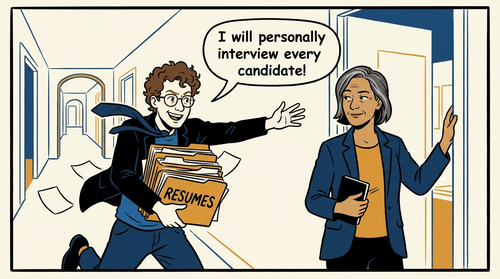
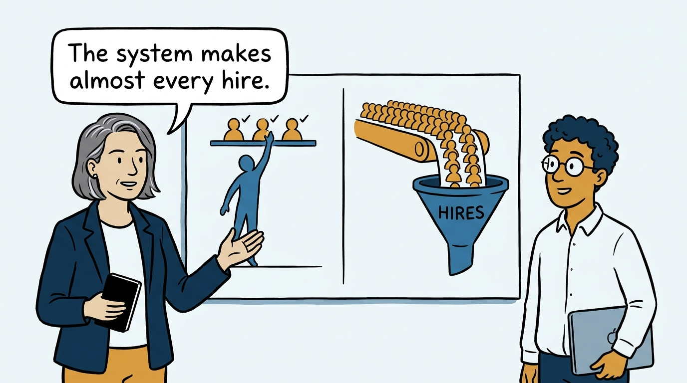
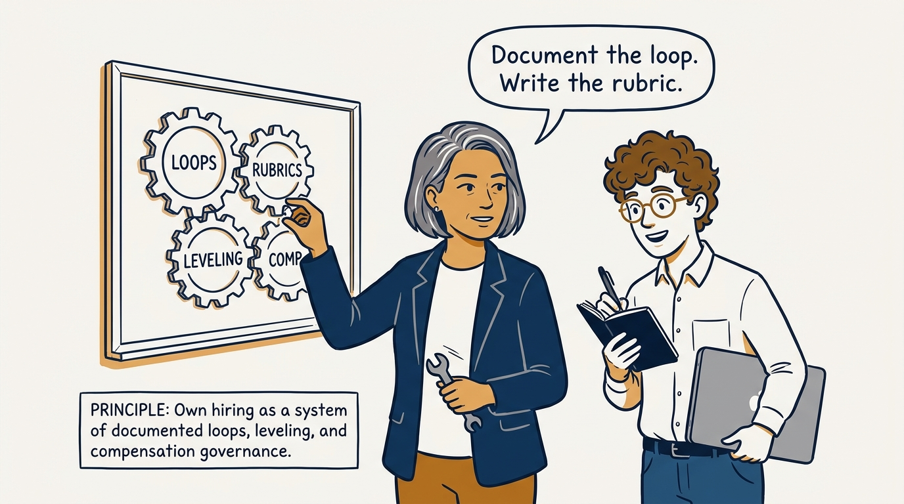
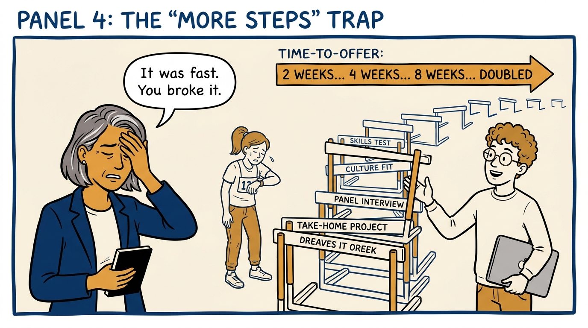
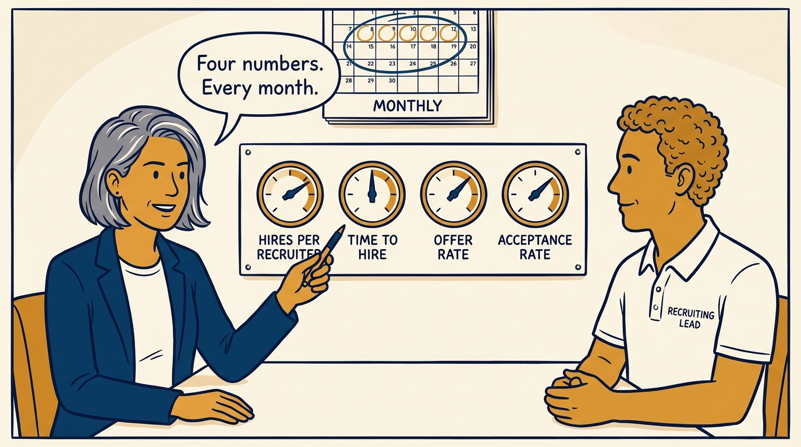

Why the executive's hiring leverage is the machine, not the heroics — in seven panels.

<!-- comic-style
{
  "cast": "VERA: a calm, seasoned engineering executive, short gray-streaked hair, dark blazer over a plain t-shirt, carries a small black notebook. LEO: an eager young engineering manager, curly hair, round glasses, laptop under one arm.",
  "style": "Clean two-tone explainer comic, thick ink outlines, flat colors with deep blue and amber accents on a light background, generous white space, hand-lettered speech bubbles with SHORT readable text, no photorealism."
}
-->

**Panel 1:** *The hook: hiring as heroics — the executive tries to be everywhere.*

**Panel 2:** *The problem: personal effort touches a few hires; the system touches them all.*

**Panel 3:** *The principle: own the machine — documented, governed, trained.*

**Panel 4:** *The wrong way: over-optimizing a process that was already fast and stable.*

**Panel 5:** *The instrument panel: four metrics, reviewed every month.*

**Panel 6:** *The exception: show up personally only where the executive is the unique value.*

**Panel 7:** *The closer: follow the process by default; break it deliberately, never accidentally.*
