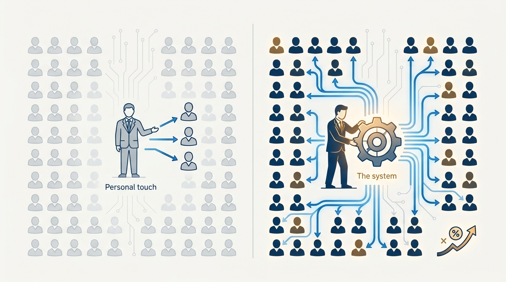
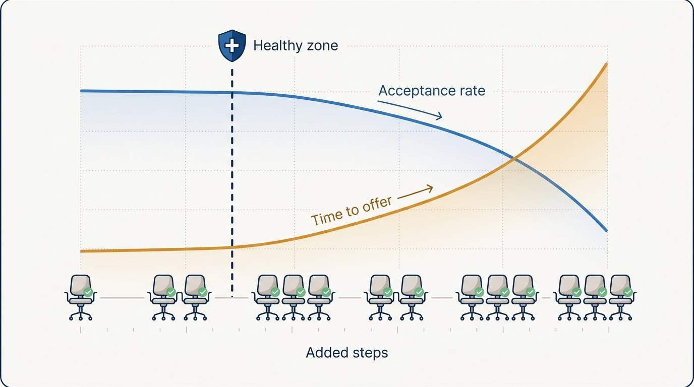

> **Status**: DRAFT
>
> **Principle**: I own hiring as a system, not as a series of heroics. My leverage is the machine: documented interview loops with explicit rubrics, a written leveling framework with clear accountability, centralized compensation governance, trained interviewers and hiring managers, and metrics reviewed monthly. I resist over-optimizing a process that is already fast and stable, and I engage personally only where an executive adds unique value — closing key candidates and reviewing out-of-band decisions. I follow the process by default, and break it deliberately when the business demands it — the system serves the business, not the other way around.

## Statement

Hiring is the highest-leverage system I run, and I run it as a system. My commitments:

- **Establish the process.** Every role has a documented hiring loop with clear ownership (recruiter, hiring manager, approvers), explicit interview problems and scoring rubrics, trained interviewers (shadow → reverse-shadow), a strong ATS as the coordination core, and job descriptions aligned with the leveling framework.
- **Write the leveling framework down.** Leveling is provisional early (phone screen plus experience heuristic), shapes the loop, and is finalized holistically — with clear accountability for the final decision and a defined escalation path.
- **Standardize compensation.** The recruiter calculates offers from structured guidelines; approvers review leveling and compensation together; in-band versus out-of-band rules are explicit; governance is centralized. We do not systematically overpay to "win" candidates.
- **Monitor and debug, monthly.** Recruiting updates in the weekly leadership meeting, a monthly hiring review with the recruiting lead, and four metrics reviewed monthly: hires per recruiter, time to hire, offer rate, acceptance rate.
- **Resist over-optimizing.** If recruiters are closing roughly five or more engineers a quarter, loops are stable, and time-to-offer is two weeks or less, the process is healthy — I require a high bar before adding steps and avoid bespoke loops.
- **Show up where the executive is the unique value.** Sell calls for senior candidates, personal support for strategically critical hires, review of out-of-band compensation requests — without slowing the process.
- **The system serves the business.** Follow the process by default; break it deliberately when necessary, weighing the cost of overriding against the cost of delay; refine it continuously.

**Figure 1:** *The hiring machine: a governed, instrumented pipeline — the executive touches it at exactly two points.*

## How to Read This

This record tells my hiring managers and recruiting partners what system I will build and hold them accountable to, and where I will personally engage. It is a vision of the executive role in hiring, not an interviewing handbook — question design and assessment craft live with the teams. The working checklist — process foundations, leveling, compensation governance, prioritization, training, diversity, brand, committees, and the executive quick diagnostic — lives in the **Checklist** tab of this post.

## Rationale

**The executive's leverage is the system, not the individual hire.** I might touch a handful of hires personally in a quarter; the system touches all of them. A written leveling framework, standardized compensation, documented loops, and trained interviewers improve every hiring decision made without me in the room — which is nearly all of them. Time spent making the system explainable, measurable, and consistent compounds; time spent substituting for it does not.

**Figure 2:** *Leverage: personal involvement touches a handful of hires; the system touches all of them, and compounds.*

**Over-optimizing a healthy process destroys the thing it optimizes.** Hiring processes accumulate steps the way codebases accumulate dependencies — each addition individually defensible, the sum slow and brittle. When throughput is healthy, loops are stable, and time-to-offer is fast, the correct move is to leave the process alone. I require a high bar before adding new interviews and resist unnecessary specialization, because speed and predictability are themselves competitive advantages in closing candidates.

**Figure 3:** *Over-optimization: each step is defensible alone; the sum doubles time-to-offer and drags acceptance down.*

**Governance beats heroics on compensation and leveling.** Case-by-case compensation "wins" compound into systematic overpaying and internal inequity; ad-hoc leveling compounds into title inflation and calibration debt. Centralized governance — structured offer guidelines, joint review of leveling and compensation, explicit out-of-band approval — keeps individual generosity from becoming structural unfairness. The same logic makes me cautious about hiring committees: they can help calibration at scale, but introduced casually they diffuse the accountability the system depends on. This is [[inspected-trust]] applied to hiring: the metrics review and approval visibility are the inspection forums of the hiring machine.

**Hiring managers are part of the system, and the system trains them.** Unicorn job requirements, unaccountable vetoes, constant pushes for non-standard compensation, indecisiveness stretching into endless interviews, delayed engagement with strong candidates — these are red flags I watch for and address with targeted training, clear decision timelines, and reinforced accountability, not with quiet workarounds.

**Balance is audited, not assumed.** Internal versus external hires, network hires versus open-market hires, representation across hiring, retention, and promotion — these drift unless tracked. I audit the balances periodically, hold Engineering leadership (not just recruiting) accountable for diversity, and keep engineering-brand investment proportional to actual hiring needs and tied to business outcomes.

## What This Means in Practice

| What this principle says | What it does **not** say |
| --- | --- |
| I own the hiring system and its metrics. | I drive individual hires — the system, not my calendar, closes most candidates. |
| I personally engage on senior sells and critical hires. | Every candidate gets executive attention — that would slow the process for no gain. |
| Follow the process by default. | Never break it — I break it deliberately when the business demands, weighing override cost against delay cost. |
| Resist adding steps to a fast, stable process. | Never change the process — I continuously refine it against metrics and outcomes. |
| Centralize compensation and leveling governance. | Rigidity on every offer — out-of-band exists; it is just visible and approved, not improvised. |

The health check is the executive quick diagnostic: we can explain our leveling framework, we know our monthly metrics, time-to-offer is fast and predictable, hiring managers are accountable, compensation is consistent, we are not over-relying on networks or committees — and the process feels intentional, not accidental.

## Anti-Patterns

- **Unicorn job requirements.** Role descriptions demanding a combination of skills no real candidate has, guaranteeing a pipeline that trickles and a hiring manager who blames the market.
- **The unaccountable veto.** Any interviewer able to kill a candidate without owning the decision — vetoes without accountability turn the loop into a lottery.
- **Systematic overpaying to "win."** Treating every negotiation as a must-win and compensating out-of-band by default, buying candidates at the cost of internal equity and a governance system nobody believes.
- **Committees as responsibility diffusion.** Introducing hiring committees so no one is accountable for a decision, rather than as a deliberate calibration tool with a clarified accountability structure.
- **Optimizing the healthy process.** Adding interview stages, bespoke loops, and novel assessments to a process that was already fast and stable — until time-to-offer doubles and acceptance rate follows.
- **Recruiters as rewards for weakness.** Reallocating recruiter bandwidth to the weakest hiring managers by default, teaching the organization that failing at hiring earns more hiring support.

## Related Records

- [[engineering-onboarding]] — where the hiring system hands off: everything after the accepted offer.
- [[first-90-days]] — the hiring review begun during my ramp becomes this ongoing operating rhythm.
- [[inspected-trust]] — the monthly metrics review and approval visibility are inspection applied to the hiring machine.
- [[run-engineering-processes]] — the hiring system is one of the clearly owned processes the organization runs on.
- [[measuring-engineering-organizations]] — hiring metrics are part of what I report and review.

## Scope and Revisiting

This principle governs engineering hiring wherever I am the accountable executive — the process, its governance, and my personal engagement in it. I revisit it when the monthly metrics degrade (the debug trigger), when company scale changes what the process must handle (committees and specialization earn reconsideration at scale), and whenever the quick diagnostic returns a "no" that persists across two reviews.

## Authoritative References

- Will Larson, *The Engineering Executive's Primer* (O'Reilly, 2024) — the "Hiring" chapter this record's checklist distills; the principle above is my operating commitment to it.
- Will Larson, [The Engineering executive's role in hiring](https://lethain.com/eng-exec-role-in-hiring/) — the freely available companion essay.
