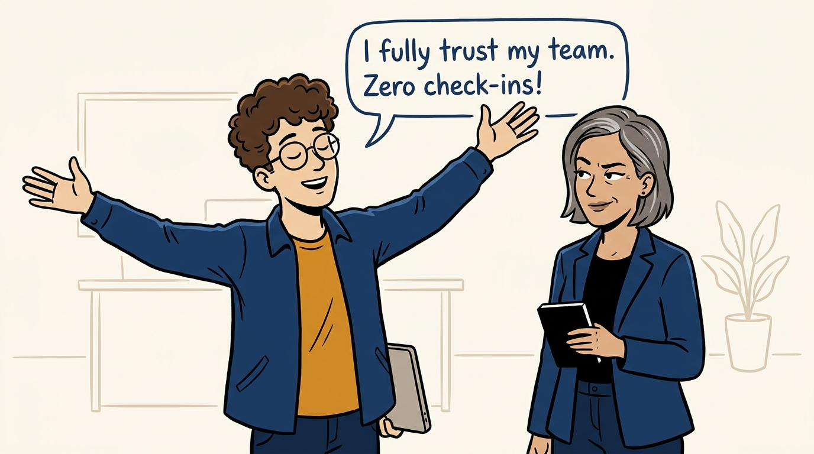
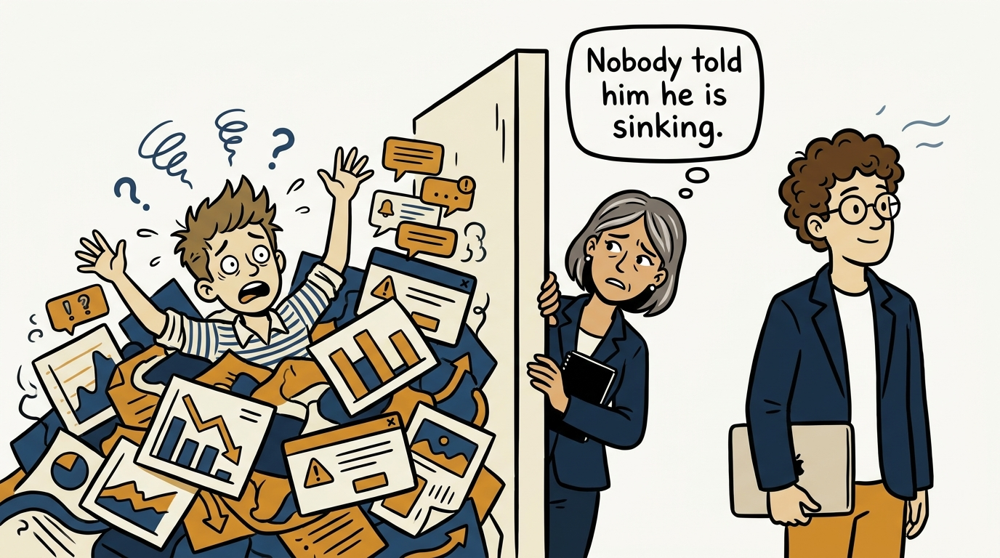
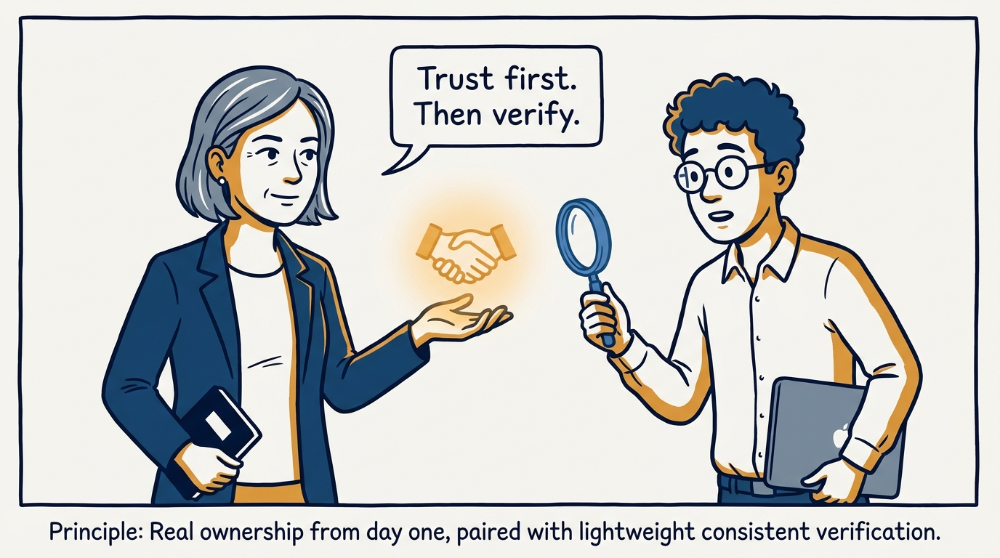
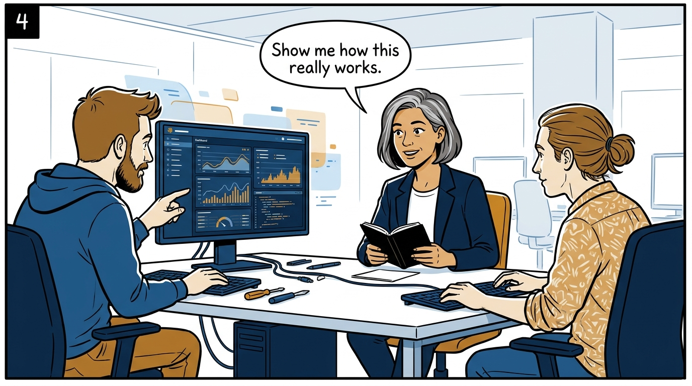
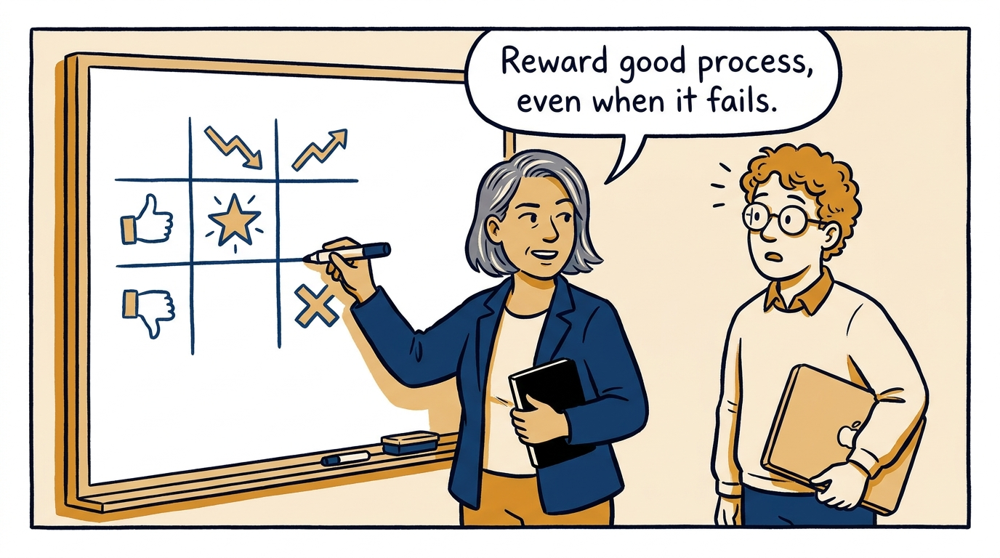
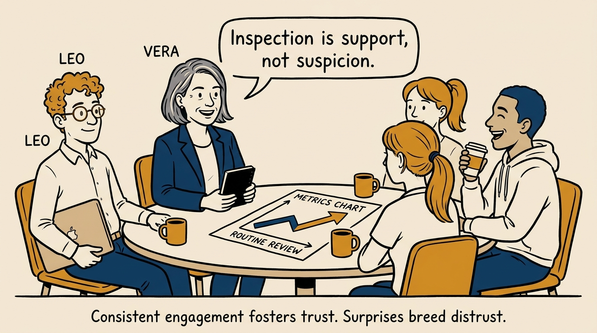
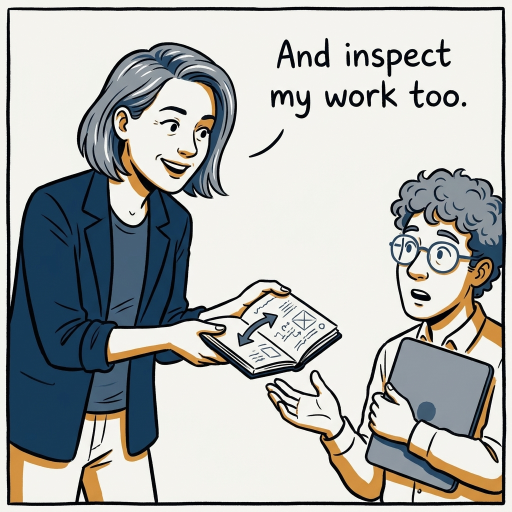

Trust first, then verify — why trust alone is an abdication, in seven panels.

<!-- comic-style
{
  "cast": "VERA: a calm, seasoned engineering executive, short gray-streaked hair, dark blazer over a plain t-shirt, carries a small black notebook. LEO: an eager young engineering manager, curly hair, round glasses, laptop under one arm.",
  "style": "Clean two-tone explainer comic, thick ink outlines, flat colors with deep blue and amber accents on a light background, generous white space, hand-lettered speech bubbles with SHORT readable text, no photorealism."
}
-->

**Panel 1:** *The hook: empowerment as the absence of any oversight.*

**Panel 2:** *The problem: letting someone fail without feedback is neglect, not respect.*

**Panel 3:** *The principle: inspected trust — trust first, then verify.*

**Panel 4:** *How it plays out: learning spikes — go to the work, not the summary.*

**Panel 5:** *The judgment test: good errors get protected, bad successes get no parade.*

**Panel 6:** *The tone: routine and consistent — that is what keeps inspection neutral.*

**Panel 7:** *The closer: inspection flows both ways.*
