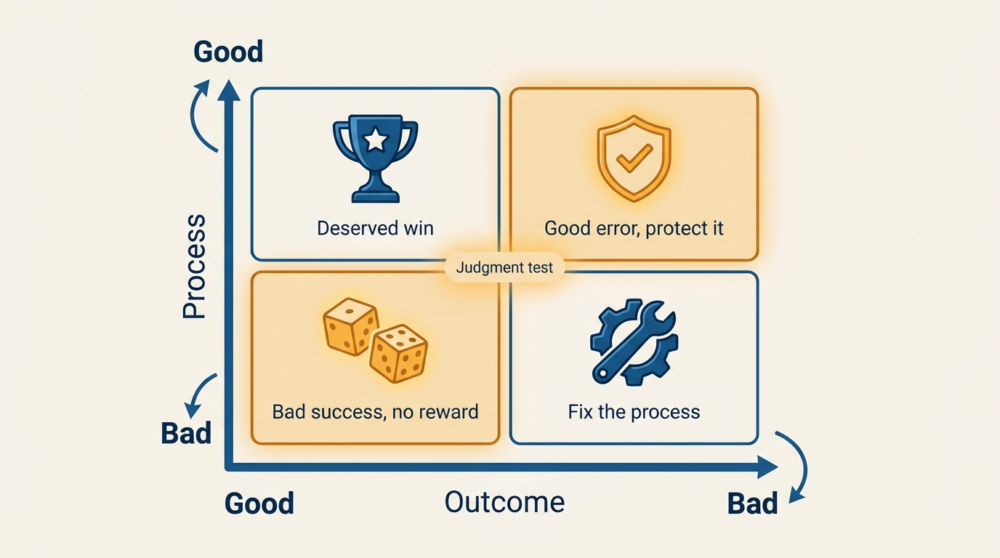
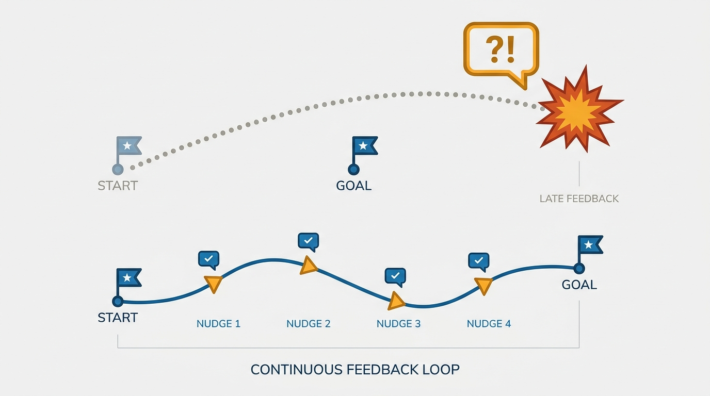
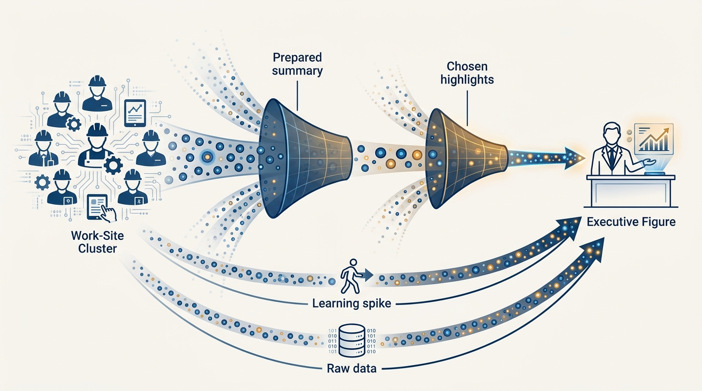

> **Status**: DRAFT
>
> **Principle**: I practice inspected trust: trust first, then verify. I do not rely on trust alone as a management technique, and I do not confuse empowerment with the absence of oversight. I separate the quality of judgment and process from the randomness of outcomes — rewarding good process even when outcomes fail, and refusing to reward bad process that got lucky. Inspection is support and accountability, not suspicion, and it is reciprocal: my own work is inspectable too.

## Statement

Trust is necessary and insufficient. My operating model has three parts:

- **Trust first.** People get real ownership and the benefit of the doubt from day one. Inspection does not mean I make their decisions.
- **Then verify.** I maintain lightweight, consistent mechanisms — metric review forums, learning spikes, direct engagement with data — that let me independently see how work is actually going, rather than relying solely on prepared narratives.
- **Judge process, not just outcomes.** Performance falls into four categories: good process with a good outcome; good process with a bad outcome (a *good error*); bad process with a good outcome (a *bad success*); and bad process with a bad outcome. The middle two are where leadership judgment is actually tested — I protect good errors and refuse to celebrate bad successes.

**Figure 1:** *The four performance categories: the off-diagonal — good errors and bad successes — is where leadership judgment is tested.*

## How to Read This

If you report to me, this record is the explanation you are owed in advance: when I ask detailed questions, look at raw data, or talk directly to people doing the work, that is the system working — not a signal that you have lost my confidence. Discomfort with inspection is worth talking about openly; persistent discomfort is usually a misalignment signal, and I treat it as something to explore, not to suppress. What "good" looks like — the standards themselves — is a separate record, [[calibrating-your-standards]]; this one is about how I verify without destroying trust. The working checklist, including the quarterly self-assessment, lives in the **Checklist** tab of this post.

## Rationale

**Blind trust fails the people it means to honor.** The common failure mode is a new leader "thrashing" for months while everyone politely assumes they will figure it out — until the damage is visible and the feedback arrives too late to be useful. Letting someone fail without feedback is not respect; it is neglect. Early, small course corrections are the kind thing, not the controlling thing.

**Figure 2:** *Feedback timing: months of silence then one heavy correction, versus early small course corrections that actually help.*

**Outcomes are noisy; judgment is the signal.** If I evaluate my leadership bench purely on outcomes, I promote the lucky and punish the unlucky. Separating process quality from outcomes lets me catch a bad decision process *before* it produces its inevitable bad outcome, and lets me keep backing a leader whose good decision happened to land badly.

**Narratives filter; data and proximity do not.** Every summary I receive was prepared by someone who chose what to include. So I keep small, diverse data sources: I go directly to the individuals doing the work (learning spikes), talk across functions, understand how the data in a report was prepared, and cross-reference new information against known sources. Not because people lie, but because filtering is structural.

**Figure 3:** *Narratives filter structurally: learning spikes and direct data engagement are the unfiltered lines of sight.*

**Misalignment compounds; confusion is a trust risk.** When something seems confusing or contradictory, I investigate immediately rather than letting it ride. When concerns are raised about a team or a leader, I assume there may be a real issue, validate it independently, seek multiple perspectives, consider what context I might be missing, form my own view before prescribing solutions — and close the loop with whoever raised the concern.

## What This Means in Practice

| What this principle says | What it does **not** say |
| --- | --- |
| Trust is paired with validation. | Trust is withheld until proven. It is granted first. |
| I engage directly with data and the people doing the work. | I make their decisions or redesign their work. |
| Discomfort with inspection is a signal to explore. | Discomfort is insubordination. |
| Good process is rewarded even when outcomes fail. | Outcomes don't matter. They matter — they are just not the whole signal. |
| Inspection is reciprocal — my work is inspectable. | Inspection flows only downhill. |

The concrete toolkit:

- **Inspection forums** — weekly or monthly metric reviews that track goals continuously (not quarterly-only), with genuine executive engagement, focused on outcomes *and* process quality.
- **Learning spikes** — short, direct dives: go to the individuals doing the work, talk across functions, look for omitted context and filtered information.
- **Direct engagement with data** — understand how the data was prepared, identify reporting bias, cross-reference against known sources.
- **Intolerance for misalignment** — investigate confusion immediately; resolve ambiguity before it compounds.

When introducing this into a culture that has not had it: start with one or two critical problems rather than everywhere at once, confirm executive peer tolerance first, frame inspection as a long-term investment in the team's success, be explicit that inspection is not distrust — and expect, and withstand, defensive reactions.

## Anti-Patterns

- **Empowerment as absence.** "I trust my leaders" used as a reason to have no visibility at all — until the surprise arrives.
- **Damage before feedback.** Waiting for a failure to become undeniable before saying anything, then delivering all the accumulated feedback at once.
- **Rewarding bad successes.** Celebrating an outcome that good luck rescued from a bad process — which teaches the organization that process doesn't matter.
- **Punishing good errors.** Treating a sound decision with an unlucky outcome as incompetence — which teaches the organization to hide risk.
- **Inspection as ambush.** Springing deep-dives only when something is already wrong, so inspection *is* a signal of distrust — the consistent, routine version is what makes it neutral.
- **One-way inspection.** Inspecting the organization while treating my own work as beyond question.

## Related Records

- [[calibrating-your-standards]] — what "good" looks like; this record is how I verify against it.
- [[first-90-days]] — the trust reservoir built during the ramp is what inspection draws on.
- [[measuring-engineering-organizations]] — the metrics that inspection forums review.
- [[run-engineering-processes]] — the operational processes inspection plugs into.
- [[gelling-your-engineering-leadership-team]] — a gelled leadership team is one where inspection reads as support.

## Scope and Revisiting

This principle governs how I manage my leadership bench and how I engage with work anywhere in my organization. I revisit it when inspection stops producing clarity (forums degenerating into preparation theater is the classic failure), and whenever a defensive reaction reveals that the "inspection ≠ distrust" framing has not actually landed.

## Authoritative References

- Will Larson, *The Engineering Executive's Primer* (O'Reilly, 2024) — the "Inspected Trust" chapter this record's checklist distills.
- Will Larson, [Better to micromanage than be disengaged](https://lethain.com/better-micromanage-than-disengaged/) — the freely available companion essay; the title is a provocation, the argument is this principle.
