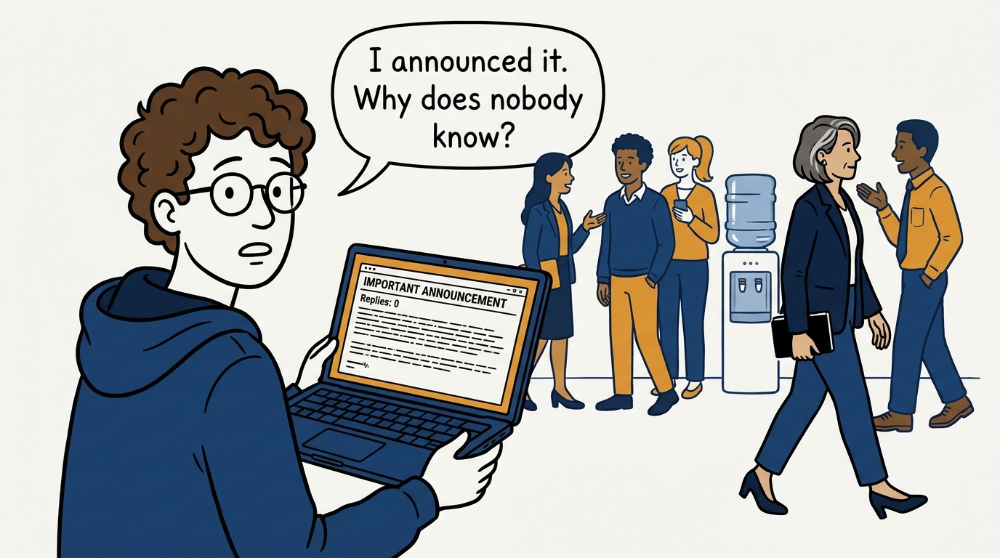
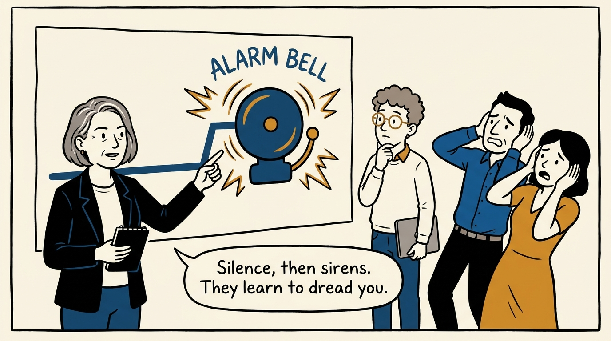
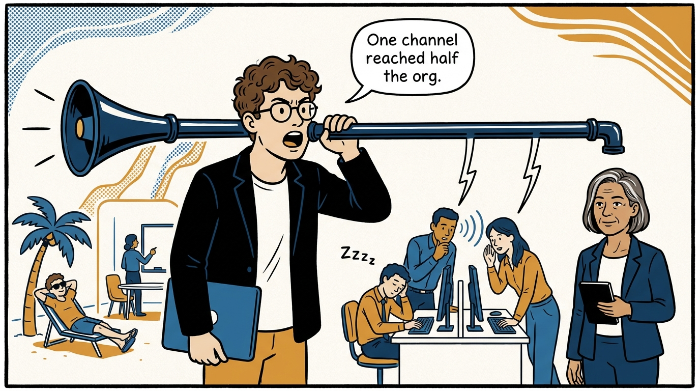
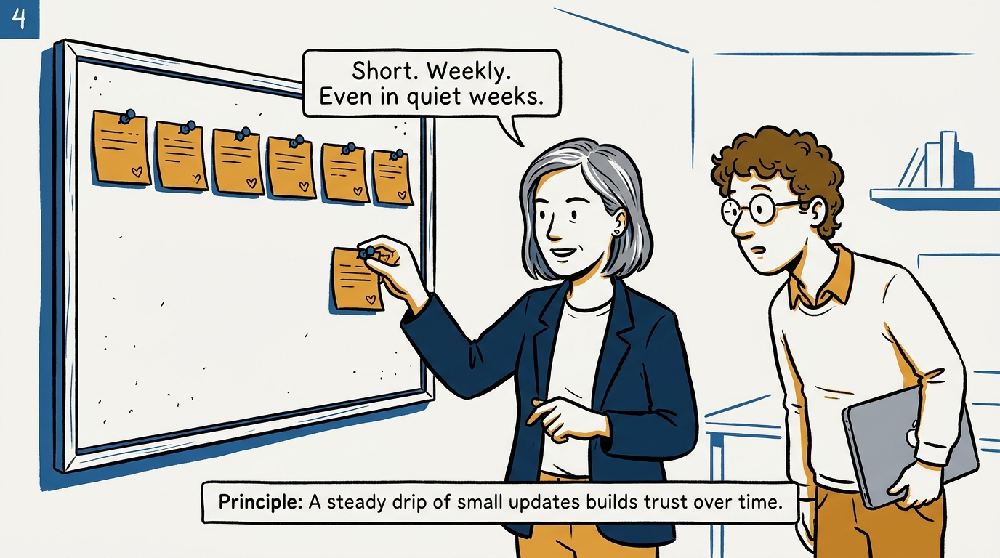
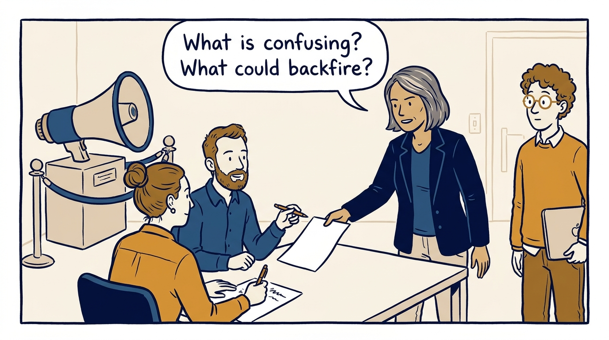
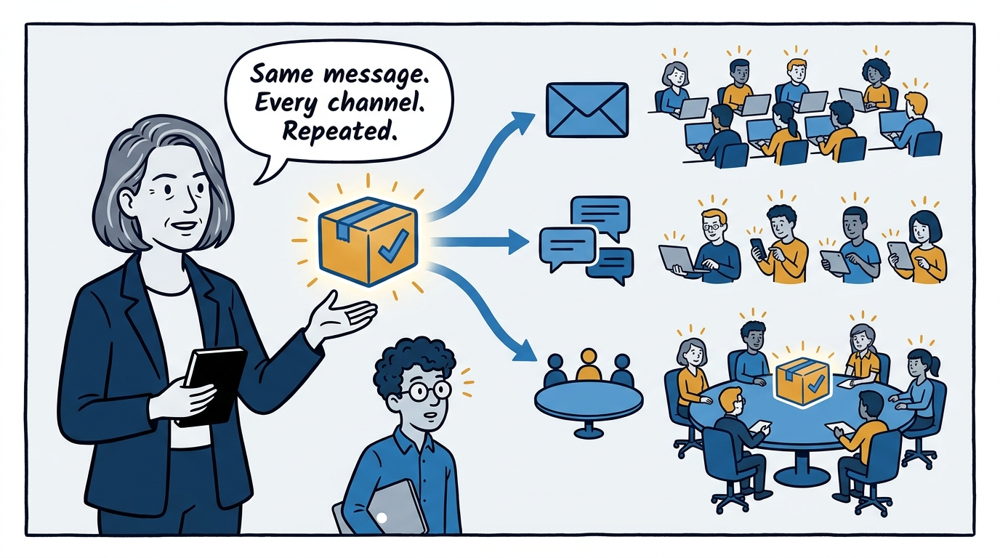
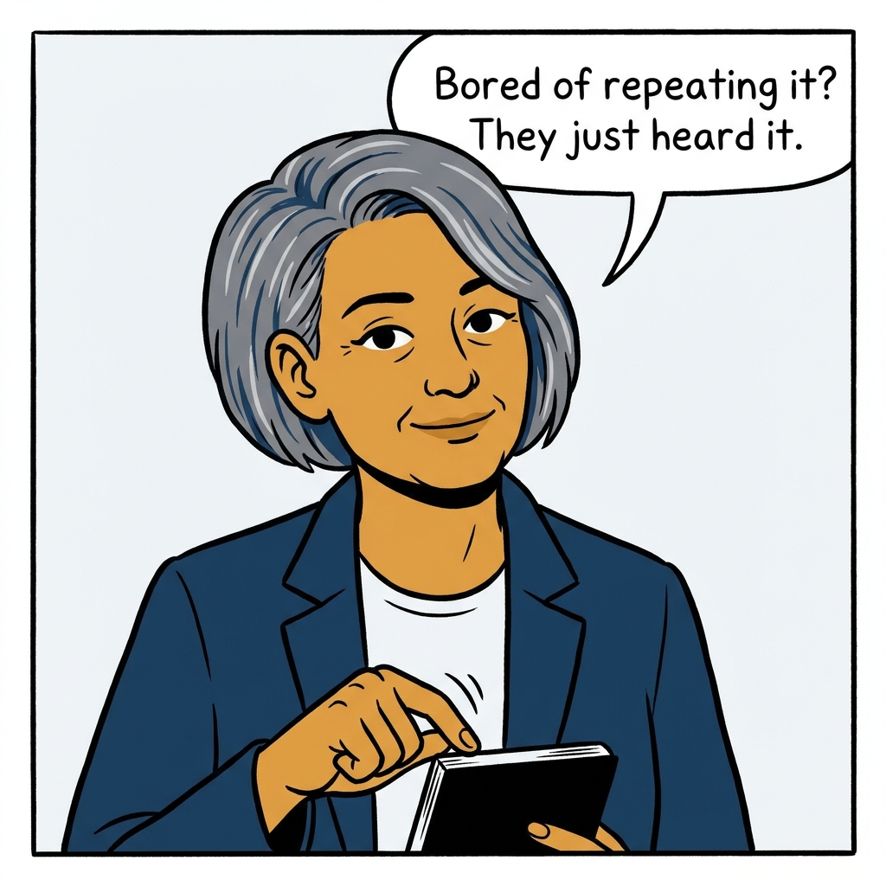

Why a steady drip of short updates beats the grand announcement — in seven panels.

<!-- comic-style
{
  "cast": "VERA: a calm, seasoned engineering executive, short gray-streaked hair, dark blazer over a plain t-shirt, carries a small black notebook. LEO: an eager young engineering manager, curly hair, round glasses, laptop under one arm.",
  "style": "Clean two-tone explainer comic, thick ink outlines, flat colors with deep blue and amber accents on a light background, generous white space, hand-lettered speech bubbles with SHORT readable text, no photorealism."
}
-->

**Panel 1:** *The hook: the big announcement that nobody actually received.*

**Panel 2:** *The problem: communicating only when something is wrong.*

**Panel 3:** *The wrong way: the single-channel announcement.*

**Panel 4:** *The principle: maintain the drip — consistency beats intensity.*

**Panel 5:** *How it plays out: test before broadcasting — the megaphone waits.*

**Panel 6:** *The mechanism: build the packet, then use every channel.*

**Panel 7:** *The closer: repetition is not redundancy — it is delivery.*
