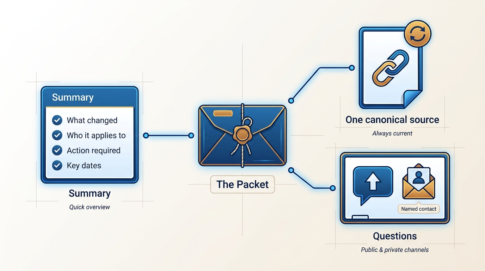
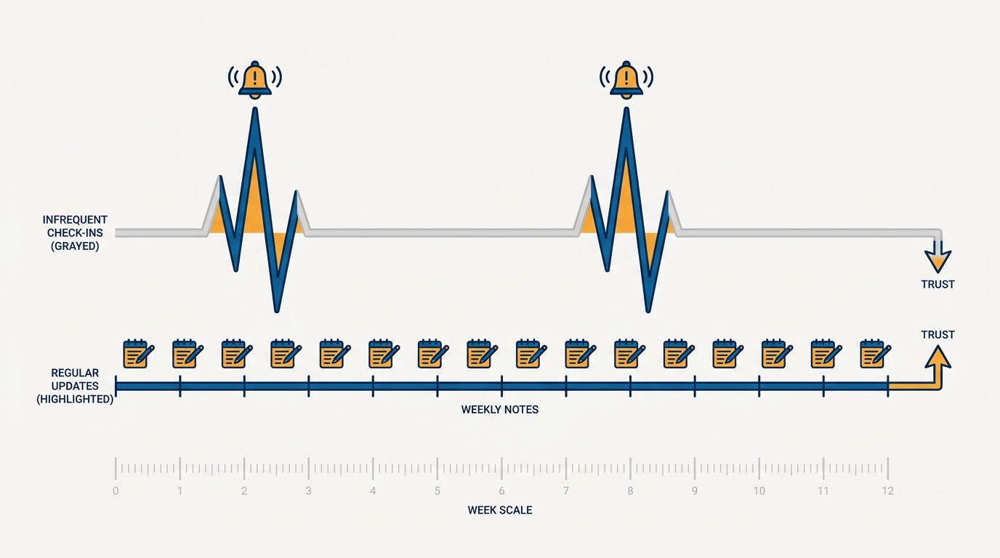
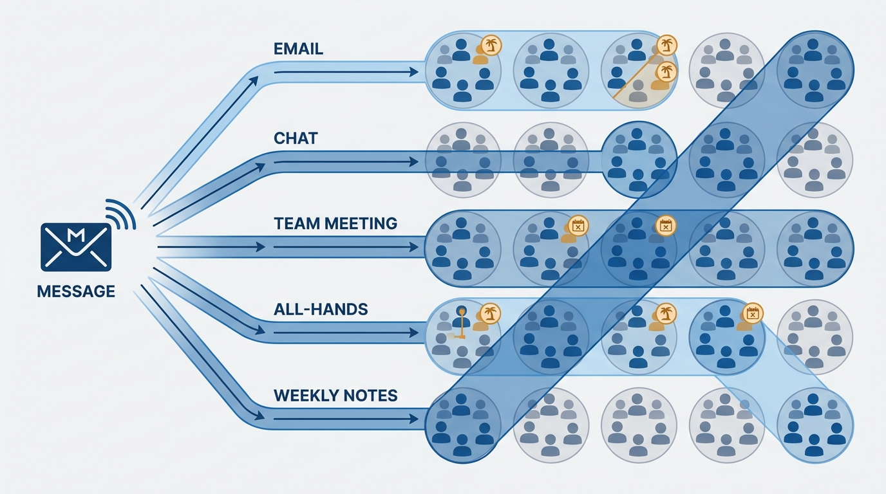

> **Status**: DRAFT
>
> **Principle**: I communicate through a steady, predictable drip of short updates, not through rare grand announcements. Behind every piece of executive feedback I look for the kernel — the real concern — instead of debating incidentals. Significant messages get tested with reviewers before they go wide; important ones ship as a packet: a clear summary, a canonical source, and a place for questions. I keep it short, and I repeat it across every channel, because a message sent once through one channel was, for half the organization, never sent.

## Statement

Internal communication is an operating system I run deliberately. It does not happen as a side effect of doing the work; it is part of the work. My commitments:

- **Maintain the drip.** A short, regular update goes out — weekly, typically — even when nothing major happened. Consistency is the point; the update is the heartbeat that tells the organization the executive function is alive and paying attention.
- **Extract the kernel.** When an executive asks a question or pushes back, I identify the underlying concern — speed, priority, risk — confirm my understanding explicitly, and reframe the discussion around the real problem rather than getting stuck on incidental details.
- **Test before broadcasting.** Significant or org-wide messages get shared with trusted reviewers first, asked specifically to flag confusion, unintended tone, potential controversy, and missing context. I revise before sending broadly.
- **Build the packet.** Every important communication has three parts: a concise summary (what changed, who it applies to, what action is required, key dates, where to learn more, how to ask questions), a link to a single up-to-date canonical source, and a public place for questions plus a named contact for private ones.
- **Keep it short.** I edit for brevity, remove unnecessary background, and cut anything that does not support the main message.
- **Use every channel.** Email, chat, team meetings, all-hands, meeting minutes, weekly notes, a decision log — the same message travels through all of them, until at least one person on every team is informed.

**Figure 1:** *The packet: every important message ships with a summary, a canonical source, and a place for questions.*

## How to Read This

This record explains how I communicate and what I expect of communication from my leadership team; if you receive my updates, it tells you why they look the way they do. It is a vision of my own operating style, not a writing course. The working checklist — the drip format, the reviewer questions, the packet structure, the final audit I run before any major message — lives in the **Checklist** tab of this post.

## Rationale

**Consistency beats intensity.** Trust in executive communication compounds from predictability, not from eloquence. A leader who writes only when something is wrong teaches the organization to dread their messages; a leader who writes every week — including the weeks when the honest content is "steady progress, nothing dramatic" — earns the right to be believed when something big does land. The one or two human sentences in each update are not decoration; they are what makes the drip feel like a person communicating rather than a system emitting status.

**Figure 2:** *Silence-then-siren versus the drip: trust compounds from predictability, not intensity.*

**The kernel matters more than the debate.** Executive feedback usually arrives wrapped in an incidental detail — a question about one line item, a suggestion about one team. Debating the wrapper loses the executive and the argument at the same time. Extracting the underlying concern, confirming it explicitly, and reframing around it is how I keep executive conversations at the altitude where they can actually be resolved. This is the same move I expect of my own leaders when my questions land on them, and it is the communication counterpart of the alignment habit in [[working-with-your-ceo-peers-and-engineering]].

**Broadcasting is irreversible; testing is cheap.** A confusing or unintentionally controversial message to the whole organization cannot be unsent — the correction never reaches everyone the original did. One or two named reviewers, asked specific questions, catch most of what I cannot see in my own draft. The few hours of delay are almost always worth it.

**Repetition is not redundancy — it is delivery.** People miss messages structurally, not carelessly: they were on vacation, the channel scrolled past, the meeting was skipped. A message that matters gets sent by email, repeated in chat, reinforced in team meetings and all-hands, and preserved in minutes, weekly notes, and the decision log. When I feel I am repeating myself is roughly when the organization is hearing it for the first time.

**Figure 3:** *Repetition as delivery: no single channel reaches everyone, so the message travels through all of them.*

## What This Means in Practice

| What this principle says | What it does **not** say |
| --- | --- |
| Send a short update on a fixed cadence, even in quiet weeks. | Manufacture drama to fill the update — "nothing major, here are the reminders" is a fine message. |
| Test significant messages with reviewers first. | Route every routine note through review — the drip flows without ceremony. |
| Repeat important messages across every channel. | Spam every channel with everything — repetition is for messages that matter. |
| Extract the kernel behind executive feedback. | Ignore the literal question — I answer it *and* address the concern underneath. |
| Keep it short; cut what doesn't support the main message. | Withhold context — the canonical source carries the depth the summary omits. |

Before any major message goes out, I run a final quick audit: is it regular and predictable, did I extract the real issue, did someone review it, does it have a clear summary, is it concise, and is it shared across multiple channels?

## Anti-Patterns

- **Communicating only when something is wrong.** The silence-then-siren pattern: no updates for months, then a heavy announcement. The organization learns that a message from me means trouble, and stops reading the rest.
- **The untested broadcast.** Sending a controversial or ambiguous org-wide message that no reviewer ever saw, then spending weeks managing the confusion a single pre-read would have caught.
- **The single-channel announcement.** Declaring something once, in one meeting or one email, and assuming delivery. Half the organization never sees it, and later decisions get made against the stale version of reality.
- **Debating the incidentals.** Spending an executive meeting litigating the detail an executive happened to mention, while the actual concern — speed, priority, risk — goes unaddressed and resurfaces next month.
- **The summary-free wall of text.** An important message with no tl;dr, no clear statement of who it applies to or what action is required, and no canonical source — so every reader reconstructs their own version of what was decided.

## Related Records

- [[meetings]] — the meeting portfolio is the synchronous half of this system; this record covers the written and multi-channel layer.
- [[measuring-engineering-organizations]] — what I report upward and how; this record covers how those messages travel.
- [[working-with-your-ceo-peers-and-engineering]] — extracting the kernel is how I keep executive relationships at the right altitude.
- [[run-engineering-processes]] — the weekly notes and decision log that the drip feeds are operational processes with owners.
- [[first-90-days]] — sharing what I am learning in weekly updates starts the drip from my first weeks in a role.

## Scope and Revisiting

This principle governs my own communication and the standard I hold my leadership team to for org-wide messages. I revisit it when the drip stops being read (a signal the format has decayed), when a major message lands badly despite the process, and whenever the organization's size or channel mix changes enough that "every channel" means something new.

## Authoritative References

- Will Larson, *The Engineering Executive's Primer* (O'Reilly, 2024) — the "Internal Communication" chapter this record's checklist distills.
- Will Larson, [Internal comms for executives](https://lethain.com/internal-comms-execs/) — the freely available companion essay.
