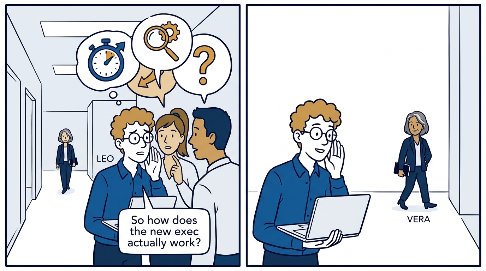
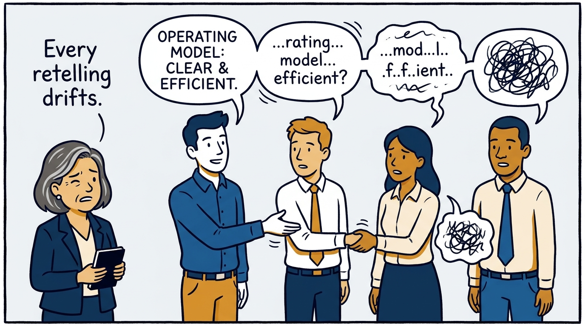
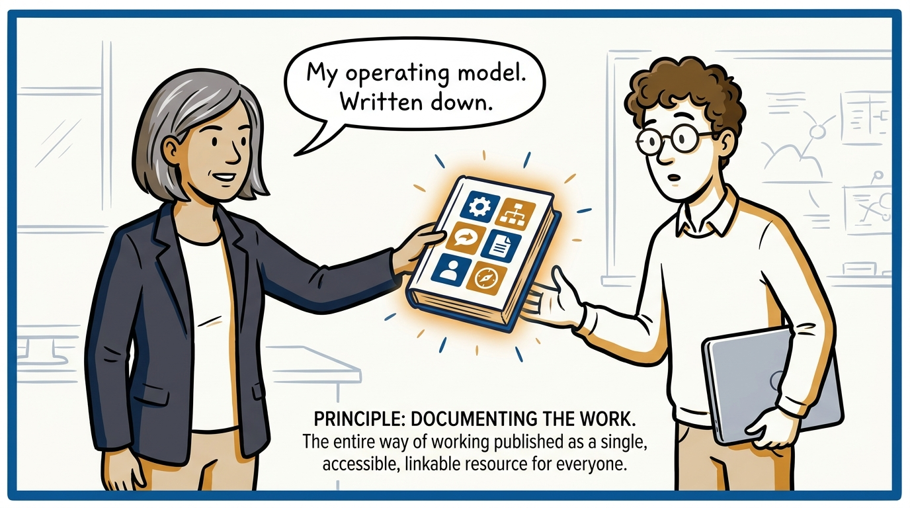
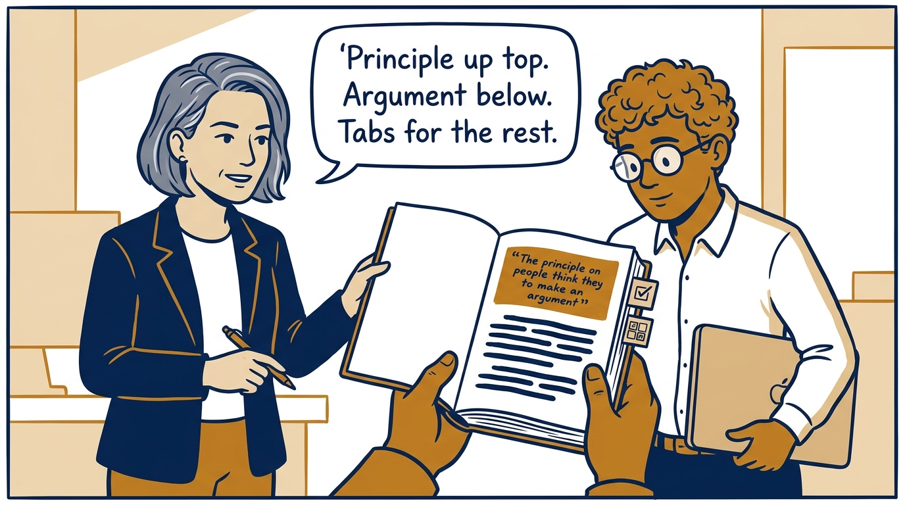
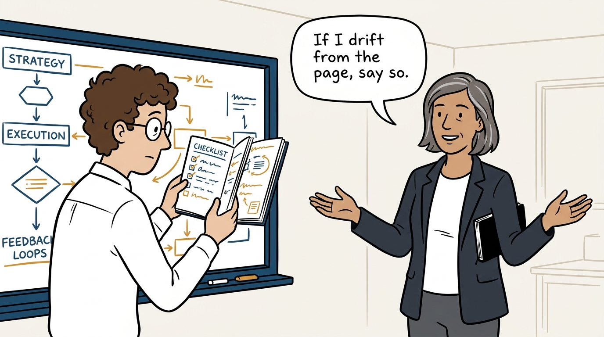
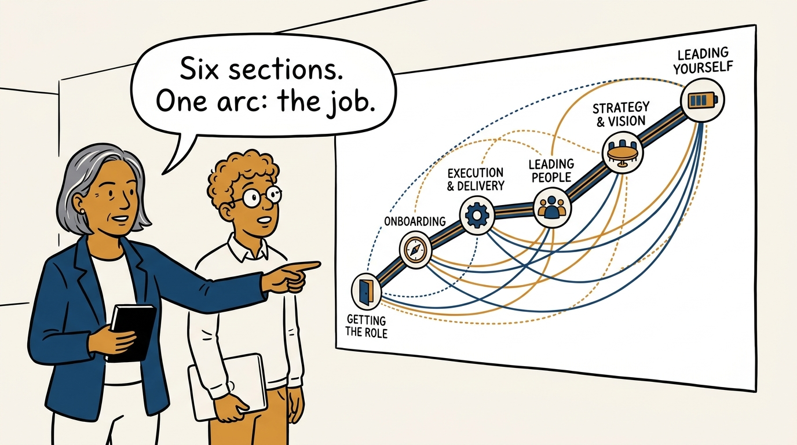
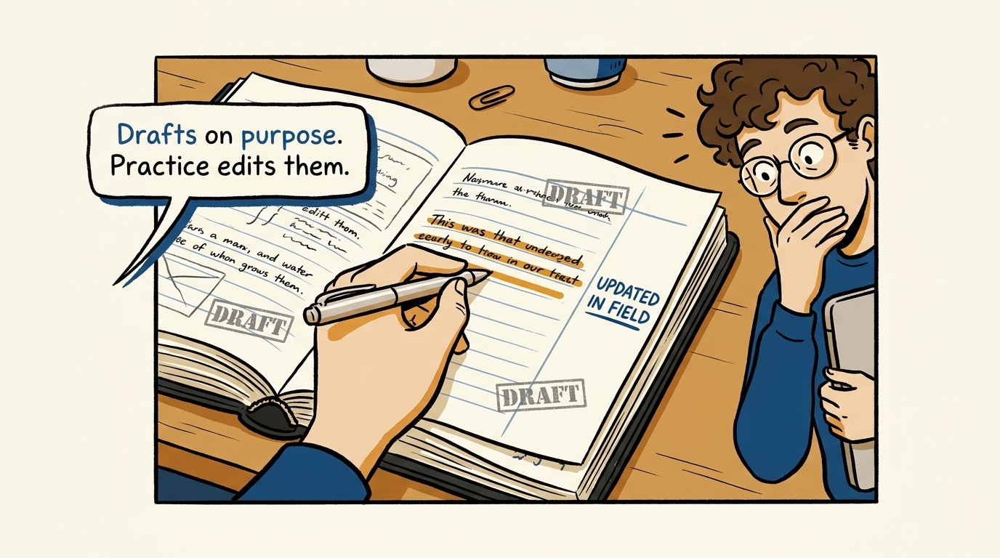
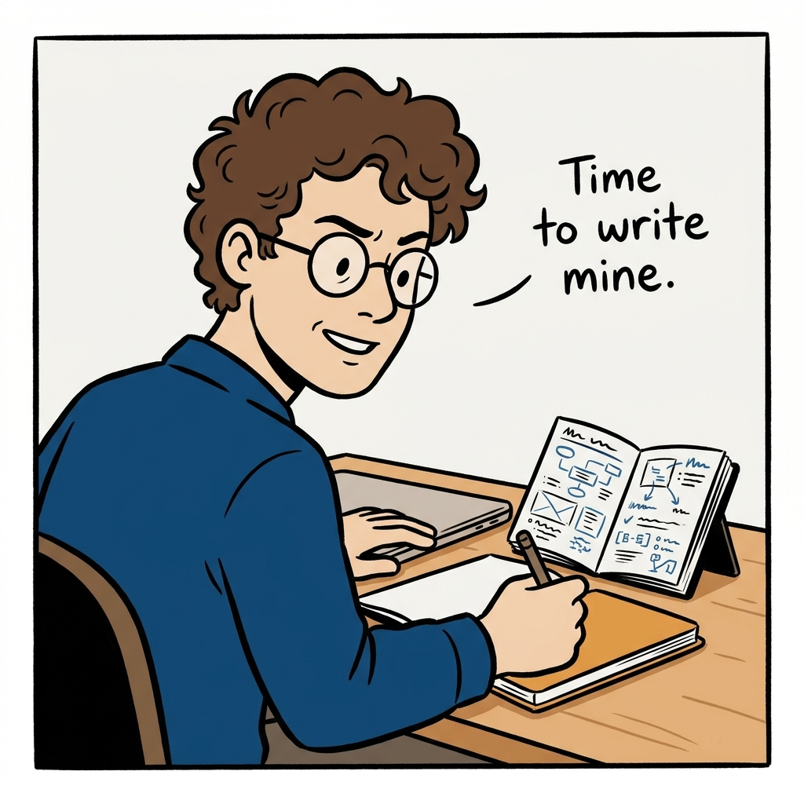

The operating model, written down — what this journal is and how to read it, in eight panels.

<!-- comic-style
{
  "cast": "VERA: a calm, seasoned engineering executive, short gray-streaked hair, dark blazer over a plain t-shirt, carries a small black notebook. LEO: an eager young engineering manager, curly hair, round glasses, laptop under one arm.",
  "style": "Clean two-tone explainer comic, thick ink outlines, flat colors with deep blue and amber accents on a light background, generous white space, hand-lettered speech bubbles with SHORT readable text, no photorealism."
}
-->

**Panel 1:** *The hook: an unwritten operating model gets reverse-engineered from meetings.*

**Panel 2:** *The problem: alignment by retelling degrades one conversation at a time.*

**Panel 3:** *The move: publish the operating model instead of narrating it.*

**Panel 4:** *Every record, same anatomy: read only the top box and you have the direction.*

**Panel 5:** *A contract, not a memoir: written concretely enough to be checked.*

**Panel 6:** *The map: getting the role, direction, operating, talent, peers, yourself.*

**Panel 7:** *Living records: draft is honest, and practice does the editing.*

**Panel 8:** *The closer: take the checklists, argue with the principles, write your own.*
