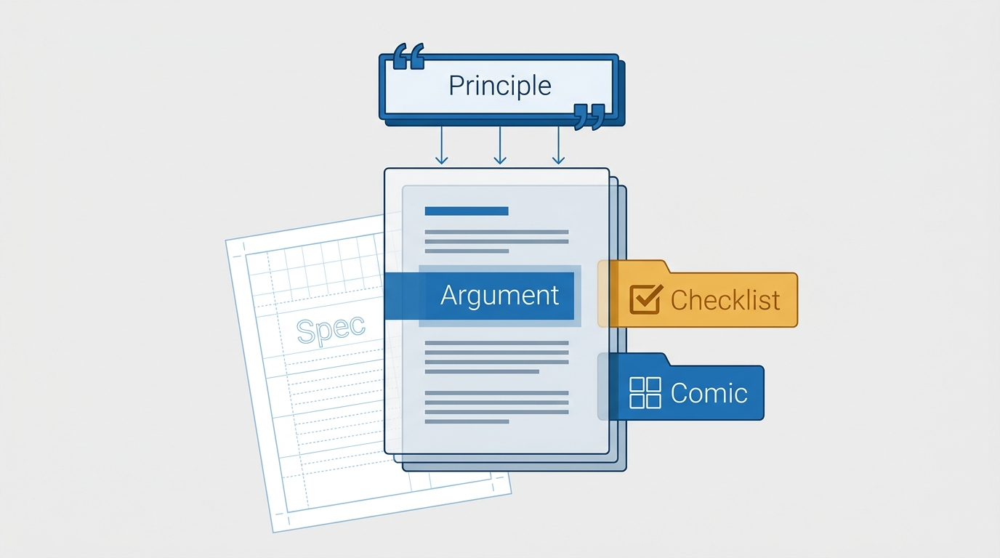
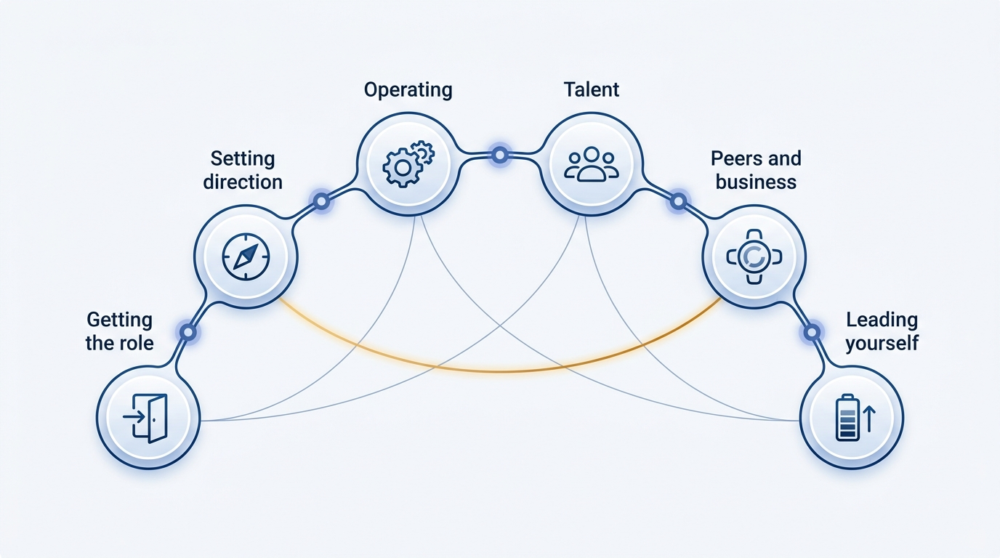

> **KEY POINTS:**
>
> * **This journal is my operating model, written down** — 21 operating principles describing how I work as an engineering executive, from getting the role to leading myself, grounded in practice and in Will Larson's *The Engineering Executive's Primer*.
> * **Every record has the same anatomy** — a quotable principle up front, an argued ADR-shaped body behind it, a runnable working checklist in the **Checklist** tab, and an explainer comic in the **Comic** tab for the two-minute version.
> * **Read it as a contract, not a memoir** — the principle tells you what to expect from me; the checklist is the part you can watch me run; every record is a draft that gets revisited against practice.

 

If you work with me — as my CEO, my peer, or on my team — you should not have to reverse-engineer how I operate from meetings. This journal writes it down: how I ramp into a role, how I set strategy, how I run processes and meetings, how I hire, how I handle conflict at the executive table, and how I keep the whole thing sustainable. Twenty-one records, each one an operating principle I am prepared to be held to — plus appendices on the management-systems layer beneath the role and on structuring teams for fast flow.

## Why Write It Down

Three reasons, in increasing order of importance.

**Alignment is cheaper in writing.** An operating model that lives in my head has to be re-explained in every 1:1, re-negotiated in every conflict, and re-discovered by every new colleague. A written record is explained once, linked forever, and read before the meeting instead of litigated during it.

**Writing forces the argument.** A preference can stay vague; a published principle cannot. Each record has to survive its own *Rationale* section — why this way and not the obvious alternative — and its own *Anti-Patterns* section, which names the failure modes I am explicitly steering away from. Several drafts did not survive that test, which is the point.

**A written model is inspectable.** [[inspected-trust]] commits me to verifying my organization's work — and to making my own work inspectable in return. This journal is that commitment applied to myself: the principles are public, the checklists are concrete enough to check me against, and discrepancies between what I wrote and what I do are legitimate things to raise with me.

**Figure 1:** *Why write it down: retellings drift; a written record is explained once, linked forever — and inspectable.*

## What a Record Looks Like

Every record follows the same shape, so you always know where to look:

| Part | What it gives you |
| --- | --- |
| **Status / Principle** blockquote | The whole principle in one quotable paragraph — read only this and you have the direction. |
| **Statement → Rationale → Anti-Patterns** | The ADR-shaped body: what I commit to, why, what it does *not* say, and the failure modes it guards against. |
| **Checklist** tab | The operational working checklist — grouped, checkable actions. The article is the argument; this is the part I actually run. |
| **Comic** tab | An eight-panel explainer with a recurring cast — the two-minute version, built to be shared. |
| **View spec** link | The authoring contract behind the post — intent, success criteria, and a decision log, versioned like everything else. |

Every record carries `status: draft`. That is honest, not tentative: these principles are written ahead of being fully tested in the role, and each one names the conditions under which I will revisit it.

**Figure 2:** *The anatomy of a record: principle up front, argument behind it, the runnable and shareable versions one tab away — and the spec as the contract underneath.*

## Where the Material Comes From

The vision is mine; the grounding is borrowed openly. Each record starts from one chapter of Will Larson's *The Engineering Executive's Primer* (O'Reilly, 2024) and its distilled working checklist, and each credits the matching freely available essay on lethain.com. What the records add is commitment: Larson describes what engineering executives do; these pages state what *I* will do, in first person, with the trade-offs I accept and the anti-patterns I reject. Where my practice disagrees with the book, the record says so. The appendices reach beyond the Primer: five records distill Larson's *An Elegant Puzzle* (Stripe Press, 2019) — the management-systems layer the executive role sits on — and nine distill Skelton and Pais's *Team Topologies* (IT Revolution Press, 2019), the team-structure model I use for organizing around fast flow. Both are read through the same executive lens.

## The Map

The six sections follow the arc of the job:

- **Getting the Role** — the search and the landing: [[getting-the-job]], [[first-90-days]].
- **Setting Direction** — strategy, planning, values, and measurement: [[engineering-strategy]], [[planning]], [[organizational-values]], [[measuring-engineering-organizations]].
- **Operating the Organization** — the day-to-day machinery: [[run-engineering-processes]], [[meetings]], [[internal-communication]], [[calibrating-your-standards]], [[inspected-trust]].
- **Talent** — building the team: [[hiring]], [[engineering-onboarding]].
- **Working with Peers and the Business** — everything beyond my own org: [[working-with-your-ceo-peers-and-engineering]], [[gelling-your-engineering-leadership-team]], [[onboarding-peer-executives]], [[your-network]], [[mergers-and-acquisitions]].
- **Leading Yourself** — the sustainable executive: [[leadership-styles]], [[managing-energy]], [[personal-and-organizational-prestige]].
- **Appendix: An Elegant Puzzle** — the management layer beneath the role: [[organizational-design]], [[systems-and-tools]], [[management-approaches]], [[engineering-culture]], [[careers-and-performance]].
- **Appendix: Team Topologies** — structuring teams for fast flow: [[org-chart-problems]], [[conways-law]], [[team-first-thinking]], [[static-team-topologies]], [[four-fundamental-team-topologies]], [[team-first-boundaries]], [[team-interaction-modes]], [[evolve-team-structures]], [[next-gen-operating-model]].

The records cross-link heavily, because the principles are not independent: inspection draws on the trust built in the first 90 days; strategy constrains planning; energy management is what makes all of it survivable. Follow the links rather than the section order if a thread pulls you.

**Figure 3:** *The map: six sections along the arc of the job — and the cross-links that make it a web, not a sequence.*

## How to Read This Journal

- **If you are deciding whether to work with me** — read the Status/Principle blockquotes across the sections that matter to you; that is the whole model in fifteen minutes. [[working-with-your-ceo-peers-and-engineering]] and [[inspected-trust]] are the two that most define the experience of working with me.
- **If you are on my team** — start with [[inspected-trust]] and [[calibrating-your-standards]]; they explain the behaviors you will actually observe, and the *How to Read This* section of each record is addressed to you.
- **If you are an engineering leader building your own model** — take the checklists; they are the transferable part. The principles are deliberately personal, and disagreeing with them is a fine way to find your own.
- **If you have two minutes** — open any record's Comic tab.

## Status and Revisiting

This journal is a living document. Records move from `draft` to `accepted` as practice tests them, each one on the revisiting conditions it declares for itself — and this introduction gets updated whenever the journal's shape changes.

## Authoritative References

- Will Larson, *The Engineering Executive's Primer* (O'Reilly, 2024) — the book whose chapter checklists ground every record here.
- Will Larson, [lethain.com](https://lethain.com/tags/executive/) — the freely available companion essays, credited individually in each record.
