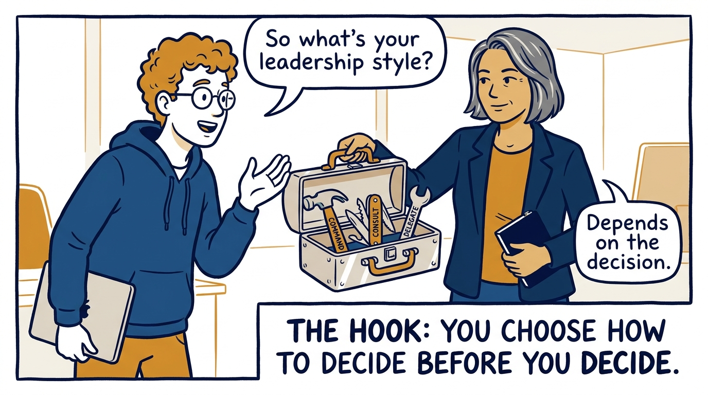
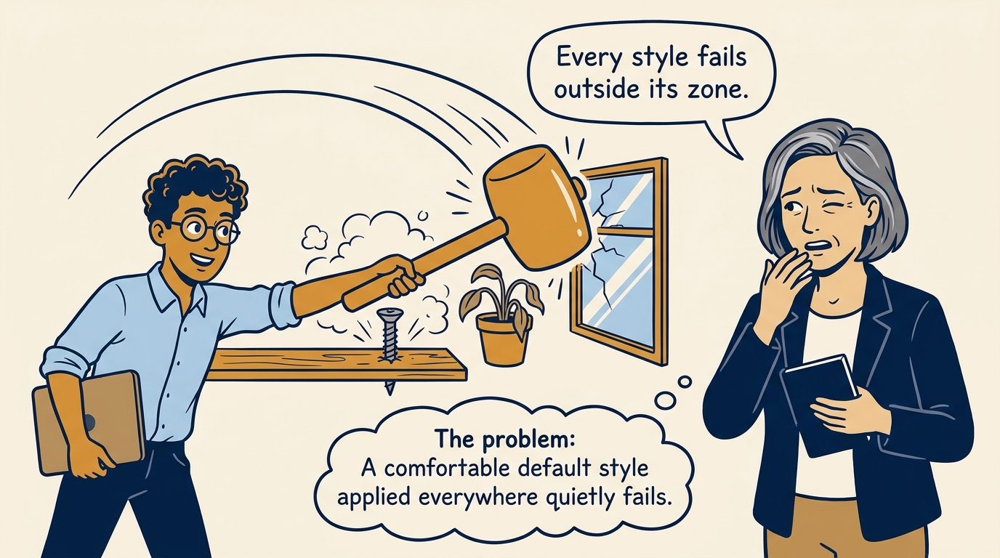
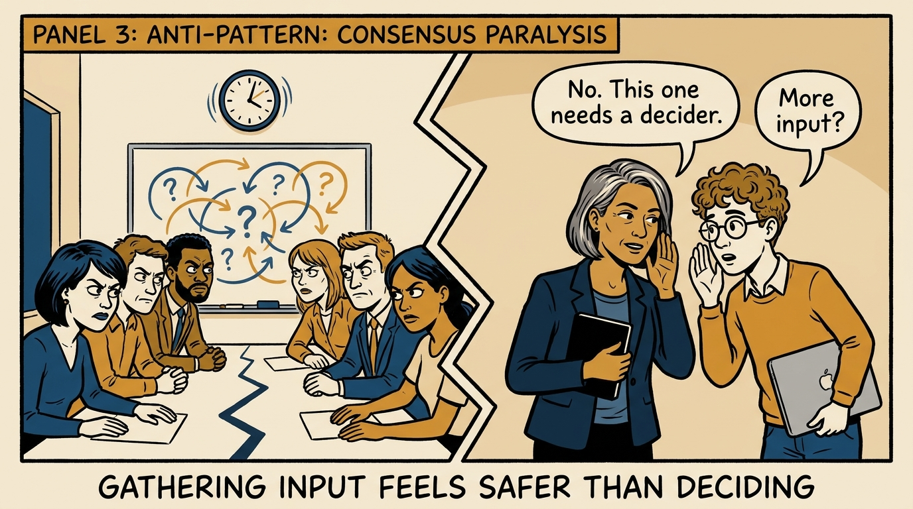
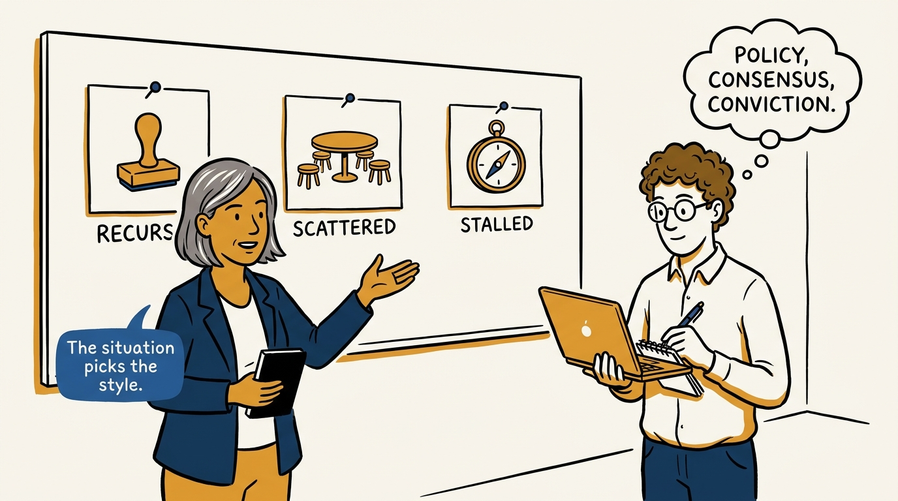
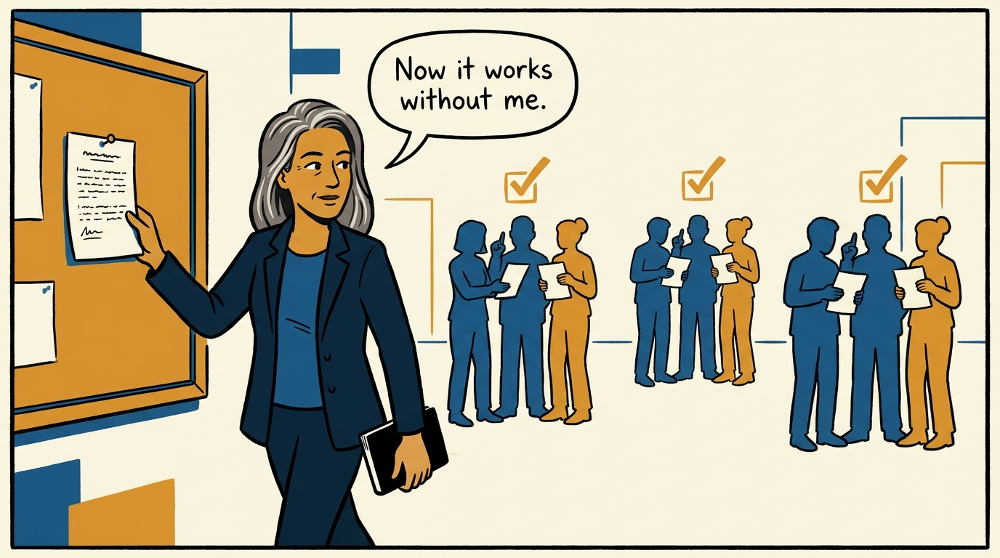
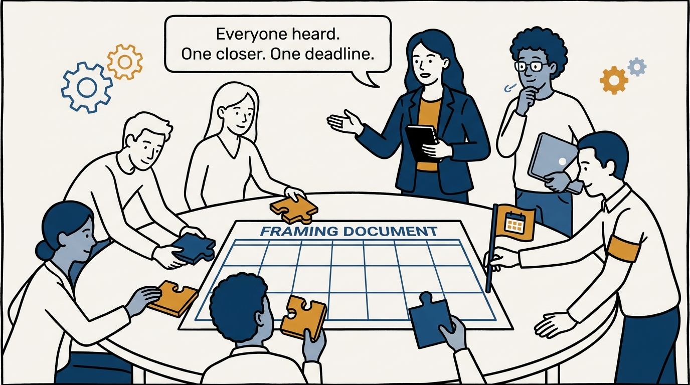
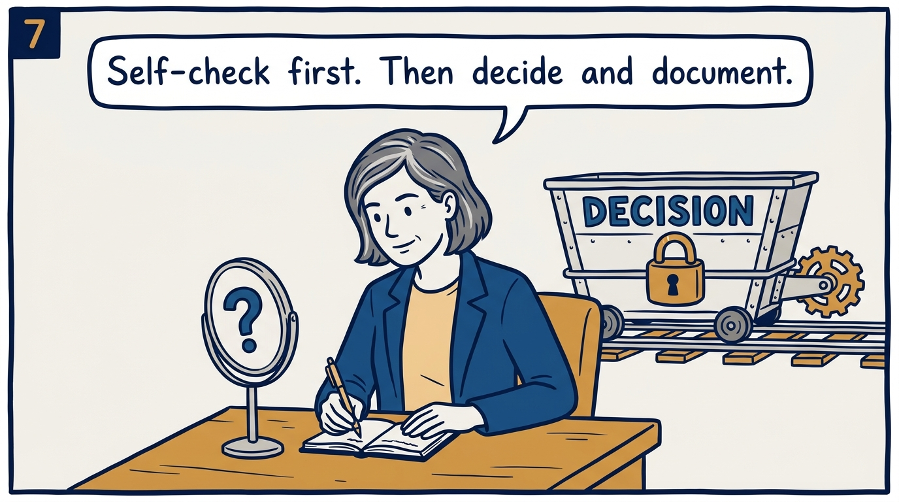
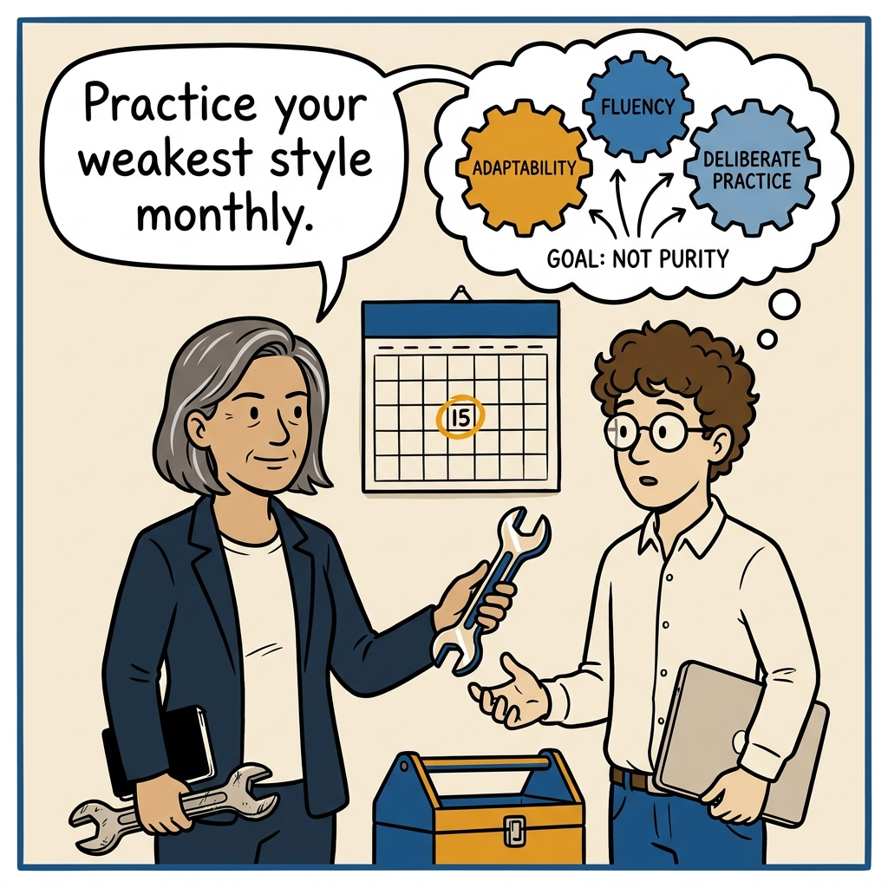

Three ways to decide — and why the situation, not habit, should pick which one you use.

<!-- comic-style
{
  "cast": "VERA: a calm, seasoned engineering executive, short gray-streaked hair, dark blazer over a plain t-shirt, carries a small black notebook. LEO: an eager young engineering manager, curly hair, round glasses, laptop under one arm.",
  "style": "Clean two-tone explainer comic, thick ink outlines, flat colors with deep blue and amber accents on a light background, generous white space, hand-lettered speech bubbles with SHORT readable text, no photorealism."
}
-->

**Panel 1:** *The hook: choose how to decide before you decide.*

**Panel 2:** *The problem: the comfortable style gets applied where it does not fit.*

**Panel 3:** *Anti-pattern: consensus as conflict avoidance produces an expensive stalemate.*

**Panel 4:** *The principle: policy when it recurs, consensus when context is scattered, conviction when it is stalled.*

**Panel 5:** *Policy: codify the recurring decision so the org moves without you in the room.*

**Panel 6:** *Consensus: everyone is heard — with a framing doc, an appointed closer, and a deadline.*

**Panel 7:** *Conviction: run the micromanagement self-check, write the reasoning, then decide.*

**Panel 8:** *Closer: adaptability, not purity — deliberately practice the style you underuse.*
