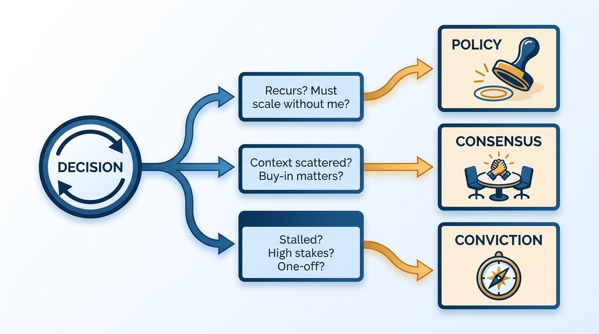
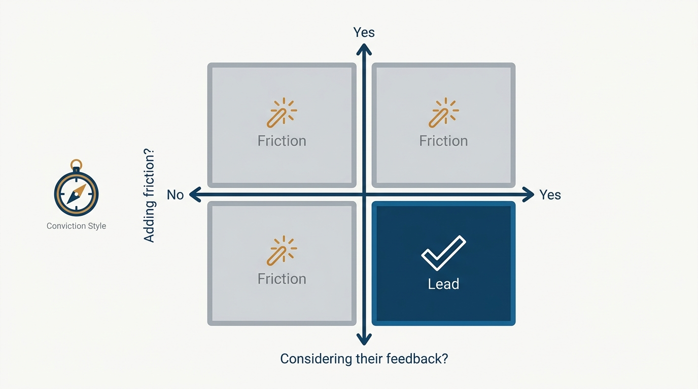
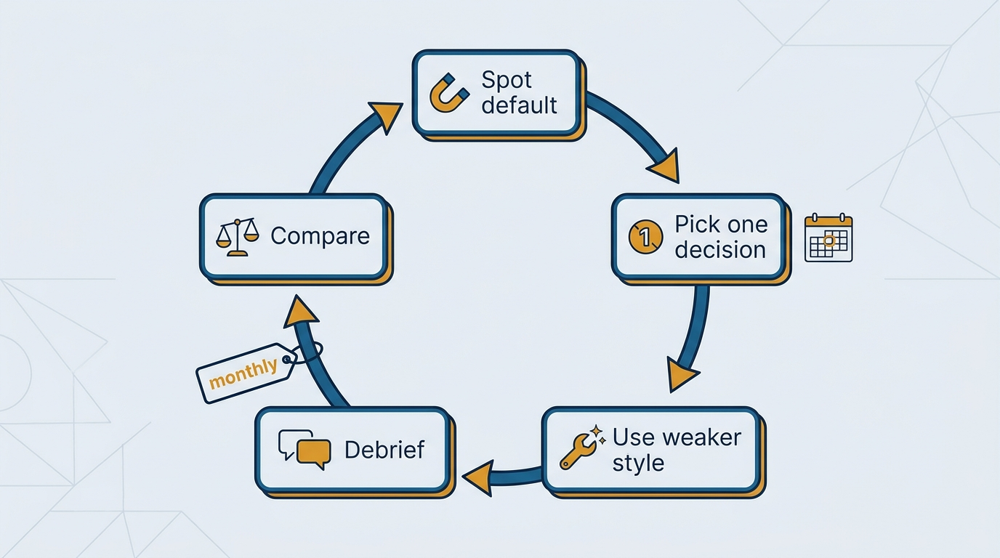

> **Status**: DRAFT
>
> **Principle**: I choose how to decide before I decide: policy when a decision recurs and the organization must move consistently without me in the room, consensus when context is distributed and buy-in materially affects execution, conviction when a high-stakes, non-recurring decision is stalled and someone must decide. Any style can be misused, and no single style works everywhere — so I deliberately practice the styles I underuse, and I run the micromanagement self-check before overriding people closer to the work. The goal is adaptability, not purity.

## Statement

The three styles are decision-making modes, not identities — and each has explicit triggers:

- **I lead with policy** when the decision recurs frequently, many people must make it consistently, speed and predictability matter, and I want the organization to move without me in the room. Executing it means: identify the recurring decision, study how strong decision-makers handle it today, codify their best judgment into a clear written policy, validate it with key contributors, roll it out intentionally, and set a review point to revisit it with data.
- **I lead from consensus** when multiple stakeholders hold critical context, no one person has the full picture, the decision is important enough to remember in six months, buy-in materially affects execution, and the issue isn't well-suited for policy. Executing it means: identify all relevant stakeholders, create a shared channel, write a framing document outlining the known perspectives, ensure everyone feels heard, appoint the most senior engaged leader, set a clear deadline, follow the agreed process, and close the loop on the outcome.
- **I lead with conviction** when the decision is high-stakes and long-lasting, stakeholders are deeply divided, no one has clear authority or full context, the decision is unlikely to be repeated, and momentum is stalled. Executing it means: deeply understand the trade-offs, engage the people with the most context, write down my reasoning and pressure-test it, communicate a tentative decision with a short timeout, then finalize, move to execution, and document the rationale for transparency.

Across all three: strong executives develop fluency in every style, and the choice is made deliberately, per situation — never out of habit.

**Figure 1:** *The style selector: explicit triggers route each decision to policy, consensus, or conviction — never habit.*

## How to Read This

This record lets my team and peer executives predict which mode I will bring to a given decision — and lets them call it out when the mode doesn't fit the triggers. It is a description of decision-making modes, not personality archetypes. The full execution checklists, the micromanagement self-check, and the development practice live in the **Checklist** tab of this post. How I verify delegated work without micromanaging is [[inspected-trust]]; here the self-check guards only the conviction style.

## Rationale

**Style should follow the situation, because each style fails outside its zone.** Policy applied to a one-off, high-stakes decision produces bureaucracy nobody needs twice. Consensus applied to a stalled, deeply divided decision produces an expensive stalemate. Conviction applied to a recurring decision makes me the bottleneck for the organization's routine judgment. The triggers are not preferences; they are the conditions under which each style actually works.

**Defaulting to habit is the quiet failure mode.** Every leader has a comfortable style, and the comfortable style gets applied to situations it doesn't fit — usually without anyone noticing, because it looks like consistency. That is why I check my defaults deliberately: am I defaulting to one style out of habit? Has my company's context changed — growth, downturn, scale — in ways that change which styles the situation now demands? Am I too distant from the details, or over-engaging unnecessarily?

**Conviction needs a guard, because it is the style closest to micromanagement.** Before overriding people closer to the work, I run the self-check: am I carefully considering feedback from those closest to the work — and am I adding friction to a team that would reach a similar outcome without me? If yes to the first and no to the second, I am likely not micromanaging; if the answers go the other way, the intervention is friction, not leadership.

**Figure 2:** *The conviction guard: only feedback-considered, friction-free intervention counts as leadership — the rest is micromanagement.*

**Fluency is built, not assumed.** I identify which style I default to and which I underuse, and once a month I review upcoming decisions and choose one to handle deliberately in my weaker style — then debrief with someone skilled in that style and compare the outcome against my default approach. Repeated consistently, this is what turns three named modes into a real repertoire, the same deliberate-practice move as [[calibrating-your-standards]].

**Figure 3:** *The fluency loop: one decision a month handled deliberately in the weaker style, debriefed, and compared.*

## What This Means in Practice

| What this principle says | What it does **not** say |
| --- | --- |
| The situation picks the style — via explicit triggers. | I have a "true" style that situations occasionally interrupt. |
| Policy exists so the org moves consistently without me in the room. | Every decision deserves a policy — one-off decisions don't. |
| Consensus means everyone is heard, with a deadline and an appointed closer. | Consensus means everyone agrees — it means the process was followed and the loop closed. |
| Conviction is for stalled, high-stakes, non-recurring decisions — pressure-tested and documented. | Conviction is a license to override teams — the micromanagement self-check comes first. |
| I deliberately practice my weaker styles monthly. | Fluency arrives with the job title. |

A reader who knows the triggers can predict my mode: a recurring escalation pattern gets a written policy with a review date; a cross-team architecture question where context is scattered gets a framing document, a channel, and a deadline; a stalled, divisive, bet-the-roadmap call gets my written reasoning, a tentative decision, a short timeout, and then execution.

## Anti-Patterns

- **Consensus as conflict avoidance.** Running a consensus process on a decision that is stalled and deeply divided — where the triggers point to conviction — because seeking more input feels safer than deciding.
- **Conviction as ego.** Reaching for the decisive style on decisions that recur or where others hold the context — skipping the self-check, overriding teams that would have landed in the same place without the friction.
- **Policy as bureaucracy.** Writing policy for one-off decisions, encoding process where judgment was needed once and never again.
- **Habit dressed as identity.** "I'm a consensus leader" (or a decisive one) — turning a default into a brand, instead of noticing that the company's context has changed and the situations now demand a different mix.
- **Consensus without a closer.** Broad input, everyone heard — but no appointed leader, no deadline, no closed loop; the process substitutes for the decision.
- **Undocumented conviction.** Deciding firmly but never writing down the reasoning — losing the pressure-test before the decision and the transparency after it.

## Related Records

- [[inspected-trust]] — the verification counterpart: how I check work without micromanaging, beyond the conviction-style self-check here.
- [[managing-energy]] — the balance check's last question (is my role too challenging or not challenging enough?) feeds the sustainability practice there.
- [[run-engineering-processes]] — leading with policy at organizational scale: processes with owners, reviews, and iteration.
- [[calibrating-your-standards]] — the same deliberate-practice loop applied to quality standards instead of decision styles.
- [[working-with-your-ceo-peers-and-engineering]] — style choice is also audience-aware: what the CEO, peers, and Engineering each need from a decision.

## Scope and Revisiting

This principle governs how I approach decisions in any executive role. I revisit it monthly through the development practice (one decision handled in my weaker style, debriefed), and whenever the balance check flags drift: defaulting out of habit, a changed company context, too much distance from details, or unnecessary over-engagement.

## Authoritative References

- Will Larson, *The Engineering Executive's Primer* (O'Reilly, 2024) — the "Leadership Styles" chapter this record's checklist distills; the principle above is my operating commitment to it.
- Will Larson, [Developing leadership styles](https://lethain.com/developing-leadership-styles/) — the freely available companion essay.
